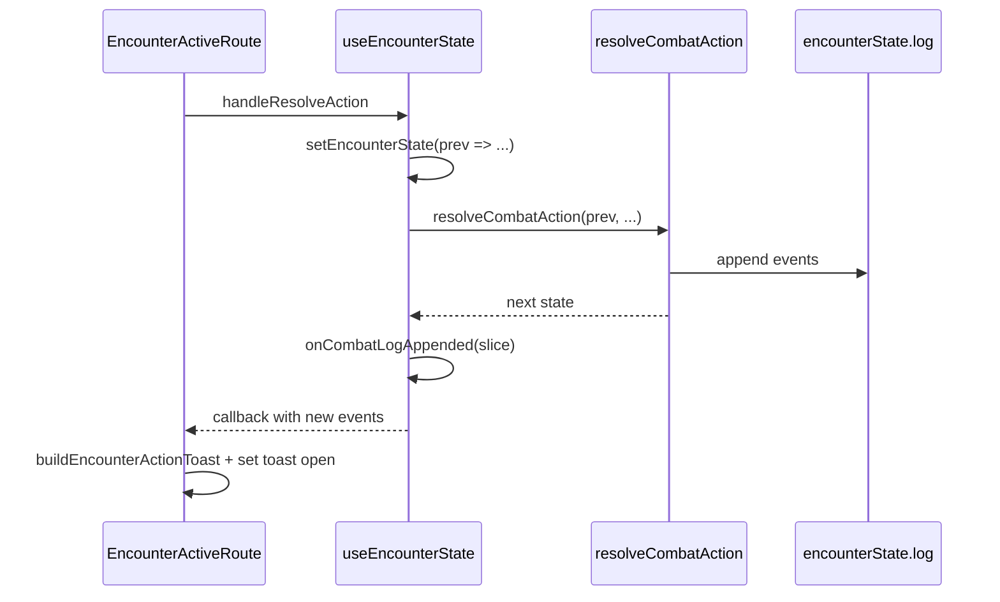

# Action-resolved toast and concise combat log

## Architecture

## 1. Shared tone / severity (avoid duplicating AppAlert)

- Extract the mapping currently in `[AppAlert.tsx](src/ui/primitives/AppAlert/AppAlert.tsx)` (lines 22–28) into a small shared module, e.g. `[src/ui/primitives/appTone.ts](src/ui/primitives/appTone.ts)`:
  - Export `AppAlertTone` **or** keep the type in `AppAlert.tsx` and import the map only — cleanest: **move** `AppAlertTone` + `toneToSeverity` to `appTone.ts`, re-export from `AppAlert` for backward compatibility.
  - Export something like `mapAppAlertToneToMuiSeverity(tone): AlertProps['severity']` (same table as today).
- `[AppAlert](src/ui/primitives/AppAlert/AppAlert.tsx)` imports and uses that helper (no behavior change).
- New `AppToast` imports the same helper for the inner `Alert`.

## 2. `AppToast` primitive (MUI Snackbar + Alert)

- Add `[src/ui/primitives/AppToast/AppToast.tsx](src/ui/primitives/AppToast/AppToast.tsx)`:
  - Wrap **Snackbar** (MUI has no separate “Toast”; Snackbar is the standard pattern) with `anchorOrigin={{ vertical: 'top', horizontal: 'center' }}`.
  - Use `**Slide`** transition with `direction="down"` so the snackbar **enters from the top** of the viewport.
  - Inner content: `**Alert`** with `severity={mapAppAlertToneToMuiSeverity(tone)}`, `variant` aligned with existing UI (e.g. `filled` or `standard` — match `AppAlert` defaults unless you prefer stronger snackbar contrast).
  - Props surface: `open`, `onClose`, `title` (Typography `subtitle1`/`body1` weight), `subtitle` (optional `ReactNode` for multiline), optional `tone` defaulting to `info`.
  - **Mechanics line(s):** accept optional `mechanics` string or render `subtitle` with two regions: primary lines + a final block with `variant="caption"` / `sx={{ fontSize: '0.75rem' }}` for dice math (matches your “dice mechanics can use small font”).
- **Min-height vs header:** `[EncounterActiveHeader](src/features/encounter/components/active/EncounterActiveHeader.tsx)` uses `Paper` with `px: 4, py: 2` and no fixed height. To align without fragile DOM measurement:
  - Extract a **shared layout constant** (e.g. `encounterActiveHeaderBarSx` or `ENCOUNTER_ACTIVE_BAR_PADDING`) used by both the header `Paper` and the toast `Alert` root `sx` (same horizontal padding and **minHeight** token).
  - Set a single **explicit `minHeight`** (e.g. `theme` spacing or `px` derived from `h3` line box + secondary line + padding) exported from the same small module as the header, imported by `AppToast`. Adjust once visually so the toast bar matches the header strip.
- Export from `[src/ui/primitives/index.ts](src/ui/primitives/index.ts)`.

## 3. When to show the toast (Encounter active route)

- **Capture new log rows** inside `[useEncounterState](src/features/encounter/hooks/useEncounterState.ts)` `handleResolveAction` using **functional** `setEncounterState`:
  - `const startLen = prev.log.length`
  - `const next = resolveCombatAction(...)`
  - `const appended = next.log.slice(startLen)`
  - Call an optional callback e.g. `onCombatLogAppended?.(appended)` (only when `appended.length > 0`).
- Thread this callback from `[EncounterRuntimeContext](src/features/encounter/routes/EncounterRuntimeContext.tsx)` (or pass `undefined` elsewhere) into `useEncounterState`.
- In `[EncounterActiveRoute](src/features/encounter/routes/EncounterActiveRoute.tsx)`: `useState` for toast payload + open; pass `onCombatLogAppended` that runs a pure builder and opens the snackbar.

This avoids parsing the full log on every turn change and only fires when the user resolves an action.

## 4. Crafting title / subtitle (and tones)

Add a pure helper, e.g. `[src/features/encounter/helpers/encounter-action-toast.ts](src/features/encounter/helpers/encounter-action-toast.ts)`:

| Log pattern                                                       | Title                                                                                                                       | Subtitle / mechanics                                                                                                                                                                                            | Tone                                                            |
| ----------------------------------------------------------------- | --------------------------------------------------------------------------------------------------------------------------- | --------------------------------------------------------------------------------------------------------------------------------------------------------------------------------------------------------------- | --------------------------------------------------------------- |
| Single `attack-hit`                                               | One line: attacker, hit/crit, target, action                                                                                | Attack line + damage lines; **include damage type** next to each total (e.g. `18 slashing`, or `Damage: slashing · 18`)                                                                                         | `success`                                                       |
| **Multiple `attack-hit` in one slice** (sequences / multi-strike) | Make **count explicit**, e.g. `Adult Brass Dragon hits Ringle with Rend — **3 hits`** or `Multi-attack: 3 hits on [Target]` | **Verbose, not collapsed:** list each strike as a numbered or bulleted block (Hit 1 / Hit 2 / Hit 3) with its attack math + damage + **damage type** per line. User must clearly see they were hit three times. | `success` if any hit; if mix hit+miss, headline reflects counts |
| `attack-missed` (single or per swing)                             | One line per miss or summary line                                                                                           | Attack math; Nat 1 handling                                                                                                                                                                                     | `warning` / `danger` per prior rule                             |
| Other resolution (saves, effects-only, spell-logged)              | Headline from `action-resolved` / `spell-logged`                                                                            | Secondary lines as needed                                                                                                                                                                                       | `info`                                                          |

**Damage type (flavor):** Pull from existing resolver / damage pipeline text where present (`Source: … Damage type: fire` already appears in examples). Normalize to a short pattern in the toast: e.g. append `· fire` to damage lines or a dedicated caption line `Types: slashing, fire` when multiple types appear in one resolution.

**Condition and state updates in the toast:** Scan the appended slice for `condition-applied`, `condition-removed`, `state-applied`, `state-removed` (see `[condition-mutations.ts](src/features/mechanics/domain/encounter/state/condition-mutations.ts)`). Append an **Effects** subsection (caption typography) with one line per event, using `summary` and any non-empty `details` from those events so players see gains/loses without opening the log.

- **Rich states (e.g. mummy curse):** Monster data such as `[monsters-m-o.ts](src/features/mechanics/domain/rulesets/system/monsters/data/monsters-m-o.ts)` (lines 216–231) describes `ongoingEffects` as human-readable notes (“Target can't regain Hit Points”, etc.). Those strings are **not** guaranteed to appear on `CombatLogEvent` today (`state-applied` logs `gains state: mummy-rot` with optional source/duration only).
  - **Phase 1 (toast):** Show `state-applied` / `condition-applied` lines from the log as-is; optionally resolve a **display label** for known state ids if a small map or catalog lookup exists later.
  - **Phase 2 (domain enrichment, optional):** When applying a runtime state from effect definitions, append the `ongoingEffects` note texts into `details` (or a structured `effectNotes?: string[]` on `CombatLogEvent`) so the toast and combat log both show the curse’s mechanical reminders without duplicating monster JSON in the UI layer.

**Capabilities / perspective:** `[deriveEncounterCapabilities](src/features/encounter/domain/capabilities/encounter-capabilities.types.ts)` exposes `tonePerspective` (`dm` | `self` | `observer`). Today context hardcodes `viewerRole: 'dm'`, so `tonePerspective` is always `dm`. For **hit/miss**, still map **outcome** → success vs warning/danger as you specified; later, blend `tonePerspective` if needed.

**Single-attack subtitle rules (still concise where there is only one swing):**

- **Title:** `[Actor] [hits\|misses] [Target] with [Action].` Append `(crit)` only when relevant; omit internal ids like `(monster-1)` in player-facing strings.
- **Subtitle:** Attack math (compressed) + damage + **damage type**; dice breakdown in **caption** tier.

### Example render: Mummy Multiattack (attacker-favorable “success”)

Reference: `[monsters-m-o.ts](src/features/mechanics/domain/rulesets/system/monsters/data/monsters-m-o.ts)` — `Multiattack` runs `rotting-fist` ×2 then `dreadful-glare` ×1.

Assume **both Rotting Fist attacks hit** the same target, **necrotic** rider and **mummy-rot** state apply on hits as the engine does today, and **Dreadful Glare**’s Wisdom save **fails** (target gains **Frightened**). (If the save **succeeds**, swap the Glare block for one line: e.g. “Dreadful Glare: **Wis save success** — target is immune to this mummy’s Dreadful Glare for 24 hours.” and tone `info` for that sub-block only.)

**Title (bold, primary):**

`Mummy completes Multiattack — 2 weapon hits, 1 glare`

(or: `Mummy: Multiattack vs [Target] — 2 hits · Glare` if space is tight)

**Body (stacked sections; dice in caption/smaller type)**

1. **Strike 1 — Rotting Fist**
  - Hit line: `d20 … + 5 = … vs AC …` (caption)  
  - Bludgeoning: `1d10 + 3 → … = **X** bludgeoning`  
  - Necrotic rider: `3d6 → … = **Y** necrotic`
2. **Strike 2 — Rotting Fist**
  - (same structure; **X′**, **Y′**)
3. **Dreadful Glare**
  - `Wis DC 11 — **failed`** (caption: save detail if present in log)  
  - One line for outcome: e.g. `Target gains Frightened until end of mummy’s next turn.`

**Effects (caption / secondary list — from `state-applied` / `condition-applied` in the slice; Phase 2 can append `ongoingEffects` notes)**

- `Target gains state: mummy-rot` (+ source/duration if in `details`)  
- After Phase 2: bullet the curse reminders (“Can’t regain HP”, “HP max doesn’t return on long rest”, etc.).  
- `Target gains condition: frightened` (from Glare)

**Tone:** `success` for the overall toast when the **parent** resolution is the monster’s full sequence and at least one attack hit; use `warning`/`info` only for mixed outcomes (e.g. one miss, or Glare saved).

**Layout note:** `AppToast` can pass **title** + **subtitle** as `ReactNode`: e.g. `Stack` with `Typography variant="subtitle2"` for “Strike 1”, then `Typography variant="caption"` for math lines, then a thin divider before **Effects**.

## 5. Refine combat-log strings (domain)

Update copy in `[action-resolver.ts](src/features/mechanics/domain/encounter/resolution/action/action-resolver.ts)` (and any tightly related append sites) so `**summary`** stays **one short headline**, and verbose dice / riders stay in `**details`** / `debugDetails`:

- Shorten redundant `action-resolved` lines where it does not hurt multi-hit clarity (e.g. avoid useless repetition when `attack-hit` already stated the action).
- Ensure **damage type** remains easy to parse for the toast (already present in some paths; align wording if needed).
- **Optional follow-up:** extend `state-applied` / effect application so curse-like states (e.g. mummy `ongoingEffects` notes in monster data) can flow into `details` for log + toast (see Phase 2 in §4).

Keep `[CombatLogEvent](src/features/mechanics/domain/encounter/state/types/combat-log.types.ts)` shape unless Phase 2 adds e.g. `effectNotes?: string[]`.

Update any affected tests under `[src/features/mechanics/domain/encounter/tests/](src/features/mechanics/domain/encounter/tests/)` that assert exact `summary` strings.

## 6. Files to touch (concise)

| Area             | Files                                                               |
| ---------------- | ------------------------------------------------------------------- |
| Tone shared      | New `appTone.ts`; edit `AppAlert.tsx`                               |
| Toast UI         | New `AppToast/`; `primitives/index.ts`                              |
| Header alignment | Small shared constants; tweak `EncounterActiveHeader.tsx` imports   |
| Hook + context   | `useEncounterState.ts`, `EncounterRuntimeContext.tsx`               |
| Route UI         | `EncounterActiveRoute.tsx`                                          |
| Toast copy       | New `encounter-action-toast.ts` (multi-hit, damage types, effects)  |
| Log copy         | `action-resolver.ts` (+ tests); optional state `details` enrichment |

## Risks / notes

- **Multi-event resolutions** (sequences, nested child actions): the slice may contain many events. **Do not** collapse multiple hits into a single line — **count and enumerate** attacks so the user sees e.g. three distinct hits. Order follows `log` order.
- **Condition/state noise:** A single action might apply several markers; the Effects block should list each `*-applied` / `*-removed` line; if too long, cap at N lines with “+N more in log” (only if needed).
- **Double-submit:** if the UI ever double-fires resolve, consider a short queue or replace-current-toast behavior (Snackbar already replaces if you reuse one open state).

