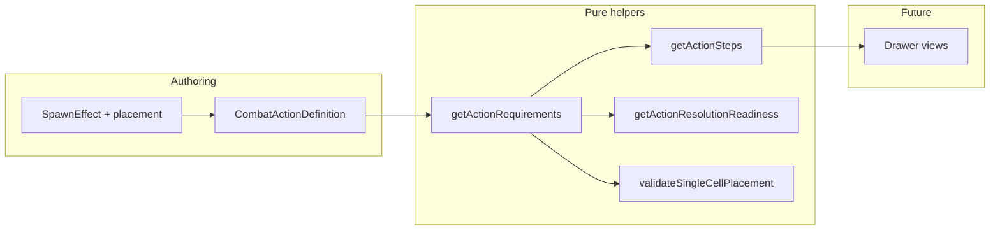

# Multi-step spell resolution: requirements, steps, validation (modeling pass)

## Current state (baseline)

- Readiness lives in `[action-resolution-requirements.ts](src/features/mechanics/domain/encounter/resolution/action/action-resolution-requirements.ts)`: coarse string kinds (`creature-target`, `area-selection`, `spawn-placement`, `caster-option`) and `getActionResolutionReadiness` iterates them. `spawn-placement` is always unsatisfied via `[isSpawnPlacementSatisfiedForPhase](src/features/mechanics/domain/encounter/resolution/action/action-resolution-requirements.ts)` returning `false`.
- `[SpawnEffect](src/features/mechanics/domain/effects/effects.types.ts)` already has `location`, `mapMonsterIdFromCasterOption`, `poolFromCasterOption`, `mapMonsterIdFromTargetRemains`, etc., but **no explicit remote single-cell placement rules** (range / LoS / unoccupied).
- **Ruleset spells with `kind: 'spawn'`** (grep): `[level1-a-l.ts](src/features/mechanics/domain/rulesets/system/spells/data/level1-a-l.ts)` (Find Familiar), `[level2-a-f.ts](src/features/mechanics/domain/rulesets/system/spells/data/level2-a-f.ts)` (Otherworldly Steed), `[level3-a-l.ts](src/features/mechanics/domain/rulesets/system/spells/data/level3-a-l.ts)` (Animate Dead), `[level4-a-l.ts](src/features/mechanics/domain/rulesets/system/spells/data/level4-a-l.ts)` (Conjure Minor Elementals, Conjure Woodland Beings), `[level4-m-z.ts](src/features/mechanics/domain/rulesets/system/spells/data/level4-m-z.ts)` (Giant Insect). Separate: monster ability spawn in `[monsters-s-u.ts](src/features/mechanics/domain/rulesets/system/monsters/data/monsters-s-u.ts)` (Troll) — treat as same `SpawnEffect` shape for placement metadata, not only spells.
- Consumers: `[encounter-resolve-selection.ts](src/features/encounter/domain/interaction/encounter-resolve-selection.ts)`, `[action-resolution-requirements.test.ts](src/features/mechanics/domain/encounter/tests/action-resolution-requirements.test.ts)`, drawer/footer copy via `getPrimaryResolutionMissing`.

## Design: three layers (as requested)

1. **Requirements** — what inputs must exist before resolve (including validation predicates for placement/targeting).
2. **Steps** — ordered UI affordances (`creatureTarget`, `casterOptions`, `singleCellPlacement`, `aoePlacement`); **not** the same as requirement kinds (e.g. LoS is validation on a requirement, not a step).
3. **Validation** — pure functions returning `PlacementValidationResult` with `reasons: PlacementValidationReason[]`.

**Naming:** Introduce **new** discriminated types (e.g. `ActionRequirement` / `ActionStepKind`) in a dedicated module to avoid confusion with the legacy `ActionResolutionRequirementKind` string union. Migration path: implement new helpers, then **refactor** `getActionResolutionRequirements` / `getActionResolutionReadiness` to **delegate** to the new model (or thin wrappers) so call sites stay stable where possible.

## 1) Types module (new file)

Add something like `[src/features/mechanics/domain/encounter/resolution/action/action-requirement-model.ts](src/features/mechanics/domain/encounter/resolution/action/action-requirement-model.ts)` (name flexible) containing:

- `ActionRequirement` union aligned with your sketch: `caster-option` (field ids or reference to `casterOptions` on action), `creature-target` (filters + `rangeFt?`, `lineOfSightRequired?`), `single-cell-placement` (`rangeFt?`, `lineOfSightRequired?`, `mustBeUnoccupied?`), `area-placement` (for AoE grid actions: tie to existing `areaTemplate` / `rangeFt` / `lineOfSightRequired?`).
- `ActionStepKind` and `ActionStepDefinition` (`kind`, `label`).
- `PlacementValidationReason` / `PlacementValidationResult`.
- Optional `ActionFlowState` shape — **document as forward-looking**; this pass may only **extend** `[ActionResolutionReadinessContext](src/features/mechanics/domain/encounter/resolution/action/action-resolution-requirements.ts)` with `selectedSummonCellId?: string | null` (or `selectedPlacementCellId`) so readiness can call `validateSingleCellPlacement` when placement metadata exists. Full `ActionFlowState` can mirror that subset until UI exists.

**Initiative:** Your sketch uses `initiativeMode: 'share-caster' | 'roll' | 'fixed'`. Existing `[SpawnSummonInitiativeMode](src/features/mechanics/domain/effects/effects.types.ts)` includes `'group'`. Plan: **do not rename** engine values in this pass; optional mapping in docs only.

## 2) `SpawnEffect.placement` (effects.types.ts)

Extend `[SpawnEffect](src/features/mechanics/domain/effects/effects.types.ts)` with optional `placement`:

- Suggested discriminated union, e.g. `placement?: { kind: 'single-cell'; rangeFromCaster?: { value: number; unit: 'ft' }; requiresLineOfSight?: boolean; mustBeUnoccupied?: boolean } | { kind: 'self-cell' | 'self-space'; ... } | { kind: 'inherit-from-target' }` (exact names to fit Animate Dead / corpse flows without inventing mechanics).
- **Rule:** If `placement` is omitted, keep current engine behavior (adapter/readiness may apply conservative defaults **only** where documented — prefer explicit authoring for each spell in this pass).

## 3) Pure helpers

| Helper                                                                       | Responsibility                                                                                                                                                                                                                                                                                                                                                 |
| ---------------------------------------------------------------------------- | -------------------------------------------------------------------------------------------------------------------------------------------------------------------------------------------------------------------------------------------------------------------------------------------------------------------------------------------------------------- |
| `getActionRequirements(action: CombatActionDefinition): ActionRequirement[]` | Derive from `targeting`, `casterOptions`, `areaTemplate`, and **spawn effects’ `placement`** (merge multiple spawn effects conservatively: e.g. union of needs). Map spell range into `rangeFt` where appropriate (reuse patterns from `[spell-combat-adapter.ts](src/features/encounter/helpers/spell-combat-adapter.ts)` / existing `rangeFt` on targeting). |
| `getActionSteps(requirements: ActionRequirement[]): ActionStepDefinition[]`  | Deterministic order: e.g. `creatureTarget` (if any creature-target req) → `casterOptions` (if any caster-option req) → `singleCellPlacement` (if any single-cell-placement req) → `aoePlacement` (if area-placement req). **LoS never becomes a step.**                                                                                                        |
| `validateSingleCellPlacement(...)`                                           | Inputs: requirement slice, caster cell, chosen cell, occupancy, LOS (call existing space helpers e.g. `[hasLineOfSight](src/features/encounter/space/space.sight.ts)` / encounter space APIs — **readonly**, no grid mutation). Return `PlacementValidationResult`.                                                                                            |
| `getActionResolutionReadiness` refactor                                      | Build missing list from **satisfied requirement predicates** (caster filled, target valid, area confirmed, **placement valid** when `selectedSummonCellId` present). Until UI passes cell id, single-cell requirement may remain “missing” with a clear message (replacing the generic “future update” string where placement is authored).                    |

**AoE path:** Keep existing `isAreaGridCombatAction` early branch in readiness; fold `area-placement` requirement into the same checks so behavior matches today.

## 4) Backfill spawn spell (and monster) data

Per spell, set `placement` **only** where the rules text supports it:

| Source                                                            | Placement intent (authoring guidance)                                                                                                                                                                                                                     |
| ----------------------------------------------------------------- | --------------------------------------------------------------------------------------------------------------------------------------------------------------------------------------------------------------------------------------------------------- |
| Giant Insect / Conjure Minor Elementals / Conjure Woodland Beings | `single-cell`, range from spell range, `requiresLineOfSight: true`, `mustBeUnoccupied: true` (explicit “unoccupied space you can see within range”).                                                                                                      |
| Find Familiar / Otherworldly Steed                                | `self-space` / `self-cell`-style placement (no remote single-cell step).                                                                                                                                                                                  |
| Animate Dead                                                      | Target is dead creature + remains mapping — **not** the same as remote single-cell; use `inherit-from-target` or rely on existing `mapMonsterIdFromTargetRemains` + creature-target requirement; **do not** imply a second map click unless data says so. |
| Troll limb (monster)                                              | `self-space` consistent with existing `location: 'self-space'`.                                                                                                                                                                                           |

## 5) Tests and docs

- Update `[action-resolution-requirements.test.ts](src/features/mechanics/domain/encounter/tests/action-resolution-requirements.test.ts)`: requirements list and ordering; readiness for Giant Insect–style action with placement metadata + mock context cell when testing validation.
- Add focused tests for `getActionSteps` ordering and `validateSingleCellPlacement` (table-driven: in-range / out-of-range / blocked LOS / occupied).
- Update `[spawn-resolution.test.ts](src/features/mechanics/domain/encounter/resolution/action/spawn-resolution.test.ts)` / `[normalization.test.ts](src/features/mechanics/domain/rulesets/system/normalization.test.ts)` only if types break fixtures.
- Update `[docs/reference/resolution.md](docs/reference/resolution.md)` with the requirement/step/validation split and `SpawnEffect.placement`.

## Explicit non-goals (this pass)

- No `singleCellPlacement` drawer view, no token placement execution, no shapeshift/replacement flows.
- No full workflow engine — only composable pure helpers and typed data.
- Avoid broad refactors outside readiness + spawn typing + spell data + exports in `[resolution/index.ts](src/features/mechanics/domain/encounter/resolution/index.ts)`.

## Acceptance criteria mapping

- Requirements/steps/validation are **separate types** and **pure helpers** with tests.
- LoS is **only** on validation inputs, not a step kind.
- All listed `**spawn` spell effects** carry explicit `placement` where applicable; Animate Dead uses a placement variant that matches corpse/target semantics without inventing mechanics.
- Existing single-target, AoE, and caster-option flows **remain green** (tests + manual smoke).
- Ready for a follow-up pass: wire `selectedSummonCellId` from UI into context and enable resolve when validation passes.

