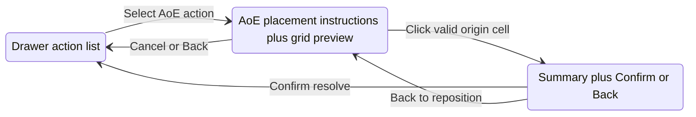

# First-pass AoE targeting (combat)

## Current gap

- **Resolver vs UI mismatch:** `[getActionTargets](src/features/mechanics/domain/encounter/resolution/action/action-targeting.ts)` treats `all-enemies` as “every valid enemy candidate” with **no grid geometry**. Spell data already encodes area (e.g. Fireball sphere) in `[buildSpellTargeting](src/features/encounter/helpers/spell-combat-adapter.ts)`, but `**CombatActionDefinition` only carries `rangeFt` (spell range / self reach), not area radius/shape**—so the UI cannot show a 20 ft sphere vs 150 ft cast range.
- **Resolve button is wrong for AoE:** `[EncounterActiveRoute](src/features/encounter/routes/EncounterActiveRoute.tsx)` sets `canResolveAction` only when `selectedActionId && selectedActionTargetId`. Domain resolution for `all-enemies` does **not** require `selection.targetId` (`[getActionTargets](src/features/mechanics/domain/encounter/resolution/action/action-targeting.ts)` lines 184–186). Today, AoE is either blocked or forced to pick a dummy target.
- **Grid:** `[selectGridViewModel](src/features/encounter/space/space.selectors.ts)` supports range rings and selected target; `[EncounterGrid](src/features/encounter/components/active/grid/EncounterGrid.tsx)` has no hover callback or AoE overlay layers.
- **Product note:** Cantrip copy still says encounter maps area spells to all enemies without geometry—this flow will start to replace that for spells we wire with `areaTemplate`.

## Recommended UX flow (matches your steps)

- **Idle:** Same as today; single-target actions still use token/cell selection for `selectedActionTargetId`.
- **Placing:** After choosing an AoE action, drawer shows compact instructions (“Choose a point within X ft”, “Y ft sphere”, “Click a cell, then confirm”). Grid shows **cast range** from caster, **hover preview** of the area, **invalid** hover (out of cast range or blocked—see below), **click** commits origin and moves to confirm (not resolve).
- **Confirm:** Drawer shows action name, range line, area size, short **affected list** (names + count cap). **Confirm** calls existing `handleResolveAction`; **Back** clears placement and returns to placing or idle.

Interaction rules: **hover = preview**, **click = lock origin**, **Confirm = resolve**, never auto-resolve on action select or first click.

## Proposed state / interaction model

**1) Classify actions in the UI**

- Introduce a small helper (e.g. `isAreaGridAction(action)`) that is true when:
  - `action.targeting?.kind === 'all-enemies'` **and**
  - optional new field `**action.areaTemplate`** is present (see below).
- Single-target / `single-creature` / touch spells: **unchanged**—still driven by `selectedActionTargetId` and `validActionIdsForTarget`.

**2) Runtime state (prefer `[EncounterRuntimeContext](src/features/encounter/routes/EncounterRuntimeContext.tsx)`)**

- Extend `[GridInteractionMode](src/features/encounter/domain/encounter-interaction.types.ts)` with e.g. `'aoe-place'` (or nest under existing modes—keep one clear mode for “grid clicks mean AoE origin”).
- New state (names illustrative):
  - `aoeActionId: string | null` (or reuse `selectedActionId` only—simplest is **reuse `selectedActionId`** and add `aoeStep: 'none' | 'placing' | 'confirm'`).
  - `aoeOriginCellId: string | null`
  - `aoeHoverCellId: string | null` (for preview)
- Entering AoE: selecting an area action sets `aoeStep` to `'placing'`, clears `aoeOriginCellId`, optionally clears `selectedActionTargetId` so it does not block resolve.
- Cancel / Back: reset `aoeStep` / `aoeOriginCellId` / hover; optionally clear `selectedActionId` if you want full return to list.

**3) Domain / data model (minimal, future-proof)**

- Add optional `**areaTemplate?: { kind: 'sphere'; radiusFt: number }`** on `[CombatActionDefinition](src/features/mechanics/domain/encounter/resolution/combat-action.types.ts)` (or on `CombatActionTargetingProfile`—prefer top-level for spell-adapter access).
- Populate in `[buildSpellTargeting](src/features/encounter/helpers/spell-combat-adapter.ts)` when `creatures-in-area` and `primaryTargeting.area` exists: map `sphere`/`cube` (first pass treat **cube as same radius = half of cube edge** or use `size/2`—document one rule).
- Extend `[ResolveCombatActionSelection](src/features/mechanics/domain/encounter/resolution/action-resolution.types.ts)` with `**aoeOriginCellId?: string`**.
- In `[getActionTargets](src/features/mechanics/domain/encounter/resolution/action/action-targeting.ts)`: when `all-enemies` and `areaTemplate` and `aoeOriginCellId` are set, **intersect** existing candidate enemies with a new spatial predicate: combatant’s cell is within **radiusFt** of the origin cell using existing `[gridDistanceFt](src/features/encounter/space/space.helpers.ts)` (same Chebyshev metric as the rest of the encounter space—**document as first-pass approximation** of a sphere). If `aoeOriginCellId` is missing but area is required, return `[]` (resolve no-op / guard in resolver).
- **Self-centered AoE** (e.g. Thunderwave): auto-set origin to **caster’s cell** when entering placement (or skip placing and go straight to confirm)—still one code path with a fixed origin.

**4) `[EncounterActiveRoute](src/features/encounter/routes/EncounterActiveRoute.tsx)`**

- `**canResolveAction`:** If current action is area-grid action: require `aoeStep === 'confirm'` and `aoeOriginCellId` (or auto-origin for self-centered) and valid caster options as today; **do not** require `selectedActionTargetId`. Else keep existing target requirement.
- `**handleResolveAction`:** Pass `aoeOriginCellId` into `resolveCombatAction` selection when present (thread from context into `[useEncounterState](src/features/encounter/hooks/useEncounterState.ts)` `handleResolveAction`).
- `**handleCellClick`:** Branch on `interactionMode` / `aoeStep`: in AoE placing, click sets origin and advances to confirm; in confirm, optional: ignore or allow changing origin via “Back” only. Avoid treating empty cell as move while in AoE mode (today empty cell triggers `[handleMoveCombatant](src/features/encounter/hooks/useEncounterState.ts)`).

**5) Grid rendering**

- Extend `[GridCellViewModel](src/features/encounter/space/space.selectors.ts)` with optional flags or pass a parallel structure: `aoeCastRange`, `aoePreviewCells`, `aoeInvalidHover`, `aoeAffectedOccupants`—computed in a dedicated selector (e.g. `selectAoeOverlayModel`) from `encounterState`, `activeCombatantId`, `selectedAction`, `aoeOriginCellId`, `aoeHoverCellId`.
- **Valid cast range:** reuse same distance logic as `selectedActionRangeFt` from caster cell to **hover/selected origin** cell; show ring/highlight for “can place here.”
- **Invalid:** origin would be out of spell range **or** (first pass) origin cell is **wall/blocking**—tint differently; do not advance to confirm on invalid click (toast optional).
- **Affected creatures:** list combatants in preview cells for drawer summary; cap display (e.g. first 5 names + “+N more”).

**6) `[EncounterGrid](src/features/encounter/components/active/grid/EncounterGrid.tsx)`**

- Add `**onCellHover?(cellId: string | null)**` (and optionally `onCellLeave`).
- Layer colors: extend `cellColor` (or sublayers) for preview vs invalid vs confirmed origin—keep palette consistent with existing `isInRange` / `isReachable`.

**7) `[CombatantActionDrawer](src/features/encounter/components/active/drawers/CombatantActionDrawer.tsx)`**

- Props for AoE step: `aoeStep`, instructions string or structured lines, `affectedSummary`, `onConfirmPlacement`, `onCancelAoe`, `onBackFromConfirm`, `confirmDisabled`.
- When `aoeStep === 'placing'`: collapse or de-emphasize full action lists; show instruction block + Cancel.
- When `aoeStep === 'confirm'`: show summary + **Confirm** (calls resolve) + **Back**.
- `**onSelectAction`:** If user picks an area action, parent sets placement mode (drawer does not resolve).

## Coexistence with single-target

| Mode          | Target selection                     | Resolve                                              |
| ------------- | ------------------------------------ | ---------------------------------------------------- |
| Single-target | `selectedActionTargetId` + valid set | unchanged                                            |
| AoE (grid)    | `aoeOriginCellId` + `areaTemplate`   | `aoeOriginCellId` on selection; ignore single target |

Switching from an AoE action to a single-target action clears AoE state; vice versa.

## AoE lifecycle and reset behavior (required)

Implement a single internal helper (e.g. `resetAoePlacement()` or equivalent) that clears **all** of the following, so the grid and drawer never show stale AoE UI:

| Field / concept  | Cleared                                                                                                     |
| ---------------- | ----------------------------------------------------------------------------------------------------------- |
| Placement step   | `aoeStep` → `'none'` (or equivalent: not in placing/confirm)                                                |
| Hover preview    | `aoeHoverCellId` → `null`                                                                                   |
| Confirmed origin | `aoeOriginCellId` → `null`                                                                                  |
| Interaction mode | If using `GridInteractionMode === 'aoe-place'`, return to `'select-target'` when placement is fully cleared |

Call this reset (or full reset including `selectedActionId` where noted) on **every** event below.

### 1. Drawer close

- **When:** User closes the action drawer (explicit close button, or Escape if it closes the drawer).
- **Behavior:** Full AoE reset: `aoeStep`, `aoeHoverCellId`, `aoeOriginCellId`, and `interactionMode` if it was `'aoe-place'`. Do **not** require clearing `selectedActionId` unless product prefers “close drawer = deselect action”; minimum bar is **no AoE overlay state** left. Recommended: also clear `selectedActionId` when closing drawer during AoE flow so reopening starts clean—if that is too aggressive, at minimum clear all AoE-specific fields so hover/origin/placing never persist.

### 2. Action switch

- **When:** User selects a **different** action in the drawer (`onSelectAction` → new `selectedActionId`).
- **Behavior:**
  - If **leaving** an area-grid action (previous was AoE, new is not): reset AoE fields as above.
  - If **entering** an area-grid action from non-AoE: reset then set `aoeStep` to `'placing'` (and clear origin/hover).
  - If **switching between two area-grid actions**: reset origin and hover, set `aoeStep` to `'placing'` for the new action (do not carry origin from spell A to spell B).

### 3. Turn change (active combatant changes)

- **When:** `activeCombatantId` changes (next turn, encounter advance, or any code path that changes whose turn it is).
- **Behavior:** Full AoE reset as in §1 (same as existing pattern that sets `interactionMode` back to `'select-target'` in `[EncounterRuntimeContext](src/features/encounter/routes/EncounterRuntimeContext.tsx)`). Clears placing mode, hover, and confirmed origin so the next player does not inherit another caster’s AoE UI.

### 4. Successful resolution

- **When:** `handleResolveAction` completes and encounter state updates (combat log appended / action resolved successfully).
- **Behavior:** Full AoE reset: `aoeStep`, `aoeHoverCellId`, `aoeOriginCellId`, and return `interactionMode` from `'aoe-place'` to `'select-target'`. Typically also clear `**selectedActionId`** (and caster options reset is already tied to action id in `[useEncounterState](src/features/encounter/hooks/useEncounterState.ts)`) so the user returns to a neutral “pick next action” state unless product wants to keep the same action selected for multi-cast—first pass: **clear selected action** after resolve to match “one resolve = one commitment.”

### Implementation note

- Centralize resets in one place (context callback) and invoke from: drawer `onClose`, action selection handler, `useEffect` on `activeCombatantId`, and post-resolve path inside `handleResolveAction` (after `setEncounterState` succeeds) or a `useEffect` that detects “resolve just fired” if needed—prefer **synchronous reset in the same handler** after successful resolve to avoid one-frame flicker.

## Edge cases and risks

- **Escape / drawer close:** Covered by §1 above; Escape must run the same `onClose` path so AoE state is cleared.
- **No space / no grid:** If `!encounterState.space`, disable AoE placement and show message (fallback: legacy “all enemies in range” only if you keep a escape hatch—prefer disable for clarity).
- **Double Escape:** Drawer already uses non-modal Escape; ensure document listener doesn’t close mid-placement without clearing AoE state (same handler path).
- **Sphere approximation:** Chebyshev grid distance ≠ Euclidean sphere—acceptable for v1 if documented in code comment.
- **Friendly fire:** Hostile rules unchanged; if future rules need allies in fireball, extend filter.

## Phased delivery

| Phase                    | Scope                                                                                                            |
| ------------------------ | ---------------------------------------------------------------------------------------------------------------- |
| **A – Domain + adapter** | `areaTemplate` on actions; `aoeOriginCellId` on selection; `getActionTargets` filtering for `all-enemies` + area |
| **B – Runtime + route**  | AoE state in context; `canResolveAction` / `handleResolveAction` / cell click branching                          |
| **C – Grid + selectors** | Hover, preview tinting, affected list for drawer                                                                 |
| **D – Drawer UI**        | Instruction + confirm panels; cancel/back wiring                                                                 |

**First pass implements A–D in one vertical slice** for **sphere** (and one mapping for cube) on a **single representative spell** path—Fireball-style `creatures-in-area` + distance range—then any spell that gets `areaTemplate` automatically gains the flow.