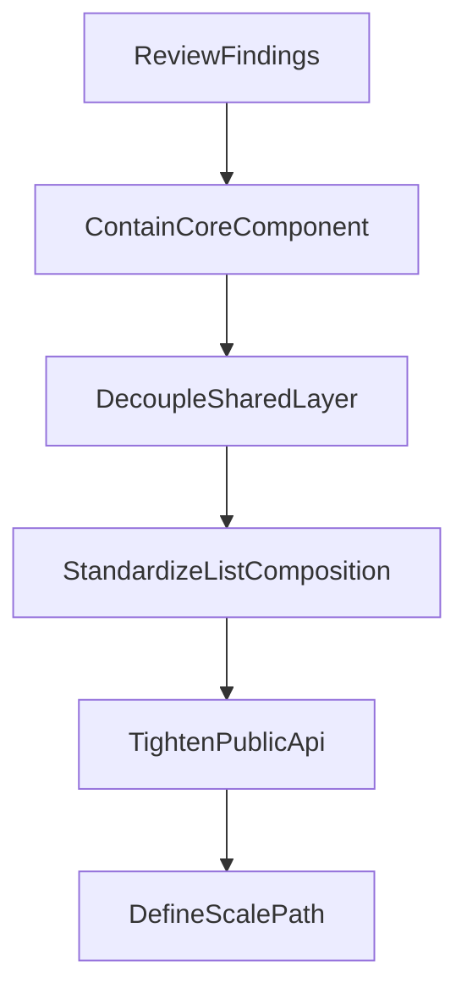

# AppDataGrid Health Plan

## Goal
Stabilize [`src/ui/patterns/AppDataGrid`](src/ui/patterns/AppDataGrid) as a reusable shared pattern before more list pages and richer toolbar behavior land. The target is not a rewrite. The target is to make the existing grid easier to extend, less coupled to content-specific code, and clearer about when it should stop being a purely client-side list primitive.

## Re-evaluated Assessment
The first-pass plan was directionally correct, but the current code shifts the highest-value refactors slightly.

The main pressure points now are:
- [`src/ui/patterns/AppDataGrid/core/AppDataGrid.tsx`](src/ui/patterns/AppDataGrid/core/AppDataGrid.tsx) is the primary scaling risk. It currently owns toolbar state, filter rendering, badge generation, layout orchestration, special-case campaign utilities, and the final MUI grid rendering.
- The earlier plan referenced `toolbarFilters.ts`, but current filter behavior is split across [`src/ui/patterns/AppDataGrid/filters/filterDefaults.ts`](src/ui/patterns/AppDataGrid/filters/filterDefaults.ts), [`src/ui/patterns/AppDataGrid/filters/filterBadges.ts`](src/ui/patterns/AppDataGrid/filters/filterBadges.ts), and [`src/ui/patterns/AppDataGrid/core/appDataGridFiltering.ts`](src/ui/patterns/AppDataGrid/core/appDataGridFiltering.ts). The risk is less “one oversized helper file” and more “logic spread across loosely related helpers with naming drift”.
- [`src/ui/patterns/AppDataGrid/core/AppDataGrid.tsx`](src/ui/patterns/AppDataGrid/core/AppDataGrid.tsx) directly imports `ContentToolbarDiscreteRangeField` from the content feature layer. That means `ui/patterns` is not fully shared infrastructure anymore.
- [`src/features/content/shared/components/ContentTypeListPage.tsx`](src/features/content/shared/components/ContentTypeListPage.tsx) and [`src/features/content/shared/components/contentListTemplate.tsx`](src/features/content/shared/components/contentListTemplate.tsx) do centralize a lot of content-list composition well, but route files still repeat a recognizable shell: presentation defaults, validation messaging, toolbar layout wiring, and row muting for disallowed content.
- [`src/ui/patterns/AppDataGrid/core/appDataGridFiltering.ts`](src/ui/patterns/AppDataGrid/core/appDataGridFiltering.ts) is still appropriate for modest lists, but the search path currently does repeated column lookup inside per-row filtering. That is the clearest scalability ceiling in the runtime pipeline.
- [`src/ui/patterns/AppDataGrid/types/appDataGrid.types.ts`](src/ui/patterns/AppDataGrid/types/appDataGrid.types.ts) still has a selection TODO. That is not urgent today, but it is a real extension point if bulk actions or larger admin workflows land.

## Refactor Strategy
Use a containment-first sequence, but front-load the changes that protect the shared-layer boundary.

## Stage 1: Highest Value Now
These are the refactors most likely to improve scalability without creating product churn.

- Contain [`src/ui/patterns/AppDataGrid/core/AppDataGrid.tsx`](src/ui/patterns/AppDataGrid/core/AppDataGrid.tsx) by extracting internal seams for:
  - toolbar state and reset behavior
  - filter control rendering
  - active badge derivation
  - toolbar row layout
  - final grid presentation
- Remove direct feature-layer coupling from the shared grid:
  - replace the direct `ContentToolbarDiscreteRangeField` dependency with a shared primitive, slot, or injected renderer
  - review whether owned-content presentation helpers belong in `ui/patterns` or should move back toward the content layer
- Correct stale plan assumptions and naming drift:
  - stop referring to the removed `toolbarFilters.ts`
  - align `chip` compatibility naming toward `badge`
  - narrow exports in [`src/ui/patterns/AppDataGrid/index.ts`](src/ui/patterns/AppDataGrid/index.ts) and [`src/ui/patterns/AppDataGrid/filters/index.ts`](src/ui/patterns/AppDataGrid/filters/index.ts)

## Stage 2: High Value Soon
These are the next refactors that improve scalability at the feature-composition level.

- Reduce repeated content-list route composition by deciding whether the following should move fully into [`src/features/content/shared/components/ContentTypeListPage.tsx`](src/features/content/shared/components/ContentTypeListPage.tsx) or a nearby shared wrapper:
  - default grid presentation
  - muted-row styling for disallowed content
  - validation or warning banner placement
  - preference-backed toolbar state wiring
- Revisit toolbar layout ownership so filter ids and layout declarations do not drift apart across content lists. Candidate seams are:
  - derive layout from a shared registry
  - add validation around unknown layout ids
  - centralize common secondary-row conventions for campaign content
- Standardize search behavior so “content lists” and “direct AppDataGrid lists” do not diverge into separate UX models unless intentionally chosen.

## Stage 3: Plan But Defer
These are real future needs, but they should not lead the current refactor.

- Server-driven or indexed filtering/search
- A controlled selection API for bulk actions
- A generalized toolbar plugin framework
- Breaking every helper into tiny files before boundaries are clearer

## Specific Review Targets
Use these as the primary checkpoints for the implementation plan.

- [`src/ui/patterns/AppDataGrid/core/AppDataGrid.tsx`](src/ui/patterns/AppDataGrid/core/AppDataGrid.tsx): reduce god-file risk and isolate campaign-specific behavior
- [`src/ui/patterns/AppDataGrid/core/appDataGridFiltering.ts`](src/ui/patterns/AppDataGrid/core/appDataGridFiltering.ts): make the current client-side path cheaper and define the future handoff point
- [`src/ui/patterns/AppDataGrid/types/appDataGrid.types.ts`](src/ui/patterns/AppDataGrid/types/appDataGrid.types.ts): keep the public contract understandable and prepare for future selection work
- [`src/ui/patterns/AppDataGrid/types/appDataGridToolbar.types.ts`](src/ui/patterns/AppDataGrid/types/appDataGridToolbar.types.ts): clarify what belongs to generic toolbar layout versus content-specific utilities
- [`src/features/content/shared/components/ContentTypeListPage.tsx`](src/features/content/shared/components/ContentTypeListPage.tsx): absorb repeated route-level wiring where it truly is shared
- [`src/features/content/shared/components/contentListTemplate.tsx`](src/features/content/shared/components/contentListTemplate.tsx): keep shared campaign content columns and filters from turning into a second schema source

## Success Criteria
This effort should be considered successful if:
- `AppDataGrid` no longer requires reading one large file to safely add a toolbar feature
- `ui/patterns/AppDataGrid` does not depend directly on content feature components
- content-list routes add domain-specific columns and filters without repeating shared list scaffolding
- the public filter and visibility API is easier to understand and harder to misuse
- the team has an explicit threshold for when to move beyond the current client-side filter/search pipeline

## Recommended Next Steps
1. Start with a design pass on [`src/ui/patterns/AppDataGrid/core/AppDataGrid.tsx`](src/ui/patterns/AppDataGrid/core/AppDataGrid.tsx), [`src/ui/patterns/AppDataGrid/core/appDataGridFiltering.ts`](src/ui/patterns/AppDataGrid/core/appDataGridFiltering.ts), and [`src/ui/patterns/AppDataGrid/types/appDataGrid.types.ts`](src/ui/patterns/AppDataGrid/types/appDataGrid.types.ts) to define the internal seams and the public API surface that must stay stable.
2. In parallel, decide the shared-layer boundary for range filters and campaign utilities so `ui/patterns` can stop importing from `features/content`.
3. After the shared-layer boundary is clear, tighten [`src/features/content/shared/components/ContentTypeListPage.tsx`](src/features/content/shared/components/ContentTypeListPage.tsx) around the repetitive content-list route shell.
4. Document explicit scale triggers for a future server-side or indexed search/filter path instead of leaving that decision implicit.