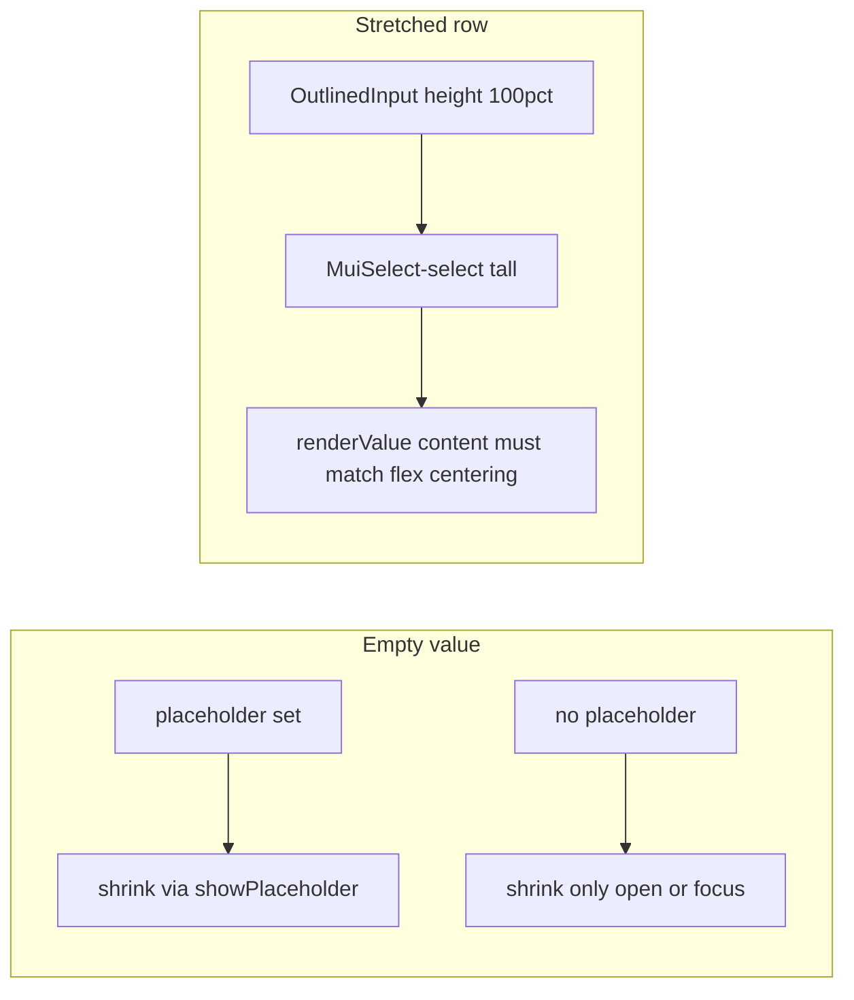

# AppSelect primitive hardening (implementation-ready)

## Preserved diagnosis (root causes)

[`AppSelect`](src/ui/primitives/forms/AppSelect.tsx) today combines:

- **`InputLabel` `shrink`**: `hasValue` **or** `open` **or** `focused` **or** `showPlaceholder` where `showPlaceholder = Boolean(placeholder) && !hasValue`.
- **When `placeholder` is set**: `displayEmpty` and a custom **`renderValue`**; empty `MenuItem` with `value=""`; empty branch currently wraps placeholder in **`Box component="span"`** (block-level quirks vs plain selected text).
- **Stretch**: [`formGridStretchOutlinedSx`](src/ui/patterns/form/FormLayoutStretchContext.tsx) sets **`'& .MuiOutlinedInput-root': { height: '100%' }`**, so **`.MuiSelect-select`** can grow tall while its **content** stays visually **top-weighted** unless explicitly centered—**placeholder + renderValue** exaggerates the gap vs a simple selected label string.

[`AppFormSelect`](src/ui/patterns/form/AppFormSelect.tsx) forwards **`required`** and RHF **`rules.required`**; empty string remains invalid for required fields—**no change to that model** in this pass.

---

## 1. Refined primitive contract

**Single primitive:** There remains **one** `AppSelect`; empty-state behavior is defined by **`placeholder` presence**, not by parallel components or default sentinels.

### When `placeholder` is provided (canonical “optional empty” UX)

| Rule | Behavior |
|------|----------|
| Empty value | `value` is `''` or `null`/`undefined` (normalized to `''` for the native Select value). |
| `displayEmpty` | **Always used** (required for empty selection to display). |
| Label shrink | **`InputLabel` shrinks** while the empty placeholder is shown (via existing `showPlaceholder` / equivalent logic)—**same as today’s intent**, but **must** stay consistent in **normal and stretched** layouts after style fixes. |
| Display pipeline | **Exactly one** custom path: **`renderValue`** handles the empty case; selected options use the same typography baseline as non-placeholder display (see §4). |
| Menu | **`MenuItem value=""`** remains the mechanism for the empty option; `emptyMenuItemDisabled` stays a caller-controlled knob (no primitive default to sentinel options). |

### When `placeholder` is **not** provided

| Rule | Behavior |
|------|----------|
| No `renderValue` for placeholder | **`renderValue` is not set** for placeholder purposes—**plain MUI `Select` behavior** for showing the selected option label. |
| Empty value + blurred + closed | **`shrink` is false** until open/focus: standard **outlined** label sits in the field—**not** a bug; contributors should not reintroduce a second placeholder path call-site-by-call-site. |
| No “special display mode” | There is **no** second parallel empty UI unless the product authors **`placeholder`** or intentionally adds a **sentinel row inside `options`** (caller-owned; see §4 policy). |

**Contributor clarity:**

- **Placeholder implies shrink** when value is empty and the field is not in a conflicting state (per `showPlaceholder` semantics).
- **`renderValue`** runs **only** when `placeholder` is provided—used for **both** empty (`''`/null) and non-empty branches as today, but the **empty** branch must not look like a different “mode” from selected text.
- **Plain MUI** is expected when **`placeholder` is omitted**—documented so nobody “fixes” centeredness by adding one-off wrappers in screens.

---

## 2. Root-cause fix strategy (primitive-only)

**Scope:** [`AppSelect.tsx`](src/ui/primitives/forms/AppSelect.tsx) and shared stretch styling—**not** individual feature screens unless a verified outlier remains after this pass.

1. **Tighten the empty `renderValue` branch (Plan B)**  
   - Remove block-level **`Box`** from the default empty placeholder rendering.  
   - Prefer **`Typography`** with `component="span"` **or** plain **``** + `sx` for `color: 'text.secondary'`, with **inline / inline-flex** semantics aligned to MUI’s default selected-value text.  
   - Goal: **one visual language**—placeholder is “dimmed option text,” not a separate layout mode.

2. **Keep behavior matrix stable**  
   - `hasValue`, `showPlaceholder`, `shrink`, `displayEmpty`, and `MenuItem value=""` **logic stays** unless a contradiction appears in tests; changes are **stylistic and layout**, not new branches per call site.

3. **Comment the contract** at the top of `AppSelect.tsx` (short: 5–10 lines)—enough that future edits run through the same rules.

---

## 3. Shared stretch-style strategy (first-class primitive concern)

**Goal:** Under [`FormLayoutStretchProvider`](src/ui/patterns/form/FormLayoutStretchContext.tsx), **`AppSelect` + `AppFormSelect`** look correct **by default**—not incidentally correct in some rows.

**Implementation direction (Plan A):**

- Extend **[`formGridStretchOutlinedSx`](src/ui/patterns/form/FormLayoutStretchContext.tsx)** *or* apply a **narrow** additional `sx` fragment that **`AppSelect` merges** when `useFormLayoutStretch` is not available to primitives (today **`AppFormSelect`** / **`DriverField`** pass `sx`; **`AppSelect`** used raw does not—see below).

**Recommended shape:**

- Prefer extending **`formGridStretchOutlinedSx`** with a **scoped** rule such as **`'& .MuiOutlinedInput-root .MuiSelect-select'`** (or the minimal selector that targets **only** the select’s displayed value region under outlined input) with:  
  **`display: 'flex'`**, **`alignItems: 'center'`**, **`minHeight: 0`**, and **`boxSizing: 'border-box'`** as needed.  
- **Do not** widen selectors to unrelated `OutlinedInput` **TextField**s unless testing proves they need the same fix; if TextFields inherit safely, one shared rule is acceptable—**verify** in tests/manual pass.

**Direct `AppSelect` without stretch `sx`:**  
- Primitive tests wrap with **`FormLayoutStretchProvider value={true}`** + **`formGridStretchOutlinedSx`** on `FormControl`/`sx` to mirror [`AppFormSelect`](src/ui/patterns/form/AppFormSelect.tsx).

**Validation checklist (manual or test-assisted):**

| Scenario | Expect |
|----------|--------|
| Non-stretch | Value and placeholder **unchanged** from pre-fix baseline except improved placeholder alignment. |
| Stretch + empty + placeholder | Placeholder **vertically centered** in the value area; **label shrunk**. |
| Stretch + selected value | Selected label **vertically centered**; **chevron** aligned; **no clipping**. |
| Open menu | Focus/open still drives shrink; **no** layout jump that regresses icon. |

---

## 4. Empty-state / required-state policy

**Default:** **One** empty-state convention at the primitive level: **`placeholder` + `value === ''`** (or normalized empty). **Do not** introduce multiple **default** empty conventions (e.g. primitive auto-injecting a “Choose…” **`MenuItem`** without `placeholder`).

| Situation | Policy |
|-----------|--------|
| **Optional select** | Callers may set **`placeholder`** + initial **`''`**; empty remains valid unless **`required`**. |
| **Required select** | **`placeholder` allowed** for UX; **`value === ''`** remains **invalid** via RHF in **`AppFormSelect`**—no primitive change. **`FormControl` `required`** continues to mark the field. |
| **Sentinel option** (e.g. `{ value: '', label: 'Choose…' }` **only** in `options`, no `placeholder`) | **Allowed only when callers explicitly author it**—not generated by **`AppSelect`**. Document as an **advanced** pattern for rare cases; not the default product path. |
| **`emptyMenuItemDisabled`** | Stays as today: optional UX (e.g. cannot re-pick empty from the list). **DriverField** may keep passing `true` when `placeholder` exists—**no mandatory change** in this pass unless tests reveal a conflict. |

**Explicit non-goal:** Supporting **two** competing “empty” stories (placeholder **and** mandatory sentinel row) **by default**—callers pick **one** approach per field.

---

## 5. Test plan (required deliverable)

**Tooling:** Project uses **Vitest** + **Testing Library** (see e.g. [`src/test/example.test.tsx`](src/test/example.test.tsx), feature `*.test.tsx` files). **No Storybook** or `*.stories.*` files were found in the repo at plan time—**no Visual/state matrix story** in this pass unless you add Storybook later.

**Add:** [`src/ui/primitives/forms/AppSelect.test.tsx`](src/ui/primitives/forms/AppSelect.test.tsx) (path aligned with colocated tests in the codebase patterns).

### Component/state coverage (minimum)

| # | Case | Assertions (examples) |
|---|------|-------------------------|
| 1 | Empty + **placeholder** | Placeholder text visible; **`InputLabel`** has **`MuiInputLabel-shrink`** when closed (or equivalent attribute/class check RTL can query). |
| 2 | **Selected value** + placeholder prop present | Shows option label, **not** placeholder. |
| 3 | Empty + **no** placeholder | **No** shrink from placeholder rule (blurred); label **not** shrunk—or match MUI class state for “unfilled” outlined. |
| 4 | **Stretch** + empty + placeholder | `sx` includes stretch styles; **optional**: assert computed style on `.MuiSelect-select` **or** snapshot class list—**at minimum** render under **`FormLayoutStretchProvider` + `formGridStretchOutlinedSx`** without throw and with placeholder visible. |
| 5 | **Stretch** + selected value | Selected label visible; no duplicate placeholder. |
| 6 | **Required + empty** via **RHF** | Wrap **`AppFormSelect`** in **`FormProvider`** + **`useForm`** with `defaultValues: { field: '' }`, **`required`**, submit or **`trigger()`**—expect **error message** / invalid state (mirror existing RHF patterns in tests). |

### Visual/state matrix

- **Not available** without Storybook. **Fallback:** the table above + one test file that **parametrize**s or **groups** `describe` blocks for **placeholder on/off × empty/selected × stretch on/off** to keep the matrix **explicit** in code.

### Regression guard

- Tests should fail if **`renderValue`** empty branch reintroduces **block** wrappers that change role/layout, or if **stretch** `sx` stops targeting **`.MuiSelect-select`** centering.

---

## 6. Optional docs/story follow-up

- **`docs/reference/forms.md`:** Optional short subsection: **`AppSelect`** contract (**placeholder** vs none), **stretch** + **`formGridStretchOutlinedSx`**, pointer to test file. **Only if** the team wants doc parity—avoid unsolicited longform unless requested.
- **Storybook matrix:** If the project adopts stories later, add **one** matrix story reusing the same dimensions as §5—**deferred** until Storybook exists.

---

## 7. Deferred items / avoided API surface

- **`forceShrink` / arbitrary `shrink` override:** **Do not add** unless **A + B** ship and a **documented** real case remains open.
- **Second primitive** (“`AppSelect` vs `AppPlainSelect`”): **Not in scope.**
- **Screen-level CSS overrides** for select alignment: **Avoid**—fix **`AppSelect` + stretch styles** first.
- **Broad form-field refactors** unrelated to select: **Out of scope.**

---

## 8. Recommended next step

1. Implement **§2 (B)** then **§3 (A)** in [`AppSelect.tsx`](src/ui/primitives/forms/AppSelect.tsx) + [`FormLayoutStretchContext.tsx`](src/ui/patterns/form/FormLayoutStretchContext.tsx) (or narrowed `sx` merge), with **§1** comment block.  
2. Land **§5** tests in the same PR or immediately following so CI guards regressions.  
3. Smoke **one** real **stretched** form screen (e.g. dynamic form row) **only** if tests leave doubt about icon/end-adornment.  
4. **Optional:** §6 doc blurb.

This yields a **stable contract**, **primitive-local** fixes, **stretch as a supported mode**, and **regression tests** as the anti-slip mechanism for future contributors.
