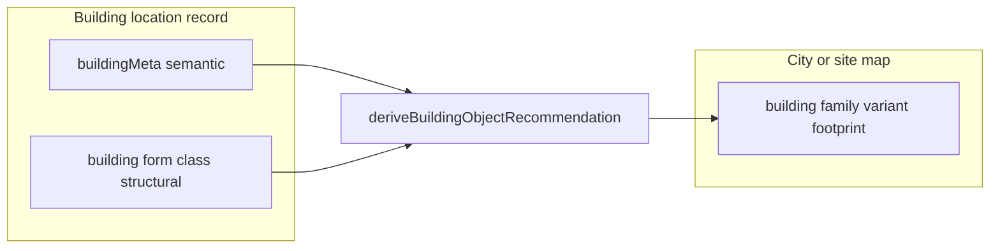

# Building form classes, map variants, and derivation seam

**Related plan:** [.cursor/plans/location_modeling_schema_plan_b86f6970.plan.md](.cursor/plans/location_modeling_schema_plan_b86f6970.plan.md) — this work advances the **building identity vs city-map presentation** split; it does **not** implement `placementId` / `cityPlacementRef` (§16) or street transitions.

---

## A. Registry: `building` family variants (city/site)

**File:** [src/features/content/locations/domain/model/placedObjects/locationPlacedObject.registry.ts](src/features/content/locations/domain/model/placedObjects/locationPlacedObject.registry.ts)

- Replace semantic variants `residential` / `civic` with a **small v1** footprint set:
  - **`compact_1cell`** — default `defaultVariantId`; labels like “Small building”; `presentation` includes `footprintClass`, `massing`, `shape` (or reuse/extend [AuthoredPlacedObjectVariantPresentation](src/features/content/locations/domain/model/placedObjects/locationPlacedObject.registry.ts) with optional `footprintClass` / `massing` so TS matches the spec).
  - **`wide_2cell`** — “Wide building”; broader envelope.
- **Defer** `deep_2cell` unless a second footprint is clearly needed for parity; note as follow-up in summary.
- Keep `runtime` and `linkedScale: 'building'` unchanged; update comments so variants are explicitly **urban footprint / massing**, not business type.

**Persisted data (no legacy support):** Do **not** add runtime aliases from old ids (`residential`, `civic`) to new variant keys. Any existing map documents that still store removed variant ids will resolve through [`resolveFamilyVariant`](shared/domain/registry/familyVariantResolve.ts) to the family **`defaultVariantId`** (unknown keys are not in `variants`). If preserving historical footprint distinction matters for production data, handle it with an **explicit one-time migration script** (out of scope for this pass unless you add a small `scripts/` migrator)—not with permanent alias logic in selectors.

**Tests:** Update [locationPlacedObject.selectors.test.ts](src/features/content/locations/domain/model/placedObjects/__tests__/locationPlacedObject.selectors.test.ts) (defaults, counts, normalize fallbacks) and any tests that hardcode `residential` / `civic` ([placementRegistryResolver.test.ts](src/features/content/locations/domain/authoring/editor/__tests__/placement/placementRegistryResolver.test.ts), [resolvePlacedKindToAction.test.ts](src/features/content/locations/domain/authoring/editor/__tests__/placement/resolvePlacedKindToAction.test.ts), [buildPlacePreviewRenderItem.test.ts](src/features/content/locations/domain/authoring/editor/placePreview/__tests__/buildPlacePreviewRenderItem.test.ts)) to use the new variant ids.

---

## B. Building form classes + default interior grid sizes (5 ft cells)

**New shared constants** (pick one file, e.g. `shared/domain/locations/building/locationBuildingForm.defaults.ts` or adjacent to [locationBuilding.types.ts](shared/domain/locations/building/locationBuilding.types.ts)):

- **`LocationBuildingFormClassId`** union: `compact_small` | `compact_medium` | `wide_medium` | `wide_large`.
- **`LOCATION_BUILDING_FORM_DEFAULT_GRID_SIZES`** (or `BUILDING_FORM_TEMPLATE_DEFAULTS`): `{ columns, rows }` per form class, matching the spec:
  - `compact_small` → 4×4 (20′×20′ @ 5′ cells)
  - `compact_medium` → 6×6
  - `wide_medium` → 8×6
  - `wide_large` → 10×8
- Document in JSDoc that values are **bootstrap defaults**, not lore; cell size assumption **5 ft** must match the **floor map cell unit** for building-scale maps (verify against [locationScaleField.policy.ts](shared/domain/locations/scale/locationScaleField.policy.ts) / create flow).

**Create flow:** [locationCreateSetupForm.ts](src/features/content/locations/domain/forms/setup/locationCreateSetupForm.ts) currently maps `LocationBuildingInteriorBootstrapPresetId` (`compact` | `standard` | `large`) → [GRID_SIZE_PRESETS](shared/domain/grid/gridPresets.ts) (`small`/`medium`/`large` with 8×6, 12×10, 16×12). Replace this with **four form-class options** in UI + draft type, and drive first-floor grid from **`LOCATION_BUILDING_FORM_DEFAULT_GRID_SIZES`** instead of generic `GRID_SIZE_PRESETS`. Update [LocationCreateSetupFormDialog](src/features/content/locations/components/workspace/setup/LocationCreateSetupFormDialog.tsx) labels/helper copy to describe **structural form**, not semantic type.

**Rename/remove:** Retire or alias `LocationBuildingInteriorBootstrapPresetId` three-way enum in favor of `LocationBuildingFormClassId` (or map old three values to the closest form class for one release if you need a softer migration—prefer a clean swap if no persistence of interior preset on the building row).

---

## C. Derivation + compatibility seam (replace `recommendBuildingPlacementVariant`)

**Current:** [shared/domain/locations/building/recommendBuildingPlacementVariant.ts](shared/domain/locations/building/recommendBuildingPlacementVariant.ts) maps only `primaryType`/`primarySubtype` → `'residential' | 'civic'`.

**Replace with** a single exported helper (name per team preference, e.g. **`deriveBuildingObjectRecommendation`**) in `shared/domain/locations/building/`:

**Inputs (v1):** `LocationBuildingMeta` (at least `primaryType`, `primarySubtype`, `functions`, `isPublicStorefront`) + **`LocationBuildingFormClassId`** (from create/edit when available).

**Outputs (minimal):**  
- `buildingFormId: LocationBuildingFormClassId` (explicit or inferred)  
- `recommendedMapVariantIds: string[]` (e.g. `['compact_1cell']` or `['wide_2cell']`)  
- Optional: short `notes` / `reason` for debugging or future UI

**Approximate v1 rules** (from your spec): residential / house-like → compact forms + `compact_1cell`; craft/trade/blacksmith → `wide_medium` form + `wide_2cell`; tavern/inn/lodging → `wide_medium` / `wide_large` + `wide_2cell`; warehouse/storage → `wide_large` + `wide_2cell`. Keep heuristics small and commented.

**Compatibility helper (optional, small):** e.g. `getCompatibleMapVariantsForBuildingForm(formClass)` returning allowed variant ids, or `isMapVariantCompatibleWithBuildingForm(form, variantId)`—only if it stays shorter than overfitting; otherwise fold into the same module as filters on the recommendation output.

**Exports:** Update [shared/domain/locations/index.ts](shared/domain/locations/index.ts): remove or deprecate export of old function name; add new module exports.

**Call sites:** Grep for `recommendBuildingPlacementVariant` and wire the new helper where palette defaults / future “suggested variant” UI should run (may be **no UI** this pass except internal use from create flow if you pre-fill suggested map variant when placing a marker—only if already trivial; otherwise document as follow-up).

**Naming:** Avoid “profile” terminology; prefer **form** / **map variant** / **footprint** in identifiers and comments.

---

## D. Docs (light touch)

- Short addition to [docs/reference/locations/location-map-schema-relations.md](docs/reference/locations/location-map-schema-relations.md) or [domain.md](docs/reference/locations/domain.md): one subsection on **three layers** (semantic meta vs structural form vs map footprint variant) and pointer to shared helpers—**only if** you want docs in-repo (user previously preferred minimal doc churn; optional).

---

## E. Non-goals (this pass)

- No new orientation/frontage systems.
- No placement validation UI beyond what naturally follows registry + tests.
- No large variant taxonomy; **`deep_2cell`** deferred unless you add it with a one-line rationale in the PR.
- **No legacy variant-id alias map** in app code (no translating `residential`/`civic` at read time).
- Placement backpointer / `cityPlacementRef` remains in the **related** schema plan, not here.

---

## F. Verification

- `npm run test:run` for touched tests; `npx tsc --noEmit` for client.
- Manual: create building with each form class → grid dimensions match table; place building marker on city map → new variant ids resolve.

---

## G. Deliverables summary (for the implementer)

| Deliverable | Where |
|------------|--------|
| Footprint map variants | `AUTHORED_PLACED_OBJECT_DEFINITIONS.building` in registry |
| Form class ids + default grids | New shared defaults module + types |
| Create flow uses form classes | `locationCreateSetupForm` + dialog |
| Derivation seam | New helper module; replace `recommendBuildingPlacementVariant` |
| Tests | Selector + placement tests updated |

**Suggested follow-ups:** Wire `deriveBuildingObjectRecommendation` into city map place tool default variant; optional persistence of chosen **form class** on building row when server merge allows; `deep_2cell` variant + multi-cell placement rules; align with §16 placement backpointer when implemented; optional **one-time DB migration** for old `variantId` strings if campaigns must retain distinct footprints without falling back to default.
