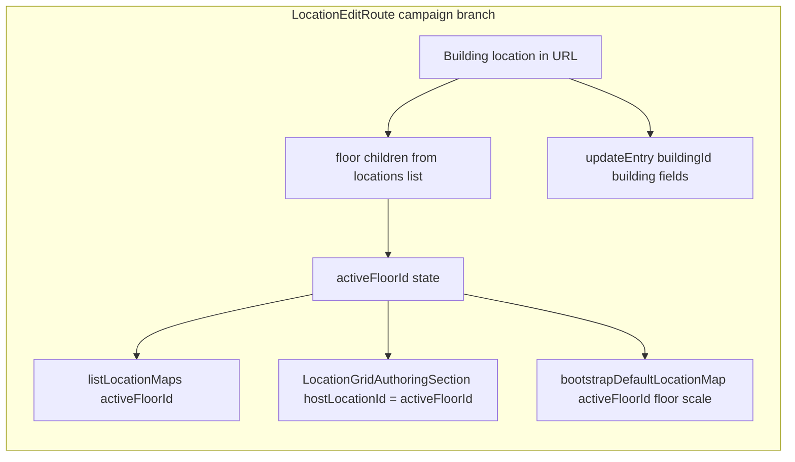

# Building workspace (floor strip) — first pass

## Context (current behavior)

- `[LocationEditRoute.tsx](src/features/content/locations/routes/LocationEditRoute.tsx)` loads default map into the form and `gridDraft` via `listLocationMaps(campaignId, locationId)` and saves with `locationRepo.updateEntry(campaignId, locationId, …)` + `bootstrapDefaultLocationMap(…, locationId, …)` for the **same** id.
- `[LocationEditorWorkspace.tsx](src/features/content/locations/components/workspace/LocationEditorWorkspace.tsx)` is header + horizontal row (canvas | right rail). The floor strip belongs **inside the canvas column**, above `[LocationEditorCanvas](src/features/content/locations/components/workspace/LocationEditorCanvas.tsx)` (not full-width).
- Parent/child policy already allows `**floor` → parent `building`** (`[locationScale.policy.ts](shared/domain/locations/scale/locationScale.policy.ts)` `ALLOWED_PARENT_SCALES_BY_SCALE.floor` includes `building`).
- `[bootstrapDefaultLocationMap](src/features/content/locations/domain/maps/bootstrapDefaultLocationMap.ts)` already creates/updates the default map for a given `**locationId`** + `LocationFormValues`; reuse for **each floor** location id with `**scale: 'floor'`** in the bootstrap call.
- Campaign locations are loaded once in `[useLocationFormCampaignData](src/features/content/locations/hooks/useLocationFormCampaignData.ts)` via `listCampaignLocations`; there is no refetch today — add a **small** trigger so "+ Add floor" can refresh the list after `createEntry`.

## Architecture (first pass)

- **URL** stays `/locations/:locationId/edit` with **building** id; **no** per-floor routes.
- **Active floor** is **React state** (`activeFloorId: string | null`), not the URL.
- **Persistence** stays **separate map documents per floor location** (no unified multi-floor document).

## A. Feature-local floor model + helpers

Add a thin module (suggested path): `[src/features/content/locations/domain/building/buildingWorkspaceFloors.ts](src/features/content/locations/domain/building/buildingWorkspaceFloors.ts)` (name flexible).

- `**BuildingWorkspaceFloorItem`**: `{ id: string; name: string; sortOrder: number; locationId: string }` — `locationId` === `id` (single id field is enough if you prefer one property).
- `**listFloorChildren(locations, buildingId)`**: filter `parentId === buildingId && scale === 'floor'`, sort by `sortOrder` ascending (then `name` as tiebreaker).
- `**floorTabLabel(index: number)`**: `Floor ${index}` with **1-based** index from sorted order (not from `sortOrder` if data is messy — **display index** = position in sorted list for this pass, unless you explicitly want `sortOrder` to drive the label; spec says "Floor 1, 2, 3" from order/index — **use sorted array index + 1** for labels).
- `**nextSortOrder(floors)`**: `max(sortOrder)+1` or `1` if empty (align with server `[listChildLocations` sort](server/features/content/locations/services/locations.service.ts) expectations).

Optional: `**resolveDefaultMapId(campaignId, floorId)**` — thin async helper wrapping `listLocationMaps` if needed for future; first pass may only need **bootstrap** after create.

## B. `BuildingFloorStrip` UI

New component: `[src/features/content/locations/components/workspace/BuildingFloorStrip.tsx](src/features/content/locations/components/workspace/BuildingFloorStrip.tsx)`.

- Props: `floors`, `activeFloorId`, `onSelectFloor(id)`, `onAddFloor`, `adding?: boolean`, `disabled?: boolean`.
- Render sorted floors as **toggle buttons** or **MUI Tabs**-like row; **active** state clearly styled.
- Trailing `**+ Add floor`** control (Button or text button); **no** modal.
- Container: **not full width** — e.g. `alignSelf: 'center'`, `maxWidth`, horizontal padding; `**position: 'sticky'`, `top: 0`, `zIndex`** if the canvas column ever scrolls; otherwise `**flexShrink: 0**` keeps it visible above the canvas.
- Export from `[src/features/content/locations/components/index.ts](src/features/content/locations/components/index.ts)`.

## C. `LocationEditorWorkspace` composition (minimal change)

**Prefer no change** to `[LocationEditorWorkspace.tsx](src/features/content/locations/components/workspace/LocationEditorWorkspace.tsx)`: in `LocationEditRoute`, wrap `**canvas`** in a column `Box` (`flex: 1`, `minHeight: 0`, `display: 'flex'`, `flexDirection: 'column'`) when `loc.scale === 'building'`:

1. `BuildingFloorStrip` (shrink 0)
2. `LocationEditorCanvas` (`flex: 1`, `minHeight: 0`) — existing zoom/pan behavior unchanged

## D. `LocationEditRoute` branching (campaign, `scale === 'building'`)

Scope **new UX** to `**loc.source === 'campaign' && loc.scale === 'building'`**. Keep the existing **system patch** branch as-is (single map / no floor strip) unless you later need parity.

**State**

- `activeFloorId: string | null`.
- `addingFloor: boolean` for loading affordance on "+ Add floor".

**Derive floors**

- `floorChildren = listFloorChildren(locations, locationId)` (memoized).

**Default active floor**

- On load / when `floorChildren` changes: if `activeFloorId` is null or **not** in the list, set to **first** sorted floor’s id; if **no** floors, `activeFloorId = null`.

**Map + gridDraft load effect** (replace/supplement the effect at ~lines 180–205)

- When **building**: run `listLocationMaps(campaignId, activeFloorId)` only when `activeFloorId` is set; set form grid fields + `gridDraft` from default map (same logic as today, but `**loc.scale` for geometry defaults** should use `**'floor'`** where relevant).
- When **not building**: keep current effect keyed on `locationId`.
- On **floor switch**: reload map for the new `activeFloorId` (accept **first-pass** behavior: **discard unsaved edits** on switch — document; no multi-floor dirty merge).

**Empty state**

- If **building** and **no** floors: render empty state inside the canvas area (Typography + hint to use **+ Add floor**); **do not** render `LocationGridAuthoringSection`.

`**showMapGridAuthoring`**

- For building: require `activeFloorId` (and optionally a successful map presence — after add floor, bootstrap creates map).

`**LocationGridAuthoringSection**`

- Pass `hostLocationId={activeFloorId}` (building branch) instead of `locationId`.
- Pass `hostScale="floor"` for map/cell behavior when editing a floor map (building’s form `scale` remains `building` for metadata).

`**gridCellUnitOptions` / `gridGeometry**`

- Prefer deriving map-related options from `**'floor'**` when in building floor mode (`useMemo` on `loc.scale === 'building' && activeFloorId`), since `[locationScaleField.policy.ts](shared/domain/locations/scale/locationScaleField.policy.ts)` treats **building** and **floor** similarly for grid, but this avoids subtle drift.

## E. Add floor (no modal)

Handler `**handleAddFloor`** (building branch only):

1. Compute `nextSortOrder` from `floorChildren`.
2. `**locationRepo.createEntry(campaignId, { name: \`Floor ${nextIndex} or derived from count+1, scale: 'floor', parentId: buildingId, sortOrder, category: … })`** — set **category** to` **interior`** (fixed for floor per policy) if required by API; mirror other create flows (e.g. `[LocationCreateRoute](src/features/content/locations/routes/LocationCreateRoute.tsx)` / setup) for required fields.
3. Build `**LocationFormValues`** slice for grid: **copy from current form** if a floor exists (same rows/columns/units as **first or active** floor map), else **defaults** consistent with create flow / `[GRID_SIZE_PRESETS](shared/domain/grid/gridPresets.ts)` / `LOCATION_FORM_DEFAULTS`.
4. `**bootstrapDefaultLocationMap(campaignId, newFloor.id, newFloor.name, 'floor', values)`** — creates default map matching dimensions.
5. **Refresh** campaign locations (see below), then `**setActiveFloorId(newFloor.id)`**.

**Refresh locations after create**

- Extend `[useLocationFormCampaignData](src/features/content/locations/hooks/useLocationFormCampaignData.ts)` with an optional `**refreshKey`** (or similar) dependency in the `useEffect` that fetches `listCampaignLocations`, and increment it from `LocationEditRoute` after successful create — **smallest** API surface.

## F. Save (global header)

**Single** submit handler branch for **building**:

1. **Validate** grid via `validateGridBootstrap(values)` only when `activeFloorId` is set (if no floors, block save with a clear message or rely on empty state — **prefer** requiring at least one floor before map save; building **metadata** might still save — product choice: **simplest** is require `activeFloorId` for any save that touches map, and still allow **building-only** field updates if map section hidden — for first pass, **require** `activeFloorId` when `includeGridBootstrap` is shown, or **split** validation so building metadata can save without floors).
  - **Pragmatic**: If **no floors**, **disable Save** or show validation error "Add a floor first" for campaign building — keeps semantics simple.
2. `**await locationRepo.updateEntry(campaignId, locationId, toLocationInput(values))`** — updates **building** (name, description, etc.). Confirm `toLocationInput` does not send unusable grid fields to the server; grid lives in map bootstrap.
3. `**await bootstrapDefaultLocationMap(campaignId, activeFloorId!, floorName, 'floor', values, { excludedCellIds, cellEntries })`** — persist **active floor** map only.
4. `**reset`** form: merge `locationToFormValues(updatedBuilding)` with `pickMapGridFormValues(values)` for the **loaded floor** map state (same as today, but map load id is **floor**).

**Dirty flag**: keep `isDirty` from react-hook-form; switching floors will **reload** and may reset dirty state — acceptable for first pass.

## G. Right rail

- No redesign: **same** `ConditionalFormRenderer` + `LocationEditorMapRailTabs`.
- **Cognitive scope**: optional **small** `Typography` note under tabs: "Editing floor: …" using active floor **name** — only if low noise.

## H. Explicitly out of scope (defer)

- Basement/subfloor, rename/delete/reorder floors, stacked canvases, minimap, per-floor save buttons, multi-floor dirty summary, horizontal sprawl, route-per-floor, broad persistence redesign, modal for add floor.

## I. Files touch list (expected)

| Action | File                                                                                                |
| ------ | --------------------------------------------------------------------------------------------------- |
| Add    | `domain/building/buildingWorkspaceFloors.ts` (helpers + types)                                      |
| Add    | `components/workspace/BuildingFloorStrip.tsx`                                                       |
| Edit   | `routes/LocationEditRoute.tsx` (building branch: state, effects, save, canvas wrapper, empty state) |
| Edit   | `hooks/useLocationFormCampaignData.ts` (`refreshKey` + refetch)                                     |
| Edit   | `components/index.ts` (export strip)                                                                |

## J. Post-implementation summary (for your checklist)

Prepare the seven bullet summary: new files; **load path** (campaign list → filter/sort children → `listLocationMaps(activeFloorId)`); **active floor** state; **next floor** = sort order +1 and label from sorted index; **create** = `createEntry` + `bootstrapDefaultLocationMap`; **canvas** = single `LocationGridAuthoringSection` bound to `activeFloorId`; **deferred** list as in section H.