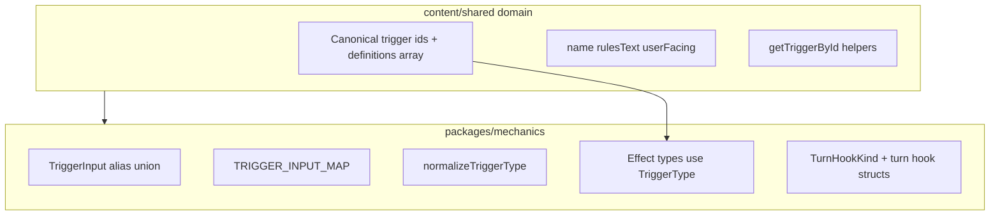

# Canonical trigger vocabulary — architecture and migration

## 1. Inventory (current state)

### Core definitions — [`packages/mechanics/src/triggers/trigger.types.ts`](packages/mechanics/src/triggers/trigger.types.ts)

- **`TriggerType`**: kebab-case union (`attack`, `weapon-hit`, `hit`, `damage-dealt`, `damage-taken`, `spell-cast`) plus **`TurnHookKind`** from [`turn-hooks.types.ts`](packages/mechanics/src/triggers/turn-hooks.types.ts) (`turn-start` | `turn-end`).
- **`TriggerInput`**: canonical ids plus legacy/alias forms (`on_*`, `snake_case` without `on_`).
- **`TRIGGER_INPUT_MAP`** + **`normalizeTriggerType()`**: maps any `TriggerInput` → `TriggerType`.

### Who imports what

| Consumer | Role |
|----------|------|
| [`packages/mechanics/src/effects/effects.types.ts`](packages/mechanics/src/effects/effects.types.ts) | `TriggeredEffect.trigger: TriggerType` |
| [`packages/mechanics/src/conditions/condition.types.ts`](packages/mechanics/src/conditions/condition.types.ts) | `EventCondition.event: TriggerType` |
| [`packages/mechanics/src/conditions/evaluation-context.types.ts`](packages/mechanics/src/conditions/evaluation-context.types.ts) | `EventSnapshot.type: TriggerType` |

### `normalizeTriggerType()` usage

- **Only** referenced from [`packages/mechanics/src/effects/timing.types.test.ts`](packages/mechanics/src/effects/timing.types.test.ts) (legacy/alias normalization tests).
- **No production call sites** in `packages/mechanics` outside tests (per full-repo grep). So normalization is **defensive / future ingestion**, not hot-path combat resolution today.

### `TurnHookKind` (separate file)

- [`packages/mechanics/src/triggers/turn-hooks.types.ts`](packages/mechanics/src/triggers/turn-hooks.types.ts): `TurnHookKind`, `TurnHookSelfTrigger`, `OffTurnTiming`.
- **Content** already imports **`TurnHookKind` only** (not full `TriggerType`) from mechanics:
  - [`src/features/content/monsters/domain/types/monster-traits.types.ts`](src/features/content/monsters/domain/types/monster-traits.types.ts)
  - [`src/features/content/monsters/domain/types/monster-legendary.types.ts`](src/features/content/monsters/domain/types/monster-legendary.types.ts)

### Parallel / overlapping vocab (do not conflate in v1)

- **Combat / marker / trait** strings such as `damage-taken-in-single-turn`, `turn-end`, `reduced-to-0-hp` appear in combat state and monster normalization — related *words* but **not** the same as `TriggerType` on `Effect` (see e.g. [`combatant.types.ts`](packages/mechanics/src/combat/state/types/combatant.types.ts), [`normalization.test.ts`](packages/mechanics/src/rulesets/system/normalization.test.ts)).
- **Environment** hooks use another shape (`start_of_turn` | `enter` | …) in [`environment.types.ts`](packages/mechanics/src/environment/environment.types.ts).
- **Spell casting time** `trigger` fields are **free prose**, not `TriggerType` ([`spell.types.ts`](src/features/content/spells/domain/types/spell.types.ts)).

### Precedent you already have (important)

[`packages/mechanics/src/conditions/effect-condition-definitions.ts`](packages/mechanics/src/conditions/effect-condition-definitions.ts) **re-exports** ids, types, and `getEffectConditionById` / rules text from [`effectConditions.vocab.ts`](src/features/content/shared/domain/vocab/effectConditions.vocab.ts). Mechanics adds only **extensions** (e.g. immunity-only ids). **This is the same layering you want for triggers.**

---

## 2. Layering (what belongs where)



| Layer | Responsibility |
|-------|----------------|
| **Canonical trigger ids** | Single string union used in authored `Effect` / `Condition` / `EventSnapshot` — should live in **shared** (like `EffectConditionId`). |
| **User-facing reference metadata** | `name`, `rulesText`, optional presentation fields — **shared vocab** (`triggers.vocab.ts`), same pattern as `effectConditions.vocab.ts`. |
| **Alias / normalization** | `TriggerInput`, map, `normalizeTriggerType` — **mechanics-only** (or `mechanics/triggers/trigger-input.ts`) so authoring vocab never embeds alias soup. |
| **Runtime semantics** | When hooks fire, how effects attach to combat — stays in **mechanics** (combat, markers, damage pipeline). **Not** the same file as PHB blurbs. |

---

## 3. Recommendation

### Preferred architecture

1. **Add** [`src/features/content/shared/domain/vocab/triggers.vocab.ts`](src/features/content/shared/domain/vocab/triggers.vocab.ts) with:
   - `TRIGGER_DEFINITIONS`: readonly array of `{ id, name, rulesText, ... }` for every **canonical** trigger id (the current `TriggerType` set, including `turn-start` / `turn-end` as first-class rows so the union is data-derived).
   - Derived **`TriggerId`** (or `TriggerCanonicalId`) = `typeof TRIGGER_DEFINITIONS[number]['id']`.
   - Helpers: `getTriggerById`, `getTriggerRulesText` (mirror `effectConditions.vocab.ts`).

2. **Export** from [`src/features/content/shared/domain/vocab/index.ts`](src/features/content/shared/domain/vocab/index.ts).

3. **Mechanics** [`trigger.types.ts`](packages/mechanics/src/triggers/trigger.types.ts):
   - **Import** `TriggerId` from shared and set **`export type TriggerType = TriggerId`** (or re-export), so **one** string union for effects.
   - **Do not** move `TriggerInput` / map / `normalizeTriggerType` into the vocab file — keep them in mechanics (optionally split to `trigger-input.ts` for clarity).

4. **Mechanics bridge** (optional but consistent with conditions): add `packages/mechanics/src/triggers/trigger-definitions.ts` that **re-exports** `TRIGGER_DEFINITIONS`, `getTriggerById`, etc., from shared — same role as [`effect-condition-definitions.ts`](packages/mechanics/src/conditions/effect-condition-definitions.ts) for mechanics consumers that prefer importing from `packages/mechanics`.

5. **`TurnHookKind`**: Prefer deriving from the shared id type, e.g. `type TurnHookKind = Extract<TriggerId, 'turn-start' | 'turn-end'>` in **one** place (shared or mechanics), so `turn-start` / `turn-end` are not **two** sources of truth. **Do not** fold `OffTurnTiming` / legendary timing into “trigger vocab” unless you explicitly widen the product definition — those are combat-structure concepts, not effect trigger ids.

### Field name: `rulesText` vs `description`

- Use **`rulesText`** to match [`effectConditions.vocab.ts`](src/features/content/shared/domain/vocab/effectConditions.vocab.ts) and PHB-style tooltips.

### Target shape (not premature)

```ts
export type TriggerDefinition = {
  id: TriggerId; // derived from TRIGGER_DEFINITIONS
  name: string;
  rulesText: string;
  userFacing?: boolean;
  // optional later: tone, defaultSection — only when UI needs it
};
```

A minimal first version is **not** premature; a large taxonomy (tone, sections, cross-links) **can** be premature until more UI surfaces consume it.

### Why not “just move” `trigger.types.ts` to shared as-is

- Mixing **`TriggerInput`** aliases into shared vocab **violates** your preference and blurs authoring vs ingestion.
- **Mechanics** already imports `@/features/content/...` in multiple places (e.g. spells, classes, effect conditions), so **mechanics importing shared trigger vocab** is consistent and **does not** force **content** to depend on mechanics for definitions.

### Elevation of ids: shared vs mechanics

- **Shared should own canonical ids** (as data + derived types). **Mechanics should import and alias** (`TriggerType`), not the reverse — matches **effect conditions** and satisfies “single source of truth” + “avoid content depending on mechanics” for **definitions**.

---

## 4. Migration plan (phased)

| Phase | Action | Risk |
|-------|--------|------|
| **0** | Document parallel vocabularies (combat markers, environment, spell prose) as **out of scope** for trigger ids until you unify deliberately. | Low |
| **1 (smallest safe)** | Add `triggers.vocab.ts` + barrel export; **no** mechanics changes yet — types can be manually aligned in a follow-up. | Lowest |
| **2** | Switch `TriggerType` in mechanics to **import** `TriggerId` from shared; keep `TriggerInput` + `normalizeTriggerType` in mechanics; run `tsc` / tests. | Low if union matches exactly |
| **3** | Optional: `mechanics/triggers/trigger-definitions.ts` re-export for ergonomics. | Low |
| **4** | Wire spell/item/feature UI to `getTriggerById` / `rulesText` where `Effect` exposes `trigger`. | Product-dependent |
| **5 (later)** | Consider **unifying** environment / combat strings **only** if you have a concrete mapping story; otherwise **worse** than two names for two domains. | Medium |

**Smallest safe first move:** Phase 1 only (add shared vocab + ids derived from definitions; no mechanics refactor).

---

## 5. Risks / tradeoffs

- **Circular dependencies**: Shared vocab must **not** import mechanics. Mechanics may import shared — **same as effect conditions**; safe if you keep aliases out of shared.
- **“Cleaner” single mega-union** for environment + combat + effect triggers: likely **worse** here — different lifecycles and authors; premature unification creates churn and bad coupling.
- **Over-modeling**: Adding tone/sections to every trigger before a second UI consumer duplicates the effect-condition evolution cost.
- **Duplication anxiety**: One **intentional** duplication remains acceptable: **alias normalization** in mechanics vs **canonical ids** in shared — different jobs.

### What not to change yet

- **`normalizeTriggerType`** production usage (there is none); leave as mechanics-only until ingestion needs it.
- **Combat/monster** trigger strings that are not `TriggerType` on `Effect`.
- **Spell `castingTime.trigger` prose** — not part of this trigger id model.

---

## Recommended next step

Add **[`src/features/content/shared/domain/vocab/triggers.vocab.ts`](src/features/content/shared/domain/vocab/triggers.vocab.ts)** with `TRIGGER_DEFINITIONS` covering the current `TriggerType` set (including turn-start/end), derived `TriggerId`, and `getTriggerById` / `getTriggerRulesText`; export from **[`vocab/index.ts`](src/features/content/shared/domain/vocab/index.ts)**. Then **Phase 2**: point [`packages/mechanics/src/triggers/trigger.types.ts`](packages/mechanics/src/triggers/trigger.types.ts) at `TriggerId` and keep `TriggerInput` + map + `normalizeTriggerType` in mechanics (same file or `trigger-input.ts`).

### Files to create / touch first (if proceeding)

1. **Create** [`src/features/content/shared/domain/vocab/triggers.vocab.ts`](src/features/content/shared/domain/vocab/triggers.vocab.ts)
2. **Modify** [`src/features/content/shared/domain/vocab/index.ts`](src/features/content/shared/domain/vocab/index.ts)
3. **Modify** [`packages/mechanics/src/triggers/trigger.types.ts`](packages/mechanics/src/triggers/trigger.types.ts) (after vocab is stable)
4. **Optional** **Create** [`packages/mechanics/src/triggers/trigger-definitions.ts`](packages/mechanics/src/triggers/trigger-definitions.ts) re-export bridge
5. **Modify** [`packages/mechanics/src/triggers/turn-hooks.types.ts`](packages/mechanics/src/triggers/turn-hooks.types.ts) only if you derive `TurnHookKind` from shared ids (small follow-up)
