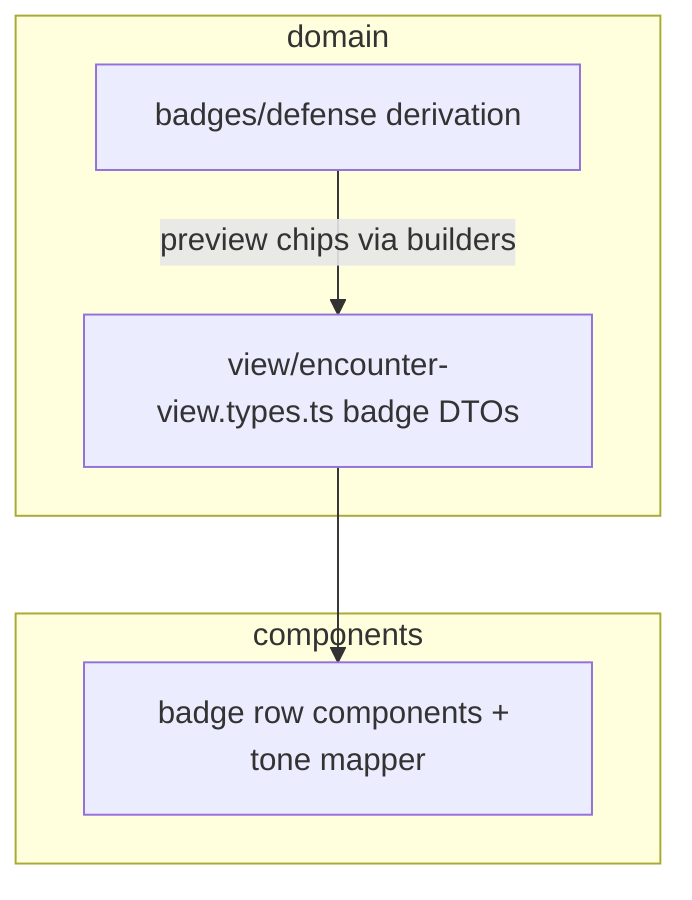

# Combatant badges: domain vs components

## What the file actually does today

`[combatant-badges.tsx](src/features/encounter/components/shared/combatant-badges.tsx)` combines:

- **Re-exports** of types that already live in the domain layer: `CombatantStatBadge`, `CombatantTrackedPartBadge`, `PreviewChip` / `PreviewTone` come from `[domain/view/encounter-view.types.ts](src/features/encounter/domain/view/encounter-view.types.ts)` (see lines 4–28 there).
- **UI-only pieces**: `BadgeWithOptionalTooltip`, three “row” components (`CombatantStatBadgeRow`, `CombatantTrackedPartBadgeRow`, `CombatantCoreBadgeRow`), `CombatantPreviewChipRow`.
- **One presentation helper**: `previewToneToAppBadgeTone` (maps `PreviewTone` to `AppBadgeTone`).

So the file feels “big” because it stacks several independent UI surfaces (stat row, tracked-parts row, combined core row, preview chips) in one module—not because domain logic is mixed in.

## Should helpers/types move to `src/features/encounter/domain/badges`?

**Types**

- **Do not duplicate** stat/chip view-model types under `domain/badges/` unless you are **moving** them out of `view/encounter-view.types.ts` with a single source of truth. Right now `[domain/badges/defense/](src/features/encounter/domain/badges/defense/)` is about **defense derivation** (resistances, immunities, tooltips), not generic “AC/HP chip” shapes.
- If badge-related **pure data shapes** proliferate (e.g. new badge families that are not preview-card props), a reasonable pattern is:
  - `**domain/view/badges.types.ts`** (or `**domain/badges/ui.types.ts`**) — only if you want to separate “badge DTOs” from the rest of `encounter-view.types.ts`, **or**
  - `**domain/badges/<family>/`** for each family that has real domain rules (parallel to defense).

**Helpers**

- `**previewToneToAppBadgeTone`** is **UI mapping** (domain tone → `AppBadge` tone). It does not belong next to defense math. Keep it next to components, or in a small `**components/.../badgeTone.ts`** (or under a future `badges/` folder) — not under `domain/badges` unless you rename “domain” to mean “all encounter presentation” (which would blur boundaries).

**Summary:** Use `**domain/` for types and pure functions** that define encounter/presentation contracts or rules. Use `**components/` (or a thin non-domain helper next to them)** for React and MUI-specific mapping.

## Should badges get their own `components/badges` directory?

**Yes, when growth justifies it** — but treat it as a **UI split**, not a second barrel.

Suggested shape (no secondary `index.ts` unless you choose to add one later):

- `components/badges/` (or `components/shared/badges/` if you want “shared” to remain the umbrella for cross-phase primitives)
  - `BadgeWithOptionalTooltip.tsx` (or keep as shared primitive if reused outside combatants)
  - `CombatantStatBadgeRow.tsx`
  - `CombatantTrackedPartBadgeRow.tsx`
  - `CombatantCoreBadgeRow.tsx`
  - `CombatantPreviewChipRow.tsx`
  - `previewToneToAppBadgeTone.ts` (or colocate with `CombatantPreviewChipRow`)

`[components/index.ts](src/features/encounter/components/index.ts)` would re-export from these paths so route code still does `from '../components'`.

## Mental model (two “badge” layers)

- **Defense badges** → effects/presentable pipeline and optional chip builders already in domain.
- **Generic stat/track/chip rows** → thin presentational components; types stay in **view** (or a dedicated view badge types file if `encounter-view.types.ts` gets unwieldy).

## Practical recommendation

1. **Short term:** Split `[combatant-badges.tsx](src/features/encounter/components/shared/combatant-badges.tsx)` into multiple files under `**components/badges/`** (or `shared/badges/`) when any single component needs tests or grows past ~80 lines.
2. **Types:** Keep canonical badge DTOs in `**domain/view/`** until `encounter-view.types.ts` is hard to navigate; then extract `**domain/view/badges.types.ts`** (re-export from `domain/index.ts` if needed) rather than stuffing unrelated types into `domain/badges/defense/`.
3. **Avoid** putting React components or `AppBadge` tone glue under `domain/badges`.

## Implemented: `AppTooltipWrap`

- Added `[src/ui/primitives/AppTooltipWrap.tsx](src/ui/primitives/AppTooltipWrap.tsx)`: generic optional-tooltip wrapper (default `placement="top"`), exported from `[src/ui/primitives/index.ts](src/ui/primitives/index.ts)`.
- Replaced `BadgeWithOptionalTooltip` in `[combatant-badges.tsx](src/features/encounter/components/shared/combatant-badges.tsx)` and `[CombatantActiveCard.tsx](src/features/encounter/components/shared/CombatantActiveCard.tsx)`.
- Removed `BadgeWithOptionalTooltip` from `[components/index.ts](src/features/encounter/components/index.ts)` barrel; consumers should import `AppTooltipWrap` from `@/ui/primitives`.

