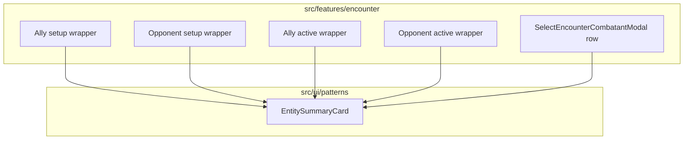

# Combatant summary cards refactor

## Are these cards overly abstracted?

**No — the current split is reasonable.** You have one presentational shell (`[CombatantPreviewCard.tsx](src/features/encounter/components/shared/CombatantPreviewCard.tsx)`) and four **data** wrappers that differ in meaningful ways:

- **Setup** cards load content, build `[CombatantInstance](src/features/mechanics/domain/encounter/state/types/combatant.types.ts)`, run effects (`onResolved`), and wire roster actions (remove / duplicate).
- **Active** lane cards consume an existing `CombatantInstance`, derive condition/defense chips, and handle turn/selection UI.

That is not “too many layers”; the real issue was **layout duplication** (title block + stat presentation) without a shared **visual** primitive — which this work fixes.

**Would only `OpponentCombatantPreviewCard` + `AllyCombatantPreviewCard` be enough?** Merging *all four* wrappers into *two* components usually means either **one file with two exports** (setup + active) — which is fine — or **one function with a huge discriminated union** — which tends to hurt maintainability. Recommended approach:

- Keep **four thin wrappers** (or **two files** exporting setup + active each) so async setup vs sync active stay isolated.
- Compose them from `**EntitySummaryCard`** (see §4) so “Preview” is not confused with `[CombatActionPreviewCard](src/features/encounter/components/shared/CombatActionPreviewCard.tsx)` / `[CombatTargetPreviewCard](src/features/encounter/components/shared/CombatTargetPreviewCard.tsx)`.

**Naming (encounter wrappers):** Optional follow-up: rename lane components to `AllyCombatantLaneCard` / `OpponentCombatantLaneCard` to avoid colliding with the large `[AllyCombatantActiveCard](src/features/encounter/components/active/AllyCombatantActiveCard.tsx)` / `[OpponentCombatantActiveCard](src/features/encounter/components/active/OpponentCombatantActiveCard.tsx)` — not required for the first pass.

---

## 1. `formatMonsterIdentityLine` (monsters `formatters/`)

- **Path:** `[src/features/content/monsters/formatters/formatMonsterIdentityLine.ts](src/features/content/monsters/formatters/formatMonsterIdentityLine.ts)`
- **Input:** `Monster` (`[monster.types.ts](src/features/content/monsters/domain/types/monster.types.ts)`).
- **Output:** Challenge rating, size, type, optional subtype in parentheses. Use **display labels** for `MonsterType` / `MonsterSizeCategory` via `[monster.vocab.ts](src/features/content/monsters/domain/vocab/monster.vocab.ts)` (ids → human-readable names). Render subtype when present.
- **Delimiter:** Use `**·`** (middle dot) between **major segments** of the identity line. (Note: `[formatCharacterClassLine](src/features/character/helpers/formatCharacterClassLine.ts)` joins **multiple classes** with `/`; that stays when the file moves; monster line uses `·` for its own segments.)
- **Replace** `[formatMonsterOptionSubtitle](src/features/encounter/helpers/encounter-helpers.ts)` usages (`[useEncounterOptions](src/features/encounter/hooks/useEncounterOptions.ts)`, `[OpponentCombatantSetupPreviewCard](src/features/encounter/components/setup/OpponentCombatantSetupPreviewCard.tsx)`) with `formatMonsterIdentityLine`, then remove the old function if unused.

---

## 2. Character `formatters/` and NPC class line

- **Create** `[src/features/character/formatters/](src/features/character/formatters/)` and **move** `[formatCharacterClassLine](src/features/character/helpers/formatCharacterClassLine.ts)` → `character/formatters/formatCharacterClassLine.ts`.
- **Update all imports** across the repo (prefer **direct imports** from `formatters/`; avoid long-term duplicate barrels in `helpers/`).
- **Remove** `[formatNpcOptionSubtitle](src/features/encounter/helpers/encounter-helpers.ts)`. Callers use **formatCharacterClassLine** after mapping NPC class data to `CharacterClassSummary[]`.
- **Optional thin wrapper** `[formatNpcClassLine](src/features/character/formatters/formatNpcClassLine.ts)`: map `[EncounterNpc](src/features/encounter/types.ts)` (or minimal shape) → `CharacterClassSummary[]` → `formatCharacterClassLine`.
- **Setup ally:** `[AllyCombatantSetupPreviewCard](src/features/encounter/components/setup/AllyCombatantSetupPreviewCard.tsx)` — `formatCharacterClassLine(character.classes)`; remove `[formatCharacterSubtitle](src/features/encounter/helpers/encounter-helpers.ts)` when obsolete.
- **Ally modal / options:** `[useEncounterOptions](src/features/encounter/hooks/useEncounterOptions.ts)` — map `EncounterAllyMember.classes` and `formatCharacterClassLine`.
- **NPC opponents:** `formatNpcClassLine` or map + `formatCharacterClassLine` everywhere `formatNpcOptionSubtitle` was used.

---

## 3. Fix ally modal data (currently drops subtitle context)

`[EncounterRuntimeContext](src/features/encounter/routes/EncounterRuntimeContext.tsx)` builds `allyModalOptions` as **only** `{ id, name }` from `allyOptions`, so `[SelectEncounterAllyModal](src/features/encounter/components/setup/SelectEncounterAllyModal.tsx)` cannot show classes. **Change** this to pass through full ally roster objects (or pass `allyOptions` from `[useEncounterOptions](src/features/encounter/hooks/useEncounterOptions.ts)` directly) so subtitles, avatars, and optional stats work.

---

## 4. `EntitySummaryCard` (`src/ui/patterns`)

**Chosen name:** `**EntitySummaryCard`** — neutral for users, locations, creatures, and future reuse.

**Regions:**

| Region     | Content                                                                                                                                                                       |
| ---------- | ----------------------------------------------------------------------------------------------------------------------------------------------------------------------------- |
| **Top**    | Avatar slot (ReactNode or render prop) + **title** + **subtitle** (`caption`, `text.secondary`). Optional “Current turn” or meta next to title where needed.                  |
| **Middle** | **Single inline stats line** (see below) — not a multi-column `[KeyValueSection](src/ui/patterns/content/KeyValueSection/KeyValueSection.tsx)` grid for this use case.        |
| **Bottom** | Optional **chips** row: `[CombatantPreviewChipRow](src/features/encounter/components/shared/combatant-badges.tsx)` for encounter conditions/defense when used from encounter. |

### Stats line format (explicit)

Render combat stats as **one continuous inline line** of `Label: value` pairs (typography `body2` / `caption`, muted labels or consistent emphasis), **not** stacked key-value grid cells. **Target example:**

`AC: 18   HP: 67/67   Init: +4   Move: 30 ft`

(Spacing: consistent gaps, e.g. `·` or em spacing between pairs — match design tokens.) Implement inside `**EntitySummaryCard`** (or a tiny `**InlineStatLine`** helper colocated with it) by **formatting from** the existing `PreviewStat[]` / `{ label, value, tooltip? }[]` so tooltips still work (wrap segments in `AppTooltipWrap` or `Tooltip` per pair if needed).

#### Why not `KeyValueSection` for this strip?

`[KeyValueSection](src/ui/patterns/content/KeyValueSection/KeyValueSection.tsx)` is built for **detail blocks** where each field gets its own **vertical** cell: subtitle-style **label on one line**, **value on the next**, optional helper text, optional **section title**, and a **responsive grid** (often two columns on `md+`) with relatively **large** gaps. That layout reads like a form or profile section — tall and scannable field-by-field.

The encounter summary strip needs the **opposite shape**: a **single horizontal run** of short pairs (`AC: 18 · HP: …`) that stays **one visual band** under the title, **minimal height**, and **does not** break each stat onto two lines unless the viewport forces wrap. Achieving that with `KeyValueSection` would mean overriding most of its structure (grid, per-item flex column, typography variants) until it is no longer really “KeyValueSection” — you inherit maintenance cost for a poor fit.

`**InlineStatLine` (or inline markup inside `EntitySummaryCard`)** is the right abstraction: a **flex row** (or inline flow) of `Label: value` segments with separators, tooltips on segments, and optional `flexWrap` for narrow widths — purpose-built for this **one-line stat sentence** pattern.

**Shell (encounter):** Preserve `[CombatantPreviewCardProps](src/features/encounter/domain/view/encounter-view.types.ts)` behaviors at the encounter wrapper: border for `isSelected` / `isCurrentTurn`, `isDefeated`, `onClick`, `secondaryActions`, `primaryAction`.

Export `**EntitySummaryCard`** from `[src/ui/patterns/index.ts](src/ui/patterns/index.ts)`.

### Avatar abstraction (feature layer over `AppAvatar`)

**Yes — add a thin feature layer** so `**AppAvatar`** stays generic (placeholder when no `src` — **no initials**), while **content types** pick **which** placeholder image to pass.

| Layer                                                                                                  | Responsibility                                                                                          |
| ------------------------------------------------------------------------------------------------------ | ------------------------------------------------------------------------------------------------------- |
| `**AppAvatar`**                                                                                        | Primitive: size, shape, `src`; when `src` absent, **generic placeholder image only** — **no initials**. |
| `**CharacterAvatar`** (`[CharacterAvatar.tsx](src/features/character/components/CharacterAvatar.tsx)`) | When `imageUrl` present, pass through; else **character** placeholder `src` — **no initials**.          |
| `**MonsterAvatar`**                                                                                    | Portrait when available; else **monster-specific** placeholder `src` — **no initials**.                 |

**Existing code:** `[MonsterAvatar](src/features/content/monsters/components/MonsterAvatar/MonsterAvatar.tsx)` already wraps `AppAvatar` the same way as `CharacterAvatar`. **Plan:** **extend that component** (and `CharacterAvatar`) with explicit **placeholder `src`** props or internal constants — **do not** introduce a second duplicate `MonsterAvatar` under a new path.

**Path note:** The repo uses `**src/features/content/monsters/`**, not `src/features/monster/`. **Prefer** keeping `MonsterAvatar` under `[content/monsters/components/MonsterAvatar/](src/features/content/monsters/components/MonsterAvatar/MonsterAvatar.tsx)`. If you later add a top-level `features/monster/` module, **re-export or move** the single implementation — avoid two `MonsterAvatar` definitions.

**Users / locations (future):** add `UserAvatar` / `LocationAvatar` (or pass `avatar={<AppAvatar … />}` into `EntitySummaryCard`) following the same pattern: **feature chooses fallback**, primitive renders.

### AppAvatar (primitive)

When `src` is missing: show **placeholder image** only (shared generic asset). **Do not** render initials. Feature avatars (`CharacterAvatar`, `MonsterAvatar`) pass a **non-empty** `src` (their type-specific placeholder) so the primitive stays dumb and consistent.

---

## 5. `SelectEncounterCombatantModal` rows

- Extend `[CombatantOption](src/features/encounter/components/setup/SelectEncounterCombatantModal.tsx)` with optional `imageUrl` / `avatarUrl` and optional `**stats`** (`PreviewStat[]`) when cheap.
- Render with `**EntitySummaryCard`**: **inline stats line** when stats exist; **no** chip/badge row in the modal.
- **Monsters:** subtitle via `**formatMonsterIdentityLine`** from full `Monster` in `monstersById` where possible.
- **Churn:** If stats are heavy for some option types, ship avatar + subtitle first; add stats where data is already available.

---

## 6. `CombatantPreviewCard` → compose `EntitySummaryCard` + subtitles

Refactor `[CombatantPreviewCard](src/features/encounter/components/shared/CombatantPreviewCard.tsx)` to compose `**EntitySummaryCard`**. **Subtitle rules:**

| `kind`      | Subtitle source                      |
| ----------- | ------------------------------------ |
| `monster`   | `formatMonsterIdentityLine(monster)` |
| `character` | `formatCharacterClassLine(classes)`  |

**Active wrappers:** `[OpponentCombatantActivePreviewCard](src/features/encounter/components/active/OpponentCombatantActivePreviewCard.tsx)` — `catalog.monstersById[combatant.source.sourceId]` when `source.kind === 'monster'`. `[AllyCombatantActivePreviewCard](src/features/encounter/components/active/AllyCombatantActivePreviewCard.tsx)` — `[useCharacter](src/features/character/hooks)` + `formatCharacterClassLine` (replace `subtitle: … 'NPC'`).

---

## 7. Cleanup

- Remove unused helpers: `[formatCharacterSubtitle](src/features/encounter/helpers/encounter-helpers.ts)`, `[formatMonsterOptionSubtitle](src/features/encounter/helpers/encounter-helpers.ts)`, `[formatAllyOptionSubtitle](src/features/encounter/helpers/encounter-helpers.ts)` once replaced.
- `[CombatantStatBadgeRow](src/features/encounter/components/shared/combatant-badges.tsx)`: remove if orphaned; grep first.
- Update `[src/features/encounter/components/index.ts](src/features/encounter/components/index.ts)` as needed.
- **Do not** remove `[CombatActionPreviewCard](src/features/encounter/components/shared/CombatActionPreviewCard.tsx)` / `[CombatTargetPreviewCard](src/features/encounter/components/shared/CombatTargetPreviewCard.tsx)`.

---

## Testing / QA

- Encounter setup roster, ally/opponent modals (search matches subtitle + inline stats), active lane (avatars + type-specific placeholders, subtitles).
- `useCharacter` in lane cards: React Query/cache behavior.
- `AppAvatar` and `CharacterAvatar` / `MonsterAvatar` with and without `src`.

---

## Follow-up: `isCurrentTurn` vs `isActive` on `EntitySummaryCard`

**Recommendation:** Prefer **not** renaming to plain `isActive` on a generic card.

- In UI copy, **“active”** often collides with **selected**, **focused**, **pressed**, or MUI’s `active` state — easy to confuse with `isSelected` on combatant rows.
- `**isCurrentTurn`** is explicit for encounter/tactical use. For a **generic** `EntitySummaryCard`, better options are:
  - Keep `**isCurrentTurn`** only in encounter wrappers and pass a `**statusSlot` / `endAdornment` / `badge`** ReactNode from the parent, **or**
  - Use a neutral name like `**showEmphasisBadge`**, `**leadingStatus`**, or `**highlight: 'none' | 'turn'**` if you want one boolean without combat-specific vocabulary.

If you rename to `isActive`, document that it means **turn highlight**, not selection.

---

## Follow-up: Race + class subtitle consistency (ally)

**Current behavior:**

- **Ally picker options** (`[useEncounterOptions](src/features/encounter/hooks/useEncounterOptions.ts)` `formatAllyOptionSubtitle`): `race · class line · owner`.
- **Setup preview card** (`[AllyCombatantSetupPreviewCard](src/features/encounter/components/setup/AllyCombatantSetupPreviewCard.tsx)`): **class line only** — race and owner are omitted (inconsistent with modal).
- **Active preview card** (`[AllyCombatantActivePreviewCard](src/features/encounter/components/active/AllyCombatantActivePreviewCard.tsx)`): **class line only** when `useCharacter` resolves — race omitted.

**Do you need race on the combatant model?**

- **Usually no.** `CharacterDetailDto` already includes `race`; `[useCharacter](src/features/character/hooks/useCharacter.ts)` in the active lane can build the same subtitle string as setup/options: e.g. `[character.race?.name, formatCharacterClassLine(character.classes)].filter(Boolean).join(' · ')` (and optionally append `ownerName` if you ever show it in-lane).
- **Add to `CombatantInstance` / `CombatantSourceRef` only if** you need the subtitle **without** loading the character (offline, perf, or pure engine-only views). In that case a small optional snapshot like `source.displaySubtitle?: string` or `source.raceName?: string` set in `[buildCharacterCombatantInstance](src/features/encounter/helpers/combatant-builders.ts)` avoids duplicating race rules in the UI.

**Implementation note:** Extract one helper (e.g. `formatCharacterSubtitleLine(character)` in `character/formatters`) that encodes **race · class line** (and optional owner) so setup, active, and modals stay aligned.