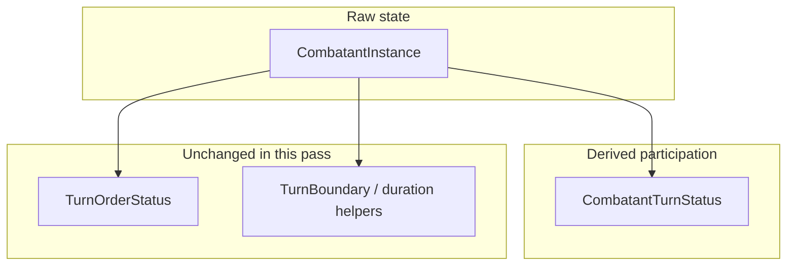

# CombatantTurnStatus derived participation layer

## Context (current codebase)

- `**CombatantInstance**` (`[combatant.types.ts](src/features/mechanics/domain/encounter/state/types/combatant.types.ts)`): raw HP, `diedAtRound`, `conditions`, `states`, etc.
- **Defeat vs death** (`[combatant-participation.ts](src/features/mechanics/domain/encounter/state/combatant-participation.ts)`): `isDefeatedCombatant` = HP ≤ 0; `isDeadCombatant` = `diedAtRound != null` — **preserve these exactly**.
- **Cannot-act semantics** already exist as **condition consequences** (`[condition-definitions.ts](src/features/mechanics/domain/encounter/state/condition-rules/condition-definitions.ts)` + `[condition-consequence-helpers.ts](src/features/mechanics/domain/encounter/state/condition-rules/condition-consequence-helpers.ts)`); `[condition-queries.ts](src/features/mechanics/domain/encounter/state/condition-rules/condition-queries.ts)` exposes `canTakeActions` / `canTakeReactions` (marker `label` must match `CONDITION_RULES` keys — e.g. `incapacitated`, `stunned`).
- **Banished** is modeled as a **state** marker with `label === 'banished'` (see `[action-targeting.ts](src/features/mechanics/domain/encounter/resolution/action/action-targeting.ts)` lines 143–145, 205).
- **Off-grid**: no marker in repo today; reserve a single internal predicate (e.g. `states.some(s => s.label === 'off-grid')`) defaulting to **false** until content adds it — keeps `getCombatantTurnStatus(c: CombatantInstance)` honest and instance-only.
- **Alive initiative eligibility** matches `isActiveCombatant` (HP > 0) — see `[runtime.ts](src/features/mechanics/domain/encounter/state/runtime.ts)` `buildAliveInitiativeParticipants`.

## Architecture (layers)

- `**CombatantTurnStatus**`: answers presence / capability / auto-skip — **not** “when does this expire?”
- `**TurnOrderStatus`**: initiative row presentation only — **no changes** to the union or modal logic in this pass.
- **Timing**: **do not** modify `[format-turn-duration.ts](src/features/encounter/helpers/format-turn-duration.ts)`, `[timing.types.ts](src/features/mechanics/domain/effects/timing.types.ts)`, etc.

## 1. Add the `CombatantTurnStatus` type

**Where:** `[combatant.types.ts](src/features/mechanics/domain/encounter/state/types/combatant.types.ts)` (near `CombatantInstance` / doc comments), with a short JSDoc: derived-only, not persisted.

**Shape:** Use your suggested fields; minor trims are fine if redundant in v1:

| Field                    | First-pass rule (instance-only)                                                                                                                                                                                                                  |
| ------------------------ | ------------------------------------------------------------------------------------------------------------------------------------------------------------------------------------------------------------------------------------------------ |
| `isDefeated`             | `isDefeatedCombatant(c)`                                                                                                                                                                                                                         |
| `isDead`                 | `isDeadCombatant(c)`                                                                                                                                                                                                                             |
| `hasBattlefieldPresence` | `false` if banished or off-grid marker; else `true` if alive **or** still represented on field (e.g. `hasRemainsOnGrid(c)` **or** `canTargetAsDeadCreature(c)` for edge/synthetic 0 HP) — aligns “body still matters” without needing placements |
| `occupiesGrid`           | For v1: same as `hasBattlefieldPresence` **or** slightly stricter if you want to exclude “dust” later; start aligned with presence to avoid inventing placement data                                                                             |
| `canBeTargetedOnGrid`    | `false` if banished; if defeated, `canTargetAsDeadCreature(c)`; if active, `true` (fine-grained hostile/willing rules stay in targeting APIs)                                                                                                    |
| `canTakeActions`         | `isActiveCombatant(c) && canTakeActions(c)` from condition-queries                                                                                                                                                                               |
| `canTakeBonusActions`    | Match engine: same gate as actions in `[shared.ts](src/features/mechanics/domain/encounter/state/shared.ts)` `createCombatantTurnResources` — **v1: same as `canTakeActions`**                                                                   |
| `canTakeReactions`       | `isActiveCombatant(c) && canTakeReactions(c)`                                                                                                                                                                                                    |
| `canMove`                | `isActiveCombatant(c) && !getSpeedConsequences(c).speedBecomesZero`                                                                                                                                                                              |
| `shouldAutoSkipTurn`     | `true` if defeated, banished, off-grid, or conditions disallow actions (`!canTakeActions` from condition-queries while active — defeated already skips via first branch)                                                                         |
| `skipReason`             | Optional; **precedence** when multiple apply (document in JSDoc): e.g. `defeated` **>** `banished` / `off-grid` **>** `cannot-act`                                                                                                               |
| `remainsInInitiative`    | **v1:** `isActiveCombatant(c)` — matches `buildAliveInitiativeParticipants`; banished/off-grid with HP > 0 stay `true`; defeated drop out                                                                                                        |

## 2. Evolve `[combatant-participation.ts](src/features/mechanics/domain/encounter/state/combatant-participation.ts)`

- Keep existing exports and file header narrative; add a subsection documenting `**CombatantTurnStatus`** as the derived “effective participation” view.
- **Import** from `./condition-rules` (use **import aliases** to avoid clashing with new public names), e.g. `canTakeActions as conditionsAllowActions`, `canTakeReactions as conditionsAllowReactions`, `getSpeedConsequences`.
- **Small private helpers** (single place for marker checks):
  - `combatantHasStateLabel(c, 'banished' | 'off-grid')` using `combatant.states`.
- **Public API** (as requested):
  - `isDefeatedCombatant` / `isDeadCombatant` — unchanged bodies.
  - `hasBattlefieldPresence(c)`
  - `canCombatantTakeActions(c)` — composes HP + conditions.
  - `canCombatantTakeReactions(c)`
  - `shouldAutoSkipCombatantTurn(c)` — thin wrapper over same rules as `getCombatantTurnStatus` or shared internal `computeSkip`.
  - `getCombatantTurnStatus(c)` — builds the full object from the helpers above.

**Avoid duplicating** condition-consequence logic: delegate to `condition-queries` for action/reaction/movement flags.

## 3. Re-exports

Update `[state/index.ts](src/features/mechanics/domain/encounter/state/index.ts)`: export `CombatantTurnStatus` (from types barrel already via `export * from './types'` if the type lives under `types/`), and export the new functions from `combatant-participation`.

## 4. Tests

Extend `[combatant-participation.test.ts](src/features/mechanics/domain/encounter/state/combatant-participation.test.ts)` (or add `combatant-turn-status.test.ts` if you prefer separation — **one file is enough** for this pass):

- **Defeated**: HP ≤ 0 → `isDefeated`, `shouldAutoSkipTurn`, `skipReason === 'defeated'`, `remainsInInitiative === false`.
- **Cannot-act**: living + `conditions` with `label: 'incapacitated'` (minimal `RuntimeMarker`) → `canCombatantTakeActions` false, `shouldAutoSkipTurn` true, `skipReason === 'cannot-act'`.
- **Banished**: `states: [{ id: 'x', label: 'banished' }]` (minimal marker) → `hasBattlefieldPresence` false, `skipReason === 'banished'`, `remainsInInitiative` true if HP > 0.
- **Off-grid**: optional test with `label: 'off-grid'` once predicate exists; otherwise skip or mark as future-facing.

Preserve existing tests for death / dead-creature / remains.

## 5. Out of scope (explicit)

- No changes to `[TurnOrderStatus](src/features/encounter/domain/view/encounter-view.types.ts)` or initiative modals.
- No persistence / mutations.
- No refactor of `[action-targeting.ts](src/features/mechanics/domain/encounter/resolution/action/action-targeting.ts)` to call `getCombatantTurnStatus` **required** for acceptance — optional follow-up if you want a single source for banished checks later.
- Splitting `combatant-turn-status.types.ts` only if `combatant-participation.ts` becomes unwieldy after implementation.

## Acceptance checklist

- `CombatantTurnStatus` exists, documented as derived-only.
- Not stored on `CombatantInstance`.
- `combatant-participation.ts` is the mechanics-level home for participation derivation; condition-rules stays the source for PHB-style consequence flags.
- Layers remain separate: `TurnOrderStatus` untouched; timing helpers untouched.
- First-pass rules wired for defeated, dead, cannot-act (via conditions), banished, placeholder off-grid.

