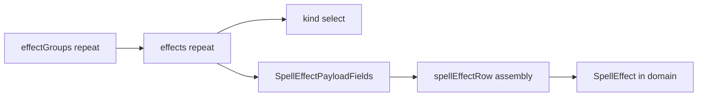

# Conditional effect-kind fields — implementation-ready Phase 1

## 1. Refined scope

**In scope**

- Preserve architecture: nested repeatables `effectGroups[]` → `effects[]`; each effect row has `kind` plus **flat-ish draft** payload fields stored under the same row path in RHF (e.g. `effectGroups.0.effects.0.*`).
- Add **`SpellEffectPayloadFields({ namePrefix })`** that reads **`${namePrefix}.kind`** via `useWatch` and conditionally renders payload controls. **Do not** implement generic shared-form `visibleWhen` path prefix rewriting in this pass; defer unless the same need appears in multiple features.
- **First wave**: structured UI + spell-local mapping → mechanics-aligned `SpellEffect` for **five** kinds only (see matrix).
- **Stub bucket**: limited placeholder UI + no commitment to full mechanics mapping (see matrix).
- **Picker**: **spell-form-local allowlist** — does **not** mirror all `authorable: true` rows in [`effectKinds.vocab.ts`](src/features/content/shared/domain/vocab/effectKinds.vocab.ts).
- **Out of scope**: recursive nested `Effect[]` authoring (`onFail`/`onSuccess`/`ongoingEffects`), **`spawn`** as a supported or pickable kind, shared cross-feature “mega” effect assembler, monster form integration (component may be reused later).

**Central registry unchanged in meaning**

- [`EFFECT_KIND_DEFINITIONS`](src/features/content/shared/domain/vocab/effectKinds.vocab.ts) / `authorable` stays the long-term global vocabulary. Phase 1 **narrows the spell form only** via a dedicated allowlist (see §3).

---

## 2. Supported / stubbed / hidden kind matrix (Phase 1)

### Fully supported (structured UI + mapping this pass)

| Kind | Draft fields (see §4) | Mechanics target |
|------|------------------------|------------------|
| **note** | `noteText`, optional `noteCategory` | `NoteEffect`: `text`, `category?` |
| **damage** | `damageValue` (dice/flat string), optional `damageType` | `DamageEffect`: `damage`, `damageType?` (defer `levelScaling` / `instances` unless trivial) |
| **condition** | `conditionId` | `ConditionEffect`: `conditionId` (defer `repeatSave` / escape for later pass) |
| **move** | `moveDistance`, `moveForced` (boolean) | `MoveEffect`: `distance`, `forced` (defer other movement flags) |
| **resource** | `resourceId`, `resourceMax`, `resourceRecharge` | `ResourceEffect`: `resource.id`, `max`, `recharge` (defer `dice` / `ScalingRule` complexity initially) |

### Stubbed / advanced placeholder (may appear in picker; not fully modeled)

| Kind | UI behavior |
|------|-------------|
| **grant** | Short notice: “Advanced — full grant authoring not in this pass” + optional read-only or disabled state; **no** requirement to emit valid `GrantEffect` from form in Phase 1 unless trivial stub is useful. |
| **immunity** | Same pattern: notice + defer full `scope` / `spellIds` / `duration` UI. |
| **save** | Notice referencing deferred nested branches; **no** nested `Effect[]` editor. |
| **check** | Same. |
| **state** | Same (defer `ongoingEffects`, `repeatSave`). |

Prefer **inline notice** + **no JSON textarea** unless a stub path is truly needed for persistence experiments; default is **safest minimal** (no orphan JSON).

### Hidden from picker in Phase 1 (spell form only)

| Kind | Rationale |
|------|-----------|
| **spawn** | Conjuration/catalog/caster-options complexity; user-requested hide for this pass. **Do not** show in spell effect-kind select even though `spawn` may remain `authorable: true` in the central registry for other surfaces later. |

**Registry split note:** No change required to `authorable` flags in `effectKinds.vocab.ts` for `spawn`. Spell form uses **`getSpellEffectKindPhase1Options()`** (or constant **`SPELL_EFFECT_PHASE1_KIND_IDS`**) that **excludes** `spawn` and optionally **includes only** the union of fully supported + stubbed kinds you want visible (recommended: all ten non-spawn authorable kinds that Phase 1 surfaces: five supported + five stubbed = **10** picker entries; or narrower if product wants fewer stub rows — default **ten**).

---

## 3. Picker strategy

- **Not** “all `authorable: true` from registry.”
- **Spell-form-local allowlist** (e.g. `src/features/content/spells/domain/forms/options/spellEffectKinds.phase1.ts` or beside registry):

  - Export `SPELL_EFFECT_PHASE1_KIND_IDS`: readonly tuple or array of **`EffectKind`** literals for Phase 1.
  - Export `getSpellEffectKindPhase1SelectOptions(): { value: string; label: string }[]` built by **filtering** [`EFFECT_KIND_DEFINITIONS`](src/features/content/shared/domain/vocab/effectKinds.vocab.ts) by id ∈ allowlist (labels/descriptions stay centralized), **excluding** `spawn`.
  - Replace [`getAuthorableEffectKindSelectOptions()`](src/features/content/shared/domain/vocab/effectKinds.vocab.ts) usage in [`buildSpellEffectGroupsFormNode`](src/features/content/spells/domain/forms/registry/spellForm.registry.ts) with this spell-scoped helper.

This keeps global registry metadata intact while making spell UI intentionally narrow.

---

## 4. Form-row draft shape (`SpellEffectFormRow`)

**Direction:** one TypeScript type for a single nested `effects[]` row, with **common** `kind` plus **union of optional draft keys** (all optional except `kind` for typing ergonomics). Stored under RHF as a single object per row (flat keys avoid deep `damage.x` until needed).

**Recommended fields (grounded in current patterns)**

- **All rows:** `kind: SpellEffectPhase1Kind` (narrow union of allowlist ids, or `EffectKind` intersected with allowlist).

- **note:** `noteText: string`; `noteCategory?: string` (optional; wire to `EffectNoteCategory` only if a small const list exists in mechanics/app — otherwise omit in Phase 1).

- **damage:** `damageValue: string` (maps to `DamageEffect.damage` as `DiceOrFlat` string/number parse); `damageType?: string` (must match mechanics `DamageType` / enum used in data).

- **condition:** `conditionId: string` (use **`EffectConditionId`** from [`effectConditions.vocab.ts`](src/features/content/shared/domain/vocab/effectConditions.vocab.ts) for typing).

- **move:** `moveDistance?: string | number`; `moveForced?: boolean`.

- **resource:** `resourceId: string`; `resourceMax: string | number`; `resourceRecharge: 'short-rest' | 'long-rest' | 'none'`.

**Update**

- [`spellForm.types.ts`](src/features/content/spells/domain/forms/types/spellForm.types.ts): replace narrow `effects: { kind: AuthorableEffectKind | '' }[]` with `SpellEffectFormRow[]` (or equivalent) so payload keys exist on the form type.
- [`buildDefaultRowFromLayout`](src/ui/patterns/form/RepeatableGroupField.tsx) / spell `defaultItem` for nested `effects` row: defaults for new keys (`''`, `false`, first option where appropriate).

---

## 5. Dedicated payload component (explicit path)

**Chosen approach:** `SpellEffectPayloadFields({ namePrefix: string })` where **`namePrefix` ==** `effectGroups[i].effects[j]` (no trailing `.kind`).

- Use **`useFormContext` + `useWatch({ name: \`${namePrefix}.kind\` })`** (or watch whole row) and **`Controller` / MUI fields** with names like **`${namePrefix}.damageValue`**.
- **Do not** rely on registry `visibleWhen` for per-row branching (static path problem in nested repeats).
- **Defer** generic [`RepeatableGroupField`](src/ui/patterns/form/RepeatableGroupField.tsx) / `FieldSpec` enhancement for prefixed `visibleWhen` **until** multiple features need it.

**Wiring options (pick one during implementation; plan favors minimal surface area)**

1. **New `FormLayoutNode` variant** `type: 'custom'` with `render: (ctx) => ReactNode` — heavier change to shared forms.
2. **Spell-only route:** Custom wrapper component used only in spell edit/create that renders `RepeatableGroupField` children for `effects` manually **or** inserts `SpellEffectPayloadFields` **below** the `kind` select rendered via a thin portal/layout in spell route — **or**
3. **Embed payload fields inside an extended child list**: register `kind` via existing registry and add a **second** custom slot beside repeats — simplest may be **single custom component** that wraps “row header + kind select + SpellEffectPayloadFields” for the effect row.

Phase 1 implementation should choose the **smallest** change that mounts `SpellEffectPayloadFields` once per effect row without breaking [`buildFormLayout`](src/features/content/shared/forms/registry/buildFormLayout.ts).

---

## 6. Phase 1 file-level plan

| Area | Files / actions |
|------|------------------|
| Allowlist + options | New: e.g. [`spellForm.options.ts`](src/features/content/spells/domain/forms/options/spellForm.options.ts) or `spellEffectKinds.phase1.ts` — `SPELL_EFFECT_PHASE1_KIND_IDS`, `getSpellEffectKindPhase1SelectOptions()`. |
| Registry | [`spellForm.registry.ts`](src/features/content/spells/domain/forms/registry/spellForm.registry.ts) — `kind` select uses Phase 1 options; may need second “slot” or custom node for payload (see §5). |
| Types | [`spellForm.types.ts`](src/features/content/spells/domain/forms/types/spellForm.types.ts) — `SpellEffectFormRow`, update `SpellEffectGroupFormRow`. |
| UI | New: `src/features/content/spells/domain/forms/components/SpellEffectPayloadFields.tsx` — switch by `kind`. |
| Defaults | [`RepeatableGroupField.tsx`](src/ui/patterns/form/RepeatableGroupField.tsx) and/or spell registry `defaultItem` for effects row — include new draft keys. |
| Mapping | New: e.g. `src/features/content/spells/domain/forms/assembly/spellEffectRow.assembly.ts` — `formRowToSpellEffect(row: SpellEffectFormRow): SpellEffect \| undefined` with per-kind branches; called from existing effectGroups → domain path (extend [`spellPayload.assembly`](src/features/content/spells/domain/forms/assembly/spellPayload.assembly.ts) or mapper). |
| Shared vocab | See §7 — only new files strictly needed. |

---

## 7. Shared vocabulary / helpers — required now vs later

**Required now (minimal)**

- **Condition IDs:** reuse [`EFFECT_CONDITION_DEFINITIONS`](src/features/content/shared/domain/vocab/effectConditions.vocab.ts) / `EFFECT_CONDITION_IDS` for select options (value = `id`, label = `name`).
- **Damage type:** add **only if** no suitable app-layer list exists — e.g. small [`damageTypes.vocab.ts`](src/features/content/shared/domain/vocab/damageTypes.vocab.ts) or import re-export from mechanics `DamageType` union with a const options array. **Scope:** values needed for dropdown, not full damage rules.
- **Resource recharge:** small const **`RESOURCE_RECHARGE_OPTIONS`**: `'short-rest' \| 'long-rest' \| 'none'` with labels (matches [`ResourceEffect`](packages/mechanics/src/effects/effects.types.ts)).

**Later (do not block Phase 1)**

- Ability/skill lists for save/check (when those kinds graduate from stub).
- Spawn/monster catalog wiring.
- `EffectDuration` editor reuse for immunity/state.
- Broad [`effectKinds.vocab.ts`](src/features/content/shared/domain/vocab/effectKinds.vocab.ts) extensions (`fieldGroup` metadata, etc.).

---

## 8. Mapping plan (spell-local)

- **Location:** spell feature only — e.g. `spellEffectRow.assembly.ts` + call site in effect group → `SpellInput['effectGroups'][n].effects` assembly (same layer as [`spellPayload.assembly.ts`](src/features/content/spells/domain/forms/assembly/spellPayload.assembly.ts)).
- **Supported kinds:** for each of note/damage/condition/move/resource, map draft row → **narrow** `Extract<Effect, { kind: K }>` (or `as SpellEffect` at boundary with comment).
- **Stubbed kinds:** either **omit** from output array, **skip** row with warning, or emit **no** row — product decision; plan recommends **skip or empty** stub rows in output until mapper is implemented (configurable).
- **Hidden** `spawn:** not selectable → no mapper branch in Phase 1.

---

## 9. Testing plan (Phase 1)

| Test | Purpose |
|------|---------|
| **Mapping unit tests** (5) | One each: note, damage, condition, move, resource — draft row → expected `SpellEffect` minimal shape. |
| **SpellEffectPayloadFields** | Renders correct inputs when `kind` is set (React Testing Library: set `kind` → assert presence of expected labels/fields). |
| **Nested repeat integration** | One test: form values with one effect group and one effect row → assembled `effectGroups` / or `toSpellInput` fragment contains expected effect payload (no recursive trees). |
| **Explicitly not in scope** | Nested `Effect[]` authoring tests; spawn; full grant/immunity/save/check/state mappers. |

---

## 10. Deferred items

- Recursive **nested `Effect[]`** (save/check/state branches).
- **Generic `visibleWhen` prefix rewriting** for arbitrary nested repeatables.
- **Spawn** in picker and mapper.
- Full **stubbed** kinds upgraded from placeholder to structured UI.
- Monster/action **reuse** of `SpellEffectPayloadFields` (optional export path only).

---

## 11. Recommended next step (after Phase 1 ships)

- Promote **save** or **check** to “supported” with **flat** fields only (DC + ability) and **single optional JSON blob** for branches *or* keep stub until a dedicated nested-effect sub-editor exists.
- Centralize **phase allowlists** per surface (spell vs monster) if multiple pickers diverge.

---

## Architecture preservation (summary diagram)

