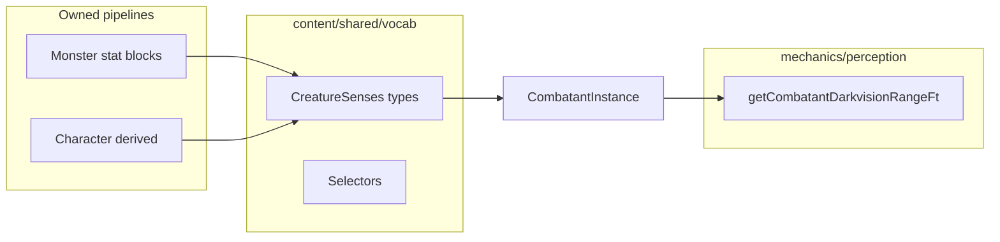

# Phase 1: Shared creature senses + race darkvision + combatant wiring

## Context from codebase

- **Monster senses today:** [`monster-senses.types.ts`](src/features/content/monsters/domain/types/monster-senses.types.ts), display via [`monsterSensesDisplay.ts`](src/features/content/monsters/domain/details/display/monsterSensesDisplay.ts), combatants via [`maxDarkvisionRangeFtFromMonsterSenses`](src/features/encounter/helpers/combatants/combatant-builders.ts) + optional `senses` snapshot on [`CombatantInstance`](packages/mechanics/src/combat/state/types/combatant.types.ts) (`CombatantSensesSnapshot`).
- **Perception engine:** [`getCombatantDarkvisionRangeFt`](packages/mechanics/src/perception/perception.capabilities.ts) reads `combatant.senses?.special` (max numeric `darkvision` range) with fallback to `stats.skillRuntime.darkvisionRangeFt`.
- **Character derived layer:** Proficiencies-only today—[`characterDerived.types.ts`](src/features/character/domain/derived/characterDerived.types.ts), [`buildCharacterDerivedContext.ts`](src/features/character/domain/derived/buildCharacterDerivedContext.ts). Docs: [`character-query-layer.md`](docs/reference/character-query-layer.md).
- **Race model:** [`RaceFields`](src/features/content/races/domain/types/race.types.ts) is minimal (id, name, description, imageKey, …). System list: [`packages/mechanics/src/rulesets/system/races.ts`](packages/mechanics/src/rulesets/system/races.ts). Campaign catalog exposes **`racesById`** ([`buildCatalog.ts`](packages/mechanics/src/rulesets/campaign/buildCatalog.ts)).
- **Your decision:** Rename **`halfOrc` → `orc`** (display as Orc); no backward compatibility for old race ids—call out that persisted characters with `halfOrc` would need a separate migration if any exist.



---

## 1. Shared vocab (`src/features/content/shared/domain/vocab/`)

Add:

| File | Purpose |
|------|---------|
| [`creatureSenses.types.ts`](src/features/content/shared/domain/vocab/creatureSenses.types.ts) | `CreatureSenseType`, `CreatureSenseSource`, `CreatureSense`, `CreatureSenses` ( **`special: CreatureSense[]` required** — use `[]` when none). |
| [`creatureSenses.selectors.ts`](src/features/content/shared/domain/vocab/creatureSenses.selectors.ts) | Pure helpers: `getCreatureSenseRange`, `hasCreatureSense`, `getDarkvisionRange`, plus **`normalizeCreatureSenses`** / **`mergeOrNormalizeSenses`** if needed: treat missing/undefined `special` as `[]`; when multiple entries share a type, **max numeric `range`**; if any entry has **no `range`**, do **not** invent unlimited range (leave max undefined for that branch; document behavior in tests). |
| Display helper (same folder or `.vocab.ts` sibling) | `getCreatureSenseTypeDisplayName(id: string): string \| undefined` — mirror the pattern in [`effectConditions.vocab.ts`](src/features/content/shared/domain/vocab/effectConditions.vocab.ts) (validate against a readonly id union / set, lookup display name). |
| [`index.ts`](src/features/content/shared/domain/vocab/index.ts) | Re-export new modules. |

Tests: [`__tests__/creatureSenses.selectors.test.ts`](src/features/content/shared/domain/vocab/__tests__/creatureSenses.selectors.test.ts) covering darkvision max range, multiple entries, missing sense, truesight, and display-name helper.

---

## 2. Monster senses → shared types

- Update [`monster-senses.types.ts`](src/features/content/monsters/domain/types/monster-senses.types.ts) to **`export type MonsterSense = CreatureSense`** and **`export type MonsterSenses = CreatureSenses`** (re-export from vocab), **or** delete duplicate types and update imports to vocab directly—prefer minimal churn: alias + re-export from monster `index` for external callers.
- **Normalization:** Add a small **`normalizeMonsterSensesToCreature`** (or use shared `normalizeCreatureSenses`) wherever authored data may still omit `special` or use `special?:` — map **`undefined` → `[]`** so `CreatureSenses.special` is always an array at boundaries (display, combatant builder).
- Refactor [`monsterSensesDisplay.ts`](src/features/content/monsters/domain/details/display/monsterSensesDisplay.ts) and [`combatant-builders.ts`](src/features/encounter/helpers/combatants/combatant-builders.ts) to use shared **`getDarkvisionRange`** / selectors instead of ad-hoc loops.
- Update [`CombatantSensesSnapshot`](packages/mechanics/src/combat/state/types/combatant.types.ts) to **`CreatureSenses`** (import from vocab via `@/features/content/...` — mechanics package already resolves `src` per [`packages/mechanics/tsconfig.json`](packages/mechanics/tsconfig.json)). Tighten loose `type: string` to the shared union.

---

## 3. Race data: structured grants + `halfOrc` → `orc`

- Extend [`RaceFields`](src/features/content/races/domain/types/race.types.ts) with an optional **`grants`** object so sense grants live under a stable namespace and other grant kinds can be added later without reshaping the race root:

```ts
grants?: {
  senses?: readonly CreatureSense[]
}
```

- **Authoring shape (system catalog and any campaign race overrides):** each race entry uses **`grants.senses`** as an array of **`CreatureSense`** rows, traceable as race-sourced, e.g.:

```ts
grants: {
  senses: [{ type: 'darkvision', range: 60, source: { kind: 'race', id: 'elf' } }],
}
```

- **`toSystemRace`** may assert or normalize that each entry’s **`source`** matches the parent race **`id`** (and **`kind: 'race'`**) so callers do not drift; alternatively author fully as above and **`toSystemRace`** only passes through—pick one approach and keep **`packages/mechanics/src/rulesets/system/races.ts`** consistent. Avoid prose parsing.
- In [`packages/mechanics/src/rulesets/system/races.ts`](packages/mechanics/src/rulesets/system/races.ts):
  - Replace **`halfOrc`** with **`orc`** (name **Orc**, keep existing `imageKey` path unless you rename assets in the same change).
  - Add **`grants.senses`** (darkvision only in Phase 1) per your table:

| Race id | Darkvision (ft) |
|---------|-----------------|
| `elf` | 60 |
| `dwarf` | 120 |
| `dragonborn` | 60 |
| `gnome` | 60 |
| `orc` | 120 |
| `tiefling` | 60 |

- **Report (for your final summary):** single source file **`packages/mechanics/src/rulesets/system/races.ts`** + type extension in **`race.types.ts`**; rationale: system catalog is the factory default merged into **`catalog.racesById`**, so derived + combatant paths stay catalog-aware without hardcoding race ids in builders.

---

## 4. Character-derived senses

- Extend [`CharacterDerivedContext`](src/features/character/domain/derived/characterDerived.types.ts) with **`senses: CreatureSenses`** (default `{ special: [] }`).
- Add helper module e.g. [`src/features/character/domain/derived/grants/raceSenseGrants.ts`](src/features/character/domain/derived/grants/raceSenseGrants.ts):
  - **`resolveRaceRecord(character.raceId | character.race, catalogs.racesById, rulesetId)`** pattern: prefer **`catalog.racesById[character.race]`** when present; else **`getSystemRace(rulesetId, raceId)`** from [`getSystemRace`](packages/mechanics/src/rulesets/system/races.ts) (same as class resolution fallback style).
  - Map **`race.grants?.senses`** → **`CreatureSenses`** (`{ special: [...] }`), preserving each grant’s **`source`** from catalog (already **`{ kind: 'race', id }`** when authored as above).
- Update [`buildCharacterDerivedContext`](src/features/character/domain/derived/buildCharacterDerivedContext.ts) to populate **`senses`** (Phase 1: race only; structure allows future class/item merges).

Tests: extend [`buildCharacterDerivedContext.test.ts`](src/features/character/domain/derived/__tests__/buildCharacterDerivedContext.test.ts) — Elf 60, Dwarf 120, Dragonborn 60, Gnome 60, Orc 120, Tiefling 60, human (or race without grants) → no darkvision.

---

## 5. Pass PC senses into engine / perception path

- **`buildCharacterCombatantInstance`** ([`combatant-builders.ts`](src/features/encounter/helpers/combatants/combatant-builders.ts)): accept either:
  - **`senses?: CreatureSenses`** on the args, **or**
  - optional **`catalog`** slice + **`rulesetId`** to resolve race (prefer **single shared helper** with derived layer to avoid divergent logic).
- Populate **`combatant.senses`** with normalized `{ special: [...], passivePerception?: ... }` (passive Perception can remain unset for PCs unless you already derive it elsewhere—**do not** broaden scope).
- Wire **[`buildCharacterCombatantForGameSession`](src/features/game-session/combat/buildCharacterCombatantForGameSession.ts)** to pass resolved senses from **`catalog.racesById`** + character race (same helper as derived).
- Any other direct callers of **`buildCharacterCombatantInstance`** (grep) get updated to pass senses or catalog.

Verification: existing perception tests ([`perception.resolve.test.ts`](packages/mechanics/src/perception/__tests__/perception.resolve.test.ts), [`combatant-pair-visibility.test.ts`](packages/mechanics/src/combat/tests/combatant-pair-visibility.test.ts)) keep monster behavior; add **one focused case** where a **PC** combatant built with an Elf race grant exposes **`senses.special`** and **`getCombatantDarkvisionRangeFt`** returns **60** (extend cheapest existing test file to avoid duplicating large fixtures).

---

## 6. Monster tests / display

- Keep [`monsterDetail.presentation.test.tsx`](src/features/content/monsters/domain/details/monsterDetail.presentation.test.tsx) / senses summary passing; adjust only if optional `special` typing changes.
- If any unit tests assert `MonsterSenses` optional `special`, update to normalized arrays.

---

## Constraints checklist (from your spec)

- No `src/features/content/shared/creatures/`.
- No `CreatureDerivedContext`.
- No monster trait/action moves; no AC/proficiency unification.
- No parsing prose for darkvision.
- Character vs monster **builders stay separate**; only **shared vocab + normalized shape** align consumers.

---

## Follow-ups / risks

- **Saved characters / API** with `race: 'halfOrc'`: you opted out of compatibility—document in the PR that existing rows may need a one-time data fix if the app persists race id.
- **Orc rename** vs. encounter tests using combatant id **`'orc'`**: unrelated, but name the system race id clearly (`orc`) in catalog to match the new PC race id.
- **`CreatureSenseSource`**: Phase 1 can keep `kind: 'race'` only on populated grants; other kinds unused until later.
