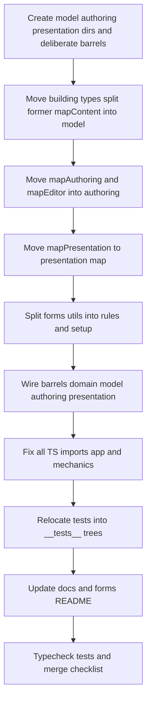

# Locations `domain/` ownership restructure

## Principles (read first)

- **Top-level folders describe domain responsibilities** (`model`, `authoring`, `presentation`, …), not historical subtopics (`mapContent`, `mapEditor`, …).
- The **final merged tree** must not preserve **dual path structures** (old folder plus new folder) or familiarity aliases.
- **Documentation** must be updated to the new vocabulary and ownership model; prose should not keep referring to removed folder names as if they still existed.
- The migration is **only complete** when legacy conceptual folders are **absent from the repository**, not merely unused or sparsely imported.

## Current vs target (mapping)

| Current                                                                                                                                                                                                                                          | Target                                                                                                                                                                                                                                                                                                                                          |
| ------------------------------------------------------------------------------------------------------------------------------------------------------------------------------------------------------------------------------------------------ | ----------------------------------------------------------------------------------------------------------------------------------------------------------------------------------------------------------------------------------------------------------------------------------------------------------------------------------------------- |
| `[building/](src/features/content/locations/domain/building/)`                                                                                                                                                                                   | `[model/building/](src/features/content/locations/domain/model/building/)`                                                                                                                                                                                                                                                                      |
| `[types/location.types.ts](src/features/content/locations/domain/types/location.types.ts)`, `[locationTransition.types.ts](src/features/content/locations/domain/types/locationTransition.types.ts)`                                             | `[model/location/](src/features/content/locations/domain/model/location/)`                                                                                                                                                                                                                                                                      |
| `[types/locationMap.types.ts](src/features/content/locations/domain/types/locationMap.types.ts)`                                                                                                                                                 | `[model/map/locationMap.types.ts](src/features/content/locations/domain/model/map/locationMap.types.ts)` (join with map-type material from the former `mapContent` split)                                                                                                                                                                       |
| `[mapContent/](src/features/content/locations/domain/mapContent/)`                                                                                                                                                                               | Split: **map** kinds/constants/types → `[model/map/](src/features/content/locations/domain/model/map/)`; **placed object** modules → `[model/placedObjects/](src/features/content/locations/domain/model/placedObjects/)`; `**locationScaleMapContent.policy.ts`** → `[model/policies/](src/features/content/locations/domain/model/policies/)` |
| `[mapAuthoring/](src/features/content/locations/domain/mapAuthoring/)`                                                                                                                                                                           | `[authoring/map/](src/features/content/locations/domain/authoring/map/)`                                                                                                                                                                                                                                                                        |
| `[mapEditor/](src/features/content/locations/domain/mapEditor/)`                                                                                                                                                                                 | `[authoring/editor/](src/features/content/locations/domain/authoring/editor/)`                                                                                                                                                                                                                                                                  |
| `mapEditor/select-mode/`                                                                                                                                                                                                                         | `authoring/editor/selectMode/` (see **Case-only renames**)                                                                                                                                                                                                                                                                                      |
| `[mapPresentation/](src/features/content/locations/domain/mapPresentation/)`                                                                                                                                                                     | `[presentation/map/](src/features/content/locations/domain/presentation/map/)`                                                                                                                                                                                                                                                                  |
| `[forms/utils/](src/features/content/locations/domain/forms/utils/)`                                                                                                                                                                             | **rules/** vs **setup/** (see **Forms** and `**forms/README.md`**)                                                                                                                                                                                                                                                                              |
| `[repo/](src/features/content/locations/domain/repo/)`, `[list/](src/features/content/locations/domain/list/)`, `[details/](src/features/content/locations/domain/details/)`, `[validation/](src/features/content/locations/domain/validation/)` | **Unchanged** location under `domain/`                                                                                                                                                                                                                                                                                                          |

## 1. Retire `mapContent` vocabulary intentionally

`mapContent/` is a **legacy folder label**, not the future conceptual structure. The reorg **must not** preserve a `mapContent/` directory “for prose parity” or to match older docs.

**After the reorg, docs and informal language should refer to:**

| Concept                                                                          | Prefer                                                                         |
| -------------------------------------------------------------------------------- | ------------------------------------------------------------------------------ |
| Map-facing types, icon names, swatch/region keys, cell-fill/path/edge vocabulary | `model/map/` or phrases like **feature map model**                             |
| Placed-object registry, selectors, persistence, runtime                          | `model/placedObjects/` or **placed-object model**                              |
| Per-scale map content policy                                                     | `model/policies/` or **map content policy** (concept), not the old folder name |

Do not reintroduce `mapContent` as a path or barrel alias in the final tree.

## 2. Feature-local vs shared `locationMap.types.ts`

Two different files share a similar basename; this is a **real confusion risk** for contributors and imports.

| Location                                                                                                                     | Role                                                                                 |
| ---------------------------------------------------------------------------------------------------------------------------- | ------------------------------------------------------------------------------------ |
| `[shared/domain/locations/map/locationMap.types.ts](shared/domain/locations/map/locationMap.types.ts)`                       | Shared, cross-environment vocabulary (wire shapes, validation-adjacent types, etc.)  |
| `[domain/model/map/locationMap.types.ts](src/features/content/locations/domain/model/map/locationMap.types.ts)` (after move) | **Feature-local** client map model types used by the locations feature editor and UI |

**Plan requirements:**

- Make this distinction **explicit** in `[docs/reference/locations.md](docs/reference/locations.md)` (and touch `[location-workspace.md](docs/reference/location-workspace.md)` where map types are discussed).
- **Optional follow-up (only if justified):** if confusion persists after documentation, evaluate a **clearer feature-local filename** (e.g. a prefix scoped to the feature). This plan does **not** require renaming the file up front—only flags the risk and allows a deliberate follow-on if needed.

## 3. Merge-time acceptance: no compatibility shims

**During the branch:** temporary local migration shims (e.g. short-lived re-export files) are **allowed** if they reduce friction, as long as they are **removed before merge**.

**In the final merged tree, the following must not exist** as folders or compatibility barrels:

- `domain/mapEditor/`
- `domain/mapContent/`
- `domain/mapPresentation/`
- `domain/mapAuthoring/`
- `domain/types/` (top-level; types live under `model/…`)
- `domain/building/` (top-level; building model lives under `model/building/`)
- `domain/forms/utils/`

**Acceptance:** no `index.ts` (or other modules) whose only purpose is re-exporting from the new paths at an old path; grep shows **no** imports targeting those legacy paths.

## 4. Case-only renames (`select-mode` → `selectMode`)

On **case-insensitive** default macOS filesystems, Git can mishandle **case-only** renames (`select-mode` → `selectMode`).

**Implementation:** use a **two-step** rename, for example:

1. `select-mode` → `select-mode-tmp` (or another distinct intermediate name)
2. `select-mode-tmp` → `selectMode`

Apply the same pattern for any other case-only path changes in this migration.

## 5. Barrel and export hygiene

- **Subtree barrels** (`model/map/index.ts`, `authoring/editor/index.ts`, …) are appropriate for grouping.
- **Root `domain/index.ts`** should stay **deliberate**: export what the feature intends as public; avoid turning it into an unbounded re-export surface during the reorg.
- `**model/index.ts` must not be a careless `export *` dump.** When composing exports from `model/map`, `model/placedObjects`, and `model/policies`:
  - **Check for name collisions** across those barrels before merging.
  - Prefer explicit re-exports or narrow barrels if collisions appear.
- `**locationPlacedObject.recordUtils`** remains an **internal** utility inside `model/placedObjects`—do **not** promote it to a higher barrel or public surface just because files moved.

Preserve the **same logical export surface** from `@/features/content/locations/domain` for symbols that are already public via that barrel (so barrel-only consumers keep working). Deep imports must move to **new** paths; obsolete directories are **deleted**, not mirrored.

## Import update scope (blast radius)

- **Deep imports** to legacy paths appear across the locations feature, combat, game-session, encounter, app theme, and `**packages/mechanics`** (e.g. `[space.types.ts](packages/mechanics/src/combat/space/space.types.ts)`, `[gridObject.fromAuthored.ts](packages/mechanics/src/combat/space/gridObject/gridObject.fromAuthored.ts)`). Use a **single coordinated pass**: move files, fix TypeScript imports until `tsc`/tests are green.
- **Internal cross-imports** inside moved modules (editor → model, presentation → model) update in the same change.

## Tests

- Move co-located tests into `__tests__/` per target:
  - `[cellAuthoringMappers.test.ts](src/features/content/locations/domain/mapAuthoring/cellAuthoringMappers.test.ts)` → `authoring/map/__tests__/cellAuthoringMappers.test.ts`
  - `[locationMapAuthoring.roundTrip.test.ts](src/features/content/locations/domain/mapAuthoring/locationMapAuthoring.roundTrip.test.ts)` → `authoring/map/__tests__/`
  - `[locationScaleMapContent.policy.test.ts](src/features/content/locations/domain/mapContent/locationScaleMapContent.policy.test.ts)` → `model/policies/__tests__/`
  - `[locationPlacedObject.selectors.test.ts](src/features/content/locations/domain/mapContent/locationPlacedObject.selectors.test.ts)` → `model/placedObjects/__tests__/`
  - Mirror `[mapEditor/__tests__/](src/features/content/locations/domain/mapEditor/__tests__/)` under `authoring/editor/__tests__/` (draw, edge, erase, hex, paint, palette, placement, rail, selectMode).
- Only create `__tests__/` subtrees that contain real test files (avoid empty dirs unless you add `.gitkeep`/README—optional).

## Forms split and `forms/README.md`

| Current `forms/utils/`                                                                                                                                       | Target                                                               |
| ------------------------------------------------------------------------------------------------------------------------------------------------------------ | -------------------------------------------------------------------- |
| `locationFormUiRules.ts`, `locationFormSanitize.ts`, `locationDependentFieldsPolicy.ts`, `buildingSubtypeSelectOptions.ts`, `parentLocationPickerOptions.ts` | `[forms/rules/](src/features/content/locations/domain/forms/rules/)` |
| `locationCreateSetupForm.ts`, `locationEntityRefPicker.ts`                                                                                                   | `[forms/setup/](src/features/content/locations/domain/forms/setup/)` |

- Update `[forms/index.ts](src/features/content/locations/domain/forms/index.ts)` to import from `./rules/...` and `./setup/...`.
- Grep for `forms/utils` and fix any external imports.

`**forms/README.md` (deliverable):** Short, discoverable ownership map:

| Folder      | Owns                                                                                              |
| ----------- | ------------------------------------------------------------------------------------------------- |
| `config/`   | Form field config and defaults                                                                    |
| `mappers/`  | Entity ↔ form value mapping                                                                       |
| `registry/` | Field registry wiring                                                                             |
| `types/`    | Form-specific TypeScript types                                                                    |
| `rules/`    | Sanitize, validation, UI policy, dependent-field rules, picker option builders that encode policy |
| `setup/`    | Create-flow and setup-specific helpers (e.g. setup draft, entity ref picker for setup)            |

## Documentation obligations (after the move)

Update path literals and narrative so they match the new tree and vocabulary:

| File                                                                                              | Obligation                                                                                                                                                       |
| ------------------------------------------------------------------------------------------------- | ---------------------------------------------------------------------------------------------------------------------------------------------------------------- |
| `[docs/reference/location-workspace.md](docs/reference/location-workspace.md)`                    | Replace legacy `domain/mapEditor/…`, `domain/mapPresentation/…`, `domain/mapAuthoring/…` with `authoring/…`, `presentation/map/…`; retire `mapContent` as a path |
| `[docs/reference/locations.md](docs/reference/locations.md)`                                      | **Shared vs feature:** describe `model/map`, `model/placedObjects`, `model/policies`; **feature vs shared `locationMap.types.ts`**; update test path bullets     |
| `[docs/reference/color-theming.md](docs/reference/color-theming.md)`                              | `domain/presentation/map/locationMapUiStyles.ts`                                                                                                                 |
| `[docs/reference/content-feature-types.ts](docs/reference/content-feature-types.ts)`              | Example path → `domain/model/location/location.types.ts` (comment-only)                                                                                          |
| Grep `**docs/**` for `mapContent`, `mapEditor`, `mapPresentation`, `mapAuthoring`, `domain/types` | Fix stragglers                                                                                                                                                   |

**Historical `.cursor/plans/*.plan.md`:** optional note in [plan bundle README](.cursor/plans/location-workspace/README.md) that older plans may cite stale domain paths—does not block this reorg.

---

## Suggested implementation order

1. Add folder skeletons and subtree barrels (avoid over-broad `model/index.ts` until exports are verified).
2. **git mv** (use **two-step** rename for `select-mode` → `selectMode` on case-insensitive FS).
3. Fix relative imports inside moved modules, then absolute imports across the repo.
4. Update `[domain/index.ts](src/features/content/locations/domain/index.ts)`; **delete** obsolete directories entirely—**no** shim `index.ts` at legacy paths.
5. Review `**model/index.ts`** for export collisions; keep `recordUtils` internal to `model/placedObjects`.
6. Run typecheck/tests; complete **Final migration checklist** below.

---

## Final migration checklist (merge-ready)

Use this before merging the reorg branch:

- **No imports** from legacy paths: `domain/mapEditor`, `domain/mapContent`, `domain/mapPresentation`, `domain/mapAuthoring`, `domain/types/`, top-level `domain/building/` (distinct from `domain/model/building/`), `forms/utils`.
- **No compatibility barrels or mirror folders** remain for those paths; branch-only shims **removed**.
- **Docs** updated: `mapContent` **retired** as vocabulary; references use `model/map`, `model/placedObjects`, `model/policies`, or conceptual phrases.
- **Feature-local vs shared `locationMap.types.ts`** documented in `locations.md` (and linked from workspace doc where helpful).
- **Case-only renames** (e.g. `select-mode` → `selectMode`) performed with a **two-step** `git mv` where required.
- **Barrels reviewed:** `model/index.ts` has no accidental duplicate exports across `model/map`, `model/placedObjects`, `model/policies`; root `domain/index.ts` remains deliberate.
- `**forms/README.md`** present with ownership for `config/`, `mappers/`, `registry/`, `types/`, `rules/`, `setup/`.
- **Typecheck and tests** green for locations-related and affected packages (including `packages/mechanics` if touched).

