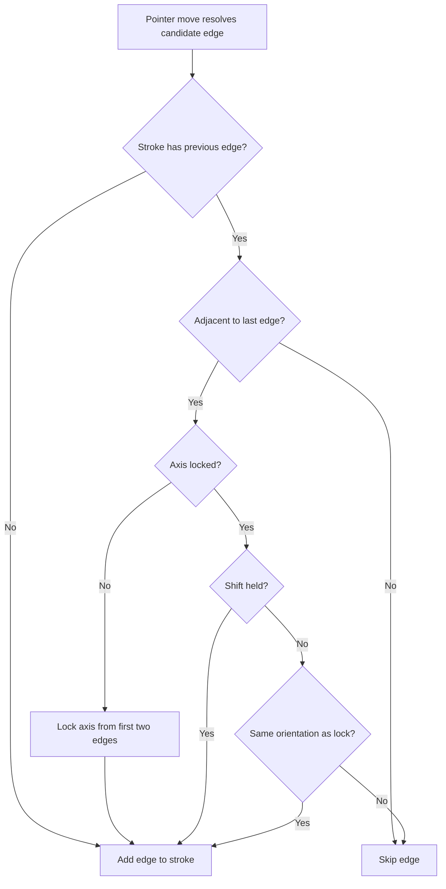

# Edge stroke axis lock + adjacency constraint

## Concept

The stroke currently accepts any edge the pointer crosses. This causes unwanted branches from hand jitter. Two constraints fix this:

1. **Axis lock** — After the stroke's first two edges establish a direction (horizontal or vertical), only accept edges with the same orientation. Holding **Shift** temporarily disables the lock, allowing direction changes for corners. When Shift is released, the new direction becomes the locked axis.
2. **Adjacency** — A candidate edge must share at least one cell with the most recently added edge. This prevents teleporting across the grid.

### Generalization for hex grids

For square grids, edges have 2 orientations: **horizontal** (N/S sides) and **vertical** (E/W sides). For hex grids (future), edges have 3 orientations. The design uses a generic `EdgeOrientation` type rather than hardcoding horizontal/vertical, so extending to hex later requires only adding a third value.

## Changes

### 1. Pure helpers in `[edgeAuthoring.ts](src/features/content/locations/domain/mapEditor/edgeAuthoring.ts)`

Add three new exports:

- `**type EdgeOrientation = 'horizontal' | 'vertical'**` — for square grids; extensible to `| 'hex-a' | 'hex-b' | 'hex-c'` later.
- `**getSquareEdgeOrientation(side: SquareCellSide): EdgeOrientation**` — N/S sides are horizontal edges, E/W sides are vertical edges.
- `**areEdgesAdjacent(edgeIdA: string, edgeIdB: string): boolean**` — parses both `between:cellA|cellB` IDs and returns true if they share at least one cell. Works for any grid geometry since it only compares cell ID strings.
- `**shouldAcceptStrokeEdge(candidate: ResolvedEdgeTarget, lastTarget: ResolvedEdgeTarget, lockedAxis: EdgeOrientation | null, shiftHeld: boolean): { accept: boolean; newAxis: EdgeOrientation | null }**` — combines adjacency + axis lock logic. Returns whether to accept and the (possibly updated) locked axis.

### 2. Tests in `[edgeAuthoring.test.ts](src/features/content/locations/domain/mapEditor/edgeAuthoring.test.ts)`

Add test groups for:

- `getSquareEdgeOrientation` — N/S return horizontal, E/W return vertical
- `areEdgesAdjacent` — shared cell returns true, disjoint returns false
- `shouldAcceptStrokeEdge` — axis lock accepts/rejects, shift bypass, adjacency rejection, axis establishment on second edge

### 3. Component state in `[LocationGridAuthoringSection.tsx](src/features/content/locations/components/LocationGridAuthoringSection.tsx)`

Add to the edge stroke ref group:

- `edgeStrokeLockedAxis = useRef<EdgeOrientation | null>(null)` — current locked axis, cleared on stroke end
- `edgeStrokeLastTarget = useRef<ResolvedEdgeTarget | null>(null)` — last accepted edge target, for adjacency check
- `shiftHeld = useRef(false)` — tracked via `useEffect` with `keydown`/`keyup` listeners for the Shift key

Update `handleEdgePointerMove`: before adding a candidate edge, call `shouldAcceptStrokeEdge`. If rejected, skip. If accepted, update `edgeStrokeLockedAxis` and `edgeStrokeLastTarget`.

Update `handleEdgePointerDown` and `commitEdgeStroke`: reset `edgeStrokeLockedAxis` and `edgeStrokeLastTarget` when starting/ending a stroke.

### 4. Hint text in `[LocationMapEditorPlacePanel.tsx](src/features/content/locations/components/mapEditor/LocationMapEditorPlacePanel.tsx)`

Append to the edge hint: "Hold Shift to change direction mid-stroke."