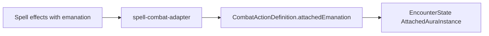

# Emanation audit and authoring plan

## Engine constraints (read before authoring)

- `**EmanationEffect**` (`[effects.types.ts](src/features/mechanics/domain/effects/effects.types.ts)`): `attachedTo: 'self'`, `area: { kind: 'sphere', size }`, optional `selectUnaffectedAtCast`.
- **Spell combat adapter** (`[spell-combat-adapter.ts](src/features/encounter/helpers/spell-combat-adapter.ts)`): derives `**CombatActionDefinition.attachedEmanation`** only from spell `effects` that include `kind: 'emanation'` (plus matching `**targeting`** for area metadata). Today only `**[spirit-guardians](src/features/mechanics/domain/rulesets/system/spells/data/level3-m-z.ts)`** does this in the whole spell catalog.
- **Runtime** (`[effects.md` § `emanation](docs/reference/effects.md)`, `[action-resolver.ts](src/features/mechanics/domain/encounter/resolution/action/action-resolver.ts)`): `AttachedAuraInstance` IDs use `**attached-emanation-${spellId}-…`**. Spatial speed multipliers and interval resolution are integrated for **spell** attached auras, not for arbitrary monster traits.
- **Stationary vs moving:** `[effects.md](docs/reference/effects.md)` describes emanations as **self-centered areas that move with the caster** on the grid. Spells whose rules say the area is **stationary** or **immobile** (e.g. Tiny Hut, Globe of Invulnerability full text) are **poor fits** for the current `emanation` + attached-aura pipeline unless the engine is extended for “fixed footprint” auras.

**Monster pipeline gap:** `[MonsterSpecialAction](src/features/content/monsters/domain/types/monster-actions.types.ts)` allows `effects`, but `[buildMonsterActionDefinition](src/features/encounter/helpers/monster-combat-adapter.ts)` does **not** copy `action.effects` onto `CombatActionDefinition.effects`. Trait `effects` feed `[buildActiveMonsterEffects](src/features/mechanics/domain/encounter/runtime/monster-runtime.ts)` / turn hooks / labels, not `**attachedEmanation`**. So **monster “emanation” authoring in this pass should stay at `resolution.caveats` + optional structured effects only where existing hooks apply** (e.g. regeneration, turn-boundary triggers), unless you schedule a separate **adapter + resolver** change to support monster-sourced attached auras (likely a new ID scheme, not `spellId`).

---

## A. Spell audit — “Emanation” in text (grep of `[system/spells](src/features/mechanics/domain/rulesets/system/spells)`)

| Spell (id)                 | File                                                                                       | Structured `emanation`? | Notes                                                                                            |
| -------------------------- | ------------------------------------------------------------------------------------------ | ----------------------- | ------------------------------------------------------------------------------------------------ |
| `pass-without-trace`       | `[level2-g-z.ts](src/features/mechanics/domain/rulesets/system/spells/data/level2-g-z.ts)` | No                      | Self, moving aura; utility (Stealth), not damage.                                                |
| `darkness`                 | `[level2-a-f.ts](src/features/mechanics/domain/rulesets/system/spells/data/level2-a-f.ts)` | No                      | Dual mode: fixed sphere **or** object-centered emanation — already caveated.                     |
| `daylight`                 | `[level3-a-l.ts](src/features/mechanics/domain/rulesets/system/spells/data/level3-a-l.ts)` | No                      | Same dual-mode / light overlap issue — already caveated.                                         |
| `speak-with-plants`        | `[level3-m-z.ts](src/features/mechanics/domain/rulesets/system/spells/data/level3-m-z.ts)` | No                      | **Immobile** 30 ft emanation — wrong for moving attached aura.                                   |
| `spirit-guardians`         | `[level3-m-z.ts](src/features/mechanics/domain/rulesets/system/spells/data/level3-m-z.ts)` | **Yes**                 | Reference implementation.                                                                        |
| `tiny-hut`                 | `[level3-m-z.ts](src/features/mechanics/domain/rulesets/system/spells/data/level3-m-z.ts)` | No                      | **Stationary** dome — keep notes + caveats; do not use `emanation` as “follows caster”.          |
| `aura-of-life`             | `[level4-a-l.ts](src/features/mechanics/domain/rulesets/system/spells/data/level4-a-l.ts)` | No                      | Self, moving aura; resistance + HP rules partly as `modifier`/`note`; caveats already list gaps. |
| `antilife-shell`           | `[level5-a-l.ts](src/features/mechanics/domain/rulesets/system/spells/data/level5-a-l.ts)` | No                      | Barrier / passage rules not covered by spatial emanation alone.                                  |
| `globe-of-invulnerability` | `[level6-a-l.ts](src/features/mechanics/domain/rulesets/system/spells/data/level6-a-l.ts)` | No                      | Text says **immobile** barrier — same stationary caveat as Tiny Hut class.                       |
| `antimagic-field`          | `[level8-a-l.ts](src/features/mechanics/domain/rulesets/system/spells/data/level8-a-l.ts)` | No                      | Heavy rules; caveats exist; not a simple aura overlay.                                           |
| `holy-aura`                | `[level8-a-l.ts](src/features/mechanics/domain/rulesets/system/spells/data/level8-a-l.ts)` | No                      | Advantage/disadvantage split; caveats exist.                                                     |

**Authoring priority for structured `emanation` (spells):**

1. **High fit (self, concentration, sphere, moves with caster):** `pass-without-trace`, `aura-of-life`, `antilife-shell`, `holy-aura`, `antimagic-field` — add `**emanation`** + `**targeting`** (`creatures-in-area`, matching radius) so the grid shows the footprint and cast-time options (e.g. `selectUnaffectedAtCast` where rules allow chosen allies: Pass without Trace, Holy Aura). Keep existing `**resolution.caveats`** and **expand** them to list anything still not automated after the aura exists (e.g. antimagic suppression, shell passage, hut occupancy).
2. **Do not force `emanation` for attached-aura runtime:** `tiny-hut`, `globe-of-invulnerability`, `speak-with-plants`, `**darkness` / `daylight` object modes** — remain **note + caveats** (and optional future “fixed area” feature).
3. **Docs touch-up:** After changes, align `[effects.md](docs/reference/effects.md)` `emanation` subsection if you add patterns (e.g. “stationary emanation” explicitly out of scope for `AttachedAuraInstance`).

---

## B. Monster audit — “Emanation” in text (`[system/monsters/data](src/features/mechanics/domain/rulesets/system/monsters/data)`)

| Location                                                                                                                                                                                                                                                                                         | Pattern                                                                                                                           |
| ------------------------------------------------------------------------------------------------------------------------------------------------------------------------------------------------------------------------------------------------------------------------------------------------ | --------------------------------------------------------------------------------------------------------------------------------- |
| `[monsters-a.ts](src/features/mechanics/domain/rulesets/system/monsters/data/monsters-a.ts)`                                                                                                                                                                                                     | Aboleth **Mucus Cloud** (5 ft, end of turn, Con save curse); Azer **Fire Aura** (5 ft, end of turn, chosen targets, fire damage). |
| `[monsters-f.ts](src/features/mechanics/domain/rulesets/system/monsters/data/monsters-f.ts)`                                                                                                                                                                                                     | Fire Elemental **Fire Aura** (10 ft, end of turn).                                                                                |
| `[monsters-g-i.ts](src/features/mechanics/domain/rulesets/system/monsters/data/monsters-g-i.ts)`                                                                                                                                                                                                 | Hobgoblin Captain **Aura of Authority** (10 ft, advantage) — already `**resolution.caveats`**.                                    |
| `[monsters-d.ts](src/features/mechanics/domain/rulesets/system/monsters/data/monsters-d.ts)`, `[monsters-m-o.ts](src/features/mechanics/domain/rulesets/system/monsters/data/monsters-m-o.ts)`, `[monsters-s-u.ts](src/features/mechanics/domain/rulesets/system/monsters/data/monsters-s-u.ts)` | Mephit/Magmin **death** explosions (Dex save, fixed radius) — `**resolution`** on the action with table text.                     |

**Recommended authoring for this pass (no engine change):**

- **Normalize “gap” messaging** to the hobgoblin pattern: traits that only have `**effects: [{ kind: 'note', … }]`** (Fire Elemental, Azer, Aboleth) should also get `**resolution: { caveats: […] }`** with the same substance as the note (or replace redundant notes with caveats only—pick one style per trait for consistency with `[Aura of Authority](src/features/mechanics/domain/rulesets/system/monsters/data/monsters-g-i.ts)`).
- **Death bursts:** keep one-line `**resolution`** on the special action; optionally add `**caveats`** array parallel to `[monsters-g-i.ts](src/features/mechanics/domain/rulesets/system/monsters/data/monsters-g-i.ts)` / `[cantrips-m-z.ts](src/features/mechanics/domain/rulesets/system/spells/data/cantrips-m-z.ts)` if the schema allows (monster actions already use `resolution` on specials—verify against `[ContentResolutionMeta](src/features/mechanics/domain/resolution/content-resolution.types.ts)`).

**Future (separate effort):** plumbing `**emanation` + interval + save** for monster traits would require **resolver + UI** support for non-spell aura IDs and likely trait-bound turn hooks for “creatures in emanation at end of turn.”

---

## C. Verification

- Run existing tests around spell combat actions / attached auras if present (e.g. `[encounter-helpers.test.ts](src/features/encounter/helpers/encounter-helpers.test.ts)`, spell catalog tests).
- Manually spot-check one authored spell in encounter: aura footprint, concentration drop removes aura, caveats visible in UI if surfaced from `resolution`.

---

## D. Suggested implementation order

1. **Spells — add `emanation` + matching `targeting`** for the “high fit” list; tune `**selectUnaffectedAtCast**` only where SRD text supports chosen allies.
2. **Spells — refresh `resolution.caveats`** per spell for remaining automation gaps (mirror the examples you cited).
3. **Monsters — add/align `resolution.caveats`** on emanation-related traits (and death actions if needed).
4. **Optional doc** — one paragraph in `[effects.md](docs/reference/effects.md)` clarifying stationary vs attached emanation.

