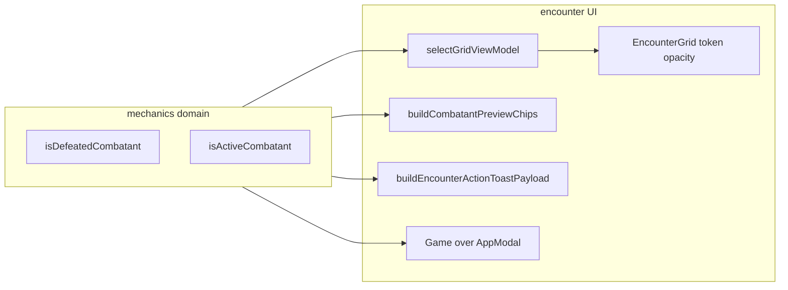

# Encounter death / defeated UI (first pass)

## Architecture

## 1. Grid token opacity

- Extend `[GridCellViewModel](src/features/encounter/space/space.selectors.ts)` with a boolean such as `**occupantIsDefeated**` derived from the occupant’s `CombatantInstance` using `**isDefeatedCombatant**` from `[combatant-participation.ts](src/features/mechanics/domain/encounter/state/combatant-participation.ts)`.
- In `[EncounterGrid.tsx](src/features/encounter/components/active/grid/EncounterGrid.tsx)`, on the token `Box` (avatar ring), set `**opacity: DEFEATED_PARTICIPATION_OPACITY**` when that flag is true (see **§4b** for the shared constant).

## 2. Toast: append defeat only on first line

- **Problem:** `[buildEncounterActionToastPayload](src/features/encounter/helpers/encounter-action-toast.ts)` only sees log events; defeat must be judged against **post-resolution** combatants.
- **Change `[useEncounterState.ts](src/features/encounter/hooks/useEncounterState.ts)`:** When appending the combat log after `resolveCombatAction`, invoke the callback as `**(appendedEvents, nextEncounterState)`** (same `queueMicrotask` pattern).
- **Update `[EncounterActiveRoute.tsx](src/features/encounter/routes/EncounterActiveRoute.tsx)`:** `registerCombatLogAppended((events, state) => { ... buildEncounterActionToastPayload(events, state) })`.
- **Extend `buildEncounterActionToastPayload(events, encounterState)`:** After computing the existing `title` (unchanged logic for body/narrative/mechanics), scan `**events`** for `type === 'damage-applied'` and each `targetIds` entry. If `combatantsById[targetId]` exists and `**isDefeatedCombatant`** is true, collect display names via `**getCombatantDisplayLabel(c, roster)`** (roster = `Object.values(encounterState.combatantsById)`). Dedupe by id; append a single concise suffix to `**title`** only, e.g.  `— {Name} is defeated.` or plural when multiple distinct targets. **Do not** add new narrative/mechanics lines for defeat in this pass.
- **Wording:** Use **“defeated”** for UI consistency with `[TurnOrderList](src/features/encounter/components/active/modals/TurnOrderList.tsx)` / participation semantics (`HP ≤ 0`); reserve stricter “dead”/record language for future if needed.

## 3. Game over modal (`AppModal`)

- Add a small **pure helper** (e.g. `deriveEncounterSideOutcome` or `getEncounterGameOverSummary`) in `[src/features/encounter/helpers/](src/features/encounter/helpers/)` or `domain/` that, given `EncounterState`, uses `**isActiveCombatant`** on `partyCombatantIds` / `enemyCombatantIds` (same ids as state) to detect:
  - **Allies win:** at least one active party combatant and **no** active enemies.
  - **Enemies win:** at least one active enemy and **no** active party combatants.
  - **Stalemate / both down:** both sides have combatants but none active (optional copy).
  - **No modal:** both sides still have active fighters, or encounter not started / empty roster (guard clauses).
- In `**EncounterActiveRoute`** (or a tiny `EncounterGameOverModal.tsx` colocated under `components/active/modals/`): render `**AppModal`** from `[@/ui/patterns](src/features/encounter/components/active/modals/CombatTurnOrderModal.tsx)` pattern — **title** reflects outcome, **body** minimal; primary action `**Reset encounter`** calling `**handleResetEncounter`** from `[useEncounterRuntime](src/features/encounter/routes/EncounterRuntimeContext.tsx)`. Optional **Close** to dismiss without navigating (local `useState` flag so closing does not fight `replace: true` on reset).
- Derive open state from `**encounterState`** + `useMemo` / `useEffect` so the modal appears when the outcome first becomes true (avoid flashing on every render: e.g. track `outcomeKey` or `dismissed` ref as needed for first pass).

## 4. State badge on tooltip + initiative cards (single pipeline — verified)

**How chips are built today (no initiative vs tooltip divergence for these cards):**

- **Grid tooltip popover:** `[renderTokenPopover](src/features/encounter/routes/EncounterActiveRoute.tsx)` renders `[AllyCombatantActivePreviewCard](src/features/encounter/components/active/cards/AllyCombatantActivePreviewCard.tsx)` / `[OpponentCombatantActivePreviewCard](src/features/encounter/components/active/cards/OpponentCombatantActivePreviewCard.tsx)`.
- **Initiative sidebar:** `[EncounterActiveSidebar](src/features/encounter/components/active/grid/EncounterActiveSidebar.tsx)` `InitiativeOrderTab` uses the **same** two preview card components.
- Both paths call `**buildCombatantPreviewChips(combatant)`** → chips flow through `**CombatantPreviewCard`** → `**CombatantPreviewChipRow`** (`[combatant-badges.tsx](src/features/encounter/components/shared/cards/combatant-badges.tsx)`).

**Related surface:** `[EncounterActiveCombatantIdentity](src/features/encounter/components/active/layout/EncounterActiveCombatantIdentity.tsx)` also uses `**buildCombatantPreviewChips(combatant, { …options })`** — same canonical builder with filters; defeated chip belongs in the builder so identity/header picks it up too.

**Implementation rule for this pass:**

- Add the **Defeated** participation chip **only** inside `[buildCombatantPreviewChips](src/features/encounter/helpers/build-combatant-preview-chips.ts)` (prepend before sort). **Do not** add duplicate chips or hardcoded labels on `AllyCombatantActivePreviewCard`, `OpponentCombatantActivePreviewCard`, or sidebar/popover wrappers.
- **Label / tone / priority:** avoid a one-off `'Defeated'` string in the helper. Add a semantic key (e.g. `**participation_defeated`**) to `**COMBAT_STATE_UI_MAP`** via `[core-combat-state-presentation.ts](src/features/encounter/domain/effects/core-combat-state-presentation.ts)` (or the appropriate merged map file), then build the chip with `**resolvePresentationForSemanticKey('participation_defeated')**` so copy matches the rest of the combat-state presentation pipeline (`[combat-state-ui-map.ts](src/features/encounter/domain/effects/combat-state-ui-map.ts)`).
- Import `**isDefeatedCombatant**` from mechanics encounter state for the gate condition.
- Replace raw `**currentHitPoints <= 0**` with `**isDefeatedCombatant(combatant)**` on the active preview cards only for the `**isDefeated**` prop on `**CombatantPreviewCard**` (card-level dimming; see opacity section below).

Tooltip and initiative therefore share **one** chip source of truth; no per-surface wording.

## 4b. Centralized defeated opacity

- Define a single constant, e.g. `**DEFEATED_PARTICIPATION_OPACITY`**, value `**0.5`** (align all surfaces to this number; current `[CombatantPreviewCard](src/features/encounter/components/shared/cards/CombatantPreviewCard.tsx)` already uses `0.5` for `isDefeated`).
- **Placement:** a small shared module under the encounter feature, e.g. `[src/features/encounter/domain/presentation-defeated.ts](src/features/encounter/domain/presentation-defeated.ts)` or `[src/features/encounter/constants/encounter-presentation.ts](src/features/encounter/constants/encounter-presentation.ts)` — whichever matches existing conventions; export the constant for grid + cards.
- **Use it for:**
  - grid token `Box` when `occupantIsDefeated` is true;
  - `**CombatantPreviewCard`** `Paper` `sx.opacity` when `isDefeated` (replace inline `0.5`).
- **Do not** introduce a second magic opacity (e.g. `0.45` on grid vs `0.5` on cards) unless there is a documented exception; consistency over the exact float.

## 5. Docs touchpoint

- Add a short subsection to `[docs/reference/badges.md](docs/reference/badges.md)` under condition/preview chips: **participation** chip `**Defeated`** sourced from `buildCombatantPreviewChips` + `isDefeatedCombatant`, distinct from action badges.

## Files to touch (concise)

| Area                 | Files                                                                                                                                                                                                                                                                                    |
| -------------------- | ---------------------------------------------------------------------------------------------------------------------------------------------------------------------------------------------------------------------------------------------------------------------------------------- |
| Shared opacity       | New `[presentation-defeated.ts](src/features/encounter/domain/presentation-defeated.ts)` (or `constants/encounter-presentation.ts`) exporting `DEFEATED_PARTICIPATION_OPACITY`; `[CombatantPreviewCard.tsx](src/features/encounter/components/shared/cards/CombatantPreviewCard.tsx)`    |
| Grid VM + grid       | `[space.selectors.ts](src/features/encounter/space/space.selectors.ts)`, `[EncounterGrid.tsx](src/features/encounter/components/active/grid/EncounterGrid.tsx)`                                                                                                                          |
| Toast + hook         | `[useEncounterState.ts](src/features/encounter/hooks/useEncounterState.ts)`, `[encounter-action-toast.ts](src/features/encounter/helpers/encounter-action-toast.ts)`, `[EncounterActiveRoute.tsx](src/features/encounter/routes/EncounterActiveRoute.tsx)`                               |
| Game over            | `[EncounterGameOverModal.tsx](src/features/encounter/components/active/modals/EncounterGameOverModal.tsx)`, outcome helper, `[EncounterActiveRoute.tsx](src/features/encounter/routes/EncounterActiveRoute.tsx)`                                                                         |
| Chips + presentation | `[core-combat-state-presentation.ts](src/features/encounter/domain/effects/core-combat-state-presentation.ts)` (add `participation_defeated`), `[build-combatant-preview-chips.ts](src/features/encounter/helpers/build-combatant-preview-chips.ts)`, ally/opponent active preview cards |
| Docs                 | `[docs/reference/badges.md](docs/reference/badges.md)`                                                                                                                                                                                                                                   |

## Tests (lightweight)

- Unit test `**buildEncounterActionToastPayload`** with a minimal `EncounterState` + synthetic `damage-applied` events and a defeated target (title gains suffix).
- Optional: unit test `**deriveEncounterSideOutcome`** (or equivalent) for win/lose/stalemate.

## Out of scope (per request)

- Global toast redesign, initiative pipeline changes, full results screen, new state machines beyond derived modal + existing helpers.

