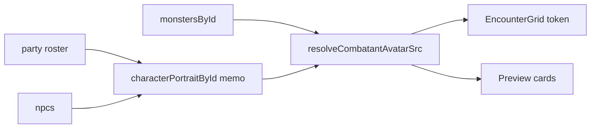

# Encounter grid avatars + DRY combatant portraits

## Why initials-only today

`[EncounterGrid.tsx](src/features/encounter/components/active/grid/EncounterGrid.tsx)` only has `cell.occupantId` / `occupantLabel` from `[selectGridViewModel](src/features/encounter/space/space.selectors.ts)`. It never sees `CombatantInstance` or catalog data, so it cannot resolve `imageKey` / portraits without new inputs from a parent.

`[EncounterRuntimeContext](src/features/encounter/routes/EncounterRuntimeContext.tsx)` already has everything needed synchronously: `party` (`useCampaignParty`), `npcs` (`useCharacters({ type: 'npc' })`), and `catalog.monstersById`.




## 1. Shared portrait map (one definition)

In `useEncounterRuntimeValue` (same file as context), add a `useMemo` that builds:

`characterPortraitById: Record<string, { imageKey?: string | null; imageUrl?: string | null }>`

by merging:

- `party` members: `id` → `{ imageKey, imageUrl }` (already on `[CharacterCardSummary](src/features/character/read-model/character-read.types.ts)` after your mapper change)
- `npcs`: `_id` → `{ imageKey, imageUrl }` from `[CharacterDoc](src/features/character/domain/types/characterDoc.types.ts)` plus normalized `imageUrl` if the list API includes it (same pattern as other endpoints)

Expose this map on the context value next to existing `monstersById` so any encounter UI can reuse it.

## 2. Pure helper (single resolution rule)

Add something like `[encounter/helpers/resolveCombatantAvatarSrc.ts](src/features/encounter/helpers/)` (name can vary):

- Input: `CombatantInstance`, `monstersById`, `characterPortraitById`, and optionally `portraitOverride` (see below)
- Logic for **base** src (no override):
  - `source.kind === 'monster'` → `resolveImageUrl(monstersById[sourceId]?.imageKey)`
  - `source.kind === 'pc' | 'npc'` → `resolveImageUrl(portrait?.imageKey ?? portrait?.imageUrl)` for `characterPortraitById[sourceId]`
  - else → `undefined`

**Override precedence:** When `portraitOverride` is provided (same shape as a portrait entry: `{ imageKey?, imageUrl? }`), resolve it first: `resolveImageUrl(portraitOverride.imageKey ?? portraitOverride.imageUrl)`. If that yields a defined `src`, use it; otherwise fall back to the base rules above. This keeps roster/map as the default and lets a loaded detail DTO win when available.

Import `[resolveImageUrl](shared/lib/media/resolveImageUrl.ts)` here only — no duplication of path rules.

## 3. `CombatantAvatar` component

Add `[encounter/components/shared/CombatantAvatar.tsx](src/features/encounter/components/shared/)` (or under `components/avatars/`) with an explicit props contract:

- **Required:** `combatant`, `monstersById`, `characterPortraitById` (always pass the shared map from context or parent — single source of truth for pc/npc portraits in encounter).
- **Optional:** `displayName` (duplicate-aware labels), `size`, `portraitOverride?: { imageKey?: string | null; imageUrl?: string | null }`.

Implementation: compute `src` via `resolveCombatantAvatarSrc(combatant, { monstersById, characterPortraitById, portraitOverride })` (or equivalent), then render `[AppAvatar](src/ui/primitives/AppAvatar.tsx)` with that `src` and `name={displayName ?? combatant.source.label}`.

This replaces the split between `MonsterAvatar` + `CharacterAvatar` in the four preview card files (same visual: MUI `Avatar` + initials fallback).

**Ally active card** (`[AllyCombatantActivePreviewCard.tsx](src/features/encounter/components/active/cards/AllyCombatantActivePreviewCard.tsx)`): Keep `[useCharacter](src/features/character/hooks/useCharacter.ts)` for subtitles and other detail. When `character` is loaded, pass `portraitOverride={{ imageKey: character.imageKey, imageUrl: character.imageUrl }}` so the avatar matches the detail API after fetch; before load, `CombatantAvatar` uses `characterPortraitById[sourceId]` only.

**Ally setup card** (`[AllyCombatantSetupPreviewCard.tsx](src/features/encounter/components/setup/roster/AllyCombatantSetupPreviewCard.tsx)`): Pass the same `characterPortraitById` from parent; use `portraitOverride` from the already-loaded `character` object passed into that card (full detail in scope — override should match or refine the map).

## 4. Grid: optional URL resolver + token UI

Extend `[EncounterGrid](src/features/encounter/components/active/grid/EncounterGrid.tsx)` props with:

`resolveTokenAvatarSrc?: (occupantId: string) => string | undefined`

Implementation:

- Look up `occupantId` is **runtime instance id** → `encounterState.combatantsById[occupantId]`
- Call `resolveCombatantAvatarSrc(combatant, ...)`

In `[EncounterActiveRoute](src/features/encounter/routes/EncounterActiveRoute.tsx)`, pass a stable `useCallback` that closes over `encounterState`, `monstersById`, and `characterPortraitById` from context.

**Token rendering:** Replace the inner `[Typography` + `tokenInitials](src/features/encounter/components/active/grid/EncounterGrid.tsx)` with a small `[AppAvatar](src/ui/primitives/AppAvatar.tsx)` (`size="xs"` or match the 32px token) using `src` when defined, `name={cell.occupantLabel}` when not.

**Styling:** Today the token uses `bgcolor: tokenColor(cell, palette)` as fill. With images, switch to a **ring** (border or box-shadow in `tokenColor`) so party/enemy color stays visible without tinting the portrait; keep initials path when `src` is undefined (AppAvatar already does initials from `name`).

## 5. Refactor call sites (DRY)


| Location                                                                                                                          | Change                                                                                                                                                                                                                                         |
| --------------------------------------------------------------------------------------------------------------------------------- | ---------------------------------------------------------------------------------------------------------------------------------------------------------------------------------------------------------------------------------------------- |
| `[OpponentCombatantActivePreviewCard.tsx](src/features/encounter/components/active/cards/OpponentCombatantActivePreviewCard.tsx)` | Use `CombatantAvatar` + context maps                                                                                                                                                                                                           |
| `[OpponentCombatantSetupPreviewCard.tsx](src/features/encounter/components/setup/roster/OpponentCombatantSetupPreviewCard.tsx)`   | Same                                                                                                                                                                                                                                           |
| `[AllyCombatantSetupPreviewCard.tsx](src/features/encounter/components/setup/roster/AllyCombatantSetupPreviewCard.tsx)`           | `CombatantAvatar` + `characterPortraitById`; `portraitOverride` from loaded `character` prop                                                                                                                                                   |
| `[AllyCombatantActivePreviewCard.tsx](src/features/encounter/components/active/cards/AllyCombatantActivePreviewCard.tsx)`         | Same; `portraitOverride` from `useCharacter` when `character` is non-null                                                                                                                                                                      |
| `[SelectEncounterCombatantModal.tsx](src/features/encounter/components/setup/modals/SelectEncounterCombatantModal.tsx)`           | **Leave as-is** (or extract `resolveOptionAvatarSrc(option) => resolveImageUrl(option.imageKey ?? option.imageUrl)` in a one-liner helper). Options are not `CombatantInstance`; forcing them through `CombatantAvatar` would add fake shapes. |


Preview cards that do not have access to context today receive `monstersById` / `characterPortraitById` as props from parents that already have them (`EncounterRuntimeContext`, `[useCampaignRules](src/app/providers/CampaignRulesProvider.tsx)`, etc.), matching how `OpponentCombatantActivePreviewCard` already uses `catalog.monstersById`.

## 6. Types / tests

- Export the new helper’s argument type (e.g. `CombatantAvatarContext`) for reuse.
- Add a small unit test for `resolveCombatantAvatarSrc` (monster vs pc/npc vs missing ids) next to other encounter helpers.

## Follow-up: `portraitImageKey` on `CombatantInstance` (recommended)

**Goal:** Drop the grid’s dependency on `resolveTokenAvatarSrc` from the route by putting a **durable media key** on each combatant, while keeping **URL resolution out of** `[space.selectors.ts](src/features/encounter/space/space.selectors.ts)`.

### Store the key, not the URL

- Add `portraitImageKey?: string | null` to `[CombatantInstance](src/features/mechanics/domain/encounter/state/types/combatant.types.ts)`.
- **Do not** store resolved URLs on encounter state. Keys are persistence-friendly; URLs are presentation/runtime (CDN, signed URLs, transforms) and belong in `resolveImageUrl` / UI.

### Single extraction helper (builders + clones)

Introduce something like:

```ts
function getCombatantPortraitImageKey(input: {
  character?: { imageKey?: string | null };
  monster?: { imageKey?: string | null };
}): string | null {
  return input.character?.imageKey ?? input.monster?.imageKey ?? null;
}
```

- Call it from `[buildCharacterCombatantInstance](src/features/encounter/helpers/combatant-builders.ts)` / `[buildMonsterCombatantInstance](src/features/encounter/helpers/combatant-builders.ts)` (and any summon/clone path) so the field is not “one more thing” every ad-hoc constructor must remember.
- Any path that copies/transforms into an encounter combatant should go through these builders or a shared helper that sets `portraitImageKey`.

### Selectors: key only, no `resolveImageUrl`

- Extend `[GridCellViewModel](src/features/encounter/space/space.selectors.ts)` with e.g. `occupantPortraitImageKey: string | null` (or per-occupant field), sourced from `combatant.portraitImageKey` when `selectGridViewModel` already has the `CombatantInstance`.
- **Do not** import or call `resolveImageUrl` inside `space.selectors.ts` — selectors stay domain/view-model; resolution stays at the edge (grid / avatar components).

### Presentation layer

- `[EncounterGrid](src/features/encounter/components/active/grid/EncounterGrid.tsx)` (or a thin wrapper) calls `resolveImageUrl(cell.occupantPortraitImageKey)` (or equivalent) when rendering the token — **after** reading the key from the grid view model.
- Optionally simplify `[resolveCombatantAvatarSrc](src/features/encounter/helpers/resolveCombatantAvatarSrc.ts)` / `[CombatantAvatar](src/features/encounter/components/shared/CombatantAvatar.tsx)` to prefer `combatant.portraitImageKey` first, then fall back to catalog/roster for older state or edge cases.

### Optional later

- Replacing per-row `useCharacter` fetches with roster-only data everywhere (performance / consistency tradeoff).

