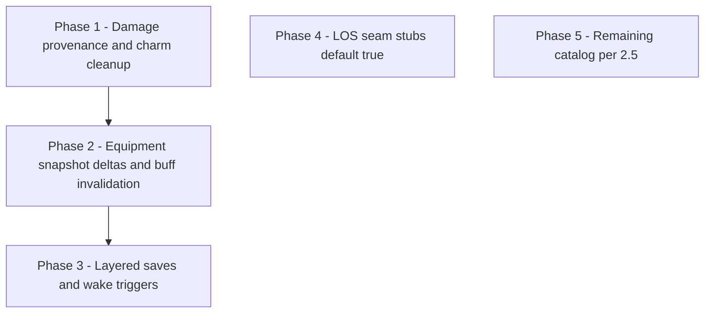

# Plan: Extend engine for Engine-blocked authoring

## Out of scope (explicit)

- **Spatial area targeting** — No roadmap work for geometry, templates, mixed allegiance in zone, or moving areas. Authored `creatures-in-area` + `area` remains a rules/UI template; the adapter continues to map area-style spells to `**all-enemies`** per [effects.md §3](../docs/reference/effects.md#area-targeting-and-encounter-combat-limitations). Revisit only if the product commits to grid/simulation.

---

## 1. What “Engine-blocked authoring” means

**Authoring** is *engine-blocked* when the canonical effect vocabulary and container metadata can represent part of a rule, but the encounter (or stat) resolution layer cannot yet enforce the remainder without lying in structured data.

The codebase already supports the *authoring side* of this pattern:

| Mechanism                               | Role                                                                   | Reference                                                                            |
| --------------------------------------- | ---------------------------------------------------------------------- | ------------------------------------------------------------------------------------ |
| `note` with `category: 'under-modeled'` | Explicit temporary gap on the spell                                    | [effects.md §8](../docs/reference/effects.md#8-intentional-under-modeling)           |
| `resolution.caveats`                    | Free-text when categorised notes are insufficient                      | [effects.md §9](../docs/reference/effects.md#9-scaling-direction)                    |
| `getSpellResolutionStatus` → `partial`  | Signals structured effects + remaining gaps                            | [spellResolution.ts](../src/features/content/spells/domain/types/spellResolution.ts) |
| Adapter degradation                     | Unsupported kinds log cleanly; content is not reshaped to fake support | [effects.md §10](../docs/reference/effects.md#10-adapter-philosophy)                 |

**Principle (from [effects.md §2](../docs/reference/effects.md#2-core-rules)):** runtime limits must not shape authored content. Engine work *unblocks* authoring cleanup: replace `under-modeled` notes with structure, trim `caveats`, and watch `partial` → `full`.

This plan is the **engine extension roadmap** that pairs with that content policy. It consolidates the follow-up backlog from [spells, caveats, See Invis](spells,_caveats,_see_invis_d60f643b.plan.md) §Engine-blocked authoring and aligns with [resolution.md §4.5](../docs/reference/resolution.md#45-condition-consequence-framework), [§9](../docs/reference/resolution.md#9-known-pressure-points), and [effects.md §10 “Known Unsupported Spell Mechanics”](../docs/reference/effects.md#known-unsupported-spell-mechanics).

---

## 2. Current blocked themes → engine capabilities

Each row: *what content does today* → *what must exist in the engine* → *primary modules / seams*.

### 2.1 Damage pipeline: provenance, allies, and conditional cleanup

**Status (landed):** `applyDamageToCombatant` strips `charmed` when the damage attacker (`options.actorId` or `activeCombatantId`) shares the charmer’s `CombatantSide` (`party` / `enemies`), using `sourceInstanceId` on the condition marker as the charmer’s instance id. Logs `condition-removed`. See [damage-mutations.ts](../src/features/mechanics/domain/encounter/state/damage-mutations.ts) (`removeCharmedFromCasterSideDamage`). Tests: `encounter/tests/damage-charm.test.ts`. Charm Person `resolution.caveats` trimmed accordingly; save advantage when allies fight remains a caveat.

**Further work (optional):** spell-level damage attribution, reactions without `actorId`, or per-marker removal APIs if multiple independent charms need finer control.

---

### 2.2 Scripted saves, wake triggers, and turn-boundary semantics

**Status (Sleep landed):** `RepeatSave` supports `singleAttempt`, `onFail.addCondition` + `markerClassification` (Sleep tags `sleep` on unconscious), and `autoSuccessIfImmuneTo` (exhaustion on initial and repeat save). `resolveRepeatSave` in [`turn-hooks.ts`](../src/features/mechanics/domain/encounter/state/turn-hooks.ts) applies fail → unconscious and clears the hook. [`damage-mutations.ts`](../src/features/mechanics/domain/encounter/state/damage-mutations.ts) strips sleep-tagged unconscious on any damage. **Not automated:** shake awake within 5 ft; creatures that don’t sleep except via exhaustion immunity (e.g. elves) — caveats on the spell. Tests: [`sleep-spell.test.ts`](../src/features/mechanics/domain/encounter/tests/sleep-spell.test.ts).

**Further work:** Flesh to Stone–style staged saves; generic wake actions; richer auto-success predicates. **Contagion:** `outcomeTrack` on `repeatSave` (`turn-hooks.ts`); spell data in `level5-a-l.ts`; tests: `contagion-outcome-track.test.ts`.

---

### 2.3 Equipment snapshot (characters + monsters), live updates, and buff invalidation

**Status (landed):** `CombatantEquipmentSnapshot` includes `armorEquipped`, `mainHandWeaponId`, `offHandWeaponId`, `shieldId` (characters populate from loadout in [`combatant-builders.ts`](../src/features/encounter/helpers/combatant-builders.ts)). `inferStatModifierEligibilityFromEffect` tags `StatModifierMarker` with `eligibility.requiresUnarmored` when the authored modifier matches `equipment.armorEquipped === null` (self). `armorClassBeforeApply` is stored for `set` `armor_class` so `expireStatModifier` can restore AC. **`patchCombatantEquipmentSnapshot`** merges a patch and drops ineligible modifiers (Mage Armor–style). Tests: [`equipment-snapshot.test.ts`](../src/features/mechanics/domain/encounter/tests/equipment-snapshot.test.ts). **UI** still must call `patchCombatantEquipmentSnapshot` (or rebuild combatants) when loadout changes; Mage Armor caveat documents that.

**Further work:** monster stat-block–derived armor; weapon conditions in `evaluateCondition`; UI wiring to patch on loadout save.

---

### 2.4 Visibility / line of sight — seam only (full LOS/position not in scope)

**Status (landed):** [`visibility-seams.ts`](../src/features/mechanics/domain/encounter/state/visibility-seams.ts) exports `lineOfSightClear`, `lineOfEffectClear` (always `true` — geometry stub), and `canSeeForTargeting(state, observerId, targetId)` combining `canSee`, invisible vs See Invisibility, and those stubs. Spell `targeting.requiresSight` flows through [`spell-combat-adapter.ts`](../src/features/encounter/helpers/spell-combat-adapter.ts) as `CombatActionTargetingProfile.requiresSight`; [`action-targeting.ts`](../src/features/mechanics/domain/encounter/resolution/action/action-targeting.ts) `isValidActionTarget` enforces it (not for `self` / `all-enemies`). Tests: [`visibility-seams.test.ts`](../src/features/mechanics/domain/encounter/tests/visibility-seams.test.ts). **Still deferred:** real LOS, positions, heavily obscured tiles, frightened “while you can see” automation.

**Unblocks:** Frightened / stealth can call the same seams later; grid replaces stub bodies only.

---

### 2.5 Catalog-wide “Known Unsupported” — revised assumptions (effects.md §10)

Engine-blocked authoring still reconciles when features land. **Deliberately deferred** in this plan:

| Theme                                                | Plan                                                                                                                                                                                                                                                                                                                                                                                                                                                                                               |
| ---------------------------------------------------- | -------------------------------------------------------------------------------------------------------------------------------------------------------------------------------------------------------------------------------------------------------------------------------------------------------------------------------------------------------------------------------------------------------------------------------------------------------------------------------------------------- |
| **Spell slots vs spell level**                       | Do **not** model slot consumption / slot-based scaling in this roadmap. Authored spell `level` is **0** for cantrips. For any formula that multiplies by spell level and needs a positive tier, use `**effectiveSpellLevelForScaling`** (`shared.ts`): **0 → 1**; leveled spells keep 1–9. Character-level cantrip damage still uses `**levelScaling` / `cantripDamageScaling`**, not this helper. **Document** slot-based upcasting as future work in [effects.md](../docs/reference/effects.md). |
| **Healing upcasting**                                | Same: when implemented, read slot or explicit “cast at level”; until then, documented assumption only.                                                                                                                                                                                                                                                                                                                                                                                             |
| **Moving areas, multi-area, spatial awareness**      | Remain **under-modeled** in content. **Assume chosen target(s) are in range** and valid per the simplified adapter; do not build multi-template or moving-effect entities in this plan.                                                                                                                                                                                                                                                                                                            |
| Charmed save advantage (allies fighting)             | Contextual save modifiers from battlefield state — still on backlog when prioritized                                                                                                                                                                                                                                                                                                                                                                                                               |
| Form changes                                         | Stat block swap / `form` resolution path                                                                                                                                                                                                                                                                                                                                                                                                                                                           |
| Caster choice at cast time                           | Cast-time selection UI → payload on action                                                                                                                                                                                                                                                                                                                                                                                                                                                         |
| Success/failure tracking (Flesh to Stone, Contagion) | Contagion: **`repeatSave.outcomeTrack`** + `repeatSaveProgress` on hooks; Flesh to Stone stages still deferred                                                                                                                                                                                                                                                                                                                                                                                      |

Prioritize by **content volume × player impact**, not list order.

### Phase 5 — catalog backlog (incremental)

§2.5 items ship **per feature**: slots, healing upcast, charm contextual save advantage, `form`/stat swap, cast-time UI payloads, Flesh to Stone–style staged saves, monster equipment derivation. **Landed:** Contagion-style **`repeatSave.outcomeTrack`** (3 successes end spell / 3 failures lock duration via `contagion-prolonged` state). **Docs:** [effects.md §10](../docs/reference/effects.md); “Mechanics resolved since initial authoring” in [effects.md](../docs/reference/effects.md).

---

## 3. Phased roadmap (recommended order)

Phases build dependencies: later phases assume earlier seams exist or are stubbed.

Phases 4–5 have no hard dependency on the chain above: Phase 4 is a parallel stub; Phase 5 is opportunistic backlog items.

| Phase | Scope                                                                      | Exit criteria (examples)                                                                                       |
| ----- | -------------------------------------------------------------------------- | -------------------------------------------------------------------------------------------------------------- |
| **1** | Damage pipeline metadata + charm removal hook                              | Unit/integration test: ally damages charmed target → charm removed per spell id                                |
| **2** | Unified equipment snapshot updates + invalidate Mage Armor–style modifiers | Test: don armor → AC modifier from spell drops; weapons fields present for PCs/monsters (monsters may default) |
| **3** | Sleep-class scripts + wake; extend repeat-save if needed                   | Sleep `under-modeled` note reduced where engine covers it; spatial honesty still via notes                     |
| **4** | LOS / visibility **seam** functions default `true`, documented             | [x] `visibility-seams.ts` + `requiresSight` targeting; docs; tests                                              |
| **5** | Itemised §2.5 backlog (form, caster choice, counters, contextual saves)    | Per-feature specs; `partial` → `full` as each lands                                                            |

**Note:** Phase 4 can land early in parallel with 2–3; it does not require equipment. Document spell-level vs slot assumptions alongside adapter changes when touching healing/scaling.

---

## 4. Reconciliation process (when the engine catches up)

For each shipped capability:

1. **Identify** spells/effects that cited this gap in `under-modeled` notes or `resolution.caveats` (grep / catalog audit).
2. **Author** the new structure; remove or narrow free-text.
3. **Run** `getSpellResolutionStatus` — expect `partial` → `full` when no `under-modeled` notes and no caveats remain.
4. **Update** [effects.md Known Unsupported](../docs/reference/effects.md#known-unsupported-spell-mechanics) — move items to “resolved since” bullets (existing pattern in that section).
5. **Trim** [spells plan](spells,_caveats,_see_invis_d60f643b.plan.md) §Engine-blocked backlog bullets.

Optional hardening: a **machine-readable** registry (e.g. caveat id → engine issue) is out of scope unless the team wants automated staleness checks; until then, docs + grep are the source of truth.

---

## 5. Anti-patterns to preserve

- Do **not** encode fake precision in effects to satisfy today’s adapter ([effects.md §11](../docs/reference/effects.md#11-anti-patterns)).
- Do **not** remove `under-modeled` / `caveats` until the engine actually enforces the rule (status `partial` is informative).
- Prefer **one shared primitive** when a gap repeats ([effects.md §14 Extension Policy](../docs/reference/effects.md#14-extension-policy)).

---

## 6. Related files

| Area                     | File(s)                                                                                      |
| ------------------------ | -------------------------------------------------------------------------------------------- |
| Spell resolution status  | `src/features/content/spells/domain/types/spellResolution.ts`                                |
| Combat actions / adapter | `src/features/encounter/helpers/spell-combat-adapter.ts`, `spell-resolution-classifier.ts`   |
| Action resolution        | `encounter/resolution/action/action-resolver.ts`, `action-effects.ts`, `action-targeting.ts` |
| Damage                   | `encounter/state/damage-mutations.ts`                                                        |
| Equipment / stat mods    | `encounter/state/equipment-mutations.ts`, `equipment-eligibility.ts`, `modifier-mutations.ts`   |
| Conditions / turn hooks  | `encounter/state/condition-mutations.ts`, `condition-rules/`, `turn-hooks.ts`                 |
| LOS / visibility seams   | `encounter/state/visibility-seams.ts`; `action-targeting.ts`; `spell-combat-adapter.ts`          |
| Reference docs           | `docs/reference/effects.md`, `docs/reference/resolution.md`                                  |

---

## 7. Backlog migration from spells plan (initial checklist)

Copy status here or delete from the spells plan once tracked:

- [x] Charm Person — damage + same-side charmer check + charm removal (see §2.1)
- [x] Sleep — layered repeat save + sleep unconscious + damage wake; exhaustion auto-success (see §2.2); spatial/elf/shake caveats remain
- Acid Splash — remains honest notes/caveats for adapter vs area wording; **no spatial engine work**
- [x] Mage Armor — `patchCombatantEquipmentSnapshot` + eligibility + set-AC snapshot; weapon fields on snapshot (see §2.3)
- [x] See Invisibility / sight targeting — `canSeeForTargeting` + `requiresSight` on combat actions; **full LOS/position/grid still deferred** (see §2.4)
- Area spells generally — **out of scope** for this plan; document in effects/resolution only

When a box checks, update spell data and docs per §4.