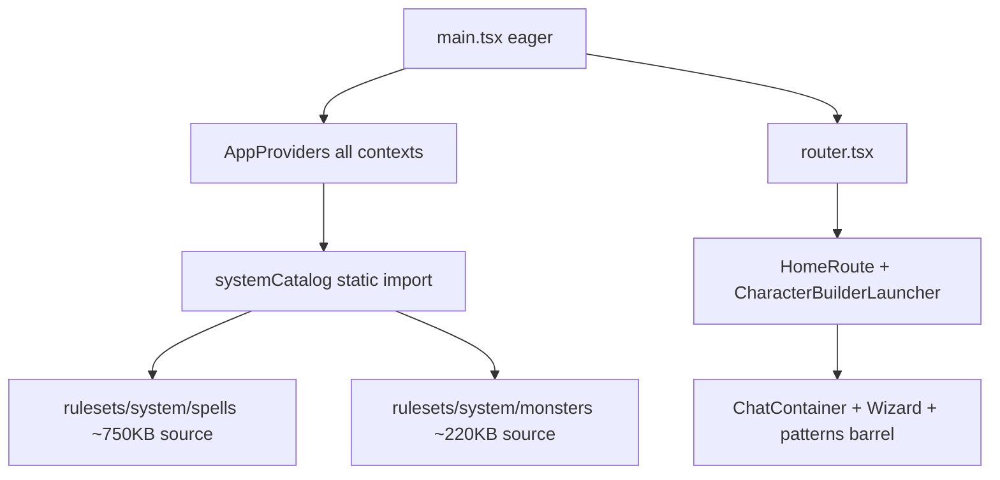
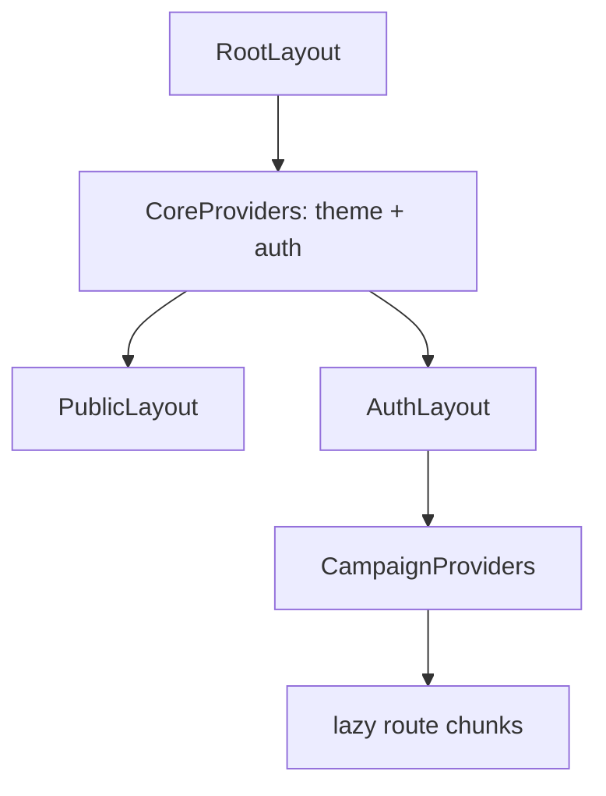

# Entry chunk reduction (post–route splitting)

## Context

**Prerequisite:** [App-level code splitting](app-level_code_splitting_eeb37e85.plan.md) — route `lazyRoute()`, public-only router imports, vendor `manualChunks` — **completed**.

**Current build shape:** see [`docs/reference/build-baseline.md`](../../docs/reference/build-baseline.md) (regenerate with `npm run build:baseline`).

| Asset | Raw | Gzip | Role |
|-------|-----|------|------|
| `index-*.js` | ~266 KB | ~68 KB | Entry |
| `system-catalog-*.js` (core) | ~74 KB | ~18 KB | Classes, races, equipment |
| `system-catalog-spells-*.js` | ~484 KB | ~106 KB | Deferred spell SRD |
| `system-catalog-monsters-*.js` | ~122 KB | ~26 KB | Deferred monster SRD |
| `vendor-mui-*.js` | ~535 KB | ~156 KB | MUI + Emotion (cacheable) |
| `vendor-mui-x-data-grid-*.js` | ~424 KB | ~126 KB | Data grid (cacheable) |
| `vendor-react-*.js` | ~396 KB | ~119 KB | React (cacheable) |

Vite still warns on chunks >500 KB — expected for vendor chunks; **the actionable target is `index-*.js`**, not silencing the warning via `chunkSizeWarningLimit`.



## Root causes (confirmed in repo)

1. **`CampaignRulesProvider`** ([`src/app/providers/CampaignRulesProvider.tsx`](src/app/providers/CampaignRulesProvider.tsx)) statically imports **`systemCatalog`** from [`packages/mechanics/src/rulesets/system/catalog.ts`](packages/mechanics/src/rulesets/system/catalog.ts), which evaluates `getSystemSpells()` + `getSystemMonsters()` at module load.
2. **`AppProviders`** ([`src/app/providers/AppProviders.tsx`](src/app/providers/AppProviders.tsx)) mounts **all** global contexts on every route, including `CharacterBuilderProvider` (~860 lines + mechanics) and campaign rules.
3. **Public [`HomeRoute`](src/app/routes/public/HomeRoute.tsx)** eagerly imports **`CharacterBuilderLauncher`** → [`ChatContainer`](src/features/chat/components/ChatContainer.tsx) → **`CharacterBuilderWizard`** + [`@/ui/patterns`](src/ui/patterns/index.ts).
4. **`main.tsx`** side-effect import of [`locationPlacedObjectRasterAssets.vite`](src/features/content/locations/domain/model/placedObjects/locationPlacedObjectRasterAssets.vite.ts) (`import.meta.glob` eager) — small today (13 PNGs) but wrong layer.
5. **Rollup shared hoisting:** many lazy world/content routes import the same `@/features/content/shared` / form / mechanics modules → may remain in entry until catalog/providers are fixed.

---

## Phase 0 — Baseline + analyzer (**done**)

**Shipped:**

- **`rollup-plugin-visualizer`** in [`vite.config.ts`](vite.config.ts) when `ANALYZE=true` → `dist/stats.html` (treemap) + `dist/stats-data.json` (raw-data).
- Scripts: `npm run build:analyze`, `npm run bundle:baseline`, `npm run build:baseline`.
- Baseline doc: [`docs/reference/build-baseline.md`](../../docs/reference/build-baseline.md) with entry/vendor sizes and top-15 entry modules.

Re-run `npm run build:baseline` after each phase. Do not use `chunkSizeWarningLimit` as a substitute for shrinking entry code.

---

## Phase 1 — Async `systemCatalog` (highest ROI)

**Target:** [`CampaignRulesProvider`](src/app/providers/CampaignRulesProvider.tsx) and any other **eager** imports of [`systemCatalog`](packages/mechanics/src/rulesets/system/catalog.ts) on the critical path.

**Approach A (recommended first):** Lazy-load the catalog module inside the provider.

```ts
// Sketch — not final API
const [baseCatalog, setBaseCatalog] = useState<CampaignCatalog | null>(null)
useEffect(() => {
  void import('@/features/mechanics/domain/rulesets/system/catalog').then((m) => {
    setBaseCatalog(m.systemCatalog)
  })
}, [])
// value.catalog = baseCatalog ? buildCampaignCatalog(baseCatalog, …) : EMPTY_CATALOG_STUB
```

**Requirements:**

- Expose **`loading`** (or stall children with existing layout fallback) until `baseCatalog` is ready **when `campaignId` is set** — evaluate whether public/login routes need catalog at all (likely not → combine with Phase 2).
- Keep **`buildCampaignCatalog(systemCatalog, overrides, ruleset)`** semantics identical; server mirror already exists: [`resolveCampaignCatalog.server.ts`](server/features/campaign/services/resolveCampaignCatalog.server.ts).
- **`useCampaignRules` / `useCampaignCatalog`:** document that hooks may throw or return loading state during bootstrap — audit call sites (character builder, spell lists, encounter runtime, content repos).

**Approach B (later / larger):** API-fetched catalog for client (`GET /api/campaigns/:id/catalog`) — aligns with server resolver; removes most SRD bytes from client bundle entirely. Defer unless Phase 1 gzip is insufficient.

### Phase 1b — Split catalog sub-chunks (**done**)

**Shipped:**

- [`catalogBase.ts`](packages/mechanics/src/rulesets/system/catalogBase.ts) — sync core (classes, races, equipment) without spells/monsters; `systemCatalogCore` for ruleset editor.
- [`catalog.ts`](packages/mechanics/src/rulesets/system/catalog.ts) — `loadSystemCatalog()` parallel `import('./spells')` + `import('./monsters')`.
- [`catalog.sync.ts`](packages/mechanics/src/rulesets/system/catalog.sync.ts) — full `systemCatalog` for server + vitest only.
- [`manualChunks.ts`](src/app/routing/manualChunks.ts) — `system-catalog-spells`, `system-catalog-monsters`, `system-catalog` (core).

**2026-05-20 build:** core **17.7 KB** gzip, spells **105.2 KB**, monsters **25.7 KB** (parallel fetch vs monolithic **146 KB** `system-catalog`).

---

## Phase 2 — Route-scoped providers (**done**)

**Shipped:**

- [`AppProviders`](src/app/providers/AppProviders.tsx): theme, auth, `ActiveCampaignProvider`, notifications only.
- [`CampaignProviders`](src/app/providers/CampaignProviders.tsx): socket + messaging + [`CharacterProviders`](src/app/providers/CharacterProviders.tsx) — mounted in [`CampaignLayoutRoute`](src/features/campaign/routes/CampaignLayoutRoute.tsx).
- [`CharacterProvidersLayout`](src/app/providers/CharacterProvidersLayout.tsx): rules + builder for `/characters/*`.
- Public `/`: [`CharacterProviders`](src/app/providers/CharacterProviders.tsx) wrap [`HomeRoute`](src/app/routes/public/HomeRoute.tsx) only (launcher still eager until Phase 3).

**Target:** Shrink the graph reachable from [`RootLayout`](src/app/router.tsx) → [`AppProviders`](src/app/providers/AppProviders.tsx).

**Keep global (minimal shell):**

- `ThemeProvider` + `CssBaseline` + [`AuthProvider`](src/app/providers/AuthProvider.tsx)
- Optionally `NotificationProvider` if needed on all auth pages

**Move under route layouts:**

| Provider | Mount under | Rationale |
|----------|-------------|-----------|
| `CampaignRulesProvider` | [`CampaignLayoutRoute`](src/features/campaign/routes/CampaignLayoutRoute.tsx) or `AuthLayout` campaign branch | Catalog only needed inside a campaign |
| `CharacterBuilderProvider` | Campaign + character routes (+ lazy home — Phase 3) | Not needed on login/register/dashboard-only |
| `SocketConnectionProvider` + `MessagingProvider` | Campaign layout (messages / live play) | Avoid socket on public `/` |

**Implementation notes:**

- Introduce **`CampaignProviders`** wrapper component used in router as `element` for `ROUTES.CAMPAIGN` subtree (nested inside existing `AuthLayout`).
- **`useCampaignRules` outside campaign:** audit — return clear error or no-op stub for routes that shouldn't call it.
- Preserve nested **Suspense** from Phase 6 of parent plan ([`RouteContentSuspenseFallback`](src/app/RouteContentSuspenseFallback.tsx)).



---

## Phase 3 — Lazy public home builder (**done**)

**Shipped:**

- [`HomeRoute`](src/app/routes/public/HomeRoute.tsx): load-on-click → dynamic `import('./PublicHomeCharacterBuilder')`.
- [`PublicHomeCharacterBuilder`](src/app/routes/public/PublicHomeCharacterBuilder.tsx): async chunk with `CharacterProviders` + launcher; `openOnMount` on [`CharacterBuilderLauncher`](src/features/characterBuilder/components/CharacterBuilderLauncher/CharacterBuilderLauncher.tsx).
- Router: `/` no longer wraps `CharacterProviders` globally.

**Target:** [`HomeRoute`](src/app/routes/public/HomeRoute.tsx) — remove static import of [`CharacterBuilderLauncher`](src/features/characterBuilder/components/CharacterBuilderLauncher/CharacterBuilderLauncher.tsx).

**How:**

- `const Launcher = lazy(() => import('…/CharacterBuilderLauncher'))` with small Suspense fallback, **or**
- Load launcher only `onClick` via dynamic `import()` before `openBuilder()`.
- Ensure **`CharacterBuilderProvider`** wraps the lazy subtree (Phase 2) — e.g. `PublicBuilderProviders` wrapper route segment for `/` only, not global.

**Also:** [`ChatContainer`](src/features/chat/components/ChatContainer.tsx) imports wizard + `@/ui/patterns` — keep it out of the initial `/` chunk.

---

## Phase 4 — Defer location raster registration (**done**)

**Shipped:** Side-effect import moved from [`main.tsx`](src/main.tsx) to [`WorldLayout`](src/features/campaign/routes/world/WorldLayout.tsx).

**Target:** Remove from [`main.tsx`](src/main.tsx):

```ts
import './features/content/locations/domain/model/placedObjects/locationPlacedObjectRasterAssets.vite'
```

**Import instead from:**

- [`WorldLayout`](src/features/campaign/routes/world/WorldLayout.tsx) and/or location edit/map routes (first surface that needs placed-object PNG URLs).

**Contract:** [`registerPlacedObjectRasterSourceFileToUrl`](src/features/content/locations/domain/model/placedObjects/locationPlacedObjectRasterAssets.core.ts) must run before map UI renders — add a one-line guard or await registration in location map entry.

---

## Phase 5 — Shared hoisting + import hygiene (**done**)

**Shipped:**

- Lazy [`AuthLayout`](src/app/layouts/auth/AuthLayout.tsx) + [`CharacterProvidersLayout`](src/app/providers/CharacterProvidersLayout.tsx); sync [`PublicLayout`](src/app/layouts/public/PublicLayout.tsx) only.
- [`campaignList.ts`](src/features/content/shared/components/campaignList.ts) — list routes no longer import editor scaffold via shared barrel.
- Direct `@/ui/patterns/...` imports in `ContentTypeListPage`, `EntryEditorLayout`, `EntryFormEditorLayout`, character-builder steps, `ChatContainer`, `SpellHorizontalCard`.
- Prefetch hooks for `authLayout` + `characterProviders` on `/characters` / `/dashboard` intent.

**After Phases 1–3**, re-run visualizer. If `index-*.js` still large:

1. List modules shared by **≥3** lazy chunks still in entry.
2. **Direct imports:** extend Phase 4 pattern from parent plan — no [`@/ui/patterns`](src/ui/patterns/index.ts) barrel in list/editor routes; same for heavy `@/features/content/shared` barrels if treemap flags them.
3. **Optional `manualChunks`:** `vendor-mechanics` or `chunk-mechanics-catalog` in [`manualChunks.ts`](src/app/routing/manualChunks.ts) for **cache** only; pair with dynamic import to reduce initial load.
4. **Editor vs list split:** ensure list routes don't static-import editor assemblies ([`buildMappers`](src/features/content/shared/forms), effect row assembly, etc.).

**Lower priority (optional):** lazy [`AuthLayout`](src/app/layouts/auth/AuthLayout.tsx) import in router — modest win for public paths once providers are scoped.

---

## Phase 6 — Verification (**done**)

**Shipped:**

- `npm run verify:bundle` — [`scripts/verify-entry-chunk-phase6.mjs`](../../scripts/verify-entry-chunk-phase6.mjs) (success criteria vs Phase 0 baseline).
- `npm run build:verify` — analyze + baseline + verify in one command.
- **2026-05-20:** entry **67.9 KB** gzip (−75.7% vs ~279 KB); `buildCampaignCatalog` vitest 2/2; no circular-chunk warning on build.

**Build:**

```bash
npm run build:verify
# or: npx vite build && npm run bundle:baseline
```

**Manual smoke:**

- `/` (home) — no catalog fetch unless builder opened
- Login / register — no campaign providers required
- Dashboard → open campaign → hub → world → equipment list
- New character + character builder modal from home (after Phase 3)
- Encounter simulator (catalog + mechanics still work)

**Automated (where cheap):**

- Existing vitest slices for mechanics/catalog if touching `buildCampaignCatalog`
- No Rollup **circular chunk** warnings reintroduced

**Regression guards:**

- Single React instance (no hook errors)
- `useCampaignRules` consumers inside campaign still resolve catalog after async load

---

## Success criteria

| Metric | Target |
|--------|--------|
| `index-*.js` gzip | **≥30% reduction** vs Phase 0 baseline (stretch: <200 KB) |
| Public `/` first load | No `systemCatalog` / full SRD in entry treemap |
| Campaign navigation | No functional regression; catalog available before content lists need it |
| Vendor chunks | May still warn >500 KB — acceptable if cacheable |
| Analyzer | `dist/stats.html` checked in CI or documented local step |

---

## Suggested PR order

1. **PR1:** Phase 0 + Phase 1 (async catalog) — isolated, measurable.
2. **PR2:** Phase 2 (provider scoping) — router/layout changes; test all auth flows.
3. **PR3:** Phase 3 + Phase 4 (home lazy + location assets) — small, public-path wins.
4. **PR4:** Phase 5 only if treemap still shows entry bloat.

---

## References

- Parent: [app-level_code_splitting_eeb37e85.plan.md](app-level_code_splitting_eeb37e85.plan.md)
- [`src/app/providers/CampaignRulesProvider.tsx`](src/app/providers/CampaignRulesProvider.tsx)
- [`packages/mechanics/src/rulesets/system/catalog.ts`](packages/mechanics/src/rulesets/system/catalog.ts)
- [`src/app/providers/AppProviders.tsx`](src/app/providers/AppProviders.tsx)
- [`src/main.tsx`](src/main.tsx)
- [`src/app/routing/manualChunks.ts`](src/app/routing/manualChunks.ts)
- Server catalog resolver: [`server/features/campaign/services/resolveCampaignCatalog.server.ts`](server/features/campaign/services/resolveCampaignCatalog.server.ts)
