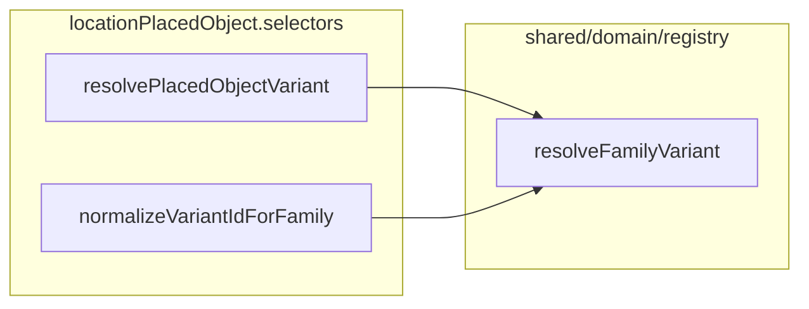

# Family / variant resolution refactor

This plan has two tracks: **§ Domain variant resolution** (below through Implementation order step 5) and **§ Map editor tray UI** (shared primitives + paint/place shells). They can be executed in sequence (recommended: complete variant-resolution tests before large tray churn) or tray work can start after `LocationMapEditorPlaceTray` extraction is scoped.

## Summary

Centralize the **“valid requested id → use it; else `defaultVariantId`”** rule in [`shared/domain/registry/familyVariantResolve.ts`](shared/domain/registry/familyVariantResolve.ts) as `resolveFamilyVariant`, with types `FamilyWithVariants<TVariant>` and `ResolvedFamilyVariant<TVariant>`. Refactor [`locationPlacedObject.selectors.ts`](src/features/content/locations/domain/model/placedObjects/locationPlacedObject.selectors.ts) so `normalizeVariantIdForFamily` is a thin delegate to `resolveFamilyVariant(...).resolvedVariantId`, and add `resolvePlacedObjectVariant(kind, requestedVariantId)` that reads `AUTHORED_PLACED_OBJECT_DEFINITIONS[kind]`, calls `resolveFamilyVariant`, and returns `{ resolvedVariantId, variant: AuthoredPlacedObjectVariantDefinition }`. Replace the normalize-then-multiple-lookup pattern in edge hydration with a single `resolvePlacedObjectVariant` call. Add unit tests for the generic helper and placed-object wrappers; preserve all existing read/hydration fallback behavior (no throws on invalid ids). **Registry invariant:** `defaultVariantId` ∈ `variants` keys—no second fallback in `resolveFamilyVariant`. **Getter docs** + **selector consolidation** per sections below. **Behavior pin:** whitespace-prefixed invalid ids (e.g. `' rect_wood'`). Update [`docs/reference/location-workspace.md`](docs/reference/location-workspace.md) so workspace contributors see where variant resolution lives and when to use which helper (see **Documentation** below). Document future cell-fill alignment via names, a short comment, and **illustrative** family/variant shapes (plains, forest, mountains, desert, water, plus floor wood/stone expectations)—**no** `AUTHORED_CELL_FILL_DEFINITIONS` or `resolveCellFillVariant` implementation unless a family registry already exists (it does not today). **Separately (tray track):** extract **`LocationMapEditorTray*`** presentational primitives from the place tray, then align the paint tray to the same section/row/variant pattern with thin shells—see **Map editor tray UI** below.



---

## Map editor tray UI (shared primitives + paint parity)

### Summary

Refactor [`LocationMapEditorPlaceTray.tsx`](src/features/content/locations/components/workspace/leftTools/place/LocationMapEditorPlaceTray.tsx) to extract **presentational** building blocks, then refactor [`LocationMapEditorPaintTray.tsx`](src/features/content/locations/components/workspace/leftTools/paint/LocationMapEditorPaintTray.tsx) so paint **feels structurally parallel** to place: **category heading → family option row → optional scoped variant affordance** (popover/menu). **Do not** merge place and paint into one large domain abstraction; shells own palette derivation, grouping, selection models, handlers, and **leading visuals** (glyph vs swatch). Shared code owns repeated **layout**, **selected chrome**, **section headings**, **option row shell**, **variant trigger + popover chrome**.

[`LocationMapEditorToolTrayShell.tsx`](src/features/content/locations/components/workspace/leftTools/LocationMapEditorToolTrayShell.tsx) stays the outer fixed-width column; new primitives live under e.g. `leftTools/tray/` (or `leftTools/shared/`) and are **not** placed-object-specific in naming.

### Architecture

| Layer | Owns |
|-------|------|
| **`LocationMapEditorTray*`** primitives | Scroll column `sx`, section heading typography, option row wrapper (tooltip, selected border, optional tile size prop), optional `Badge` + variant trigger + `Popover` shell with list/list-item slots or children |
| **Place shell** | `getPlacePaletteItemsForScale`, `getPlacedObjectPaletteCategoryLabel`, `getPlacedObjectVariantPickerRowsForFamily`, `LocationMapActivePlaceSelection`, `onSelectPlace`, icon resolution, `map-object` + `variantCount > 1` rules |
| **Paint shell** | `getPaintPaletteItemsForScale` and/or **adapter** grouping by [`LOCATION_CELL_FILL_KIND_META`](shared/domain/locations/map/locationMapCellFill.constants.ts) facets (`category`, `family`), `LocationMapPaintState`, `onPaintChange`, **Surface / Region** toggle + region hint, `getMapSwatchColor` for swatch leadings |

**Preferred shape:** smaller composable primitives (scroll column, section heading, option row, variant affordance, variant popover), not one mega-tray. Optional **presentational view-model** types colocated with primitives (UI-only; not shared with domain DTOs).

### Suggested component names (generic; no “placed object” in primitive names)

- `LocationMapEditorTrayScrollColumn`
- `LocationMapEditorTraySectionHeading`
- `LocationMapEditorTrayOptionRow` (or split inner **tile** vs row wrapper if needed)
- `LocationMapEditorTrayVariantAffordance` / `LocationMapEditorTrayVariantTrigger` (badge + button that opens popover)
- `LocationMapEditorTrayVariantPopover` (popover + paper; body via children or default list)

Use **`Tray`** prefix to align with [`LocationMapEditorToolTrayShell`](src/features/content/locations/components/workspace/leftTools/LocationMapEditorToolTrayShell.tsx) and existing `*PlaceTray` / `*PaintTray`. Keep **Palette** for domain types (`MapPaintPaletteItem`, helpers).

### Presentational view-model (shells map domain → props)

Rough direction (exact names in implementation):

```ts
type TrayVariantOption = { id: string; label: string; description?: string; leading?: React.ReactNode };

type TrayOptionRowModel = {
  id: string;
  label: string;
  description?: string;
  isSelected: boolean;
  onSelect: () => void;
  tooltipTitle?: React.ReactNode;
  leading?: React.ReactNode;
  variants?: TrayVariantOption[];
  selectedVariantId?: string;
  onVariantSelect?: (variantId: string) => void;
  showVariantBadge?: boolean;
  variantCount?: number;
  renderVariantMenuContent?: () => React.ReactNode;
};

type TraySectionModel = { id: string; label: string; options: TrayOptionRowModel[] };
```

Primitives consume **`leading`** for icon vs swatch; variant menu can use **default list** from `variants` + optional per-row `leading`, or **`renderVariantMenuContent`** for edge cases. **Tile size:** place uses ~40px icons, paint ~28px swatches—expose via prop or `sx`, do not hardcode one size in primitives.

### Data dependency (paint grouping)

[`getPaintPaletteItemsForScale`](src/features/content/locations/domain/authoring/editor/palette/locationMapEditorPalette.helpers.ts) is currently a **flat** list with a **TODO** to group by facets. **True** parity (e.g. Terrains → Forest → forest variants) requires either:

1. **Evolve** the helper + `MapPaintPaletteItem` (and paint state if needed) toward **family rows** + variant metadata, aligned with the cell-fill family/variant roadmap; or  
2. **Interim adapter** in the paint shell that groups flat items by `meta.family` / `meta.category` for section headings and rows; variant picker appears only when a family has **multiple concrete kinds** (or later when variants are first-class).

Pick (1) or (2) in implementation; document in PR. Do not block tray primitives on full `AUTHORED_CELL_FILL_DEFINITIONS` migration.

### Files to add (tray track)

| File | Purpose |
|------|---------|
| `leftTools/tray/locationMapEditorTray.types.ts` (or similar) | Presentational `TraySectionModel` / `TrayOptionRowModel` / `TrayVariantOption` |
| `leftTools/tray/LocationMapEditorTrayScrollColumn.tsx` | Shared scroll column layout |
| `leftTools/tray/LocationMapEditorTraySectionHeading.tsx` | Category label |
| `leftTools/tray/LocationMapEditorTrayOptionRow.tsx` | Composes leading, primary tile, optional variant affordance |
| `leftTools/tray/LocationMapEditorTrayVariantPopover.tsx` (+ trigger helpers as needed) | Popover + menu body slot |
| `leftTools/tray/index.ts` | Barrel exports |

Paths under [`components/workspace/leftTools/`](src/features/content/locations/components/workspace/leftTools/) — adjust if project conventions prefer another subfolder.

### Files to change (tray track)

| File | Change |
|------|--------|
| [`LocationMapEditorPlaceTray.tsx`](src/features/content/locations/components/workspace/leftTools/place/LocationMapEditorPlaceTray.tsx) | Reimplement using tray primitives; **behavior and visuals** match pre-refactor (regression check: categories, default click, multi-variant popover, linked vs map-object). |
| [`LocationMapEditorPaintTray.tsx`](src/features/content/locations/components/workspace/leftTools/paint/LocationMapEditorPaintTray.tsx) | Surface/Region block **above** scroll column; surface mode renders sectioned rows + swatch leadings; variant UI when multiple variants per family row (per data available). |
| [`locationMapEditorPalette.helpers.ts`](src/features/content/locations/domain/authoring/editor/palette/locationMapEditorPalette.helpers.ts) | **If** grouping is done in domain: extend `getPaintPaletteItemsForScale` / types; else adapter module colocated with paint shell. |
| [`locationMapEditor.types.ts`](src/features/content/locations/domain/authoring/editor/types/locationMapEditor.types.ts) | **If** paint palette DTOs gain family/variant fields—extend here; keep separate from tray presentational types. |
| [`docs/reference/location-workspace.md`](docs/reference/location-workspace.md) | **Optional:** Map editor toolbar / paint tray bullet: structural parity with place tray + pointer to `leftTools/tray/` primitives. |

### Relationship to domain variant resolution

- Placed-object **`resolvePlacedObjectVariant`** / **`normalizeVariantIdForFamily`** are orthogonal to tray UI; trays consume **palette helpers** and editor state only.
- Future **cell-fill** family registry + **`resolveCellFillVariant`** (see plan below) will make paint **variant** resolution consistent with domain; tray primitives stay unchanged.

### Tray track — non-goals

- No unified `LocationMapEditorDomainTray` prop type covering place + paint selection unions.
- No change to [`LocationMapEditorDrawTray`](src/features/content/locations/components/workspace/leftTools/draw/LocationMapEditorDrawTray.tsx) unless opportunistically reusing **scroll column** only.
- No persistence / wire format change for map fills unless explicitly part of a separate palette-state task.

### Tray track — verification

- Manual: place mode — categories, primary selection, variant popover, tooltips.
- Manual: paint mode — Surface vs Region, sectioned surface list (once data exists), swatch selection, variant popover when applicable.
- Existing palette tests: extend or add [`locationMapEditorPalette.helpers.test.ts`](src/features/content/locations/domain/authoring/editor/__tests__/palette/locationMapEditorPalette.helpers.test.ts) if helper output shape changes.

---

## Registry invariant

- **Required:** For every `FamilyWithVariants`, `family.defaultVariantId` must be a **key** of `family.variants`. Authored registries (`AUTHORED_PLACED_OBJECT_DEFINITIONS`, future `AUTHORED_CELL_FILL_DEFINITIONS`) must satisfy this; existing selector tests already assert it per placed-object family.
- **`resolveFamilyVariant` may assume this invariant** in this pass: after choosing `resolvedVariantId`, return `family.variants[resolvedVariantId]` without a second defensive fallback (e.g. do not scan keys if default is missing).
- **Do not** add alternate recovery paths for malformed registry rows—fix data at the registry instead.
- **Tests:** Keep / extend coverage so the invariant stays visible: (1) placed-object registry test that every family’s `defaultVariantId` is in `variants` (already present); (2) `resolveFamilyVariant` tests on a **minimal fixture** where `defaultVariantId` is a valid key (document in test comment that violating the invariant is out of scope for runtime handling).

## Getter safety

- **`getPlacedObjectVariantPresentation`** and **`getPlacedObjectVariantLabel`** may remain as raw lookups for **low churn**.
- **Document** in [`locationPlacedObject.selectors.ts`](src/features/content/locations/domain/model/placedObjects/locationPlacedObject.selectors.ts) (JSDoc on each export) that callers must pass a **normalized / registry-valid** variant id for that family; they do **not** apply the default-variant fallback rule.
- **Prefer** [`resolvePlacedObjectVariant`](src/features/content/locations/domain/model/placedObjects/locationPlacedObject.selectors.ts) at call sites when the id may be **missing, invalid, or from persisted wire** data, then read `variant.presentation`, `variant.label`, etc.

## Selector consolidation

- **`normalizeVariantIdForFamily`** must delegate to **`resolveFamilyVariant`** (single implementation of the fallback rule).
- **Review** private `variantDefinitionForFamily` and public `isVariantIdValidForFamily`:
  - They implement **lookup / membership**, not fallback. **Do not** implement a second fallback in either; optional refactor is only to share **direct** `variants[requestedId]` / `requestedId in variants` style access with `resolvePlacedObjectVariant` internals if it reduces duplication.
  - `isVariantIdValidForFamily` must remain “requested id is a **key** in `variants`” (boolean). It does **not** call `resolveFamilyVariant` (that would conflate “valid key?” with “resolved id”).
- **Goal:** one canonical fallback rule inside `resolveFamilyVariant`; selectors only add family lookup by `LocationPlacedObjectKindId`.

## Behavior compatibility

- Preserve current behavior for **invalid** variant strings **exactly** (e.g. unknown keys fall back to `defaultVariantId`).
- **Do not** introduce **trimming**, case coercion, or other normalization of variant id strings unless identical behavior already exists today.
- **Pin** current behavior with a test: for a family like `table`, `normalizeVariantIdForFamily('table', ' rect_wood')` (leading space) behaves as today—**invalid** key → fallback to default (not the `rect_wood` variant). This guards against accidental `.trim()` in a future edit.

## Files to add

| File | Purpose |
|------|---------|
| [`shared/domain/registry/familyVariantResolve.ts`](shared/domain/registry/familyVariantResolve.ts) | Export `FamilyWithVariants`, `ResolvedFamilyVariant`, `resolveFamilyVariant` with the exact signatures specified. Module doc: structural-only; no wire/legacy policy; **registry invariant:** `defaultVariantId` must be a key of `variants`—callers may rely on it; no defensive second fallback. **future:** cell fills reuse via `AUTHORED_CELL_FILL_DEFINITIONS` + `resolveCellFillVariant` once family-based registry exists. |
| [`shared/domain/registry/familyVariantResolve.test.ts`](shared/domain/registry/familyVariantResolve.test.ts) | Vitest: valid id → that variant; invalid id → default variant; `null`/`undefined` → default variant. Use a minimal inline `FamilyWithVariants` fixture where default is a valid key (invariant documented in test). Optionally assert `resolvedVariant.variant === family.variants[resolvedVariantId]` after resolution. |

## Files to change

| File | Change |
|------|--------|
| [`locationPlacedObject.selectors.ts`](src/features/content/locations/domain/model/placedObjects/locationPlacedObject.selectors.ts) | Import `resolveFamilyVariant`. `normalizeVariantIdForFamily` → delegate to `resolveFamilyVariant(family, variantId).resolvedVariantId`. Add `resolvePlacedObjectVariant` per spec. Consolidate `variantDefinitionForFamily` / `isVariantIdValidForFamily` per **Selector consolidation** section (no duplicate fallback rule). JSDoc on `getPlacedObjectVariantPresentation` / `getPlacedObjectVariantLabel`: **normalize/valid id only**; prefer `resolvePlacedObjectVariant` when input may be invalid or from wire. Optionally implement `getPlacedObjectIconName` via `resolvePlacedObjectVariant` (behavior must match existing tests). |
| [`locationMapEdgeAuthoring.resolve.ts`](src/features/content/locations/domain/authoring/map/locationMapEdgeAuthoring.resolve.ts) | In the `door`/`window` branch: replace normalize + `getPlacedObjectVariantPresentation` + `getPlacedObjectVariantLabel` with `resolvePlacedObjectVariant(placedKind, entry.variantId)`; map `resolvedVariantId`, `variant.presentation`, `variant.label`. Trim imports. |
| [`locationPlacedObject.types.ts`](src/features/content/locations/domain/model/placedObjects/locationPlacedObject.types.ts) | Re-export `resolvePlacedObjectVariant` alongside existing selector exports (match existing barrel pattern). |
| [`locationPlacedObject.selectors.test.ts`](src/features/content/locations/domain/model/placedObjects/__tests__/locationPlacedObject.selectors.test.ts) | Existing `normalizeVariantIdForFamily` cases; add `resolvePlacedObjectVariant` coverage; **pin** whitespace-prefixed invalid id (`' rect_wood'` for `table`) to current normalize behavior; add cases as needed for consolidation. |
| [`docs/reference/location-workspace.md`](docs/reference/location-workspace.md) | **In scope.** Extend the **Object authoring UX modernization (roadmap)** subsection (after the Phase 2 sentence on `defaultVariantId` / `variants`): add a short **Variant resolution** note—`shared/domain/registry/familyVariantResolve.ts` (`resolveFamilyVariant`, `FamilyWithVariants`); placed-object wrappers `resolvePlacedObjectVariant` and `normalizeVariantIdForFamily` in `locationPlacedObject.selectors.ts`; **registry invariant** that `defaultVariantId` is always a key of `variants`; use **`resolvePlacedObjectVariant`** when the variant id may be missing, invalid, or from persisted wire; raw **`getPlacedObjectVariantPresentation` / `getPlacedObjectVariantLabel`** expect a **normalized** id; edge-authored identity hydration flows through **`resolveAuthoredEdgeInstance`** (uses `resolvePlacedObjectVariant`). Optionally add one bullet under **Pointers for the next agent** if a single line fits. Keep tight; point to code modules rather than duplicating this plan’s cell-fill illustrations (those stay in the plan until migration). |

## Optional one-line doc touch

| File | Change |
|------|--------|
| [`locationMapEditor.types.ts`](src/features/content/locations/domain/authoring/editor/types/locationMapEditor.types.ts) | Optionally extend the `variantId` comment: `normalizeVariantIdForFamily` for id-only; `resolvePlacedObjectVariant` when full variant row is needed. |

## Call sites intentionally left unchanged (or minimal)

- **[`resolvePlacedKindToAction.ts`](src/features/content/locations/domain/authoring/editor/placement/resolvePlacedKindToAction.ts)** — uses **`normalizeVariantIdForFamily` only** (needs resolved id string for `buildPersistedPlacedObjectPayload`). **Intentionally** not switching to `resolvePlacedObjectVariant` unless desired for symmetry; behavior unchanged via delegate to `resolveFamilyVariant`.
- **[`resolvePlacedObjectCellVisual.ts`](src/features/content/locations/domain/presentation/map/resolvePlacedObjectCellVisual.ts)** — uses **`getPlacedObjectIconName`** only; that helper normalizes internally before icon lookup. **Unchanged**; not “normalize + raw getters.”
- **Palette / place UI** (`LocationMapEditorPlaceTray`, `locationMapEditorPalette.helpers`, etc.) — use `defaultVariantId` from palette rows or explicit `variantId`; no wire ambiguity. **Tray track** refactors `LocationMapEditorPlaceTray` onto shared primitives without changing that contract.

### Intentionally unchanged: resolve id + raw getters (acceptable)

After this pass, **no** remaining production path should chain **`normalizeVariantIdForFamily` + `getPlacedObjectVariantPresentation` / `getPlacedObjectVariantLabel`** (edge hydration moves to `resolvePlacedObjectVariant`). If grep finds such a pattern later, prefer refactoring to `resolvePlacedObjectVariant` for clarity and safety.

- **`getDefaultVariantPresentationForKind`**, **`getPlacedObjectVariantPickerRowsForFamily`**, **`defaultVariantEntryOf`** — no mega-refactor; only touch if a tiny internal use of `resolveFamilyVariant` or `resolvePlacedObjectVariant` removes duplication without behavior change.

## Cell-fill future (documentation only)

- **Do not** add `AUTHORED_CELL_FILL_DEFINITIONS`, `AuthoredCellFillFamilyDefinition`, `AuthoredCellFillVariantDefinition`, or `resolveCellFillVariant` in this pass—flat [`LOCATION_CELL_FILL_KIND_META`](shared/domain/locations/map/locationMapCellFill.constants.ts) remains authoritative.
- **Align naming** in the shared helper file comment (and this plan) so a later migration implements: registry `AUTHORED_CELL_FILL_DEFINITIONS`, families satisfying `FamilyWithVariants<AuthoredCellFillVariantDefinition>` (plus extra fields such as `category`, `allowedScales` as needed), wrapper `resolveCellFillVariant(familyId: LocationCellFillFamilyId, requestedVariantId)` returning `{ resolvedVariantId, variant }`.

### Illustrative family records (not implemented in this refactor)

The snippets below are **design targets** for a future `AUTHORED_CELL_FILL_DEFINITIONS`: each **family** has `defaultVariantId`, `variants`, and shared authoring fields; each **variant** carries `label`, `description`, `swatchColorKey`, and optional `presentation` facets. `resolveCellFillVariant` would delegate to `resolveFamilyVariant` on the family slice. **Surface / floor** families should expose **wood** and **stone** (and any other material axes) as distinct variants—see **Floors (material variations)** after the terrain examples.

**`plains`**

```ts
plains: {
  category: 'terrain',
  allowedScales: ['world'],
  defaultVariantId: 'temperate_open',
  variants: {
    temperate_open: {
      label: 'Plains',
      description: 'Open grassland or steppe.',
      swatchColorKey: 'cellFillPlains',
      presentation: {
        biome: 'temperate',
        vegetation: 'grassland',
        density: 'open',
      },
    },
    prairie: {
      label: 'Prairie',
      description: 'Wide fertile grassland with taller grasses.',
      swatchColorKey: 'cellFillPlainsPrairie',
      presentation: {
        biome: 'temperate',
        vegetation: 'grassland',
        fertility: 'fertile',
      },
    },
    steppe: {
      label: 'Steppe',
      description: 'Dry open plain with sparse grasses.',
      swatchColorKey: 'cellFillPlainsSteppe',
      presentation: {
        biome: 'semi_arid',
        vegetation: 'grassland',
        density: 'sparse',
      },
    },
    scrubland: {
      label: 'Scrubland',
      description: 'Open plain with low brush and hardy shrubs.',
      swatchColorKey: 'cellFillPlainsScrub',
      presentation: {
        biome: 'semi_arid',
        vegetation: 'scrub',
      },
    },
  },
},
```

**`forest`**

```ts
forest: {
  category: 'terrain',
  allowedScales: ['world'],
  defaultVariantId: 'temperate_open',
  variants: {
    temperate_open: {
      label: 'Light forest',
      description: 'Sparse or young woodland.',
      swatchColorKey: 'cellFillForestLight',
      presentation: {
        biome: 'temperate',
        density: 'open',
      },
    },
    temperate_dense: {
      label: 'Dense forest',
      description: 'Thick canopy or old growth.',
      swatchColorKey: 'cellFillForestHeavy',
      presentation: {
        biome: 'temperate',
        density: 'dense',
      },
    },
    boreal: {
      label: 'Boreal forest',
      description: 'Cold evergreen woodland.',
      swatchColorKey: 'cellFillForestBoreal',
      presentation: {
        biome: 'boreal',
        density: 'moderate',
      },
    },
    tropical: {
      label: 'Tropical forest',
      description: 'Lush warm forest with dense growth.',
      swatchColorKey: 'cellFillForestTropical',
      presentation: {
        biome: 'tropical',
        density: 'dense',
      },
    },
    deadwood: {
      label: 'Dead forest',
      description: 'Blighted or burned woodland.',
      swatchColorKey: 'cellFillForestDeadwood',
      presentation: {
        biome: 'blighted',
        density: 'sparse',
      },
    },
  },
},
```

**`mountains`**

```ts
mountains: {
  category: 'terrain',
  allowedScales: ['world'],
  defaultVariantId: 'rocky',
  variants: {
    rocky: {
      label: 'Mountains',
      description: 'High, rugged terrain.',
      swatchColorKey: 'cellFillMountains',
      presentation: {
        surface: 'rocky',
        elevation: 'high',
      },
    },
    alpine: {
      label: 'Alpine mountains',
      description: 'High peaks with snow or exposed stone.',
      swatchColorKey: 'cellFillMountainsAlpine',
      presentation: {
        surface: 'rocky',
        elevation: 'high',
        climate: 'cold',
      },
    },
    forested: {
      label: 'Forested mountains',
      description: 'Mountain slopes with heavy tree cover.',
      swatchColorKey: 'cellFillMountainsForested',
      presentation: {
        surface: 'rocky',
        vegetation: 'forest',
      },
    },
    volcanic: {
      label: 'Volcanic mountains',
      description: 'Jagged dark peaks shaped by fire.',
      swatchColorKey: 'cellFillMountainsVolcanic',
      presentation: {
        surface: 'volcanic',
      },
    },
    hills: {
      label: 'High hills',
      description: 'Rolling elevated terrain below full mountains.',
      swatchColorKey: 'cellFillHills',
      presentation: {
        surface: 'rocky',
        elevation: 'moderate',
      },
    },
  },
},
```

**`desert`**

```ts
desert: {
  category: 'terrain',
  allowedScales: ['world'],
  defaultVariantId: 'sand',
  variants: {
    sand: {
      label: 'Sandy desert',
      description: 'Arid dunes and exposed sand.',
      swatchColorKey: 'cellFillDesert',
      presentation: {
        biome: 'arid',
        surface: 'sand',
      },
    },
    rocky: {
      label: 'Rock desert',
      description: 'Dry terrain of stone, gravel, and sparse dust.',
      swatchColorKey: 'cellFillDesertRocky',
      presentation: {
        biome: 'arid',
        surface: 'rock',
      },
    },
    badlands: {
      label: 'Badlands',
      description: 'Dry eroded terrain with ridges and gullies.',
      swatchColorKey: 'cellFillDesertBadlands',
      presentation: {
        biome: 'arid',
        surface: 'eroded',
      },
    },
    salt_flat: {
      label: 'Salt flats',
      description: 'Dry flat mineral basin with little vegetation.',
      swatchColorKey: 'cellFillDesertSaltFlat',
      presentation: {
        biome: 'arid',
        surface: 'salt',
      },
    },
    scrub_desert: {
      label: 'Scrub desert',
      description: 'Dry land with sparse brush and hardy plants.',
      swatchColorKey: 'cellFillDesertScrub',
      presentation: {
        biome: 'semi_arid',
        surface: 'scrub',
      },
    },
  },
},
```

**`water`** — **`defaultVariantId: 'deep'`** is intentional: deep water is the default palette / primary-click variant; shallow is opt-in.

```ts
water: {
  category: 'terrain',
  allowedScales: ['world'],
  defaultVariantId: 'deep',
  variants: {
    shallow: {
      label: 'Shallow water',
      description: 'Fordable or near-shore water.',
      swatchColorKey: 'cellFillWaterShallow',
      presentation: {
        depth: 'shallow',
      },
    },
    deep: {
      label: 'Deep water',
      description: 'Dark deeper water unsuitable for wading.',
      swatchColorKey: 'cellFillWaterDeep',
      presentation: {
        depth: 'deep',
      },
    },
  },
},
```

**Floors (material variations)**

- Future **`floor`** (or `surface` / interior floor) families should include at least **wood** and **stone** material variants (aligned with [`LOCATION_CELL_FILL_MATERIAL_IDS`](shared/domain/locations/map/locationMapCellFill.facets.ts) and existing `stone_floor` concrete id). Exact variant ids and `swatchColorKey` names are left to the migration PR; the pattern is the same: `FamilyWithVariants` + `resolveCellFillVariant` for read-time resolution and palette defaults.

## Follow-up (later cell-fill migration)

1. Introduce `AUTHORED_CELL_FILL_DEFINITIONS` keyed by family id, each record matching `FamilyWithVariants` plus any extra facet metadata (`category`, `allowedScales`, etc.), using illustrative shapes above as a north star.
2. Map persisted **concrete** fill ids (`forest_light`) to family + variant for read paths, or evolve persistence—out of scope here.
3. Implement `resolveCellFillVariant` as a thin delegate to `resolveFamilyVariant` (same pattern as `resolvePlacedObjectVariant`).
4. Consolidate paint/combat callers that today index `LOCATION_CELL_FILL_KIND_META` directly once the data model is decided.
5. Add floor surface variants (wood, stone, and any additional materials) under the floor family when migrating off flat ids.

## Cleanup (post-refactor)

Dedicated pass **after** variant-resolution and tray work are merged and tests pass. **Goal:** remove legacy and transitional code the refactor introduced, without changing behavior.

| Area | Actions |
|------|---------|
| **Selectors** | Remove `variantDefinitionForFamily` / private helpers only if fully inlined into `resolveFamilyVariant` delegation with no second code path; grep for duplicate “valid key else default” logic. |
| **Edge / placement** | Confirm no leftover imports of removed getters; no dead branches. |
| **Paint palette** | If a **shell-only adapter** was used for grouping, delete it once [`getPaintPaletteItemsForScale`](src/features/content/locations/domain/authoring/editor/palette/locationMapEditorPalette.helpers.ts) (or successor) is the single source of truth for sectioned rows. |
| **Tray** | Remove duplicate scroll/heading/tile markup from [`LocationMapEditorPlaceTray`](src/features/content/locations/components/workspace/leftTools/place/LocationMapEditorPlaceTray.tsx) / [`LocationMapEditorPaintTray`](src/features/content/locations/components/workspace/leftTools/paint/LocationMapEditorPaintTray.tsx) after primitives own it; drop unused tray props/types. |
| **Barrels** | Trim speculative exports; align with **narrow imports** rule. |
| **Docs** | Remove outdated references to pre-refactor patterns if any were left in comments. |

**Guardrail:** do not delete code paths still required for backward compatibility at persistence boundaries unless a separate migration explicitly removes them.

## Verification

- **Unit:** `vitest` for `shared/domain/registry/familyVariantResolve.test.ts` and `locationPlacedObject.selectors.test.ts` (including whitespace-prefixed id pin and `resolvePlacedObjectVariant` cases).
- **Integration / smoke:** Run at least one existing test file that touches **edge hydration** or **placement resolution**, e.g. [`locationMapEdgeAuthoring.resolve.test.ts`](src/features/content/locations/domain/authoring/map/__tests__/locationMapEdgeAuthoring.resolve.test.ts) (directly covers `resolveAuthoredEdgeInstance`) and/or [`placementRegistryResolver.test.ts`](src/features/content/locations/domain/authoring/editor/__tests__/placement/placementRegistryResolver.test.ts) (`normalizeVariantIdForFamily` via `resolvePlacedKindToAction`). Goal: confirm no regressions after selector refactor.
- **Manual:** Optional grep for `normalizeVariantIdForFamily` + `getPlacedObjectVariantPresentation` / `getPlacedObjectVariantLabel` in the same function—should be **none** in production code after edge hydration update (see **Intentionally unchanged** above).
- **Docs:** [`location-workspace.md`](docs/reference/location-workspace.md) reads correctly and links/paths match implemented modules after the refactor.
- **Tray (when implemented):** manual spot-check place + paint trays per **Tray track — verification**; palette unit tests if helpers change.
- **Cleanup (Phase C):** full suite green after dead-code removal; confirm no duplicate adapter + helper paths for paint grouping.

## Implementation order (build)

1. Add [`familyVariantResolve.ts`](shared/domain/registry/familyVariantResolve.ts) + [`familyVariantResolve.test.ts`](shared/domain/registry/familyVariantResolve.test.ts).
2. Refactor [`locationPlacedObject.selectors.ts`](src/features/content/locations/domain/model/placedObjects/locationPlacedObject.selectors.ts) + extend [`locationPlacedObject.selectors.test.ts`](src/features/content/locations/domain/model/placedObjects/__tests__/locationPlacedObject.selectors.test.ts) (whitespace pin, `resolvePlacedObjectVariant`).
3. Update [`locationMapEdgeAuthoring.resolve.ts`](src/features/content/locations/domain/authoring/map/locationMapEdgeAuthoring.resolve.ts); re-export from [`locationPlacedObject.types.ts`](src/features/content/locations/domain/model/placedObjects/locationPlacedObject.types.ts).
4. Run unit + integration/smoke tests (edge + placement).
5. Update [`docs/reference/location-workspace.md`](docs/reference/location-workspace.md) per the **Files to change** row (variant resolution note + optional pointer).

### Phase B — Map editor tray (after or in parallel once track A is stable)

6. Add **`LocationMapEditorTray*`** primitives + [`locationMapEditorTray.types.ts`](src/features/content/locations/components/workspace/leftTools/tray/locationMapEditorTray.types.ts) (or paths in **Files to add** above).
7. Refactor **`LocationMapEditorPlaceTray`** onto primitives; verify no behavior regression.
8. Implement **paint palette grouping** (helper extension and/or shell adapter) per **Data dependency** in the tray section.
9. Refactor **`LocationMapEditorPaintTray`** onto primitives + sectioned rows; keep Surface/Region and paint-only copy in the shell.
10. Optional: **`location-workspace.md`** tray note; extend palette tests if DTOs change.

### Phase C — Cleanup (after tracks A and B are merged and green)

11. **Dead code and superseded paths:** Remove private helpers in [`locationPlacedObject.selectors.ts`](src/features/content/locations/domain/model/placedObjects/locationPlacedObject.selectors.ts) that are fully replaced by `resolveFamilyVariant` / `resolvePlacedObjectVariant` (only where no remaining callers); remove any duplicate fallback logic verified by grep. Remove **temporary paint grouping adapters** in the paint shell only if domain [`getPaintPaletteItemsForScale`](src/features/content/locations/domain/authoring/editor/palette/locationMapEditorPalette.helpers.ts) now emits the same shape—**do not** delete adapters until the helper owns grouping.

12. **Tray UI:** Remove inlined layout from place/paint trays that is fully subsumed by `LocationMapEditorTray*` components; avoid duplicate `sx` between shell and primitives.

13. **Exports / barrels:** Drop unused re-exports from [`locationPlacedObject.types.ts`](src/features/content/locations/domain/model/placedObjects/locationPlacedObject.types.ts) and tray `index.ts` if any were added speculatively; prefer narrow imports per project rules.

14. **Verification:** Full test suite + targeted greps (e.g. `normalizeVariantIdForFamily` chained with raw getters in one function, deprecated palette helpers). **No intended behavior change**—cleanup only.

See **Cleanup (post-refactor)** for the checklist narrative.
