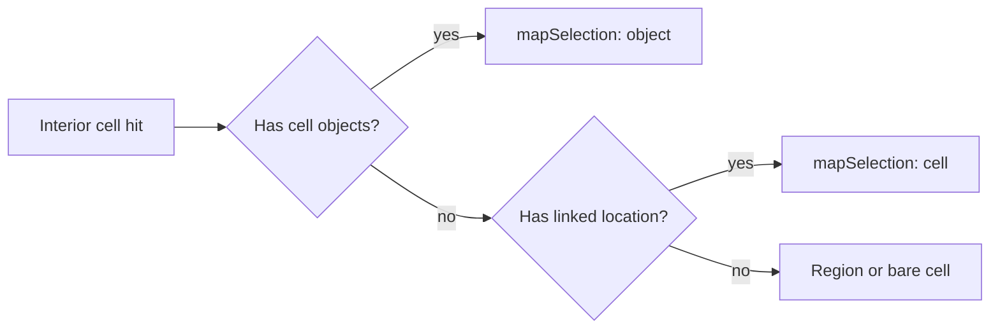

# Fill selection: inspector alignment plan

## Current state (evaluation)

### 1. Can fill reuse the same structural inspector pattern as object selection?

**Yes.** Objects use [`PlacedObjectRailTemplate`](src/features/content/locations/components/workspace/rightRail/selection/PlacedObjectRailTemplate.tsx) with category → title → placement → metadata (`PlacedObjectPresentationMetadataRows`) → optional label/actions. Paths and edges use the same backbone ([`LocationMapPathInspector`](src/features/content/locations/components/workspace/rightRail/selection/LocationMapSelectionInspectors.tsx), edge inspectors). Cell fills can use the **same template** with `metadata` only (no label field, per your swatch/label requirement).

### 2. What already establishes the object inspector pattern?

| Piece | Role |
|--------|------|
| [`PlacedObjectRailTemplate`](src/features/content/locations/components/workspace/rightRail/selection/PlacedObjectRailTemplate.tsx) + [`SelectionRailIdentityBlock`](src/features/content/locations/components/workspace/rightRail/selection/PlacedObjectRailTemplate.tsx) | Shared rail layout (overline / title / placement). |
| [`placedObjectRail.helpers.ts`](src/features/content/locations/components/workspace/rightRail/selection/placedObjectRail.helpers.ts) | `formatCellPlacementLine`, `presentationRowsFromPresentation`, `PresentationMetadataRow` type. |
| [`LocationMapObjectInspector`](src/features/content/locations/components/workspace/rightRail/selection/LocationMapSelectionInspectors.tsx) | Reference wiring: category/title from registry, rows from `presentation`, then `PlacedObjectRailTemplate`. |
| Shared fill registry | [`AUTHORED_CELL_FILL_DEFINITIONS`](shared/domain/locations/map/authoredCellFillDefinitions.ts), [`resolveCellFillVariant`](shared/domain/locations/map/authoredCellFillDefinitions.ts), family [`category`](shared/domain/locations/map/locationMapCellFill.facets.ts) (`terrain` \| `surface`). |

### 3–4. Is there a unified selection-details resolver / view-model layer?

**No dedicated cross-entity “resolver” type** exists today. The “unified pipeline” is **conventional**: each inspector branch in [`LocationEditorSelectionPanel`](src/features/content/locations/components/workspace/rightRail/selection/LocationEditorSelectionPanel.tsx) composes the same template/helpers. Fills should **plug into that convention**—either inline in [`LocationCellAuthoringPanel`](src/features/content/locations/components/workspace/rightRail/panels/LocationCellAuthoringPanel.tsx) or as a small `LocationMapCellFillInspector` next to the other inspectors—rather than a second bespoke panel stack.

**Optional (nice-to-have):** a pure `buildCellFillSelectionInspectorModel(familyId, variantId)` (or your `SelectionInspectorModel` shape) in **shared** or **feature domain**, used only to map registry → `{ sectionLabel, title, metadataRows }` for testing and single-source display logic. **Not required** if the component stays thin.

### 5. Clean derivation of display fields

| Field | Source |
|--------|--------|
| **Section label** (`Terrain` / `Surface`) | `getAuthoredCellFillFamilyDefinition(familyId).category`: map `terrain` → `Terrain`, `surface` → `Surface` (single small helper, e.g. `cellFillCategoryToSectionLabel` colocated with fill rail helpers or in `shared/.../authoredCellFillDefinitions.ts` if you want pure domain). |
| **Title** | `resolveCellFillVariant(familyId, variantId).variant.label` (resolved label, e.g. `Dense forest`, `Stone floor`). |
| **Subtitle / placement** | Reuse `formatCellPlacementLine(cellId)` → `Cell x,y`. |
| **Metadata rows** | `variant.presentation` on the resolved variant — same key/value shaping as objects: **either** generalize [`presentationRowsFromPresentation`](src/features/content/locations/components/workspace/rightRail/selection/placedObjectRail.helpers.ts) to accept a generic `Record<string, string \| number \| boolean \| undefined>` (cell fill’s [`AuthoredCellFillVariantPresentation`](shared/domain/locations/map/authoredCellFillDefinitions.ts) matches), **or** add `cellFillPresentationRowsFromPresentation` that delegates to the same internal formatting as `presentationRowsFromPresentation` to avoid widening placed-object types awkwardly. |

**Swatches:** do **not** add a separate swatch label row; color remains implicit from theme + registry (existing paint/render path).

### 6. Selection behavior when a cell has both fill and object

**Established rule** ([`resolveSelectModeAfterPathEdgeHits`](src/features/content/locations/domain/authoring/editor/selectMode/resolveSelectModeRegionOrCellSelection.ts)): interior resolution after path/edge hits is **objects → linked location → region → bare cell**. **Fill is not a selection type** and is not ranked—so **objects always win** the Selection tab when present.

**Implication for this pass:** the new fill inspector runs when `mapSelection.type === 'cell'` **and** the cell has a `cellFill` in draft—**not** when `type === 'object'`. Showing fill under object selection would be a **multi-entity** rail change; **out of scope** unless you explicitly want a secondary line on the object inspector later.

**Related:** if the cell is **in a region**, Select mode resolves **`region`** before bare `cell`, so the user sees the region form, not the fill-only inspector. Changing region vs fill priority is a **product** decision, not required for mirroring the object template for **bare cell** fill.

---

## Implementation outline

1. **Plumb data**  
   - Extend [`LocationCellAuthoringPanelProps`](src/features/content/locations/components/workspace/rightRail/panels/LocationCellAuthoringPanel.tsx) with `cellFillByCellId: Record<string, LocationMapCellFillSelection | undefined>` (import type from [`shared/domain/locations`](shared/domain/locations/map/locationMap.types.ts)).  
   - Pass `cellFillByCellId={gridDraft.cellFillByCellId}` from [`LocationEditWorkspaceSelectionRailPanel`](src/features/content/locations/routes/locationEdit/locationEditWorkspaceRailPanels.tsx).

2. **Fill inspector UI**  
   - When `selection` is handled as `case 'cell'` and `cellFillByCellId[cellId]` is defined, render a **fill-first** rail using `PlacedObjectRailTemplate` with:
     - `categoryLabel` = section label from family `category`
     - `objectTitle` = resolved variant `label`
     - `placementLine` = `formatCellPlacementLine(cellId)`
     - `metadata` = `PlacedObjectPresentationMetadataRows` with rows from presentation  
   - **Do not** pass `secondaryCaption` to `SelectionRailIdentityBlock` for this block (template already omits it unless we add a prop—keep it **no** host/ancestry lines for fill).  
   - **No** `labelField` / swatch label row.  
   - **Remove** action: optional “Clear fill” could mirror erase semantics; **omit** unless you want parity with “Remove from map” in the same pass (erase already clears fill).

3. **Empty cell without fill**  
   - Keep existing [`LocationCellAuthoringPanel`](src/features/content/locations/components/workspace/rightRail/panels/LocationCellAuthoringPanel.tsx) copy for cells with no fill (host caption behavior unchanged for that path—your constraint was **only** the fill panel).

4. **Tests**  
   - Extend [`placedObjectRail.helpers.test.ts`](src/features/content/locations/components/workspace/rightRail/selection/__tests__/placedObjectRail.helpers.test.ts) (or add `cellFillRail.helpers.test.ts`) for: category → section label; presentation rows for a known forest variant (e.g. `biome` / `density`).  
   - Optional: thin component test for “fill cell renders title + Terrain/Surface” if you add a test harness.

5. **Docs**  
   - **Optional** one-line update to [`docs/reference/location-workspace.md`](docs/reference/location-workspace.md) under Selection / concrete examples (only if you want the reference to mention fill inspection)—not required for code correctness.

---

## Answers mapped to your checklist

| Question | Answer |
|----------|--------|
| Same structural pattern as objects? | Yes — `PlacedObjectRailTemplate` + metadata rows. |
| Unified pipeline? | Same **component + helper** pipeline as other inspectors; no separate resolver layer today—extend that, optionally add a pure view-model builder. |
| Add to same resolver? | No global resolver exists; **extend** `LocationEditorSelectionPanel` / cell branch + `LocationCellAuthoringPanel` (or extracted `LocationMapCellFillInspector`). |
| `SelectionInspectorModel` shape? | **Compatible** as an internal pure return type; not mandatory to expose. |
| Object + fill? | **Object selection wins**; fill inspector only when selection is bare `cell` with fill and no object. |
