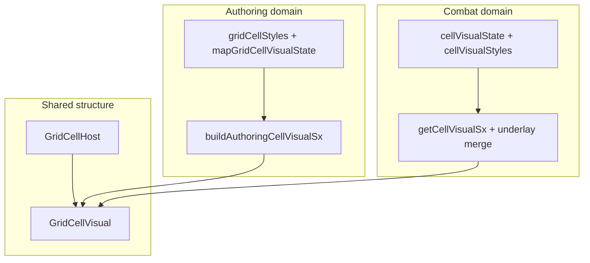

# Map grid: two-layer cell host + shared visual chrome pipeline

## Direction (revised)

**Do not** migrate interactive map cells to `div`-only hosts. Preserve **native `<button>`** where the cell is interactive so **Enter / Space** activation and focus semantics stay browser-provided, and future **keyboard navigation** (including combat) builds on real controls rather than re-implemented `div role="gridcell"` behavior.

**Structural unification ≠ one shared style function.** The goal is a **consistent host/visual DOM pattern** and **clear boundaries**: shared primitives and optional thin shared types; **separate** authoring vs combat **state → sx** pipelines. Combat’s [`cellVisualStyles.ts`](src/features/combat/components/grid/cellVisualStyles.ts) already behaves as a **domain-specific tactical builder**—it should **fit beside** authoring chrome, not be folded into it.

1. **Outer host** — `GridCellHost`
   - **`button`** when the cell is interactive (clickable / focusable for authoring or combat).
   - **`div`** when the cell is not interactive (e.g. wall / blocking cell with no click handler in combat).
2. **Inner visual** — `GridCellVisual`
   - Receives **nearly all** border, background, hover/selected/excluded chrome, shadows, hex ring/fill split — the **presentation surface** for “what the cell looks like” in that domain.
3. **Domain builders (separate files)**
   - **Authoring:** tokens [`gridCellStyles.ts`](src/features/content/locations/components/mapGrid/gridCellStyles.ts) + policy [`mapGridCellVisualState.ts`](src/features/content/locations/components/mapGrid/mapGridCellVisualState.ts) + **new** pure `state → sx` for the authoring visual layer (square + hex variants/outputs).
   - **Combat:** keep [`getCellVisualSx`](src/features/combat/components/grid/cellVisualStyles.ts) + [`mergeAuthoringMapUnderlayIntoCellSx`](src/features/combat/components/grid/cellVisualStyles.ts) as **tactical** presentation; optionally rename for clarity, **do not** merge implementation with authoring.

**Stop** depending on **global** [`button { … }`](src/index.css) and [`button[role="gridcell"]`](src/index.css) for correct cell appearance: **reset the host button minimally** (padding, border, background, font) **on the host component** (via `sx` and/or a scoped class), and put **meaningful chrome** on **`GridCellVisual`**.

## Target markup (evaluate and refine during implementation)

```tsx
<GridCellHost interactive={boolean} /* button vs div; role="gridcell"; data-cell-id; handlers */>
  <GridCellVisual /* sx from domain builder */>
    {children — labels, terrain icons, tokens, etc.}
  </GridCellVisual>
</GridCellHost>
```

- **Host:** layout shell + interaction + a11y (`type="button"` when button, `disabled`, `aria-*`). **No** primary fill from globals — stripped by local reset.
- **Visual:** fills the host’s content box (`flex: 1` / `position: absolute; inset: 0` as needed) and receives **domain** `sx` output.

**Hex:** can use **one** `GridCellVisual` with nested inner clip layer **or** two visual layers (outer ring + inner fill)—same **host** primitive; geometry-specific **builder output** (outer vs inner `sx`) stays in the **authoring** pipeline, not in shared primitives.

**`GridCellContent`:** not required initially—authoring already wraps custom/label in inner `Box`es. Introduce a small content wrapper only if duplication across square/hex/combat becomes painful.

## Context (today)

| Area | Today |
|------|--------|
| [`GridEditor`](src/features/content/locations/components/mapGrid/GridEditor.tsx) / [`HexGridEditor`](src/features/content/locations/components/mapGrid/HexGridEditor.tsx) | Single `Box component="button"`; chrome in `sx` on that element (hex splits ring/fill across button + `.hex-inner`) |
| [`CombatGrid`](src/features/combat/components/grid/CombatGrid.tsx) | `Box` (div) per cell; [`getCellVisualSx`](src/features/combat/components/grid/cellVisualStyles.ts) + theme; walls are non-clickable divs |
| Globals | [`index.css`](src/index.css) `button { }` + `button[role="gridcell"]` resets |



---

## Architecture evaluation (authoring + combat)

### 1) Recommendation summary

- **Share:** `GridCellHost`, `GridCellVisual` (thin MUI `Box` wrappers), optional **narrow** shared prop types (`GridCellHostProps`, `GridCellVisualProps`) for `role`, `data-cell-id`, `interactive`, `disabled`, `children`, `sx` merge order—not a shared “render model” for all domains on day one.
- **Do not share:** one combined `buildAllGridsVisualSx`; authoring hover/select policy vs combat tactical/perception state; theme-driven combat fills vs fixed authoring tokens.
- **Combat [`cellVisualStyles.ts`](src/features/combat/components/grid/cellVisualStyles.ts):** treat as **combat cell visual builder**; **keep** in `features/combat/components/grid/`; **rename** to `combatCellVisual.builder.ts` (or `combatGridCellVisual.sx.ts`) when convenient—**no split** until file size or test isolation demands it.
- **Authoring files:** evolve toward **`gridCellStyles.ts`** (tokens, keep name) + **`mapGridCellVisualState.ts`** (policy, keep name) + **new** `mapGridAuthoringCellVisual.builder.ts` (pure `state → sx` for square; hex returns `{ outer, inner }` or merged layers as today). Avoid over-splitting into `.tokens / .policy / .builder` **unless** files grow—**two existing + one builder** is enough.
- **Square vs hex:** same **host** + same **visual** primitive; **differ** in builder outputs and layout (`absolute` + `clip-path` vs grid cell)—hex may pass **variant** or call **hex-specific** builder functions in the same authoring builder module.
- **Sequencing:** (see §6) **authoring builder first** (behavior-preserving extraction), **then** host/visual split for authoring, **then** combat structural alignment **without** merging style logic, **then** shared primitives file location polish + CSS cleanup.

### 2) Target file tree (incremental)

```
src/features/content/locations/components/mapGrid/
  gridCellStyles.ts                    # tokens (existing)
  mapGridCellVisualState.ts            # select/hover policy (existing)
  mapGridAuthoringCellVisual.builder.ts # NEW: authoring state → sx (square + hex helpers)
  GridCellHost.tsx                     # NEW: shared (start here or under cell/)
  GridCellVisual.tsx                   # NEW
  GridEditor.tsx
  HexGridEditor.tsx

src/features/combat/components/grid/
  cellVisualState.ts                   # tactical state (existing)
  cellVisualStyles.ts                  # tactical sx + underlay — rename later optional
  CombatGrid.tsx
```

Optional later: `src/ui/grid/` or `src/shared/ui/gridCell/` **if** multiple features import host/visual—**not** required for first pass; colocate under `mapGrid/` first, re-export from combat if import paths get awkward.

### 3) Shared vs domain-specific

| Shared | Domain-specific |
|--------|-----------------|
| `GridCellHost` / `GridCellVisual` markup and host button reset | Authoring: `gridCellPalette`, `shouldApplyCellSelectedChrome`, terrain `fillBg`, square vs hex geometry |
| Optional `GridCellHostProps` / `GridCellVisualProps` (structural) | Combat: `CellVisualState`, `getCellVisualSx`, `mergeAuthoringMapUnderlayIntoCellSx`, perception merge, wall vs walkable |
| `role="gridcell"`, `data-cell-id` conventions | Token/combatant overlays, tooltips, popovers—stay in feature components |
| Docs: two-layer pattern | Tests: builder tests per domain |

### 4) `cellVisualStyles.ts`: rename, split, or keep

- **Now:** **Keep file and exports**; conceptually label it the **combat grid cell visual builder** in a module comment.
- **Rename (optional, low risk):** `combatCellVisual.builder.ts` or `combatGridCellVisual.sx.ts`—single rename + import updates; **no** behavioral change.
- **Split:** defer until >~200 lines **or** distinct test targets (e.g. underlay vs base fill) need isolation.

### 5) Shared types

- **`GridCellHostProps` / `GridCellVisualProps`:** yes, **minimal**—interactive, disabled, `component`, `onClick`, `sx`, children, `aria-*`, `data-cell-id`.
- **`GridCellRenderModel` / `GridCellInteractionState`:** **defer**—authoring and combat “models” diverge; premature union types invite leaks. If needed later, **separate** `AuthoringCellChromeInput` vs `CombatCellChromeInput` feeding their own builders.

### 6) Square vs hex

- **Same** `GridCellHost` + `GridCellVisual` **primitives**.
- **Different** builder outputs: square = one visual `sx`; hex = outer ring + inner fill (nested `GridCellVisual` or inner `Box` with class)—**builder module** owns the split, not the host.

### 7) Preserve behavior first

- Extract **pure authoring builder** with **Vitest** snapshots/table tests for representative states **before** reshaping DOM.
- Introduce **host/visual** in authoring **without** combat changes until authoring QA passes.
- Combat: **swap** inner structure to host/visual while **keeping** `getCellVisualSx` output applied to `GridCellVisual` (or merged in same order as today).

### Specific answers (numbered)

1. **Shared structure:** `GridCellHost` + `GridCellVisual` is the right split; add `GridCellContent` only if children layout repeats uncomfortably.
2. **Authoring naming:** Prefer **`gridCellStyles.ts`** + **`mapGridCellVisualState.ts`** + **`mapGridAuthoringCellVisual.builder.ts`**. The `*.tokens / *.policy / *.chrome` split is optional sugar—use if files grow.
3. **Combat placement:** Keep **`cellVisualStyles.ts`** in combat; align **structurally** in `CombatGrid`; rename for clarity when touched.
4. **Shared types:** Minimal host/visual props **yes**; cross-domain render model **not yet**.
5. **Square vs hex:** Same primitives; **geometry-specific builder** and optional second inner visual for hex.
6. **Refactor sequence:** Authoring builder → authoring host/visual → combat structural align → shared location polish + `index.css` cleanup. **Confirmed** as safest.

### Risks / tradeoffs

- **Risk:** Extracting builder while editors still apply hover via `&:hover` on host—may need to pass **hover mirror** styles onto visual until `:hover` is fully on visual layer.
- **Risk:** Hex two-layer styling is easy to break—golden tests or story/manual QA checklist.
- **Tradeoff:** Shared primitives under `mapGrid/` may later move to `shared/`—small move cost if boundaries stay clean.
- **Tradeoff:** Combat walls as `div` vs inert `button`—product/a11y choice; **div** for non-interactive is fine.

### Smallest safe first pass

1. Add **`mapGridAuthoringCellVisual.builder.ts`** with pure functions taking inputs already computed in `GridEditor` (selected, excluded, fillBg, select hover flags) + **`mapGridCellVisualState`**—return **`sx` for the cell “chrome”** matching current square cell (or split host vs visual **in a follow-up step**).
2. **Vitest:** a handful of cases (selected, excluded, hover allowed, hover suppressed, terrain fill).
3. Wire **`GridEditor`** to use the builder output **without** changing outer DOM yet (still one `Box` button)—**behavior unchanged**, diff is localized.

Then proceed to **`GridCellHost` + `GridCellVisual`** and move chrome `sx` to visual.

---

## Implementation phases (execution)

### Phase A — Authoring visual builder (behavior-preserving)

- Add **`mapGridAuthoringCellVisual.builder.ts`** (square first; hex can call separate exported helpers in same file).
- **`gridCellStyles` / `mapGridCellVisualState`:** keep public APIs; builder imports them.
- Ensure **`gridCellPalette.background.selected`** is intentional (`transparent` today—document or adjust if builder needs an explicit selected fill).

### Phase B — Primitives + authoring host/visual

- Add **`GridCellHost`** + **`GridCellVisual`**; button reset on host `sx`.
- Refactor **`GridEditor`** then **`HexGridEditor`**; preserve `role="gridcell"`, labels, pointer handlers.

### Phase C — Combat structural alignment

- Refactor [`CombatGrid`](src/features/combat/components/grid/CombatGrid.tsx) cell to **host + visual**; apply existing **`getCellVisualSx` + underlay** to **`GridCellVisual`** (or equivalent layer order).
- **Walls:** `GridCellHost` as **`div`**, non-interactive; walkable/clickable → **`button`** when `onCellClick` applies.
- **Do not** import authoring builder into combat.

### Phase D — Global CSS + docs

- Trim [`button[role="gridcell"]`](src/index.css) if host reset covers authoring.
- Update [`location-workspace.md`](docs/reference/location-workspace.md): two-layer pattern, file names, combat stays tactical builder.

## Out of scope (follow-ups)

- Full **APG grid** roving tabindex + arrow navigation (build on real `button` hosts when implemented).
- Replacing global `button { }` in `index.css` for the whole app with class-scoped buttons.

## Acceptance criteria

- Interactive authoring cells remain **`<button type="button">`** at the host layer where applicable; **keyboard activation** unchanged for typical click paths.
- **Authoring chrome** lives on **`GridCellVisual`** via **authoring** builder + tokens/policy; **combat** chrome stays **`getCellVisualSx`** (+ underlay), applied to combat’s visual layer—not merged into authoring code.
- **Combat** cells match **host/visual structure**; **no** entanglement of tactical rules with authoring hover/select policy.
- **`index.css`** `button[role="gridcell"]` reset **removed or justified** after local host resets prove sufficient.
- Unit tests for **authoring** builder; combat tests remain on existing modules unless structural change requires updates.

## Key files

| File | Role |
|------|------|
| [`gridCellStyles.ts`](src/features/content/locations/components/mapGrid/gridCellStyles.ts) | Authoring tokens |
| [`mapGridCellVisualState.ts`](src/features/content/locations/components/mapGrid/mapGridCellVisualState.ts) | Authoring policy |
| **New** `mapGridAuthoringCellVisual.builder.ts` | Authoring `state → sx` |
| **New** `GridCellHost.tsx`, `GridCellVisual.tsx` | Shared structure |
| [`GridEditor.tsx`](src/features/content/locations/components/mapGrid/GridEditor.tsx), [`HexGridEditor.tsx`](src/features/content/locations/components/mapGrid/HexGridEditor.tsx) | Compose primitives |
| [`cellVisualState.ts`](src/features/combat/components/grid/cellVisualState.ts), [`cellVisualStyles.ts`](src/features/combat/components/grid/cellVisualStyles.ts) | Combat domain (unchanged responsibility) |
| [`CombatGrid.tsx`](src/features/combat/components/grid/CombatGrid.tsx) | Apply combat sx to visual layer inside host |
| [`index.css`](src/index.css) | Trim gridcell button hacks after verification |
| [`location-workspace.md`](docs/reference/location-workspace.md) | Architecture note |

---

**Parent reference:** [docs/reference/location-workspace.md](../../docs/reference/location-workspace.md) (grid styling, Select mode).
