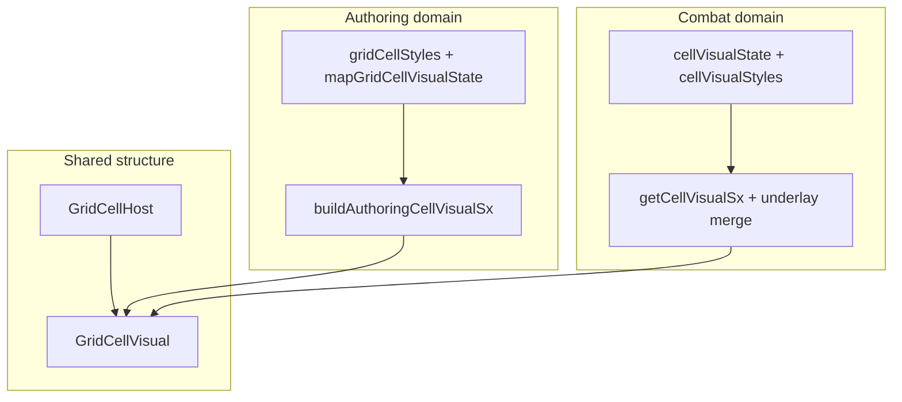

# Map grid: two-layer cell host + shared visual chrome pipeline

## Direction (revised)

**Do not** migrate interactive map cells to `div`-only hosts. Preserve **native `<button>`** where the cell is interactive so **Enter / Space** activation and focus semantics stay browser-provided, and future **keyboard navigation** (including combat) builds on real controls rather than re-implemented `div role="gridcell"` behavior.

**Structural unification ≠ one shared style function.** The goal is a **consistent host/visual DOM pattern** and **clear boundaries**: shared primitives and optional thin shared types; **separate** authoring vs combat **state → sx** pipelines. Combat’s [`cellVisualStyles.ts`](src/features/combat/components/grid/cellVisualStyles.ts) already behaves as a **domain-specific tactical builder**—it should **fit beside** authoring chrome, not be folded into it.

### “Interactive” (definition)

**Interactive** means any cell that should be **activatable and/or focusable** in the **current UX**—not only cells that happen to pass an `onClick` at a particular call site. Call sites may still use `button` for cells that are focusable for keyboard or future grid navigation even when click wiring is indirect or conditional.

### Host vs visual (responsibility split)

| Layer | Owns |
|-------|------|
| **`GridCellHost`** | Semantics (`role`, `aria-*`, `data-*`), **focus** behavior, **keyboard activation** (native button), **`disabled`**, pointer/click handlers as appropriate for the feature. |
| **`GridCellVisual`** | **Visible chrome**: border, fill, hover/selected states, shadows, hex layers—and **any `focus-visible` / keyboard-focus ring treatment** drawn for keyboard users (so focus appearance is not fighting global `button {}` on the host). |

1. **Outer host** — `GridCellHost`
   - **`button`** when the cell is **interactive** (see definition above).
   - **`div`** when the cell is **not** interactive (e.g. wall / blocking cell with no activation path in combat).
2. **Inner visual** — `GridCellVisual`
   - **Visible chrome** for the domain: border, background, hover/selected/excluded, shadows, hex ring/fill split—including **focus-visible styling** for keyboard users.
3. **Domain builders (separate files)**
   - **Authoring:** tokens [`gridCellStyles.ts`](src/features/content/locations/components/mapGrid/gridCellStyles.ts) + policy [`mapGridCellVisualState.ts`](src/features/content/locations/components/mapGrid/mapGridCellVisualState.ts) + **new** pure `state → sx` for the authoring visual layer (square + hex variants/outputs).
   - **Combat:** keep [`getCellVisualSx`](src/features/combat/components/grid/cellVisualStyles.ts) + [`mergeAuthoringMapUnderlayIntoCellSx`](src/features/combat/components/grid/cellVisualStyles.ts) as **tactical** presentation; optionally rename for clarity, **do not** merge implementation with authoring.

**Stop** depending on **global** [`button { … }`](src/index.css) and [`button[role="gridcell"]`](src/index.css) for correct cell appearance: **reset the host button minimally** (padding, border, background, font) **on the host component** (via `sx` and/or a scoped class), and put **meaningful chrome** on **`GridCellVisual`**.

## Target markup (evaluate and refine during implementation)

```tsx
<GridCellHost interactive={boolean} /* button vs div; role="gridcell"; data-cell-id; handlers */>
  <GridCellVisual /* sx from domain builder */>
    {children — labels, terrain icons, tokens, etc.}
  </GridCellVisual>
</GridCellHost>
```

- **Host:** interaction shell + a11y (`type="button"` when button, `disabled`, `aria-*`), focus target for interactive cells, keyboard activation. **No** primary fill from globals — stripped by local reset (see [`index.css`](src/index.css) `button[role="gridcell"]`).
- **Visual:** fills the host’s content box (`flex: 1` / `position: absolute; inset: 0` as needed), receives **domain** `sx` for fills/borders/hover—and **focus-visible** chrome so keyboard focus is visible without relying on global button styles on the host.

**Hex:** can use **one** `GridCellVisual` with nested inner clip layer **or** two visual layers (outer ring + inner fill)—same **host** primitive; geometry-specific **builder output** (outer vs inner `sx`) stays in the **authoring** pipeline, not in shared primitives.

**`GridCellContent`:** not required initially—authoring already wraps custom/label in inner `Box`es. Introduce a small content wrapper only if duplication across square/hex/combat becomes painful.

## Context (today)

| Area | Today |
|------|--------|
| [`GridEditor`](src/features/content/locations/components/mapGrid/GridEditor.tsx) / [`HexGridEditor`](src/features/content/locations/components/mapGrid/HexGridEditor.tsx) | Single `Box component="button"`; chrome in `sx` on that element (hex splits ring/fill across button + `.hex-inner`) |
| [`CombatGrid`](src/features/combat/components/grid/CombatGrid.tsx) | `Box` (div) per cell; [`getCellVisualSx`](src/features/combat/components/grid/cellVisualStyles.ts) + theme; walls are non-clickable divs |
| Globals | [`index.css`](src/index.css) `button { }` + `button[role="gridcell"]` resets |



---

## Architecture evaluation (authoring + combat)

### 1) Recommendation summary

- **Share:** `GridCellHost`, `GridCellVisual` (thin MUI `Box` wrappers), optional **narrow** shared prop types (`GridCellHostProps`, `GridCellVisualProps`) for `role`, `data-cell-id`, `interactive`, `disabled`, `children`, `sx` merge order—not a shared “render model” for all domains on day one.
- **Do not share:** one combined `buildAllGridsVisualSx`; authoring hover/select policy vs combat tactical/perception state; theme-driven combat fills vs fixed authoring tokens.
- **Combat [`cellVisualStyles.ts`](src/features/combat/components/grid/cellVisualStyles.ts):** treat as **combat cell visual builder**; **keep** in `features/combat/components/grid/`; **rename** to `combatCellVisual.builder.ts` (or `combatGridCellVisual.sx.ts`) when convenient—**no split** until file size or test isolation demands it.
- **Authoring files:** evolve toward **`gridCellStyles.ts`** (tokens, keep name) + **`mapGridCellVisualState.ts`** (policy, keep name) + **new** `mapGridAuthoringCellVisual.builder.ts` (pure `state → sx` for square; hex returns `{ outer, inner }` or merged layers as today). Avoid over-splitting into `.tokens / .policy / .builder` **unless** files grow—**two existing + one builder** is enough.
- **Square vs hex:** same **host** + same **visual** primitive; **differ** in builder outputs and layout (`absolute` + `clip-path` vs grid cell)—hex may pass **variant** or call **hex-specific** builder functions in the same authoring builder module.
- **Sequencing:** (see §6) **authoring builder first** (behavior-preserving extraction), **then** host/visual split for authoring, **then** combat structural alignment **without** merging style logic, **then** shared primitives file location polish + CSS cleanup.

### 2) Target file tree (incremental)

```
src/features/content/locations/components/mapGrid/
  gridCellStyles.ts                    # tokens (existing)
  mapGridCellVisualState.ts            # select/hover policy (existing)
  mapGridAuthoringCellVisual.builder.ts # NEW: authoring state → sx (square + hex helpers)
  GridCellHost.tsx                     # NEW: shared (start here or under cell/)
  GridCellVisual.tsx                   # NEW
  GridEditor.tsx
  HexGridEditor.tsx

src/features/combat/components/grid/
  cellVisualState.ts                   # tactical state (existing)
  cellVisualStyles.ts                  # tactical sx + underlay — rename later optional
  CombatGrid.tsx
```

**Colocation policy:** Keep **`GridCellHost`** / **`GridCellVisual`** next to **`mapGrid/`** (same folder or `mapGrid/cell/`) until **both** authoring and combat consumers have **stabilized**. Only then consider moving to `src/ui/grid/` or `src/shared/ui/gridCell/`—defer the move to avoid churn while APIs and imports are still moving. Re-export from combat if import paths are awkward in the interim.

### 3) Shared vs domain-specific

| Shared | Domain-specific |
|--------|-----------------|
| `GridCellHost` / `GridCellVisual` markup and host button reset | Authoring: `gridCellPalette`, `shouldApplyCellSelectedChrome`, terrain `fillBg`, square vs hex geometry |
| Optional `GridCellHostProps` / `GridCellVisualProps` (structural) | Combat: `CellVisualState`, `getCellVisualSx`, `mergeAuthoringMapUnderlayIntoCellSx`, perception merge, wall vs walkable |
| `role="gridcell"`, `data-cell-id` conventions | Token/combatant overlays, tooltips, popovers—stay in feature components |
| Docs: two-layer pattern | Tests: builder tests per domain |

### 4) `cellVisualStyles.ts`: rename, split, or keep

- **Now:** **Keep file and exports**; conceptually label it the **combat grid cell visual builder** in a module comment.
- **Rename (optional, low risk):** `combatCellVisual.builder.ts` or `combatGridCellVisual.sx.ts`—single rename + import updates; **no** behavioral change.
- **Split:** defer until >~200 lines **or** distinct test targets (e.g. underlay vs base fill) need isolation.

### 5) Shared types

- **`GridCellHostProps` / `GridCellVisualProps`:** yes, **minimal**—interactive, disabled, `component`, `onClick`, `sx`, children, `aria-*`, `data-cell-id`.
- **`GridCellRenderModel` / `GridCellInteractionState`:** **defer**—authoring and combat “models” diverge; premature union types invite leaks. If needed later, **separate** `AuthoringCellChromeInput` vs `CombatCellChromeInput` feeding their own builders.

### 6) Square vs hex

- **Same** `GridCellHost` + `GridCellVisual` **primitives**.
- **Different** builder outputs: square = one visual `sx`; hex = outer ring + inner fill (nested `GridCellVisual` or inner `Box` with class)—**builder module** owns the split, not the host.

### 7) Preserve behavior first

- Extract **pure authoring builder** with **Vitest** snapshots/table tests for representative states **before** reshaping DOM; **do not** bundle **host/visual** into that same PR unless the diff is trivially small (see **Smallest safe first pass**).
- Introduce **host/visual** in authoring **without** combat changes until authoring QA passes; include **keyboard / focus-visible** verification for that phase.
- Combat: **swap** inner structure to host/visual while **keeping** `getCellVisualSx` output applied to `GridCellVisual` (or merged in same order as today).

### Specific answers (numbered)

1. **Shared structure:** `GridCellHost` + `GridCellVisual` is the right split; add `GridCellContent` only if children layout repeats uncomfortably.
2. **Authoring naming:** Prefer **`gridCellStyles.ts`** + **`mapGridCellVisualState.ts`** + **`mapGridAuthoringCellVisual.builder.ts`**. The `*.tokens / *.policy / *.chrome` split is optional sugar—use if files grow.
3. **Combat placement:** Keep **`cellVisualStyles.ts`** in combat; align **structurally** in `CombatGrid`; rename for clarity when touched.
4. **Shared types:** Minimal host/visual props **yes**; cross-domain render model **not yet**.
5. **Square vs hex:** Same primitives; **geometry-specific builder** and optional second inner visual for hex.
6. **Refactor sequence:** Authoring builder → authoring host/visual → combat structural align → shared location polish + `index.css` cleanup. **Confirmed** as safest.

### Risks / tradeoffs

- **Risk:** Extracting builder while editors still apply hover via `&:hover` on host—may need to pass **hover mirror** styles onto visual until `:hover` is fully on visual layer.
- **Risk:** Hex two-layer styling is easy to break—golden tests or story/manual QA checklist.
- **Tradeoff:** Shared primitives under `mapGrid/` may later move to `shared/`—small move cost if boundaries stay clean.
- **Tradeoff:** Combat walls as `div` vs inert `button`—product/a11y choice; **div** for non-interactive is fine.

### Smallest safe first pass

**Keep this step truly behavior-preserving:** extract the **authoring builder** first. **Do not** introduce **`GridCellHost` / `GridCellVisual`** in the **same** change unless the combined diff stays **very small** and review risk is negligible—default is **builder-only PR**, then a **separate** PR for host/visual.

1. Add **`mapGridAuthoringCellVisual.builder.ts`** with pure functions taking inputs already computed in `GridEditor` (selected, excluded, fillBg, select hover flags) + **`mapGridCellVisualState`**—return **`sx` for the cell “chrome”** matching current square cell.
2. **Vitest:** a handful of cases (selected, excluded, hover allowed, hover suppressed, terrain fill).
3. Wire **`GridEditor`** to use the builder output **without** changing outer DOM yet (still one `Box` button)—**behavior unchanged**, diff is localized.

**Next step (separate change):** **`GridCellHost` + `GridCellVisual`** and move chrome `sx` onto **`GridCellVisual`**; add **verification** below.

---

## Implementation phases (execution)

### Phase A — Authoring visual builder (behavior-preserving)

- Add **`mapGridAuthoringCellVisual.builder.ts`** (square first; hex can call separate exported helpers in same file).
- **`gridCellStyles` / `mapGridCellVisualState`:** keep public APIs; builder imports them.
- Ensure **`gridCellPalette.background.selected`** is intentional (`transparent` today—document or adjust if builder needs an explicit selected fill).

### Phase B — Primitives + authoring host/visual

- Add **`GridCellHost`** + **`GridCellVisual`** under **`mapGrid/`** (see colocation policy); button reset on host `sx`; put **focus-visible** treatment on **`GridCellVisual`** (or inner focus ring target), not on reintroducing global primary button chrome on the host.
- Refactor **`GridEditor`** then **`HexGridEditor`**; preserve `role="gridcell"`, labels, pointer handlers, **`disabled`** semantics.
- **Verification (required):** at least one **manual or automated** check for **keyboard activation** (e.g. Tab to cell, **Enter / Space** where applicable) and **visible focus** for keyboard users—not only **Vitest** on the authoring builder. Document the checklist in the PR or `location-workspace.md` if helpful.

### Phase C — Combat structural alignment

- Refactor [`CombatGrid`](src/features/combat/components/grid/CombatGrid.tsx) cell to **host + visual**; apply existing **`getCellVisualSx` + underlay** to **`GridCellVisual`** (or equivalent layer order).
- **Walls:** `GridCellHost` as **`div`**, non-interactive; walkable/clickable → **`button`** when `onCellClick` applies.
- **Do not** import authoring builder into combat.

### Phase D — Global CSS + docs

- Trim [`button[role="gridcell"]`](src/index.css) if host reset covers authoring.
- Update [`location-workspace.md`](docs/reference/location-workspace.md): two-layer pattern, file names, combat stays tactical builder.

### Phase E — Combat affordance unification (host + cursor + hover/visual)

Refine combat grid host/visual so **interactivity**, **cursor**, and **hover/selection styling** for **illegal** cells are driven by **one affordance model**, not three loosely coupled checks. **Do not implement** this only in CSS or only inside `getCellVisualState`—treat it as an **interaction contract** consumed by host, cursor, and visual pipeline inputs.

#### Problem

Current combat cells use **three partially separate decision paths**:

- **Host interactivity** — `button` vs `div` (`clickable` = `!isWall && Boolean(onCellClick)` in [`CombatGrid.tsx`](src/features/combat/components/grid/CombatGrid.tsx))
- **Cursor** — [`resolveCellCursor`](src/features/combat/components/grid/CombatGrid.tsx) (local function)
- **Visual hover/selection** — `hoveredCellId` + [`getCellVisualState`](src/features/combat/components/grid/cellVisualState.ts) + [`getCellVisualSx`](src/features/combat/components/grid/cellVisualStyles.ts)

This produces **inconsistent behavior**:

- Some cells remain **native `<button>`** because they are “walkable + have `onCellClick`”, even when the **cursor** is `not-allowed` (illegal movement / targeting / placement).
- **Hover / tactical styling** can still read as a **meaningful active target** while the cursor says the action is illegal.

Especially visible for **illegal movement / targeting / placement** on **walkable** cells.

#### Goals

- Prevent **non-legal** movement/targeting/placement cells from looking like **normal active/hoverable action** cells when they should not be.
- Align:
  - **host semantics** (focusable? activatable? `disabled`?)
  - **cursor**
  - **hover visual treatment** (and selection/placement emphasis where applicable)
- Preserve **host + visual architecture**: `GridCellHost`, `GridCellVisual`, combat style builder **separate** from authoring.

#### Preferred direction — shared affordance type

Introduce a **shared combat affordance helper**, e.g.:

```ts
type CombatCellAffordance = {
  interactive: boolean;   // host participates in interaction model (e.g. focusable shell)
  activatable: boolean;   // click / Enter+Space should commit the current action
  disabled: boolean;      // native disabled when using <button>
  cursor: 'pointer' | 'default' | 'not-allowed';
  hoverMode: 'none' | 'legal' | 'illegal';
};
```

The helper should derive its result from the **same tactical inputs** that today influence:

- `clickable`
- `resolveCellCursor`
- hover behavior / `hoveredCellId` consumption
- visual-state decisions (`getCellVisualState` and downstream `getCellVisualSx`)

#### Questions to resolve (design)

| Question | Notes |
|----------|--------|
| **Source of truth** for interactive / activatable / hoverable / visually emphasized | Should be **one resolver output** + explicit mapping rules to host + visual—not ad hoc checks in three places. |
| **Illegal walkable cells: `<button>` vs `div` vs `button disabled`** | Tradeoffs: focus order, screen readers, keyboard grid nav later. Document chosen policy. |
| **Should `hoveredCellId` be set for illegal cells?** | Options: still set (pointer location) but **visual pipeline** uses `hoverMode: 'illegal'`; or omit hover id for walls only; or omit for all non-emphasized—**product decision**. |
| **Illegal cells: no hover treatment vs minimal illegal-hover vs current treatment** | User preference below: **no positive** chrome; optional **restrained** illegal-hover only if feedback value is clear. |
| **Differentiation** | Explicit rules for: **walls/blocking**, **unreachable walkable**, **illegal targets**, **invalid placement** cells. |

#### Stakeholder preference (baseline)

- **Walls / blocking:** non-interactive; **no** action-oriented hover styling.
- **Legal actionable cells:** activatable; **pointer** cursor; **normal** hover/emphasis.
- **Illegal walkable cells:** **not** activatable; **not-allowed** cursor; **no** positive hover/selection chrome; **optional** restrained illegal-hover **only** if useful for feedback.

#### Architecture constraint

- **Do not** solve this **only** in CSS or **only** in `getCellVisualState`.
- Treat as an **affordance model**: **one helper** drives host choice / `disabled`, **cursor**, and **hover-mode input** to the visual pipeline (extend `CellVisualContext` or pass an explicit `affordance` / `hoverMode` into the chain that `getCellVisualState` + builders respect).

#### Files to inspect when implementing

- [`CombatGrid.tsx`](src/features/combat/components/grid/CombatGrid.tsx) — `clickable`, `isWall`, `onPointerEnter` / `onCellHover`, `GridCellHost` props
- `resolveCellCursor` (same file)
- [`getCellVisualState`](src/features/combat/components/grid/cellVisualState.ts) / [`mergePerceptionIntoCellVisualState`](src/features/combat/components/grid/cellVisualState.ts)
- [`getCellVisualSx`](src/features/combat/components/grid/cellVisualStyles.ts) / underlay merge
- Callers that set **`hoveredCellId`** (parent of `CombatGrid`)

#### Deliverable — recommendation and plan

**Recommendation**

- Add a **pure** **`resolveCombatCellAffordance`** (name TBD) in a small module under `src/features/combat/components/grid/` (e.g. `combatCellAffordance.ts`) that takes **`GridCellViewModel`**, **hover id** (or boolean `isHovered`), and the **same mode flags** `CombatGrid` already passes to `resolveCellCursor` / `getCellVisualState` context.
- **Single source of truth** for: whether the host is a **focusable action control**, whether **activation** is allowed, **`cursor`**, and **`hoverMode`** for **downstream visual policy**.
- **Plumb `hoverMode` (or equivalent)** into **`getCellVisualState`** (extended `CellVisualContext`) **or** a dedicated **visual-suppression** step **before** `getCellVisualSx`, so **illegal** hover does not reuse **legal** movement/targeting emphasis. **Not** CSS-only.

**Proposed helper name and type**

- **Module:** `combatCellAffordance.ts` (or `combatGridCellAffordance.ts` if naming collision matters).
- **Function:** `resolveCombatCellAffordance(input) -> CombatCellAffordance`.
- **Type:** `CombatCellAffordance` as sketched above (`interactive`, `activatable`, `disabled`, `cursor`, `hoverMode`). Adjust field names after first implementation if `interactive` vs “host component” needs splitting.

**Host semantics (target end state)**

- **Walls/blocking:** `interactive: false` → `GridCellHost` **`div`** (today); no positive action chrome; cursor typically **default** unless a mode overrides.
- **Legal actionable walkable:** `activatable: true`, `disabled: false`, **`button`** (or equivalent), **`pointer`**.
- **Illegal walkable (movement/targeting/placement):** **`activatable: false`**; **`cursor: 'not-allowed'`**; **`disabled: true`** on **`button`** **or** **`interactive: false`** with **`div`** + inert hit-testing—**pick one** and document (a11y + future roving tabindex). User preference leans **not activatable** + **no positive chrome**.

**Hover state**

- **`hoveredCellId`** may remain a **spatial** “which cell is under the pointer” for tooltips/debug, but **tactical paint** should consult **`hoverMode`** (and legality) so **illegal** cells do not get **legal** hover bands/rings.
- Optionally **`hoveredCellId`** **not** updated for **walls** if that simplifies “no action hover styling” without extra visual branches.

**Should illegal cells still receive hover ids?**

- **Default recommendation:** keep **setting** hover id for **walkable** cells if **parent** needs a single hover location, but **gate visuals** with **`hoverMode: 'illegal'`**; for **walls**, consider **skipping** hover id updates **or** always **`hoverMode: 'none'`** for paint. Final choice in implementation with UX.

**Implementation steps (suggested order)**

1. Extract **`resolveCombatCellAffordance`** + **Vitest** table tests: rows for wall, legal walkable, unreachable movement, illegal targeting, placement invalid—**mirror** current `resolveCellCursor` + `clickable` behavior first (**behavior match**).
2. Wire **`cursor`** + **`disabled`/`interactive`** on **`GridCellHost`** from resolver output; remove duplicated logic from inline `clickable` + `resolveCellCursor` (delete local function or delegate).
3. Extend **`CellVisualContext`** (or parallel input) with **`hoverMode`** / **`affordance`**; update **`getCellVisualState`** (or wrapper) to **suppress or swap** hover-driven movement/targeting visuals when **`hoverMode === 'illegal'`** (and wall rules).
4. Manual QA: movement, targeting, placement, walls—**cursor**, **focus**, **hover paint**, **click** no-op where intended.

**Smallest safe first pass**

- **Step 1 only:** introduce **pure** `resolveCombatCellAffordance` + tests; **call** it from `CombatGrid` to set **`cursor`** and **`disabled`** / **`interactive`** **without** changing `getCellVisualState` yet (**reduces** button+not-allowed mismatch **fast**).
- **Step 2:** plumb **`hoverMode`** into visual state (incremental; may be a follow-up PR).

## Out of scope (follow-ups)

- Full **APG grid** roving tabindex + arrow navigation (build on real `button` hosts when implemented).
- Replacing global `button { }` in `index.css` for the whole app with class-scoped buttons.

## Acceptance criteria

- **Interactive** cells (per definition above) use **`<button type="button">`** at the host when they should be activatable/focusable; **keyboard activation** and **focus visibility** for keyboard users are **verified** after the host/visual split (not only builder unit tests).
- **Host** owns semantics, focus, keyboard activation, and **disabled**; **`GridCellVisual`** owns visible chrome **including focus-visible** styling.
- **Authoring chrome** lives on **`GridCellVisual`** via **authoring** builder + tokens/policy; **combat** chrome stays **`getCellVisualSx`** (+ underlay), applied to combat’s visual layer—not merged into authoring code.
- **Combat** cells match **host/visual structure**; **no** entanglement of tactical rules with authoring hover/select policy.
- **`index.css`** `button[role="gridcell"]` reset **removed or justified** after local host resets prove sufficient.
- Unit tests for **authoring** builder; combat tests remain on existing modules unless structural change requires updates.
- **`GridCellHost` / `GridCellVisual`** remain **colocated under `mapGrid/`** until authoring and combat usages are stable; moving to a shared folder is optional follow-up.

## Key files

| File | Role |
|------|------|
| [`gridCellStyles.ts`](src/features/content/locations/components/mapGrid/gridCellStyles.ts) | Authoring tokens |
| [`mapGridCellVisualState.ts`](src/features/content/locations/components/mapGrid/mapGridCellVisualState.ts) | Authoring policy |
| **New** `mapGridAuthoringCellVisual.builder.ts` | Authoring `state → sx` |
| **New** `GridCellHost.tsx`, `GridCellVisual.tsx` | Shared structure |
| [`GridEditor.tsx`](src/features/content/locations/components/mapGrid/GridEditor.tsx), [`HexGridEditor.tsx`](src/features/content/locations/components/mapGrid/HexGridEditor.tsx) | Compose primitives |
| [`cellVisualState.ts`](src/features/combat/components/grid/cellVisualState.ts), [`cellVisualStyles.ts`](src/features/combat/components/grid/cellVisualStyles.ts) | Combat domain (unchanged responsibility) |
| **New (Phase E)** `combatCellAffordance.ts` — `resolveCombatCellAffordance`, `CombatCellAffordance` | Single combat affordance model: host + cursor + `hoverMode` input to visuals |
| [`CombatGrid.tsx`](src/features/combat/components/grid/CombatGrid.tsx) | Apply combat sx to visual layer inside host |
| [`index.css`](src/index.css) | Trim gridcell button hacks after verification |
| [`location-workspace.md`](docs/reference/location-workspace.md) | Architecture note |

---

**Parent reference:** [docs/reference/location-workspace.md](../../docs/reference/location-workspace.md) (grid styling, Select mode).
