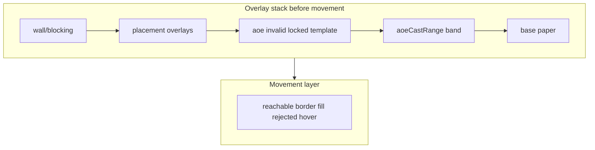

# Phase 0: Grid cell visual-state resolver + style map

## Current behavior to preserve (no gameplay changes)

All inputs stay `**GridCellViewModel**` from [`space.selectors.ts`](src/features/encounter/space/space.selectors.ts) plus render props: `hoveredCellId`, `movementHighlightActive`, `hasMovementRemaining`, `singleCellPlacementPickActive` (same as today).

**Today’s split (what we are replacing):**

- **Base fill** in `cellColor(...)` for walls, placement, and most AoE template/origin states.
- **`aoeCastRange`** is **not** in `cellColor`; it only appears via `isAoeOverlayCell` to **suppress** movement fill (alongside template, locked origin, invalid origin hover). That hides cast-range intent in “suppression-only” logic.

**Phase 0 change:** model **`aoeCastRange` as a first-class overlay intent** in the same resolver as placement and other AoE overlays. Movement fill suppression for those cells becomes a **consequence of explicit overlay precedence** (or explicit rules on the resolved overlay record), not a parallel `Boolean(aoeCastRange || …)` helper in render.

## Overlay / base precedence (target model)

Use one ordered system (names illustrative—use project naming convention e.g. `aoe-cast-range`):

1. **Wall / blocking** — blocked base (unchanged).
2. **Placement** overlays — invalid hover, selected, cast range (same relative order as today’s `cellColor` for placement).
3. **AoE** overlays — invalid origin hover, origin locked, in-template (same relative order as today).
4. **`aoeCastRange`** — **first-class** overlay intent: the **cast-range band** when the cell is in range of the caster but no higher-priority AoE fill applies. Within AoE, keep the same **relative** order as today’s `cellColor`: invalid origin hover > origin locked > in-template > **then** cast-range band (so a cell that is both in-template and in cast range still shows the **template** tint, matching current behavior).
5. **Default base** — paper when no overlay tint applies.

**Above movement:** the whole overlay stack (including `aoeCastRange` when it is the winning AoE/placement/base intent) is resolved **before** the movement layer; movement fill suppression follows from that resolution, not from a parallel boolean list.

**Movement layer** applies **after** overlay resolution, only when movement mode is active and `!isWall`, and **respects** the resolver’s rule that certain overlays (including **`aoeCastRange`**, placement band, and other AoE overlays as today) **do not combine with movement fill**—encoded once in the resolver or in a small `CellVisualState` field such as `movementFillAllowed: boolean` / `movementFillSuppressedBy: OverlayKind | null` derived from precedence, **not** a separate `isAoeOverlayCell` in JSX.

**Movement behaviors to preserve:**

- **Rejected hover:** dashed error outline when illegal movement hover.
- **Reachable:** border and optional fill per reachable + hover strength.
- **Border-only reachable:** when reachable but **movement fill** is suppressed by a higher-priority overlay (placement band, AoE template, locked/invalid origin, **`aoeCastRange`**, etc.)—same net effect as today’s border-only branch.

## `aoeCastRange` — first-class treatment

- **Represented** in the centralized overlay/visual-state model alongside placement selected, placement invalid hover, placement cast range, AoE template, origin locked, invalid origin hover, and movement.
- **Precedence:** above movement overlays so movement suppression is **not** a hidden side rule.
- **Styling:** defined in **`cellVisualStyles.ts`** only—options include:
  - a **subtle fill** (e.g. very light info/error-neutral tint), or
  - a **subtle border/outline**, or
  - a **no-fill** style that still sets a **named overlay kind** and **suppresses movement fill** via the same rules table.

The important part: **readers can see** cast-range intent in the resolved state and in the style map; it is no longer “only” a flag inside `isAoeOverlayCell`.

**Visual change:** If today’s pixels are **no tint** for cast range, the style entry can default to **no visible fill** while still being a first-class overlay in the model; optionally add a **subtle** tint if product wants a clearer band—decide in implementation and document in `space.md`.

## Proposed files

| File | Role |
|------|------|
| New: [`src/features/encounter/components/active/grid/cellVisualState.ts`](src/features/encounter/components/active/grid/cellVisualState.ts) | String unions for overlay kinds / tones, `CellVisualContext`, **`getCellVisualState(...)`** with **explicit precedence** including `aoeCastRange`; optional `movementFillAllowed` or equivalent derived from overlays. **No** ad hoc `isAoeOverlayCell` in the grid component. |
| New: [`src/features/encounter/components/active/grid/cellVisualStyles.ts`](src/features/encounter/components/active/grid/cellVisualStyles.ts) | **`getCellVisualSx(theme, state)`** mapping to MUI `sx`; **centralized entry for `aoeCastRange`** (subtle fill / outline / none); movement rules keyed off full state. |

Optional: `index.ts` in `grid/` only if a barrel already exists.

## Resolver design (readable, not a framework)

- **`getCellVisualState`** is pure: `(cell: GridCellViewModel, ctx: CellVisualContext) => CellVisualState`.
- **`CellVisualContext`:** `hoveredCellId`, `movementHighlightActive`, `hasMovementRemaining`; derive `isHover`, `isWall`, reachable flags inside the helper.
- **Single precedence chain** for “which overlay intent wins?” including **`aoeCastRange`**; movement branch reads the resolved overlay / movement suppression flags.

## Style map design

- **`getCellVisualSx(theme, state)`** returns cell `Box` sx (bgcolor, outline, transitions).
- **`getCellVisualState` must not reference palette**; style map owns all `alpha` / colors.
- **`aoeCastRange`:** one branch in the style map (even if “no visible fill” beyond base) so treatment is **centralized**.
- Future auras: extend overlay kinds + style map.

## [`EncounterGrid.tsx`](src/features/encounter/components/active/grid/EncounterGrid.tsx) changes

- Remove `cellColor`, inline movement booleans, and **`isAoeOverlayCell`** (or equivalent) from render.
- Per cell: `visual = getCellVisualState(cell, ctx)` then `getCellVisualSx(theme, visual)`.
- Keep token rings, keyframes, `resolveCellCursor`, drag/popover logic unchanged.

## Tests

- Table-driven cases: **`aoeCastRange`** resolves as first-class overlay; movement fill suppressed when that overlay is active; **reachable border-only** when overlay blocks fill; interaction with placement and other AoE flags.

## Documentation

- Update [`docs/reference/space.md`](docs/reference/space.md): document **overlay precedence** (including **`aoeCastRange` above movement**), and that cast-range styling is defined in the style map—not a suppression-only boolean.

## Acceptance checklist

- Precedence lives in `getCellVisualState` + comments, not scattered in JSX.
- Raw color/alpha values live in `cellVisualStyles.ts`.
- **`aoeCastRange`** is represented in the centralized overlay/visual-state system.
- **`aoeCastRange`** no longer relies only on ad hoc movement suppression (`isAoeOverlayCell` pattern).
- Movement fill suppression for AoE cast range is **explained by** centralized overlay precedence / resolver output (or explicit `movementFillSuppressedBy`-style field), not hidden helpers.
- Placement, AoE, and movement visuals match current behavior except for any **intentional** subtle cast-range tint if chosen in the style map (document in `space.md`).
- After refactor, **why** a cell looks like AoE cast range and **why** movement fill is absent there are answerable from the resolver + style map.
- `space.md` reflects the model.
