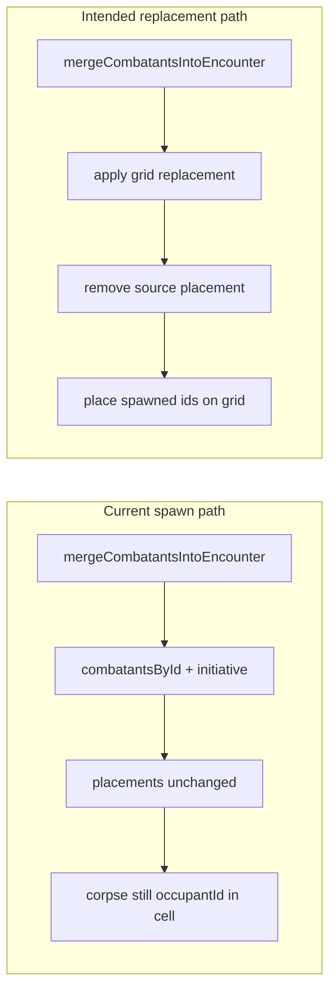

# Grid occupancy for spawn replacement (Animate Dead + future replacement)

## Root cause (verified)

- **Single source of truth for “who is in this cell”:** `[CombatantPosition[]](src/features/encounter/space/space.types.ts)` on `[EncounterState.placements](src/features/mechanics/domain/encounter/state/types/encounter-state.types.ts)`. `[getOccupant](src/features/encounter/space/space.helpers.ts)` returns the occupant for a `cellId`; `[selectGridViewModel](src/features/encounter/space/space.selectors.ts)` uses that for `occupantId` / portrait / labels.
- **Why the zombie never renders:** `[mergeCombatantsIntoEncounter](src/features/mechanics/domain/encounter/state/runtime.ts)` adds combatants and initiative rolls but **does not touch `placements`**. The defeated corpse **still has** `{ combatantId: corpseId, cellId }` from initial `[generateInitialPlacements](src/features/encounter/space/generateInitialPlacements.ts)`; the spawned zombie has **no** placement row, so every cell’s `occupantId` stays the corpse.
- `**location: 'self-space'` / `'self-cell'`** on `[SpawnEffect](src/features/mechanics/domain/effects/effects.types.ts)` is **not** consumed in `[applyActionEffects](src/features/mechanics/domain/encounter/resolution/action/action-effects.ts)` today — so this bug is systemic for spawns, but your scoped fix targets the **remains-based replacement** path first.

## Design choice (smallest coherent generic rule)

**Option B (canonical occupancy transfer)** fits the existing model: one `combatantId` per cell in `placements`, no parallel “render hack” layer.

1. After a successful catalog spawn (`built.length > 0`), if the effect indicates **“replace the target’s on-grid presence”**, update `placements`:
  - **Remove** the spawn target’s row (corpse no longer occupies the cell).
  - **Assign** the first spawned combatant to **that same `cellId`**.
  - For **additional** spawned ids (higher-slot counts / multi-minion), place them on **nearest passable, unoccupied** cells (BFS by Chebyshev distance from the anchor cell). This avoids stacking multiple tokens in one cell and keeps behavior predictable without spell-specific code.

**Trigger (not Animate-Dead-by-name):** treat as generic spawn metadata:

- **Primary:** `[SpawnEffect.mapMonsterIdFromTargetRemains](src/features/mechanics/domain/effects/effects.types.ts)` — domain meaning is “spawn from this corpse/bones”; inheriting the cell is the correct default.
- **Future:** add an optional flag on `SpawnEffect`, e.g. `inheritGridCellFromTarget?: boolean`, for replacement flows that are **not** remains-mapped (shapeshift/new-instance). Default `false` preserves today’s behavior for other spawns.

Document in a short comment on the helper (not on a spell file) that this supports **corpse → summon** now and is intended to generalize **transformation / replacement** when a new combatant instance should own the tile.

## Implementation sketch

| Location                                                                                                                                                                                                                                              | Change                                                                                                |
| ----------------------------------------------------------------------------------------------------------------------------------------------------------------------------------------------------------------------------------------------------- | ----------------------------------------------------------------------------------------------------- |
| New helper (e.g. `[src/features/encounter/space/applyGridSpawnReplacement.ts](src/features/encounter/space/applyGridSpawnReplacement.ts)` or adjacent to `placeCombatant` in `[space.selectors.ts](src/features/encounter/space/space.selectors.ts)`) | `applyGridSpawnReplacementFromTarget(state, sourceId, spawnedIds): EncounterState` — no-op if `!space |
| `[effects.types.ts](src/features/mechanics/domain/effects/effects.types.ts)`                                                                                                                                                                          | Optional `inheritGridCellFromTarget?: boolean` + JSDoc tying it to replacement semantics.             |
| `[action-effects.ts](src/features/mechanics/domain/encounter/resolution/action/action-effects.ts)`                                                                                                                                                    | After `mergeCombatantsIntoEncounter` for `spawn`, if `effect.mapMonsterIdFromTargetRemains            |

**No change** to `[level3-a-l.ts](src/features/mechanics/domain/rulesets/system/spells/data/level3-a-l.ts)` if inheritance is implied by `mapMonsterIdFromTargetRemains`.

**Edge / semantics note (acceptable for this pass):** removing the corpse from `placements` means `[getCellForCombatant](src/features/encounter/space/space.helpers.ts)` no longer returns a cell for that combatant; `[isWithinRange](src/features/encounter/space/space.helpers.ts)` and `[lineOfSightClear](src/features/mechanics/domain/encounter/state/visibility-seams.ts)` already treat missing cells as **permissive** (`true`). That matches “corpse is no longer the tactical object on the map” once the zombie exists; if later you need strict range/LoS to the **old** record, add a thin `gridSpatialAnchorId` (follow-up, not required for visible token fix).

## Testing

1. **Unit tests** for `applyGridSpawnReplacementFromTarget` (generic ids `source`, `spawn-a`, `spawn-b`):
  - Source removed from placements; first spawn occupies anchor cell.
  - Second spawn occupies a nearby open cell (not the same cell).
  - No duplicate `cellId` occupancy in the placements array.
2. **Integration-style test** (mechanics domain): `resolveCombatAction` / `applyActionEffects` with a minimal grid (`createSquareGridSpace` + manual `placements` for corpse cell), dead target + spawn with `mapMonsterIdFromTargetRemains`, mock `buildSummonAllyCombatant` + `monstersById` — assert `selectGridViewModel` (or `getOccupant`) shows **spawn** in the corpse’s cell, not the corpse.

Existing tests to lean on: `[spawn-resolution.test.ts](src/features/mechanics/domain/encounter/resolution/action/spawn-resolution.test.ts)`, `[space.helpers.test.ts](src/features/encounter/space/__tests__/space.helpers.test.ts)`.

## Out of scope (per your constraints)

- Full polymorph / form pipeline (the existing `[form](src/features/mechanics/domain/encounter/resolution/action/action-effects.ts)` effect is log-only today).
- Initiative/history redesign.
- Wiring `location: 'self-cell'` for non-remains summons (could be a follow-up using the same helper with anchor = caster cell).

