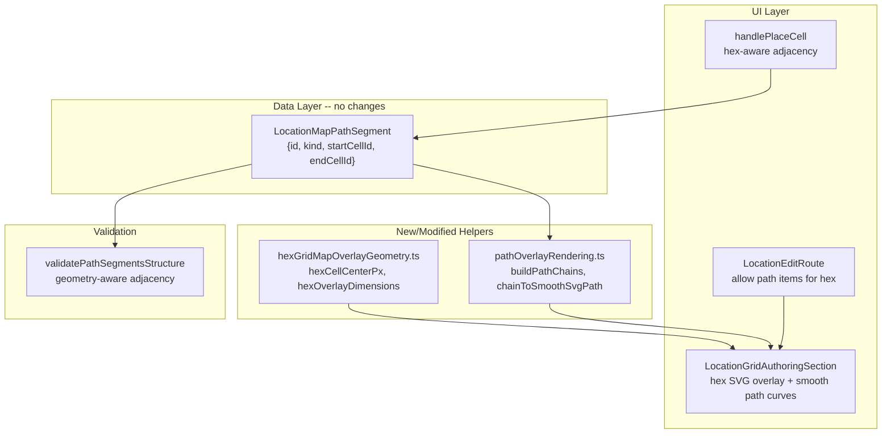

# Hex path rendering with smooth curves

## Current state

- Paths (roads, rivers) only render on **square** grids via an SVG overlay of `<line>` elements between `squareCellCenterPx` endpoints.
- The palette **filters out** path and edge items when `gridGeometry === 'hex'` ([LocationEditRoute.tsx](src/features/content/locations/routes/LocationEditRoute.tsx) line 421).
- Path placement uses a Manhattan distance check (`dx + dy === 1`) for adjacency -- square only.
- Validation in [locationMapFeatures.validation.ts](shared/domain/locations/map/locationMapFeatures.validation.ts) uses `isOrthogonalAdjacentSquare` -- square only.
- The data model (`LocationMapPathSegment`: `startCellId` / `endCellId`) is geometry-agnostic and needs no changes.
- Hex cell layout math lives in [HexGridEditor.tsx](src/ui/patterns/grid/HexGridEditor.tsx): `colStep = hexW * 0.75`, `rowStep = hexH`, odd columns shifted down by `hexH * 0.5`. No shared pixel-center helper exists.

## Approach

### 1. Hex overlay geometry helpers

Create `**[hexGridMapOverlayGeometry.ts](src/features/content/locations/components/hexGridMapOverlayGeometry.ts)`** alongside the existing `squareGridMapOverlayGeometry.ts`:

- `hexCellCenterPx(cellId, hexSize)` -- returns `{ cx, cy }` using the same odd-q layout math as `HexGridEditor` (center = top-left + half width/height).
- `hexOverlayDimensions(cols, rows, hexSize)` -- returns `{ width, height }` matching the `HexGridEditor` container sizing.

### 2. Path chain builder and smooth curve renderer

Create `**[pathOverlayRendering.ts](src/features/content/locations/components/pathOverlayRendering.ts)`** with geometry-agnostic helpers:

- `buildPathChains(segments, kindFilter?)` -- groups segments by `kind`, builds an adjacency graph from `startCellId`/`endCellId`, and extracts maximal ordered chains (sequences of cell IDs where each node has at most degree 2 within the chain). Branch points split into separate chains.
- `chainToSmoothSvgPath(cellCenters: {cx,cy}[], closed?: boolean)` -- converts a sequence of pixel points to an SVG `d` attribute using **Catmull-Rom to cubic Bezier** conversion. For chains of 2 points, produces a straight line (`M ... L ...`). For 3+ points, produces smooth curves (`M ... C ...`). Uses a tension parameter (default 0.5) for Catmull-Rom alpha.
- `pathSegmentsToSvgPaths(segments, centerFn)` -- orchestrates: builds chains per kind, maps cell IDs to pixel centers via `centerFn`, returns `{ kind, d }[]` ready for rendering.

This keeps smooth curve math pure and testable, usable for both square and hex.

### 3. Update SVG overlay in LocationGridAuthoringSection

In [LocationGridAuthoringSection.tsx](src/features/content/locations/components/LocationGridAuthoringSection.tsx):

- Compute `hexGridGeometry` (dimensions + hexSize) alongside the existing `squareGridGeometry` memo, for hex grids.
- Create a unified `cellCenterPx(cellId)` function that delegates to `squareCellCenterPx` or `hexCellCenterPx` based on `isHex`.
- **New hex SVG overlay**: when `isHex` and there are path segments (or a path placement preview), mount an `<svg>` overlay sized via `hexOverlayDimensions`. Render only paths (no edges -- hex edge authoring remains scoped out).
- **Replace path `<line>` elements** with `<path>` elements using `pathSegmentsToSvgPaths` for smooth curves. This applies to **both** square and hex overlays. Individual segments that are not part of a longer chain render as straight lines; connected segments render as smooth Catmull-Rom curves.
- Update `pathPlacementPreview` memo to work for hex: use `hexCellCenterPx` when `isHex`, and use `getNeighborPoints` for the adjacency validity check instead of `dx + dy === 1`.

### 4. Allow path palette items for hex grids

In [LocationEditRoute.tsx](src/features/content/locations/routes/LocationEditRoute.tsx):

- Change the palette filter from `i.category === 'object'` to `i.category === 'object' || i.category === 'path'` for hex grids. Edge items remain hidden.

### 5. Update path placement adjacency for hex

In [LocationEditRoute.tsx](src/features/content/locations/routes/LocationEditRoute.tsx) `handlePlaceCell` path branch (~line 831):

- Replace `Math.abs(pa.x - pb.x) + Math.abs(pa.y - pb.y) !== 1` with a geometry-aware adjacency check using `getNeighborPoints` from [gridHelpers.ts](shared/domain/grid/gridHelpers.ts). Requires passing `gridGeometry`, `cols`, `rows` into the adjacency test.

### 6. Update server validation for hex adjacency

In [locationMapFeatures.validation.ts](shared/domain/locations/map/locationMapFeatures.validation.ts):

- Add a `geometry` parameter to `validatePathSegmentsStructure` (default `'square'` for backwards compat).
- Replace `isOrthogonalAdjacentSquare` with a geometry-aware check: for `'square'` keep the Manhattan check; for `'hex'` use `getNeighborPoints` or equivalent inline odd-q offset check.
- Update call site in [locationMap.validation.ts](shared/domain/locations/map/locationMap.validation.ts) to pass geometry from the grid payload.

### 7. Tests

- `**hexGridMapOverlayGeometry.test.ts`**: hex cell center pixel calculations for even/odd columns, overlay dimensions.
- `**pathOverlayRendering.test.ts`**: chain building (single segment, linear chain, branch splits, multiple kinds), smooth SVG path output (2-point straight line, 3+ point curve contains `C` commands).
- `**locationMapFeatures.validation.test.ts`** (extend existing): hex-adjacent path segments pass validation; non-adjacent hex pairs fail.

### Rendering style

- Roads: solid stroke, `theme.palette.info.main`, 3px width (matching current square style but smoother).
- Rivers: could use a slightly different blue or wider stroke if a visual distinction is desired -- but current data model only stores `kind`, not style. Keep same color for now; distinguish by context.

### Out of scope

- Hex edge authoring (walls/doors/windows) -- remains hidden for hex grids.
- Drag-to-paint path placement (paths still use two-click flow).
- Hex path erase -- will work automatically since erase resolves by cell and path segments reference cell IDs.

