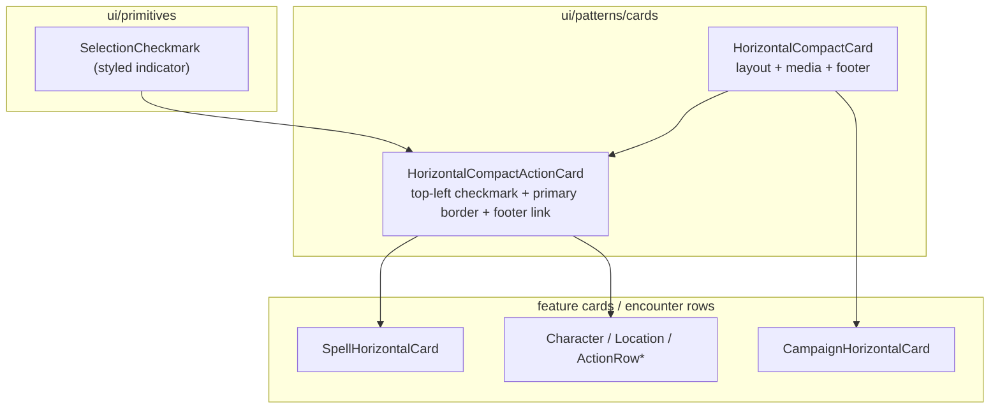

# Horizontal compact action card pattern

## Current state (what we are unifying)

- `[ActionRowBase.tsx](src/features/encounter/components/shared/ActionRow/ActionRowBase.tsx)`: **Paper**, first row = **title (left) + badges (right)**, optional caption second line. Selection = **outline border** + hover; **no checkmark**, no image.
- `[HorizontalCompactCard.tsx](src/ui/patterns/cards/HorizontalCompactCard.tsx)`: **Card** + optional **100px image**, title/sub/description, then **badges in a bottom row** next to `actions`. Optional full-card `[Link](src/ui/patterns/cards/HorizontalCompactCard.tsx)` wrapper when `link` is set.
- `[SpellHorizontalCard.tsx](src/features/content/spells/components/cards/SpellHorizontalCard.tsx)`: uses `HorizontalCompactCard`, passes **checkmark** in `actions` when `onToggle` is set (inline styles 66–86).

Your target: **SpellHorizontalCard should match SpellActionRow’s layout** (title + inline badges like `ActionRowBase`), **plus** selection affordances when toggling; encounter **Natural** / **Weapon** (and by extension **Spell** action rows) get the **same** selection UI; all horizontal cards support a **bottom-right action link**; `**link` prop removed** — navigation only via that footer affordance.

### Selection affordance (updated)

- When selected: `**borderColor: primary.main`** on the **Card** (not optional) **and** the checkmark indicator.
- **Checkmark placement**: **Top-left** of the card (not in the footer). Layout: a **fixed-width column** for the checkmark (`flexShrink: 0`) and a **main column** (`flex: 1`, `minWidth: 0`) for image + text so **headline and title row never wrap under** the checkmark. Footer row stays **full width below** this block so **bottom-right is free** for the “View details” link.

### SpellHorizontalCard content (mirror encounter action rows)

- **Subheadline**: `spell.description.summary` (replaces class list line at former 62–65 mapping).
- **Description**: **omit** (`undefined`) so the card matches encounter action cards (summary only as second line; no tertiary description block).
- **Footer action link**: **“View details”** → spell detail route (derive URL from existing app routes + `spell.id`; grep during implementation). `**openInNewTab: true`** (see below).
- **Badges**: keep level / school (or align with `SpellActionRow` badge set when implementing parity).

### Footer action link: new tab option

- Pattern-level prop (name TBD, e.g. `**footerActionOpenInNewTab?: boolean`**) on `HorizontalCompactCard` / `HorizontalCompactActionCard`, **default `false`**.
- When `**true**`: render footer link with `**target="_blank"**` and `**rel="noopener noreferrer"**` (security + correct behavior for new tab).
- **Spell usages**: set `**true`** everywhere the footer navigates to spell details — at minimum `**SpellHorizontalCard`**; also `**SpellActionRow`** (and any other spell-specific row/card that adds the same footer link) so behavior is consistent.
- **Location**: `[LocationHorizontalCard.tsx](src/features/content/locations/components/cards/LocationHorizontalCard.tsx)` gets an explicit footer **“View details”** action to the **location detail route** (same URL as today’s `link` prop / detail navigation). `**openInNewTab`**: **omit or `false`** — **same tab** (default).

## Recommended layering (scalable model)

1. `**SelectionCheckmark**` (new, `ui/primitives`): Extract the checkmark UI from `SpellHorizontalCard` (66–86) into a small component with props like `selected: boolean` (and optional `aria-*` / `size`). Keeps MUI theme tokens (`primary.main`, `divider`) via `sx` or theme.
2. `**HorizontalCompactCard**` (`[HorizontalCompactCard.tsx](src/ui/patterns/cards/HorizontalCompactCard.tsx)`) — **layout-only** responsibilities:
  - **Title row**: `headline` + **inline badges** on the right (mirror `ActionRowBase`’s first `Stack`: `justifyContent="space-between"`, `alignItems="flex-start"`, `minWidth: 0` on title).
  - **Subheadline / description**: unchanged order below title row.
  - **Footer row**: `justifyContent="space-between"` — **leading** slot (e.g. empty, future chips, or `actions` that are not the main nav) and **trailing** slot for the **optional bottom-right action link** (e.g. `Typography` “View details” or `RouterLink`). Rename props for clarity: e.g. `footerStart?: ReactNode`, `footerEnd?: ReactNode` (or keep `actions` as leading and add `footerAction?: ReactNode` for bottom-right only — pick one naming scheme and use it everywhere). Support `**footerActionOpenInNewTab?: boolean`** (default `**false`**); when true, apply `target` + `rel` on the rendered link.
  - **Media**: `image?: string` unchanged; add `**imageFallback?: string`** (or `placeholderImageSrc`) used when `image` is missing so the column width stays consistent (same 100px slot as today).
  - **Remove `link` prop** and the `Box component={Link}` wrapper per your decision. Callers pass a **footer** link/button instead.
3. `**HorizontalCompactActionCard`** (new file under `[src/ui/patterns/cards/](src/ui/patterns/cards/)`): Composes `HorizontalCompactCard` + selection behavior for rows that need encounter/spell-style UX:
  - Props aligned with `ActionRowBase`: `isSelected`, `isAvailable` (opacity), `onSelect` (row click).
  - **Card** uses `**borderColor: primary.main` when `isSelected`**, and default `divider` when not (same idea as current `ActionRowBase`).
  - **Root layout**: horizontal `**flex` row** — `**SelectionCheckmark`** column (**top-aligned**, `flexShrink: 0`) **+** `HorizontalCompactCard` (`flex: 1`, `minWidth: 0`) so the **card body** (image + text) never sits under the checkmark; footer row remains inside the card, **full width**, bottom-right for `**footerAction`**.
  - **Details link + `onToggle` / `onSelect`**: not inherently conflicting. **Row / card surface** handles toggle; **footer link** is a separate target — use `**onClick` on the link with `e.stopPropagation()`** so navigation does not also fire the parent toggle. Avoid invalid nesting (`<a>` inside `<button>`); keep link focusable for accessibility.
4. **Badge data shape**: Encounter rows use `**AppBadge`** fragments (`ReactNode`). Domain horizontal cards use `**CardBadgeProps[]` + `CardBadge`**. Avoid a second “badge row” at the bottom for primary metadata. Recommendation: `HorizontalCompactCard` accepts `**badges?: React.ReactNode`** for the title-row end (maximum flexibility). Feature components either map `CardBadgeProps[]` to `<CardBadge />` list or pass `AppBadge` groups — optionally add a tiny helper `renderCardBadges(props: CardBadgeProps[])` next to `CardBadge` exports to avoid repetition.

## File-by-file migration

| Area                                                                                                                         | Change                                                                                                                                                                                                                                                                                                                                                                              |
| ---------------------------------------------------------------------------------------------------------------------------- | ----------------------------------------------------------------------------------------------------------------------------------------------------------------------------------------------------------------------------------------------------------------------------------------------------------------------------------------------------------------------------------- |
| `[SpellHorizontalCard.tsx](src/features/content/spells/components/cards/SpellHorizontalCard.tsx)`                            | `subheadline={spell.description.summary}`; `description={undefined}`; footer **View details** with `**openInNewTab` true**; badges/level/school as today; selection via `HorizontalCompactActionCard` + `stopPropagation` on footer link when `onToggle` is set.                                                                                                                    |
| `[CampaignHorizontalCard.tsx](src/features/campaign/components/CampaignHorizontalCard/CampaignHorizontalCard.tsx)`           | Remove `link` on card; move “View details” / navigation to `**footerAction`** (bottom-right).                                                                                                                                                                                                                                                                                       |
| `[CharacterHorizontalCard.tsx](src/features/character/components/cards/CharacterHorizontalCard/CharacterHorizontalCard.tsx)` | Same: `**footerAction`** for navigation; drop default full-card `link` behavior.                                                                                                                                                                                                                                                                                                    |
| `[LocationHorizontalCard.tsx](src/features/content/locations/components/cards/LocationHorizontalCard.tsx)`                   | Same.                                                                                                                                                                                                                                                                                                                                                                               |
| `[ActionRowBase.tsx](src/features/encounter/components/shared/ActionRow/ActionRowBase.tsx)`                                  | **Replace implementation** with `HorizontalCompactActionCard` (or delete and inline into each row — prefer **one** base to avoid drift). Preserve public props shape so `ActionRow.tsx` / `WeaponActionRow` / `SpellActionRow` / `NaturalActionRow` / `GenericActionRow` stay thin **mappers** from `CombatActionDefinition` → `headline`, `badges`, `secondLine`, `onSelect`, etc. |
| `[SpellActionRow.tsx](src/features/encounter/components/shared/ActionRow/SpellActionRow.tsx)` etc.                           | Same footer-link behavior for spell rows: `**openInNewTab` true** when a spell details link is present. Otherwise mapping only if title/badge strings need to match post-refactor `SpellHorizontalCard`; encounter rows use **action** metadata, not full `Spell`.                                                                                                                  |
| Exports                                                                                                                      | Add `HorizontalCompactActionCard`, `SelectionCheckmark` types to `[src/ui/patterns/cards/index.ts](src/ui/patterns/cards/index.ts)` and `[src/ui/primitives/index.ts](src/ui/primitives/index.ts)` as appropriate.                                                                                                                                                                  |

## Call sites to update after `link` removal

Grep for `link=` / `HorizontalCompactCard` usage and update any route components that relied on **clicking anywhere** on the card — they will need `**footerAction`** with `Link`/`RouterLink` (or `Button component={Link}`).

## Resolved ambiguity

- **Navigation**: Full-card `link` **removed**; **only** bottom-right (footer) action link for navigation — applied consistently across campaign, character, location, and spell cards.
- **New tab**: Footer action link supports `**openInNewTab`** (default `**false`**); spell surfaces (`SpellHorizontalCard`, spell footer on `SpellActionRow`, etc.) use `**true`**.

## Remaining small decisions (non-blocking in code review)

- **Fallback image**: Use a single static asset under `public/` or `src/assets/` (e.g. neutral silhouette) passed as default `imageFallback` in pattern vs. per-feature icons (spell vs weapon). Start with **one global default** in `HorizontalCompactCard` optional prop.
- **Hover**: Keep `ActionRowBase`-style `**bgcolor: action.hover`** on the card when `onSelect` is defined (when not disabled).
- `**ActionRowBase` name**: Either keep as re-export alias of `HorizontalCompactActionCard` for backward compatibility, or rename in `[src/features/encounter/components/index.ts](src/features/encounter/components/index.ts)` with a short deprecation comment — prefer **minimal export churn** (keep `ActionRowBase` name as thin wrapper).

