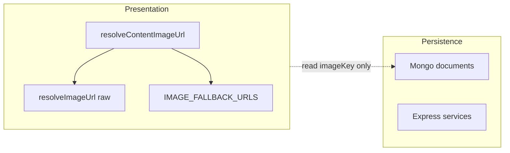

# Phased image fallback + imageKey rollout

## Phase 1 — Presentation only (safe types)

### 1.1 Central resolver (presentation separate from persistence)

- Add [`shared/lib/media/imageFallbacks.ts`](shared/lib/media/imageFallbacks.ts): `IMAGE_FALLBACK_URLS` (exact flat map you specified), `ImageContentType` as `keyof typeof IMAGE_FALLBACK_URLS`, and `getImageFallbackUrl(type)`.
- Add [`shared/lib/media/resolveContentImageUrl.ts`](shared/lib/media/resolveContentImageUrl.ts):
  - `resolveContentImageUrl(contentType, imageKey): string` — uses existing [`resolveImageUrl`](shared/lib/media/resolveImageUrl.ts) for non-empty keys; otherwise returns `getImageFallbackUrl(contentType)`.
- Re-export from [`shared/lib/media/index.ts`](shared/lib/media/index.ts).
- Add a small **Vitest** file under `shared/lib/media/` (or existing test layout) covering: empty key → fallback; `/assets/…` key → unchanged; storage key → `/uploads/…`.

**Naming:** keep `resolveImageUrl` as **raw-only**; document in file header that routes/components should prefer `resolveContentImageUrl` for UI.

### 1.2 Campaign content list grids

- Extend [`AppDataGridColumn`](src/ui/patterns/AppDataGrid/types/appDataGrid.types.ts) with optional `imageContentType?: ImageContentType` (required whenever `imageColumn` is used in practice).
- Update [`appDataGridColumns.tsx`](src/ui/patterns/AppDataGrid/core/appDataGridColumns.tsx) image branch: `src={resolveContentImageUrl(column.imageContentType ?? 'gear', imageKey)}` (or require `imageContentType` and fix all call sites — **prefer required** to avoid silent wrong fallback).
- Thread `imageContentType` through [`makePreColumns`](src/features/content/shared/components/contentListTemplate.tsx) / [`buildCampaignContentColumns`](src/features/content/shared/components/contentListTemplate.tsx) (new required param `imageContentType`).
- Pass the correct type from each list route:

| Route | `imageContentType` |
|-------|-------------------|
| [`MonsterListRoute`](src/features/content/monsters/routes/MonsterListRoute.tsx) | `monster` |
| [`SpellListRoute`](src/features/content/spells/routes/SpellListRoute.tsx) | `spell` |
| [`RaceListRoute`](src/features/content/races/routes/RaceListRoute.tsx) | `race` |
| [`ClassListRoute`](src/features/content/classes/routes/ClassListRoute.tsx) | `class` |
| [`LocationListRoute`](src/features/content/locations/routes/LocationListRoute.tsx) | `location` |
| [`SkillProficiencyListRoute`](src/features/content/skillProficiencies/routes/SkillProficiencyListRoute.tsx) | `skillProficiencies` |
| [`GearListRoute`](src/features/content/equipment/gear/routes/GearListRoute.tsx) | `gear` |
| [`ArmorListRoute`](src/features/content/equipment/armor/routes/ArmorListRoute.tsx) | `armor` |
| [`WeaponsListRoute`](src/features/content/equipment/weapons/routes/WeaponsListRoute.tsx) | `weapon` |
| [`MagicItemsListRoute`](src/features/content/equipment/magicItems/routes/MagicItemsListRoute.tsx) | `equipment` (map has `equipment` → generic; avoids new key) |

- Avatar cells will **always** have a `src` (fallback PNG). Optionally keep initials as `img` `onError` fallback later; not required for Phase 1.

### 1.3 Shared detail layout component

- Add [`ContentDetailImageKeyValueGrid.tsx`](src/features/content/shared/components/ContentDetailImageKeyValueGrid.tsx) (name can be adjusted): MUI `Grid` **12 columns**, **md:8 / md:4**, `order` so **image stacks first on xs** (match current [`MonsterDetailRoute`](src/features/content/monsters/routes/MonsterDetailRoute.tsx) structure). Props: `imageContentType`, `imageKey`, `alt`, optional `maxHeight` (default **500**; use **200** for equipment detail pages to preserve current visual scale), `children` = `KeyValueSection` (or fragment).
- Image: **always** render `` (no `imageKey &&`).
- Export from [`src/features/content/shared/components/index.ts`](src/features/content/shared/components/index.ts).

### 1.4 Detail routes — adopt grid + resolver

Migrate to `ContentDetailImageKeyValueGrid` + `resolveContentImageUrl`:

- [`MonsterDetailRoute`](src/features/content/monsters/routes/MonsterDetailRoute.tsx) — fix conditional image; `imageContentType="monster"`.
- [`SpellDetailRoute`](src/features/content/spells/routes/SpellDetailRoute.tsx) — add grid (currently KV only); prose (`Typography` full description) **below** grid.
- [`RaceDetailRoute`](src/features/content/races/routes/RaceDetailRoute.tsx), [`ClassDetailRoute`](src/features/content/classes/routes/ClassDetailRoute.tsx), [`SkillProficiencyDetailRoute`](src/features/content/skillProficiencies/routes/SkillProficiencyDetailRoute.tsx) — grid + **fallback-only** display (`race` / `class` / `skillProficiencies`); normalize prose order where needed (prefer **grid first**, long description after, like spell).
- [`LocationDetailRoute`](src/features/content/locations/routes/LocationDetailRoute.tsx)
- [`ArmorDetailRoute`](src/features/content/equipment/armor/routes/ArmorDetailRoute.tsx), [`GearDetailRoute`](src/features/content/equipment/gear/routes/GearDetailRoute.tsx), [`WeaponDetailRoute`](src/features/content/equipment/weapons/routes/WeaponDetailRoute.tsx), [`MagicItemDetailRoute`](src/features/content/equipment/magicItems/routes/MagicItemDetailRoute.tsx) — `maxHeight={200}`, correct `imageContentType`.

Remove direct `resolveImageUrl` imports from these routes where replaced.

### 1.5 Character / NPC surfaces (presentation)

- Update [`CharacterAvatar.tsx`](src/features/character/components/CharacterAvatar.tsx), [`CampaignPartySection`](src/features/character/components/sections/CampaignPartySection/CampaignPartySection.tsx) / [`CharacterMediaTopCard`](src/features/character/components/) if it takes URLs, [`NpcGallerySection`](src/features/character/components/sections/NpcGallerySection/NpcGallerySection.tsx) to use `resolveContentImageUrl('character', imageKey)` (NPC uses same fallback asset per map).

### 1.6 Remove false “persist” affordance for race (Phase 1 constraint)

- In [`raceForm.registry.ts`](src/features/content/races/domain/forms/registry/raceForm.registry.ts), **stop using** [`getBaseContentFieldSpecs`](src/features/content/shared/forms/baseFieldSpecs.ts) until Phase 2. Use [`getNameDescriptionFieldSpecs`](src/features/content/shared/forms/baseFieldSpecs.ts) + the same `accessPolicy` field pattern other minimal forms use (mirror how some forms skip image). This removes the misleading **Image** upload while persistence is still missing.

### Phase 1 deliverable checklist

- Central resolver + tests
- List + detail + key character surfaces on final resolver
- Race form no longer exposes `imageKey` editor
- Short report: files touched; **deferred**: Monster E2E imageKey, race/class/skill DB/API, monster PATCH contract

---

## Phase 2 — E2E `imageKey` for race, class, skill proficiencies

Use **Spell** ([`CampaignSpell.model.ts`](server/shared/models/CampaignSpell.model.ts), [`spells.service.ts`](server/features/content/spells/services/spells.service.ts)) and **Equipment** ([`CampaignEquipment.model.ts`](server/shared/models/CampaignEquipment.model.ts)) as references — **top-level `imageKey` string**, validated on write, returned on read.

### Race

- Mongo: add `imageKey` to [`CampaignRace.model.ts`](server/shared/models/CampaignRace.model.ts).
- Service: [`races.service.ts`](server/features/content/races/services/races.service.ts) — validate optional string; `create`/`update`/`toDoc` include `imageKey`.
- Client: [`CampaignRaceDto` / `toRace`](src/features/content/races/domain/repo/raceRepo.ts); restore **base field specs** (image upload) in race form registry; ensure `RaceInput` / mappers round-trip.

### Class

- Mongo: add **top-level** `imageKey` to [`CampaignClass.model.ts`](server/shared/models/CampaignClass.model.ts) (not inside `data` / `extractData` whitelist).
- Service: [`classes.service.ts`](server/features/content/classes/services/classes.service.ts) — validate, read/write `imageKey` alongside `name`/`description`; **do not** bury in `extractData`.
- Client: extend [`CampaignClassDto` / `toCharacterClass`](src/features/content/classes/domain/repo/classRepo.ts) and merged `ClassContentItem` typing; add `imageKey` to class form registry (e.g. adopt base content image spec or align with spell pattern); [`classForm.mappers`](src/features/content/classes/domain/forms/mappers/classForm.mappers.ts) if needed.

### Skill proficiencies

- Mongo: add `imageKey` to [`CampaignSkillProficiency.model.ts`](server/shared/models/CampaignSkillProficiency.model.ts).
- Service: [`skillProficiencies.service.ts`](server/features/content/skillProficiencies/services/skillProficiencies.service.ts) — full CRUD fields.
- Client: DTO + [`skillProficiencyRepo`](src/features/content/skillProficiencies/domain/repo/skillProficiencyRepo.ts); form registry + mappers.

### Phase 2 verification

- Manual or API-level smoke: create → GET list → PATCH → detail shows persisted image (not only fallback).
- Report: per-type layer table (schema, service, DTO, form, routes).

---

## Phase 3 — Monster PATCH contract, then monster `imageKey`

### 3.1 Fix PATCH contract first

- **Recommended approach (minimal client churn):** In [`monsters.service.ts`](server/features/content/monsters/services/monsters.service.ts) `update`, merge a **flat** PATCH body into existing `data` (mirror `create`’s “rest → data” semantics): strip `name`, `monsterId`, `id`, `accessPolicy`, `data`; merge remaining keys into current `data` document (deep-merge only if already required elsewhere — prefer **shallow replace of provided top-level keys inside `data`** or full `data` replace if body includes `data` — **pick one and document in a short comment**).
- Ensure [`validateInput`](server/features/content/monsters/services/monsters.service.ts) allows optional `imageKey` string if you validate at service layer (optional for Phase 3.2).
- Confirm [`toMonster`](src/features/content/monsters/domain/repo/monsterRepo.ts) still spreads `dto.data` after change.

### 3.2 Monster `imageKey` E2E

- Add `imageKey` to [`MONSTER_FORM_FIELDS`](src/features/content/monsters/domain/forms/registry/monsterForm.registry.ts) (e.g. `imageUpload` spec like base content) and wire [`monsterForm.mappers`](src/features/content/monsters/domain/forms/mappers/monsterForm.mappers.ts) (`monsterToFormValues` / `toMonsterInput`) so `imageKey` round-trips.
- Server: if not covered by generic merge, explicitly validate `imageKey` type on create/update.
- Detail route already uses grid + resolver from Phase 1.

### Phase 3 deliverable

- Comment or short note documenting **chosen PATCH contract** next to server `update`.
- Report: contract summary + files changed.

---

## Architecture notes (carry forward)

- **Do not** put fallback URLs in server persistence or DTO normalization.
- **Phase 1** explicitly uses **fallback-only** rendering for types without storage until Phase 2/3.

## Suggested execution order

Implement **Phase 1 fully**, then **Phase 2** (race → class → skill proficiency, or parallel by layer), then **Phase 3**. Slight reorder inside Phase 1 (resolver before routes) is natural.

## Risks / remaining concerns after all phases

- **System catalog** entries may still lack `imageKey`; presentation fallback remains correct.
- **Monster** deep-merge semantics: if you need partial nested updates inside `data`, document behavior to avoid clobbering.
