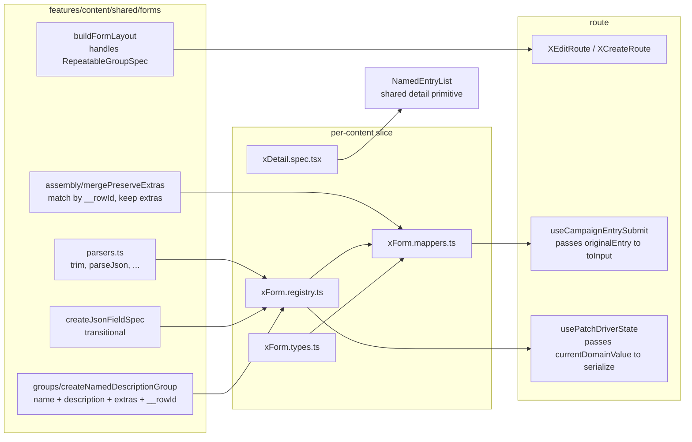

# JSON forms to structured groups

Migrate class/monster `kind: 'json'` form fields to structured selects, text fields, and repeatable groups, mirroring the spell pattern. MVP exposes `name + description` for complex rows (just `name` for natural attacks); other domain fields are preserved per-row via a transient `__rowId` + merge-with-original. Detail specs gain default `structuredMainAndAdvanced` so platform admins can verify round-trips.

## Architecture



## Phase 0 — Shared substrate (one PR before the slice work)

### 0.1 Parsers & helpers
- **New** `src/features/content/shared/forms/parsers.ts` — exports `trim`, `trimOrNull`, `strOrEmpty`, `numOrUndefined`, `numToStr`, `arrOrEmpty`, `parseJsonObject`, `formatJsonObject` (currently re-declared in `classForm.registry.ts:10-35`, `monsterForm.registry.ts:24-57`, `spellForm.registry.ts:78-86`, `weaponForm.registry.ts:30-31`).
- Migrate the four registries to import from here.

### 0.2 Transitional JSON field helper
- **New** `src/features/content/shared/forms/registry/createJsonFieldSpec.ts` — lift the private `jsonField()` factory from [`src/features/content/monsters/domain/forms/registry/monsterForm.registry.ts:62-80`](src/features/content/monsters/domain/forms/registry/monsterForm.registry.ts) and export as deprecated/transitional. Used by class/monster registries until each section migrates; greppable via the import for "what's left to migrate".

### 0.3 Detail spec defaults (default-on `structuredMainAndAdvanced`)
- Modify [`src/features/content/shared/forms/registry/buildContentDetailSectionsFromSpecs.ts`](src/features/content/shared/forms/registry/buildContentDetailSectionsFromSpecs.ts) so that any spec with `getValue` and no `placement` is treated as `structuredMainAndAdvanced` (rawAudience: `platformOwner`, `hideIfEmpty: true`). Existing specs that set `placement` explicitly still win.
- Update [`buildContentDetailSectionsFromSpecs.test.ts`](src/features/content/shared/forms/registry/buildContentDetailSectionsFromSpecs.test.ts) with one assertion each for default-on and explicit opt-out.

### 0.4 Builder convergence (per slice)
Class/monster routes currently call `buildFieldConfigs` (only flat fields). Each slice migration flips that route to `buildFormLayout` + `DynamicFormRenderer` — same pattern spell uses today. No "merge builders" mega-PR; the swap is contained per slice.
- Reference: [`src/features/content/spells/domain/forms/registry/spellForm.registry.ts:625-651`](src/features/content/spells/domain/forms/registry/spellForm.registry.ts) (`getSpellFormFields()` returns `FormNodeSpec[]`).
- Confirm `ConditionalFormRenderer` accepts `FormLayoutNode[]`; if not, add a thin shim that delegates to `DynamicFormRenderer` for tree specs.

### 0.5 Shared `name + description` repeatable group
- **New** `src/features/content/shared/forms/groups/createNamedDescriptionGroup.ts`:

```ts
export type NamedDescriptionFormRow = {
  __rowId: string;
  name: string;
  description: string;
};

export function createNamedDescriptionGroup<TItem extends Record<string, unknown>>(opts: {
  name: string;                       // RHF array key
  domainPath: string;                 // patch driver dot-path (e.g. "mechanics.traits")
  itemLabel: string;
  /** Drop description for name-only variants (natural attacks). */
  includeDescription?: boolean;
  extras?: NestedFieldSpec[];
  /** Domain-side keys the form authoritatively owns (default ['name','description']). */
  ownedKeys?: readonly (keyof TItem & string)[];
}): RepeatableGroupSpec;
```

Built-ins:
- hidden `__rowId` field (`kind: 'text'`, `skipInForm: true`, but kept in form values).
- `name` text field.
- `description` textarea field unless `includeDescription === false`.
- spread of `extras` (e.g. `{ name: 'level', kind: 'numberText' }` for class features).
- `patchBinding`: `parse(domainArray)` tags each row with `crypto.randomUUID()`; `serialize(uiArray, sourceArray)` calls `mergePreserveExtras` (Phase 0.6).

### 0.6 Preserve-extras assembly
- **New** `src/features/content/shared/forms/assembly/mergePreserveExtras.ts`:

```ts
export function mergePreserveExtras<T extends Record<string, unknown>>(
  formRows: ReadonlyArray<NamedDescriptionFormRow & Partial<T>>,
  sourceRows: ReadonlyArray<T> | undefined,
  ownedKeys: readonly (keyof T & string)[],
): T[];
```

Behavior:
- Indexes `sourceRows` by an internal Map keyed by the `__rowId` tagged at load (load-time map kept on a WeakRef-ish closure or re-derived by stable iteration).
- For each form row: locate source row → `{ ...source, ...pick(formRow, ownedKeys) }`.
- New form rows (no source match) → `pick(formRow, ownedKeys)` with extras absent.
- Strips `__rowId` from the returned items.

### 0.7 Submit hook threading (one-time shared change)
- Modify [`src/features/content/shared/hooks/useCampaignEntrySubmit.ts`](src/features/content/shared/hooks/useCampaignEntrySubmit.ts) so `toInput` receives `(values, original?)`. Pass the loaded entry from the call sites (already in scope at [`MonsterEditRoute.tsx:123-131`](src/features/content/monsters/routes/MonsterEditRoute.tsx) and [`ClassEditRoute.tsx:117-125`](src/features/content/classes/routes/ClassEditRoute.tsx)). Backward-compatible: existing `toInput(values)` callers ignore the second arg.
- Patch driver path already gets `currentDomainValue` via `patchBinding.serialize` — no shared change needed there.

### 0.8 Shared detail summary primitive
- **New** `src/features/content/shared/components/detail/NamedEntryList.tsx` — `<Stack spacing>` of `<Box>{subtitle2 title}{callout?}{body2 description}{children?}</Box>`. Replace the bodies of [`MonsterTraitsSummary.tsx`](src/features/content/monsters/components/views/MonsterView/sections/MonsterTraitsSummary.tsx), the action entry in [`MonsterActionsSummary.tsx`](src/features/content/monsters/components/views/MonsterView/sections/MonsterActionsSummary.tsx), and the new class section components in later phases.

## Phase 1 — Pilot: Monster traits ✅

Smallest blast radius: pure name+description, no per-kind branching. Exercises preserve-extras (`trigger`, `effects`, `uses`, `resolution.caveats`) and patch parity end-to-end.

**Status: COMPLETED.** All Phase 1 tasks landed; full slice test command (per AGENTS.md) plus monsters/classes/shared suites pass with **0 new TypeScript errors** vs. baseline.

What shipped:

- `jsonField('traits', ...)` → `createNamedDescriptionGroup({ name: 'traits', domainPath: 'mechanics.traits', itemLabel: 'Trait', label: 'Traits' })`, exported as `monsterTraitsGroup` from [`monsterForm.registry.ts`](src/features/content/monsters/domain/forms/registry/monsterForm.registry.ts). New `getMonsterFormFields()` factory composes the flat tuple + structured group into `FormNodeSpec[]`.
- [`monsterForm.types.ts`](src/features/content/monsters/domain/forms/types/monsterForm.types.ts): `traits: string` → `traits: MonsterTraitFormRow[]` (alias of `NamedDescriptionFormRow`).
- [`monsterForm.mappers.ts`](src/features/content/monsters/domain/forms/mappers/monsterForm.mappers.ts):
  - New exported `tagMonsterForEditing(monster)` returns a shallow-cloned monster whose `mechanics.traits[]` carry transient `__rowId`s. Memoized once per loaded entry on the route so the same instance flows to both `monsterToFormValues` and the patch driver / submit-hook `originalEntry`.
  - `monsterToFormValues` propagates `__rowId` from the tagged source onto form rows.
  - `toMonsterInput(values, original?)` calls `mergePreserveExtras(values.traits, original?.mechanics?.traits, ['name','description'])` — extras (`resolution.caveats`, hypothetical `trigger`/`effects`/`uses`) round-trip byte-equal.
- [`monsterForm.config.ts`](src/features/content/monsters/domain/forms/config/monsterForm.config.ts): swap `buildFieldConfigs` → `buildFormLayout`, return `FormLayoutNode[]`. `ConditionalFormRenderer` already accepts `FormLayoutNode[]` (delegates to `DynamicFormRenderer` internally); no route-level renderer swap needed.
- [`MonsterEditRoute.tsx`](src/features/content/monsters/routes/MonsterEditRoute.tsx): wraps the loaded entry through `tagMonsterForEditing` once via `useMemo` and threads it into both `useCampaignEntryFormReset` and the patch-driver base / `useCampaignEntrySubmit.originalEntry`.
- [`MonsterTraitsSummary.tsx`](src/features/content/monsters/components/views/MonsterView/sections/MonsterTraitsSummary.tsx) now renders via `<NamedEntryList items={...} />`.

Phase-0 follow-ups landed alongside Phase 1 to make the patch path actually round-trip:

- `tagRowsWithIds` now **preserves** an existing non-empty `__rowId` (instead of always minting fresh) so successive `parse → serialize` cycles in patch mode keep stable identity.
- `createNamedDescriptionGroup.serialize` re-attaches the form row's `__rowId` to the merged output so the patch state retains identity across renders. Persistence boundary stripping moved into the shared `useSystemPatchActions.savePatch` via the new `stripRowIdsDeep` helper in [`mergePreserveExtras.ts`](src/features/content/shared/forms/assembly/mergePreserveExtras.ts).

Tests (all pass, all green):

- [`monsterForm.mappers.preserveExtras.test.ts`](src/features/content/monsters/domain/forms/mappers/monsterForm.mappers.preserveExtras.test.ts): aboleth fixture → form values → edit `Mucus Cloud` description → save. Asserts `mucus-cloud.resolution.caveats` and every other trait survive byte-equal. Reorder, insert, delete cases included; create-flow (no `original`) yields owned-keys-only rows.
- [`monsterTraits.patchDriver.test.ts`](src/features/content/monsters/domain/forms/mappers/monsterTraits.patchDriver.test.ts): patch-driver smoke. Verifies (a) no-op render-cycle round-trip is data-equivalent to the tagged base after stripping ids, (b) a single description edit preserves every other row's extras byte-for-byte and the persisted patch (after `stripRowIdsDeep`) carries the edit, (c) two successive edits across a `parse → serialize → setValue → parse` cycle don't drop extras.
- Phase-0 helpers ([`mergePreserveExtras.test.ts`](src/features/content/shared/forms/assembly/mergePreserveExtras.test.ts), [`createNamedDescriptionGroup.test.ts`](src/features/content/shared/forms/groups/createNamedDescriptionGroup.test.ts)) extended with idempotent `__rowId` preservation, fresh-id minting only when missing, and `stripRowIdsDeep` coverage.

## Phase 2 — Class: definitions.options[]

**Status: COMPLETED.** Definitions JSON replaced with grouped scalar fields (`definitionsId`, `definitionsName`, `definitionsSelectionLevel` + patch binding on level), repeatable `definitionsOptions` built from `createNamedDescriptionGroup`, and `SubclassOptionsSummary` wired to `structuredMainAndAdvanced` in class detail specs. Mapper uses `mergePreserveExtras`/`tagClassForEditing` as in Phase 1. Tests live in `classForm.mappers.subclassOptions.test.ts`.

## Phase 3 — Class: progression composites + features[]

**Status: COMPLETED.** JSON `progression` removed from `CLASS_FORM_FIELDS`; grouped fields + `progressionFeatures` repeatable are injected after Proficiencies alongside the Phase 2 definitions block. Mapper merges over `original.progression` so `spellProgression`, `hpPerLevel`, and `features[].effects` MVP extras persist. Detail uses `ClassProgressionSummary`, `ClassFeatureList`, and `structuredMainAndAdvanced`. Tests in `classForm.mappers.progression.test.ts`; presentation asserts fighter hit die in main.

## Phase 4 — Monster stat block composites (no repeatable groups)

Flat composites only; detail summaries already friendly:

- `mechanics.hitPoints.{count,die,modifier}` — numberText group.
- `mechanics.armorClass.{kind,offset}` — select + numberText.
- `mechanics.movement.{ground,swim,fly,climb,burrow}` — numberText group.
- `mechanics.abilities.{str,dex,con,int,wis,cha}` — numberText group.

## Phase 5 — Monster: actions / bonusActions / legendaryActions (per-kind branching)

UI splits the unified `mechanics.actions[]` (and bonus/legendary equivalents) into **three sub-arrays at load time**:

- `specialActions` (`kind === 'special'`) → `createNamedDescriptionGroup({ itemLabel: 'Special action' })`.
- `naturalActions` (`kind === 'natural'`) → `createNamedDescriptionGroup({ includeDescription: false, itemLabel: 'Natural attack' })` (name only; `notes`, `attackBonus`, `damage`, `reach`, `damageType`, `onHitEffects` preserved).
- `weaponActions` (`kind === 'weapon'`) → render read-only "Weapon: <weaponRef>" rows; authoring deferred.

Save assembly concatenates the three sub-arrays back into `mechanics.actions[]` (preserving each row's extras via `mergePreserveExtras`). Same recipe for `bonusActions[]` and `legendaryActions.actions[]`.

[`MonsterActionsSummary.tsx`](src/features/content/monsters/components/views/MonsterView/sections/MonsterActionsSummary.tsx) + [`MonsterLegendaryActionsSummary.tsx`](src/features/content/monsters/components/views/MonsterView/sections/MonsterLegendaryActionsSummary.tsx) — refresh bodies onto `<NamedEntryList>` with the existing callout helpers.

## Phase 6 — Monster: senses, equipment, languages, description

- `mechanics.senses.{passivePerception, special[]}`: flat `passivePerception` numberText + repeatable group of `{ type: select, range: numberText }`.
- `mechanics.equipment`: small composites or option pickers.
- `description.short` text + `description.long` textarea group; un-comment the disabled detail row at [`monsterDetail.spec.tsx:51-56`](src/features/content/monsters/domain/details/monsterDetail.spec.tsx).

## Phase 7 — Class: proficiencies + requirements

- `proficiencies.{skills,weapons,armor,tools}`: discriminated `type: 'choice' | 'fixed'` select + level numberText + `from`/`categories`/`items` chip inputs (with `visibleWhen`).
- `requirements.allowedRaces` (`'all' | RaceId[]`) and `requirements.allowedAlignments` — discriminated select + optionPicker.
- `requirements.multiclassing.note` text + `anyOf[]` as a repeatable group (rows = `{ all: AbilityRequirement[] }`); `minStats` similar. Defer further nesting beyond MVP.
- Replace `classProficienciesFriendly`, `classRequirementsFriendly` with `ClassView/sections/{ClassProficienciesSummary,ClassRequirementsSummary}.tsx`.

## Phase 8 — Cleanup

- Delete `createJsonFieldSpec` once no slice imports it.
- Delete `class*Friendly` string-builders ([`classDetail.spec.tsx:31-113`](src/features/content/classes/domain/details/classDetail.spec.tsx)).
- Remove the bespoke `classRawRecord` row at [`classDetail.spec.tsx:115-136,194-201`](src/features/content/classes/domain/details/classDetail.spec.tsx) — Phase 0.3 gives every structured row a per-row platform-owner raw cell automatically.

## Recommended call-outs adopted (locking in)

- **Pilot slice**: monster traits — pure name+description.
- **Detail defaults**: any `getValue` row defaults to friendly+raw with `platformOwner` audience.
- **Shared naming**: `createNamedDescriptionGroup` core + thin domain-named exports per slice (e.g. `monsterTraitGroup = createNamedDescriptionGroup({...})`).
- **Builder convergence**: per-slice route swap to `buildFormLayout` (no big-bang refactor).
- **Form values typing**: per-slice replacement (drop the JSON-string column for that section in the same PR).
- **Row identity**: `crypto.randomUUID()` at load, transient — never persisted to the domain.

## Test slice

Extend the AGENTS.md command to:

```
npx vitest run \
  shared/domain/dice/dice.parse.test.ts \
  src/features/content/shared/forms/dice/ \
  src/features/content/shared/forms/groups/ \
  src/features/content/shared/forms/assembly/ \
  src/features/content/shared/forms/registry/ \
  src/features/content/equipment/weapons/domain/forms/ \
  src/features/content/spells/domain/forms/ \
  src/features/content/monsters/domain/forms/ \
  src/features/content/classes/domain/forms/
```

## Risks / watch-outs

- `useCampaignEntrySubmit` signature change (Phase 0.7) ripples through every slice; ship 0.7 first.
- The patch driver's `serialize(uiValue, currentDomainValue)` provides the source array, but only at save time. The `__rowId` map must be built at load (`parse`) and held in closure long enough for the next save — verify there's no stale-source case when the patched entry is reloaded.
- `ConditionalFormRenderer` may not natively understand `FormLayoutNode[]` (only spell uses `DynamicFormRenderer` today). Confirm in Phase 0.4; add a shim if needed.
- Detail spec default-on (Phase 0.3) is a behavior change for any existing `getValue` row that didn't explicitly set `placement`. Audit current call sites before flipping; the only affected files at the time of this plan are the monster detail spec (which already uses the explicit `structuredMainAndAdvanced` spread, so behavior is preserved).
