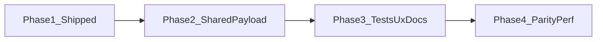
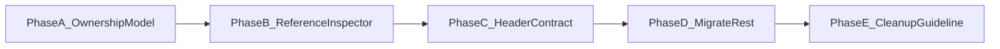
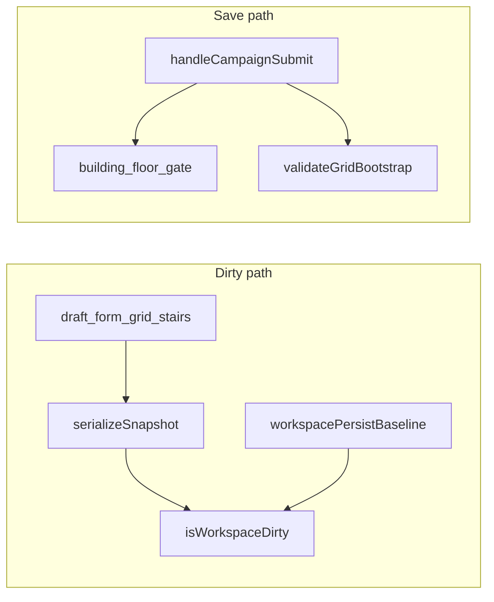

# Location map workspace: scalable dirty-state plan

## Phased roadmap

| Phase | Goal | Primary outcome |
| ----- | ---- | --------------- |
| **1** | Persistable snapshot + baseline | `isWorkspaceDirty`, [`workspacePersistableSnapshot.ts`](src/features/content/locations/routes/locationEdit/workspacePersistableSnapshot.ts), hydration/save baseline, [`location-workspace.md`](docs/reference/location-workspace.md) — **done** |
| **2** | Single source of truth | One builder for “what would be persisted” consumed by **both** dirty snapshot and `handleCampaignSubmit` — eliminates save vs dirty drift |
| **3** | Quality + rail UX | Table/matrix tests, contributor checklist in docs, explicit policy for nested **submit-to-commit** inspectors |
| **4** | Parity + polish | System patch rules documented or aligned; optional snapshot memoization if profiling says so |

---

## Current behavior (as implemented)

- **Campaign** edit header uses [`LocationEditRoute.tsx`](src/features/content/locations/routes/LocationEditRoute.tsx): `dirty={isWorkspaceDirty}` (persistable snapshot vs baseline from [`useLocationEditWorkspaceModel.ts`](src/features/content/locations/routes/locationEdit/useLocationEditWorkspaceModel.ts), [`workspacePersistableSnapshot.ts`](src/features/content/locations/routes/locationEdit/workspacePersistableSnapshot.ts)).
- **System** patch branch: `dirty={isSystemLocationWorkspaceDirty(driver.isDirty(), isGridDraftDirty)}` ([`systemLocationWorkspaceDirty.ts`](src/features/content/locations/routes/locationEdit/systemLocationWorkspaceDirty.ts)) — patch JSON dirty **or** grid draft dirty; **not** the campaign persistable snapshot (intentional).
- **`isGridDraftDirty`** remains for the system branch; campaign Save no longer relies on RHF `formState.isDirty` alone.
- **Save path (campaign):** [`handleCampaignSubmit`](src/features/content/locations/routes/locationEdit/useLocationEditSaveActions.ts) builds payloads via **`buildCampaignWorkspacePersistableParts`** (same helper as [`serializeLocationWorkspacePersistableSnapshot`](src/features/content/locations/routes/locationEdit/workspacePersistableSnapshot.ts)).

Rail tabs (**Location / Map / Selection**) are not separate stores: they feed the same `FormProvider` form, `gridDraft`, and (for buildings) `buildingStairConnections`. Tab-specific dirty flags are unnecessary if the **aggregate snapshot** (campaign) or **patch + grid** (system) is correct.

## Root causes this design fixes

1. **Split sources of truth** — Anything that is **saved** but **not** reflected in RHF `isDirty` or in `gridDraftPersistableEquals` will keep Save disabled. The save path already uses `**buildingStairConnectionsRef`** for building saves; that state lives **outside** the current `dirty` expression and is a **concrete gap** for “rail changed but Save stays off” whenever connections and normalized grid data do not both move (or when only the ref-relevant slice changes). A **single snapshot** that mirrors submit inputs removes this class of bug for future parallel state too.
2. **RHF `isDirty` fragility** — Conditional fields, programmatic `setValue` without `shouldDirty`, or subscription quirks can miss edits. Comparing `**getValues()`-derived persistable input** (same shape as save) is more reliable than trusting `isDirty` alone.
3. **Map draft compare is already normalized** — `[gridDraftPersistableEquals](src/features/content/locations/components/locationGridDraft.utils.ts)` + `[normalizedAuthoringPayloadFromGridDraft](src/features/content/locations/components/locationGridDraft.utils.ts)` are the right building blocks; extend them into a **workspace-level** compare, not new per-field listeners.

## Shipped design (summary)

**Campaign:** `buildCampaignWorkspacePersistableParts` feeds both [`handleCampaignSubmit`](src/features/content/locations/routes/locationEdit/useLocationEditSaveActions.ts) and [`serializeLocationWorkspacePersistableSnapshot`](src/features/content/locations/routes/locationEdit/workspacePersistableSnapshot.ts); baseline string is set after successful map hydration and after successful campaign save. **Dirty:** `isWorkspaceDirty` compares current snapshot to baseline.

**System:** `isSystemLocationWorkspaceDirty(patchDriver.isDirty(), isGridDraftDirty)` in [`systemLocationWorkspaceDirty.ts`](src/features/content/locations/routes/locationEdit/systemLocationWorkspaceDirty.ts) — not the campaign snapshot.

Full architecture, nested-form policy, and pointers **#8–#9** live in [`location-workspace.md`](docs/reference/location-workspace.md).

## Remaining risks and gaps (post-ship)

### In good shape

- **Campaign save vs dirty drift** is largely mitigated by the shared **`buildCampaignWorkspacePersistableParts`** path.
- **Contributor-facing** detail: [`location-workspace.md`](docs/reference/location-workspace.md) (campaign snapshot, system two-rule dirty, nested rails, whitespace, performance).

### Risks

| Risk | Notes |
| ---- | ----- |
| **New persistence without updating the builder** | If a field is persisted outside `buildCampaignWorkspacePersistableParts` / `toLocationInput` / map bootstrap, expect **false negatives** (Save stays off) or inconsistent dirty behavior. Mitigation: extend the shared builder and the checklist in `location-workspace.md`; no automated lint today. |
| **Hydration / grid layout ordering** | **False positives** after prune or dimension changes if draft and baseline update in different orders. Mitigate with baseline only at hydration/save boundaries; add focused tests when changing [`useLocationMapHydration.ts`](src/features/content/locations/routes/locationEdit/useLocationMapHydration.ts) or grid reset. |
| **Post-save baseline uses `loc`, not `updated`** | After campaign save, baseline serialization uses `loc` from closure while the form was reset from `updated`. [`mergeBuildingProfileForSave`](src/features/content/locations/routes/locationEdit/workspacePersistableSnapshot.ts) layers `loc.buildingProfile` under form input; **server-only** keys not in the form could theoretically skew the snapshot until the route refetches `loc`. Low risk if the form owns those fields. |
| **Whitespace / normalization** | Spacing-only edits may not dirty the snapshot if `toLocationInput` / normalization trims — documented in `location-workspace.md`. |
| **Performance** | Snapshot string is memoized in [`useLocationEditWorkspaceModel.ts`](src/features/content/locations/routes/locationEdit/useLocationEditWorkspaceModel.ts); broad `watch()` deps remain. Narrow only if profiling shows a hotspot. |

### Gaps (by design or follow-up)

| Gap | Notes |
| --- | ----- |
| **Nested submit-to-commit rails** | Edits that apply to `gridDraft` only on **panel Submit** are invisible to `isWorkspaceDirty` until then. **Target fix:** § [Refactor-first plan](#refactor-first-plan-make-workspace-draft-the-single-source-of-truth-for-persistable-edits) (Phases A–E): workspace-owned draft for persistable edits; avoid end-state “flush all panels on Save.” |
| **System vs campaign semantics** | Two models: **patch driver + grid draft** vs **full campaign persistable snapshot**. No unified “serialize like server” for system unless product requests a larger refactor. |
| **Test depth** | [`workspacePersistableSnapshot.test.ts`](src/features/content/locations/routes/locationEdit/workspacePersistableSnapshot.test.ts) matrix + [`systemLocationWorkspaceDirty.test.ts`](src/features/content/locations/routes/locationEdit/systemLocationWorkspaceDirty.test.ts); **no E2E** for header Save across full flows. |
| **Optional automation** | CI guard if save and snapshot builders diverge — not implemented. |

### Process

- Keep **Pointers for the next agent** in [`location-workspace.md`](docs/reference/location-workspace.md) linked to [`workspacePersistableSnapshot.ts`](src/features/content/locations/routes/locationEdit/workspacePersistableSnapshot.ts) and this plan.

## Key files (reference)

| Area | Files |
| ---- | ----- |
| Snapshot + builder | [`workspacePersistableSnapshot.ts`](src/features/content/locations/routes/locationEdit/workspacePersistableSnapshot.ts) |
| Workspace model | [`useLocationEditWorkspaceModel.ts`](src/features/content/locations/routes/locationEdit/useLocationEditWorkspaceModel.ts) |
| Save + baseline | [`useLocationEditSaveActions.ts`](src/features/content/locations/routes/locationEdit/useLocationEditSaveActions.ts) |
| Hydration + baseline | [`useLocationMapHydration.ts`](src/features/content/locations/routes/locationEdit/useLocationMapHydration.ts), [`hydrateDefaultLocationMap.ts`](src/features/content/locations/routes/hydrateDefaultLocationMap.ts) |
| Route wiring | [`LocationEditRoute.tsx`](src/features/content/locations/routes/LocationEditRoute.tsx) |
| System dirty helper | [`systemLocationWorkspaceDirty.ts`](src/features/content/locations/routes/locationEdit/systemLocationWorkspaceDirty.ts) |
| Tests | [`workspacePersistableSnapshot.test.ts`](src/features/content/locations/routes/locationEdit/workspacePersistableSnapshot.test.ts), [`systemLocationWorkspaceDirty.test.ts`](src/features/content/locations/routes/locationEdit/systemLocationWorkspaceDirty.test.ts) |
| Docs | [`location-workspace.md`](docs/reference/location-workspace.md) |
| Re-exports | [`routes/locationEdit/index.ts`](src/features/content/locations/routes/locationEdit/index.ts) |

---

## Refactor-first plan: make workspace draft the single source of truth for persistable edits

Follow-up work after Phases 1–4. **Ownership refactor**, not a full workspace rewrite.

### Goal

Refactor the location workspace so any **persistable** edit made in nested inspectors or rail panels lands in **workspace-owned draft state** before header Save. The header dirty state and Save action must become truthful without relying on panel-local submit buttons.

### Core rule

Adopt this rule across the workspace:

- If a field affects saved location/workspace data, edits must flow into workspace draft state.
- Local component state is only for ephemeral UI concerns (open/closed panels, hover, search, picker visibility, temporary preview state).
- Header dirty/save must derive from workspace draft vs persisted snapshot, not from scattered child-local forms.

### Scope guardrails

Keep this pass intentionally narrow.

**Do:**

- Refactor persistable nested inspector edits into workspace-owned draft state.
- Preserve existing workspace UX where possible.
- Migrate incrementally by inspector/slice.
- Add small adapter helpers where needed to bridge old local panel code to new draft writes.

**Do not:**

- Redesign the entire location workspace.
- Rebuild all forms under one giant RHF tree unless already necessary for the targeted slice.
- Mix this pass with object palette, edge-authoring, or broader tool redesign.
- Change persistence contracts unless required by the draft ownership refactor.
- Introduce a large imperative “flush all child panels on Save” architecture as the end state.

### Phase A — establish the ownership model

**Status: completed** (ownership note + migration list below).

#### Canonical workspace draft sources (campaign edit)

Persistable authoring for the campaign snapshot in [`workspacePersistableSnapshot.ts`](src/features/content/locations/routes/locationEdit/workspacePersistableSnapshot.ts) is assembled from:

| Source | Location | Serialized via |
| ------ | -------- | -------------- |
| **Location form** | `LocationFormValues` (React Hook Form in [`useLocationEditWorkspaceModel.ts`](src/features/content/locations/routes/locationEdit/useLocationEditWorkspaceModel.ts)) | `toLocationInput` |
| **Map draft** | `LocationGridDraftState` (`gridDraft` / `gridDraftRef`) | `normalizedAuthoringPayloadFromGridDraft` + `excludedCellIds` + region/path/edge/cell data |
| **Building stairs** | `buildingStairConnections` (state + ref) | Merged in `mergeBuildingProfileForSave` when `loc.scale === 'building'` |

**System location patch:** map side still uses `gridDraft` vs baseline; metadata uses [`patchDriver`](src/features/content/shared/editor/patchDriver.ts) — not the campaign snapshot string.

#### Ephemeral UI state (must stay local)

Examples: map editor **mode** and tool selection, **paint** `activePaint` / active region id for painting, **map selection** (`mapSelection`), rail **tab** (`railSection`), right-rail **open**, **zoom/pan**, async **picker loading** lists, **busy** flags on async actions. These are excluded from the persistable snapshot per [`locationGridDraft.utils.ts`](src/features/content/locations/components/locationGridDraft.utils.ts) / [`location-workspace.md`](docs/reference/location-workspace.md).

#### Nested inspectors — audit (submit-to-commit vs draft-sync)

| Inspector / area | Persistable path | Gap? |
| ------------------ | ---------------- | ---- |
| [`LocationMapRegionMetadataForm`](src/features/content/locations/components/workspace/LocationMapRegionMetadataForm.tsx) (Selection → **region**) | **`onPatchRegion`** → `onUpdateRegionEntry` → `gridDraft.regionEntries` (name/color immediate; description debounced) | **Migrated (Phase B)** — [`regionMetadataDraftAdapter.ts`](src/features/content/locations/components/workspace/regionMetadataDraftAdapter.ts). |
| [`LocationMapStairEndpointInspectForm`](src/features/content/locations/components/workspace/LocationMapSelectionInspectors.tsx) (stairs on floor) | `FormSelectField` **onAfterChange** → `onUpdateCellObjects` | No — updates `gridDraft` immediately. `AppForm` uses noop `onSubmit`; form is structural. |
| [`StairPairingLinkForm`](src/features/content/locations/components/workspace/LocationMapSelectionInspectors.tsx) (building pairing) | **Link endpoints** button → async `onLink` | No — commits without a “Save” panel step; nested form state is picker UX only. |
| [`LocationCellAuthoringPanel`](src/features/content/locations/components/LocationCellAuthoringPanel.tsx) | Callbacks → `onUpdateLinkedLocation` / `onUpdateCellObjects` | No — syncs to draft. |
| Path / edge / object / edge-run inspectors | Remove / metadata actions via callbacks | No — draft updates inline. |
| [`LocationMapEditorPaintMapPanel`](src/features/content/locations/components/mapEditor/LocationMapEditorPaintMapPanel.tsx) | Preset color / create region / navigate to edit | Color change uses handlers that update `gridDraft` (see route); full name/description intentionally deferred to Selection. |

**Rule for future panels:** persistable fields → **`gridDraft`**, **location form**, or **building stair connections** (or patch document for system metadata) — not isolated `AppForm` state without syncing.

#### Migration list (Phase B–D order)

1. **P0 — [`LocationMapRegionMetadataForm`](src/features/content/locations/components/workspace/LocationMapRegionMetadataForm.tsx)** — **done (Phase B)**; reference pattern for future panels.
2. *None others identified* in `components/workspace/` as of Phase A audit that buffer persistable data behind panel Submit only. Re-audit when adding new rail inspectors.

**Acceptance criteria (Phase A):** satisfied — shared rule and ordered migration list are documented above and in [`location-workspace.md`](docs/reference/location-workspace.md).

### Phase B — refactor one representative inspector end-to-end

**Status: completed** — [`LocationMapRegionMetadataForm`](src/features/content/locations/components/workspace/LocationMapRegionMetadataForm.tsx) + [`regionMetadataDraftAdapter.ts`](src/features/content/locations/components/workspace/regionMetadataDraftAdapter.ts); [`FormTextField`](src/ui/patterns/form/FormTextField.tsx) gained optional `onAfterChange`.

Choose the highest-value nested inspector that currently creates the dirty-state gap and use it as the reference implementation.

**Implementation goals:**

- Move its persistable fields to read/write through workspace draft.
- Keep ephemeral UI state local where appropriate.
- Remove dependence on panel-local Submit as the only way to commit persistable changes.
- Prefer immediate sync for discrete fields (toggle/select/choice).
- Prefer debounced sync for freeform text inputs if needed for ergonomics.

**Design guidance:**

- It is acceptable for workspace draft to temporarily contain incomplete or invalid in-progress values, as long as final save validation remains authoritative.
- If the inspector currently depends on a local “Cancel” model, redefine Cancel to discard only ephemeral unsaved UI changes, not revert already-applied workspace draft changes, unless there is a strong product reason to preserve full revert semantics.

**Acceptance criteria:**

- Editing this inspector updates workspace dirty state truthfully.
- Header Save reflects the current edited state without requiring panel Submit.
- Closing or switching away from the panel does not silently discard persistable work.

### Phase C — make header dirty/save depend on draft ownership only (refinement)

**Status: completed** — [`campaignWorkspaceSaveGate.ts`](src/features/content/locations/routes/locationEdit/campaignWorkspaceSaveGate.ts), `campaignWorkspaceCanSave` / `campaignWorkspaceSaveBlockReason` in [`useLocationEditWorkspaceModel.ts`](src/features/content/locations/routes/locationEdit/useLocationEditWorkspaceModel.ts), [`LocationEditRoute.tsx`](src/features/content/locations/routes/LocationEditRoute.tsx) `saveDisabled` + `saveDisabledReason`, [`LocationEditorHeader.tsx`](src/features/content/locations/components/workspace/LocationEditorHeader.tsx) tooltip; docs **Dirty vs saveable**.

Campaign location edit already derives **dirty** from `serializeLocationWorkspacePersistableSnapshot` vs `workspacePersistBaseline` in [`useLocationEditWorkspaceModel.ts`](src/features/content/locations/routes/locationEdit/useLocationEditWorkspaceModel.ts). Phase B removed panel-local submit for region metadata. Phase C **tightens the contract**: name **dirty** vs **saveable** explicitly, centralize the same gates as the submit path, and wire the header so Save is disabled when save is blocked while **dirty** stays accurate.

#### Current state (audit)

| Concern | Where | Behavior today |
| -------- | ------ | ---------------- |
| **Dirty** | `useLocationEditWorkspaceModel` | `isWorkspaceDirty` = baseline ≠ `serializeLocationWorkspacePersistableSnapshot(watch(), gridDraft, buildingStairConnections, loc)`. |
| **Save** | [`useLocationEditSaveActions.ts`](src/features/content/locations/routes/locationEdit/useLocationEditSaveActions.ts) | `handleCampaignSubmit`: building floor gate, then `validateGridBootstrap` ([`bootstrapDefaultLocationMap.ts`](src/features/content/locations/domain/mapAuthoring/bootstrapDefaultLocationMap.ts)). |
| **Header Save** | [`LocationEditorHeader.tsx`](src/features/content/locations/components/workspace/LocationEditorHeader.tsx), [`LocationEditRoute.tsx`](src/features/content/locations/routes/LocationEditRoute.tsx) | `disabled = busy \|\| saveDisabled \|\| (!dirty && !isNew)`. **`saveDisabled`** = `!campaignWorkspaceCanSave` ([`getCampaignWorkspaceSaveBlockReason`](src/features/content/locations/routes/locationEdit/campaignWorkspaceSaveGate.ts): floor + `validateGridBootstrap`). Tooltip when blocked via `saveDisabledReason`. |
| **System branch** | `LocationEditRoute` | `dirty` = `isSystemLocationWorkspaceDirty(patch, gridDraft)` — **out of scope** for this Phase C unless a follow-up adds parallel saveable for patch. |

**Gap:** **Dirty** and **saveable** are not **named** separately in the workspace API; saveability is implicit inside `handleCampaignSubmit`.

**Secondary audit:** `useEffect` resetting `gridDraft` / baseline when `gridColumns`/`gridRows` are invalid (~369–386 in `useLocationEditWorkspaceModel`) — document as stability behavior or follow-up if it ever fights “dirty + invalid” UX.

#### Target contract

- **Dirty** (unchanged): persistable snapshot differs from last baseline — keep centralized in [`workspacePersistableSnapshot.ts`](src/features/content/locations/routes/locationEdit/workspacePersistableSnapshot.ts).
- **Saveable / canSave**: same **logical** gates as a successful campaign save (building needs active floor when editing building maps; `validateGridBootstrap(getValues())` passes). **Independent** from dirty.
- **Header:** `dirty` = unsaved work; **Save disabled** when **not** saveable (structural + validation). **Do not** infer dirty from saveability.

**Recommended Save button:** `Save` enabled when `dirty && canSave && !saving` (plus existing flags). **Dirty && !canSave** → Save **disabled**, optional **Tooltip** with reason (grid bootstrap, add floor, etc.).

#### Implementation steps

1. **Extract shared “campaign save gate”** — new module e.g. [`campaignWorkspaceSaveGate.ts`](src/features/content/locations/routes/locationEdit/campaignWorkspaceSaveGate.ts): `getCampaignWorkspaceSaveBlockReason(params): string | null` or `{ canSave; reason }` using `getValues()`, `loc`, `activeFloorId` — **mirror** early returns in `handleCampaignSubmit`. Refactor `handleCampaignSubmit` to call this helper so validation cannot drift.
2. **Expose from `useLocationEditWorkspaceModel`** (memoized): `campaignWorkspaceCanSave` / `campaignWorkspaceSaveBlockReason` (or equivalent).
3. **Wire [`LocationEditRoute.tsx`](src/features/content/locations/routes/LocationEditRoute.tsx):** replace `saveDisabled={isBuildingWorkspace && !activeFloorId}` with a single expression that includes **floor + grid bootstrap** (same as gate).
4. **Header (minimal):** optional `saveDisabledReason` + `Tooltip` on Save in [`LocationEditCampaignWorkspace.tsx`](src/features/content/locations/components/workspace/LocationEditCampaignWorkspace.tsx) / [`LocationEditorHeader.tsx`](src/features/content/locations/components/workspace/LocationEditorHeader.tsx) when `dirty && !canSave`.
5. **Docs:** “Dirty vs saveable” in [`location-workspace.md`](docs/reference/location-workspace.md). **Transitional:** system patch may still use `validationApiRef` — isolated from campaign snapshot dirty.

#### Acceptance mapping (Phase C)

| Criterion | How it is met |
| --------- | ---------------- |
| Dirty from draft vs snapshot | Already; document only if needed. |
| Dirty vs valid separate | New `canSave` / `saveBlockReason`; header uses both. |
| No hidden panel state for migrated slices | True post–Phase B; reaffirm in docs. |
| Centralized comparison | Snapshot in `workspacePersistableSnapshot.ts`; **save gate** in new module beside it. |

#### Out of scope (Phase C)

- Rebuilding inspectors, object/edge tools, imperative flush-all-panels.
- **System** patch `saveable` parity unless added as follow-up.

### Phase D — migrate remaining nested inspectors slice-by-slice (refinement)

**Status: completed** — Re-audit found **no** additional persistable submit-to-commit gaps beyond Phase B (region metadata). **Code:** [`LocationMapSelectionInspectors.tsx`](src/features/content/locations/components/workspace/LocationMapSelectionInspectors.tsx) — replaced noop **`AppForm`** wrappers (**StairPairingLinkForm**, **LocationMapStairEndpointInspectForm**) with **`FormProvider` + `useForm`** + `Stack` (no fake form submit). **Docs:** [`location-workspace.md`](docs/reference/location-workspace.md) **Phase D — migration inventory** table.

Phase C established the **campaign** header contract: **dirty** = workspace draft vs persisted snapshot; **saveable** = separate (`getCampaignWorkspaceSaveBlockReason`); header Save truthful for **migrated** slices without panel-local Submit.

#### Objective

Convert each **remaining** inspector that still holds **persistable** edits in **local** panel state into the **workspace-owned draft** model (same as the Phase B reference). **Repeat the pattern safely** — do not invent a new pattern per inspector.

#### Required migration rule (every inspector in scope)

- Persistable fields **read/write** workspace-owned draft state.
- Ephemeral panel UI may stay **local** (open/closed, hover, picker loading, etc.).
- Header dirty/save must reflect persistable edits **without** requiring panel-local Submit.
- Debounce freeform fields **intentionally** and **document** (as with region description in Phase B).
- Panel-local Submit must **not** be the only commit path for persistable changes.

#### Migration process (one inspector at a time)

1. Identify local state held only until panel Submit.
2. Classify each piece: **persistable authoring** vs **ephemeral UI**.
3. Move persistable state into workspace draft ownership.
4. Keep ephemeral-only state local.
5. Remove or repurpose panel-local Submit.
6. Verify header dirty/save for that slice.
7. Add/update tests or docs if needed.

**Do not** batch multiple inspectors into one broad refactor unless trivially coupled.

#### Reuse the reference pattern (Phase B)

- Reuse [`regionMetadataDraftAdapter.ts`](src/features/content/locations/components/workspace/regionMetadataDraftAdapter.ts)-style helpers and **`onAfterChange` / debounced `useWatch`** patterns where practical.
- **Consistent** read from draft, patch slice, separate ephemeral state.
- Extend shared helpers **carefully** for new shapes — avoid cloning mutation logic.

#### Prioritization order

1. Highest risk of **silent data loss**
2. Most **frequently used** authoring panels
3. **Simpler** state shapes (reinforce the pattern)
4. Lower-risk / specialized **last**

Prefer **user-risk reduction** over convenience.

#### Panel button behavior

Per inspector, resolve old panel Submit **intentionally**:

- **Remove** if unnecessary
- **Repurpose** to Done / Close / non-commit UX
- **Keep** only with clear UX purpose — must **not** be the sole path for persistable data to reach draft

Do not leave misleading Submit buttons that imply private edits when draft-backed.

#### Validation behavior (keep Phase C contract)

- Dirty and saveable stay **separate**
- Migrated inspectors may write **incomplete** or **temporarily invalid** values into draft; **save** validation remains authoritative
- Local field validation is OK for UX; it must **not** redefine ownership
- Do **not** reintroduce hidden local buffering to avoid temporary invalid draft values

#### Transitional handling

- **Migrated** inspectors: full ownership model
- **Unmigrated**: explicitly **transitional**; temporary protections **isolated** — must not weaken the canonical draft-based contract
- Avoid mixing migrated + unmigrated semantics **inside one inspector**

#### Migration inventory (checklist — update as slices complete)

Post–Phase A audit + Phase B: the only **submit-to-commit persistable** gap was **region metadata** — **migrated** in Phase B. Other Selection inspectors (**cell, object, path, edge, stairs, pairing**) already **sync** to `gridDraft` via callbacks (see § Phase A inventory in this plan). Phase D work is therefore:

| Area | Phase D outcome |
| ---- | ---------------- |
| **Region metadata** | Already migrated (Phase B) |
| **Selection inspectors** | Re-audited — all draft-sync; stair forms no longer use noop `AppForm` |
| **Map rail** | Handlers touch draft only — confirmed |
| **New / future rail panels** | Use checklist in **location-workspace.md** |

**Phase-level deliverables:** migration inventory in docs; noop `AppForm` removed from stair inspectors.

#### Acceptance criteria

**Met for this codebase:** no persistable-only-local Submit path in campaign rail inspectors; stair pairing / stair endpoint use `FormProvider` and draft callbacks; inventory documented.

### Phase E — remove transitional patterns and codify the standard (refinement)

**Status: completed** (todo `refactor-phaseE-cleanup-guideline`). **Docs:** [`location-workspace.md`](docs/reference/location-workspace.md) **State ownership (authoring standard)**; **code:** region metadata `Box` wrapper (no fake `<form>` submit); adapter + stair label copy.

Phase D confirmed the old **submit-to-commit** persistable gap is gone and remaining inspector flows commit through **workspace draft ownership**. Phase E is **cleanup and standardization**, not another behavioral redesign.

#### Objective

- Remove stale compatibility assumptions from the old nested submit-to-commit model
- Simplify panel/component APIs that still reflect that model
- Document the **canonical ownership rule** for future workspace authoring

#### Required outcomes

- No hidden persistable edits outside the canonical draft model (`LocationFormValues`, `gridDraft`, building stairs, etc.)
- Panel APIs **do not imply** persistable changes are privately buffered until local Submit
- Contributors have a **short, clear rule set** for workspace panel state

#### Cleanup targets

Audit and remove or simplify where applicable:

- Stale **“Submit to commit”** terminology in code, props, comments, or docs
- No-op form wrappers that existed only to preserve a submit shell (**largely addressed** in Phase D for stairs)
- Props/callbacks whose only purpose was coordinating **local commit** workflows
- Compatibility comments **no longer true** after Phases B–D
- Misleading button labels implying persistable edits stay local until confirmed
- Helper names that still reflect the old ownership model if they now operate on workspace draft directly

**Do not** remove useful RHF usage where it improves field handling; only remove the implication that **form submission** is the persistable commit boundary.

#### API simplification guidance

Review panel APIs and simplify where the old local-commit model is no longer needed.

**Preferred:** panel inputs read **draft-backed** values; persistable updates call **explicit draft helpers/actions**; local UI stays local.

**Look for:** redundant “initial values + submit” shapes → draft-backed props; rename callbacks to **immediate / draft** updates; reduce indirection that existed only because local submit was the commit point.

**Keep refactors modest** — avoid churn without clarity gain.

#### Codify the authoring standard (document)

Add an explicit guideline stating:

| Rule | Summary |
| ---- | -------- |
| **Persistable field → workspace draft** | Any value included in save must **not** live only in local panel state |
| **Ephemeral panel UI → local state** | Open/closed, hover/preview, non-persisting search/filter, temporary picker chrome |
| **Header dirty/save → workspace draft only** | Dirty = draft vs persisted snapshot; save = current draft; **no** hidden child-local persistable state for save truth |
| **Validation vs dirty** | Dirty = changed; saveable = allowed to persist; draft may be **dirty** while **invalid** |

Expand each rule **just enough** to be actionable (see deliverable in [`location-workspace.md`](docs/reference/location-workspace.md)).

#### Documentation expectations

- Concise **state ownership** subsection
- Short **when to use local state vs workspace draft** checklist
- **One or two** concrete examples from current inspectors (e.g. region metadata adapter, stair `FormProvider`)
- Migration history: **brief**, clearly marked **historical** if kept

#### Scope constraints

**Do:** remove stale assumptions; simplify APIs that encode the old commit model; document clearly; keep RHF where valuable.

**Do not:** reopen completed migration work unnecessarily; redesign the full inspector system; replace working draft-backed flows just to remove forms; broaden into unrelated object-tool / workspace UX.

#### Suggested deliverables

- Cleanup pass: old submit-to-commit language / scaffolding
- Simplified panel APIs where transitional commit assumptions remain
- **Explicit state-ownership guideline** in workspace docs
- Small **naming** cleanups so code reflects the new model

#### Acceptance criteria (Phase E)

- No hidden persistable edits outside the canonical draft model
- Stale nested submit-to-commit assumptions **removed or clearly retired**
- Panel APIs **do not imply** private buffering until local Submit
- Documentation includes a **clear authoring standard** for future panels
- A new inspector can follow: **persistable → workspace draft**; **ephemeral → local**; **header dirty/save trusts workspace draft only**

### Transitional note during migration (historical)

Phases B–D addressed the migration. Any **remaining** transitional protections should be **isolated** and retired in Phase E. Older notes in this plan about “unmigrated inspectors” refer to **pre–Phase D** state unless a new panel explicitly opts into a transitional path.

**Important:** Target architecture is workspace-owned draft for all persistable authoring state.

### Success criteria for the overall refactor

This refactor is successful when all of the following are true:

- Header Save never misses meaningful persistable workspace edits for migrated panels.
- Dirty state is trustworthy because it is based on workspace-owned draft state.
- Nested inspectors are simpler in responsibility: they edit draft state rather than privately owning unsaved persistable data.
- The workspace has a durable state ownership rule that can support future richer tools (objects, edges, metadata, etc.) without reintroducing split dirty-state behavior.

### Related plan

**Shared location workspace authoring contract** (system vs **homebrew** adapters, editor-facing contract, vocabulary migration): [location_workspace_authoring_contract.plan.md](location_workspace_authoring_contract.plan.md). Separate from this file’s dirty snapshot work; **no** DB or persisted shape migration — codebase architecture only.

