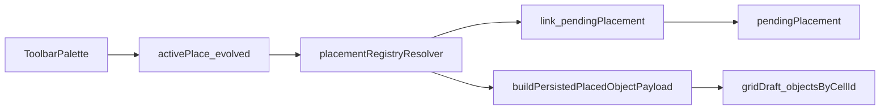

# Object authoring Phase 1 — palette foundation

**Parent:** [location_workspace_object_authoring_roadmap.plan.md](location_workspace_object_authoring_roadmap.plan.md)  
**Canonical reference:** [docs/reference/location-workspace.md](../../../docs/reference/location-workspace.md)

**Role:** **Child plan (implementation)** — **Phase 1** of the object authoring roadmap. Establishes a **family-oriented placed object registry** (refactor `locationPlacedObject.registry.ts` + selectors), **consolidated placement seam**, and **toolbar-first** palette on top of **today’s real pipeline** (`activePlace` → resolver → payloads / link intent → draft). **Phase 2 (variants UI)** extends the **same registry contract** — **not** a second registry redesign.

**Next phase:** [location_workspace_object_authoring_phase2_variants.plan.md](location_workspace_object_authoring_phase2_variants.plan.md)

---

## Objective

Move from **rail-first** picking to a **registry-driven** **toolbar drawer** palette, while **preserving** **click-to-place** and the **current persisted wire contract** for map objects.

Phase 1 is **explicitly grounded** in the audited chain: palette rows → `MapPlacePaletteItem` → `**activePlace`** → `**handleAuthoringCellClick**` → `**resolvePlacedKindToAction**` → `**buildPersistedPlacedObjectPayload**` (map-object branch) **or** link placement → `**gridDraft`** / `**pendingPlacement**`. The plan names how **loaded placement identity**, the **resolver seam**, and **registry** relate to these **existing** symbols — not abstract “future” mechanisms with no mapping to code.

**Registry source of truth:** implementation work extends the canonical placed-object definitions in [`locationPlacedObject.registry.ts`](../../../src/features/content/locations/domain/model/placedObjects/locationPlacedObject.registry.ts) (and [`locationPlacedObject.selectors.ts`](../../../src/features/content/locations/domain/model/placedObjects/locationPlacedObject.selectors.ts)) — not a parallel ad hoc list.

---

## Problem: flat registry vs family/variant direction

Today’s **flat** registry keys (`city`, `building`, `site`, `tree`, `table`, `stairs`, `treasure`, …) match current placement but **do not** encode the durable shape needed for the documented direction:

- Human-readable **long-term identity** examples: `door.single.wood`, `table.rect.wood`, `stairs.stone`, `window.narrow` — **family-scoped**, not unrelated flat ids.
- **Top-level registry key** should imply **family / base kind**.
- **Category** (e.g. furniture vs fixtures) should stay **explicit metadata** for palette **grouping** — **not** persisted map identity.
- **Shared `runtime`** (blocking, cover, etc.) should live at **family** level by default; variant-level overrides are a later escape hatch.
- **Variants** must stay **explicit and readable**; future **swatch/image** selection favors **explicit variant entries**, not a fully **dynamic matrix** of orthogonal axes at runtime.

If Phase 2 builds **grouped variant UX** on top of a still-flat registry, the codebase risks a **second registry redesign** while palette UX is also moving — **avoid**.

---

## Family-oriented placed object registry (Phase 1 — before Phase 2 UI)

**Objective:** Introduce a **family-oriented placed object registry** and a **small set of selectors / resolver-facing helpers** so that:

- **Current Phase 1 placement behavior** is **preserved** (wire payload, link vs object branches, stairs seeding policy).
- **Category** remains **UI / palette metadata only** (never persisted authored identity on the map).
- **Family + explicit `variants`** is the **durable contract** now; Phase 2 **adds** grouped variant **UI**, not a new registry shape.
- **Today’s single-entry placeables** are represented as **single-variant families** (e.g. one `default` variant) until real multi-variant families are added.
- **Linked-content** vs **map-object** placement stays **explicit** in resolver routing (unchanged semantics).

**Replace** the flat `AUTHORED_PLACED_OBJECT_DEFINITIONS` shape with a **future-facing** structure along these lines (exact field names are implementation details; **shape** is the contract):

- **Top-level key** = **family id** (base kind for resolution and palette row identity).
- **`category`** (or equivalent) = **explicit palette grouping** (toolbar sections) — presentation only with respect to persistence.
- **`placementMode`** (e.g. `cell` for current placeables), **`allowedScales`**, and **family-level `runtime`** on the **family** record.
- **`variants`**: a **map** (or ordered list) of **explicit** variant ids → per-variant fields (labels, icons, descriptions, and any variant-only data). Phase 1 may only expose **`default`** (or one canonical id) in the toolbar per family.
- **No** generalized **materials × shapes × sizes** engine; optional **helper composition** later if repetition hurts — **not** Phase 1.

**Illustrative example** (bias, not prescription):

```ts
table: {
  label: 'Table',
  category: 'furniture',
  placementMode: 'cell',
  allowedScales: ['floor'],
  runtime: { /* shared defaults */ },
  variants: {
    default: {
      label: 'Table',
      iconName: 'table',
      description: 'Furniture or surface.',
    },
  },
},
```

**Selectors / resolvers (minimal Phase 1 set):**

- Refactor or extend **`getPlacedObjectPaletteOptionsForScale`**, **`getPlacedObjectDefinition`**, **`LOCATION_PLACED_OBJECT_KIND_META`**, and related exports so **palette rows** resolve from **family + default variant** (or explicit variant when only one exists).
- **`LocationPlacedObjectKindId`** (or a successor type) should align with **family id** at the top level; **variant id** is carried alongside for **`activePlace`** and **`MapPlacePaletteItem`** (already biased in Phase 1 types).
- **`placementRegistryResolver`** / **`buildPersistedPlacedObjectPayload`** consume **stable mapping** from **family + variant** → existing **wire** `LocationMapObjectKindId` + optional **`authoredPlaceKindId`** — **no** second parallel “flat kind” registry long-term.

**Phase 2 guard:** [location_workspace_object_authoring_phase2_variants.plan.md](location_workspace_object_authoring_phase2_variants.plan.md) should **extend** this registry (more variants per family, picker UX, tooltips) — **not** replace the family/variant contract again.

---

## Audited: current placement pipeline (production)

The following is **already implemented** and is the baseline Phase 1 refactors from:

1. **Palette data:** `getPlacePaletteItemsForScale` → `MapPlacePaletteItem[]` (linked-content vs map-object **category** is **UI routing only**).
2. **Selection:** User picks a row → `**activePlace`** = `{ category, kind }` (`LocationMapActivePlaceSelection` in `useLocationMapEditorState`).
3. **Click:** `**handleAuthoringCellClick`** (`useLocationEditWorkspaceModel`) runs when in **place** mode with `**activePlace`** set.
4. **Routing:** `**resolvePlacedKindToAction(activePlace, hostScale)`** → `**link**` | `**object**` | `**unsupported**`.
5. **Map-object payload:** `**buildPersistedPlacedObjectPayload(placedKind, hostScale)`** → `{ kind: LocationMapObjectKindId, authoredPlaceKindId? }`.
6. **Draft / link:** **Object** → append to `**gridDraft.objectsByCellId[cellId]`** (plus **stairs** default `**stairEndpoint`** inline). **Link** → `**setPendingPlacement`** (linked-location flow).
7. **Persisted wire (map objects):** `**LocationMapObjectKindId`** + optional `**authoredPlaceKindId**` — unchanged by Phase 1 (see **Persistence stance**).

---

## Current placement pipeline → Phase 1 mapping


| Today (audited)                                                         | Phase 1 target                                                                                                                                                                                                                                              |
| ----------------------------------------------------------------------- | ----------------------------------------------------------------------------------------------------------------------------------------------------------------------------------------------------------------------------------------------------------- |
| Rail `**LocationMapEditorPlacePanel`** + `getPlacePaletteItemsForScale` | **Toolbar drawer** palette; **same** registry-driven item list (not a second list)                                                                                                                                                                          |
| `**activePlace` = `{ category, kind }`**                                | **Evolved** loaded placement identity (see `**activePlace` vs loaded placement state**): `**category`** remains **UI-only**; `**kind`** gains **family + default variant** (or equivalent) as registry identity                                             |
| `**handleAuthoringCellClick`** (large inline place branch)              | **Thin handler**: delegate `**activePlace` + cell + host context** → `**placementRegistryResolver`** (single entry); **only** then `**setPendingPlacement`** / `**setGridDraft**` from returned **structured result** — **no** inlined kind→payload mapping |
| `**resolvePlacedKindToAction`**                                         | **Absorbed into / re-exported from** `**placementRegistryResolver`** — same **placement action** discriminant (`link` | `object` | …), **not** a duplicate resolver                                                                                         |
| `**buildPersistedPlacedObjectPayload`**                                 | **Object-payload translation layer** inside the seam (keep or wrap; **do not** fork two competing payload builders)                                                                                                                                         |
| Stairs `**stairEndpoint`** seeded in draft mutation                     | Remains **special-case authored defaults** at **draft append** (or immediately after resolver returns **object** intent), **not** generic “stairs with no future hooks” — **stairs linking** workflows stay **out of scope**                                |


---

## Loaded placement state: relationship to `activePlace` (decision)

**Chosen approach: Option A — evolve `activePlace` (single source of truth)**

- Phase 1 **does not** add a **second** parallel state (e.g. `loadedPlaceable` alongside `**activePlace`**) and **does not** retire `**activePlace`** in favor of an unrelated name without migration (Options B/C avoided to **minimize duplicate sources of truth**).
- `**activePlace`** remains the **one** field in `**useLocationMapEditorState`** that means “what the user intends to place.” Its **TypeScript type** `**LocationMapActivePlaceSelection`** **evolves** to carry **durable registry identity**: at minimum **family id** + **variant id** (Phase 1: default variant), while preserving **discrimination** between **linked-content** and **map-object** **routes** via `**category`** (still **not** persisted).
- **Why this sets up Phase 2:** Variant selection updates the **same** `**activePlace`** / loaded identity — no merge logic between two competing stores. Toolbar and rail (during migration) both **set** this one state.

**Implementation note:** During refactors, a **temporary** normalizer from legacy `{ category, kind }` to **family + variant** may live at the registry boundary; the **target** is one evolved shape, not permanent dual models (avoid Option C as an indefinite end state).

---

## Placement resolver seam — `placementRegistryResolver` (concrete)

**This is not a greenfield API.** Production already has a real seam:

- `**resolvePlacedKindToAction`** — registry/palette `**kind**` + `**category**` + host scale → `**link`  `object`  `unsupported**`
- `**buildPersistedPlacedObjectPayload**` — authored `**placedKind**` + host scale → **persisted object payload** for **map-object** branch
- `**handleAuthoringCellClick`** — today **mixes** resolution with draft mutation; Phase 1 **splits** that responsibility.

**Phase 1 direction:** **Absorb and consolidate** resolution into a **named module boundary** `**placementRegistryResolver`** (single folder or module as implemented):

1. **Owns:** **Registry identity** (family + variant, once registry exists) **→** same conceptual outputs as today: **placement action** (`link`  `object`  unsupported) **→** for `**object`**: **payload** = `**LocationMapObjectKindId` + optional `authoredPlaceKindId`** via `**buildPersistedPlacedObjectPayload**` (or thin wrapper); for `**link**`: **link intent** for `**pendingPlacement`**.
2. **Does not own:** Palette JSX, toolbar layout, or **full** `gridDraft` reducers — but **must** be the **only** place that maps **identity → action → payload/link intent** (no copy-paste branches in the route hook).
3. `**handleAuthoringCellClick` becomes thinner:** For **place** mode, it should **call** `**placementRegistryResolver`** (or one exported `**resolvePlacementForCellClick**`) with `**activePlace**`, `**cellId**`, `**hostScale**`, and any minimal flags — then **only** apply **pure** side effects: `**setPendingPlacement`** from **link** result, `**setGridDraft`** append from **object** result (including **stairs** seeding). It **must not** grow new **kind → payload** branches; those stay **inside** the resolver seam.
4. **Toolbar / route wiring:** **No new parallel mapping.** Toolbar components **set `activePlace` / UI only** — they **do not** import `**buildPersistedPlacedObjectPayload`**, `**resolvePlacedKindToAction**`, or registry→wire translation. `**LocationEditRoute**` (and similar assembly) **wires props and handlers** — it **does not** add a **second** placement translation path alongside the resolver.
5. **Special-case authored defaults:** **Stairs** `**stairEndpoint`** initialization stays **after** **object** resolution, at **draft creation** time (same layer as today conceptually), **not** inside generic registry rows as if stairs were indistinguishable from props. This **preserves** room for future **stairs-specific** authoring without pretending stairs are fully generic.

**Wrap vs replace:** Prefer **wrapping / re-exporting** `**resolvePlacedKindToAction`** and `**buildPersistedPlacedObjectPayload**` inside `**placementRegistryResolver**` until family+variant inputs are wired — **avoid** two diverging resolver implementations.




---

## Linked-content scope (Phase 1)

**Explicit:** **Included** in the **same** Phase 1 palette migration and **same** `**activePlace`** / resolver model — **not** “objects only, linked-content later.”

- `**getPlacePaletteItemsForScale`** already emits **both** **linked-content** and **map-object** rows; the toolbar replaces the rail as the **primary chooser** for **all** of them.
- **Resolver:** `**resolvePlacedKindToAction`** already implements a **distinct** `**link`** branch from `**object**`. Phase 1 **keeps** that **two-family** model: **loaded placement** can resolve to **link intent** or **object payload**, not only cell objects.
- **Out of scope still:** Deep **stairs linking** workflows, rich **post-placement** link editing — only **existing** link + object **placement** behavior.

---

## Persistence stance (Phase 1)

**Preserve** the **current persisted wire shape** for map objects:

- `**LocationMapObjectKindId`** + optional `**authoredPlaceKindId**`

Phase 1 **does not** intentionally change map save semantics or introduce a new persisted identity encoding in `**cellEntries`** for this phase. **Registry family + variant** lives **above** the wire: the **resolver seam** translates to the **existing** payload shape. If a future phase adds persisted variant ids, that is a **separate** migration with explicit cost — **not** Phase 1.

**Category / group:** Remains **presentation metadata** in the registry for toolbar sections — **never** part of persisted authored identity on the map. **Toolbar grouping** and **placement identity** are separate concerns.

---

## Category and grouping (UI-only, reaffirmed)

- `**category`** on `**MapPlacePaletteItem**` / `**activePlace**` (`**linked-content**` vs `**map-object**`) is **UI routing** to pick resolver branch — **not** stored on the map.
- Registry **category/group** fields drive **toolbar sections** only; they **do not** become part of **persisted authored identity**.

---

## Stairs and special-case authoring defaults

- **Stairs** participate in the **registry** and **loaded placement** like other floor **map-object** placeables.
- **Default `stairEndpoint` seeding** on new placement remains **explicit** in the **draft-append** path (as today), **not** hidden inside a generic “all objects equal” helper. This **does not** implement **stairs linking** (still out of scope); it **honors** existing **special authoring defaults** and keeps a hook for future **stairs-specific** behavior.

---

## Authored identity contract (durable, above the wire)

- **Top-level registry key** = **family id**; **`variants`** holds explicit entries; Phase 1 toolbar uses **one row per family** with **default** (or single) variant.
- **Persisted** cell payloads remain **as today**; **family + variant** resolve through **`placementRegistryResolver`** to **`LocationMapObjectKindId` + optional `authoredPlaceKindId`**.

**Human-readable examples** (intent — may be structured ids in code, not one concatenated string): `door.single.wood`, `table.rect.wood`, `stairs.stone`, `window.narrow`.

**Concrete registry shape:** See **Family-oriented placed object registry** above; implementation lives under [`locationPlacedObject.registry.ts`](../../../src/features/content/locations/domain/model/placedObjects/locationPlacedObject.registry.ts).

---

## Family-level shared fields vs variant overrides

- **Default:** **`runtime`** and cross-variant defaults at **family** level (see family-oriented registry section).
- **Phase 2+:** Variant-level metadata and **optional partial overrides**; merge order **family → variant** at resolution time — **not** in palette JSX.

---

## Current-state audit — complete inventory (gate before implementation)

The **starter** inventory (e.g. floor **table** / **stairs** / **treasure**) is **not** sufficient. **Implementation must not begin** until the table below is **complete** for **every** row `**getPlacePaletteItemsForScale`** can emit **and** any **edge** special cases called out in code reviews.

**Required columns (one row per placeable):**


| Column                                         | Content                                                                                 |
| ---------------------------------------------- | --------------------------------------------------------------------------------------- |
| **Current palette / source kind**              | `LocationPlacedObjectKindId` (or equivalent source key)                                 |
| **Placement class**                            | `**map-object`** | `**linked-content**`                                                 |
| **Current persisted payload or link behavior** | For objects: wire shape + notes; for links: `**pendingPlacement`** / modal flow summary |
| **Proposed registry family key**               | Durable family id                                                                       |
| **Proposed default / current variant id**      | Phase 1 default                                                                         |
| **Category / group** (toolbar)                 | Presentation only                                                                       |
| **Placement mode**                             | `cell` (and note if link uses different UX)                                             |
| **Notes / migration risk / special handling**  | e.g. **tree** → **marker** mapping, **stairs** endpoint seeding                         |


**Output:** Migration-sensitive notes **and** **completed** table — **gate** for coding tasks that change placement or registry wiring.

---

## Registry location and ownership

- **Authoring vocabulary + runtime defaults:** [`locationPlacedObject.registry.ts`](../../../src/features/content/locations/domain/model/placedObjects/locationPlacedObject.registry.ts) — **family-oriented** definitions; **not** a second duplicate registry elsewhere.
- **Derived palette / meta / ids:** [`locationPlacedObject.selectors.ts`](../../../src/features/content/locations/domain/model/placedObjects/locationPlacedObject.selectors.ts) (and siblings) — **selectors** stay the thin layer over the family registry.
- **`placementRegistryResolver`:** [`domain/authoring/editor/placement/`](../../../src/features/content/locations/domain/authoring/editor/placement/) — **identity → wire payload / link**; colocated with `**resolvePlacedKindToAction**` / persistence mapping.
- **Single source of truth** for palette rows: toolbar **and** any remaining rail hints **must not** diverge from **selectors + registry**.

---

## Palette model (toolbar drawer)

- **Primary chooser** for **all** place palette content (**map-object** + **linked-content**), registry-driven sections.
- **One row per family**, default variant; **no** Phase 2 variant picker.
- **Load** → sets evolved `**activePlace`** only (identity + `**category**` for branch routing). **No** payload or resolver calls in toolbar JSX — **no** duplicate mapping.
- **Repeat / clear:** unchanged policy (stay loaded after place; clear on explicit clear, mode change, or other placeable).

---

## Loaded object state model (concrete)


| Topic                | Phase 1 rule                                                                                                                                                             |
| -------------------- | ------------------------------------------------------------------------------------------------------------------------------------------------------------------------ |
| **Shape**            | Evolved `activePlace`: registry **family + variant** (default in Phase 1) + `**category`** for branch routing — **not** a duplicate persisted `**cellEntries`** document |
| **Repeat placement** | After place, **stay loaded**                                                                                                                                             |
| **Clear**            | Explicit clear, **tool/mode** away from place, or **other placeable**                                                                                                    |
| **vs selection**     | `**mapSelection`**: inspect; `**activePlace**`: placement intent                                                                                                         |


---

## Placement continuity

- **Same** wire shapes and behaviors through **evolved** identity + **consolidated** `**placementRegistryResolver`**.

---

## Toolbar vs rail responsibility split


| Surface            | Role                                                                                                                                         |
| ------------------ | -------------------------------------------------------------------------------------------------------------------------------------------- |
| **Toolbar drawer** | **Choose** what to place (all place rows); show loaded placement; set `activePlace` only — **zero** placement translation / payload building |
| **Rail**           | **Not** primary chooser; hints / inspect after selection; same rule if rail still shows place items during migration                         |


**Route / workspace assembly (`LocationEditRoute`, rail panel props):** Pass **handlers** and **refs** to **model** code that calls `**placementRegistryResolver`** — **do not** embed mapping from palette kind → persisted shape in the route file.

---

## Future Phase 2 (variants) — forward note

- Phase 2 extends **same** **`activePlace`** identity and **`placementRegistryResolver`** with **grouped variant UX** (picker, counts, tooltips).
- Phase 2 **does not** replace the **family + `variants`** registry contract introduced in Phase 1 — it **adds UI and optional variant-level metadata** on the **existing** shape.

---

## Out of scope

- Grouped **variant** UX, pickers, swatches
- **Edge** placement from Draw
- **Deep** inspector rewrite
- **Stairs linking** beyond defaults + registry coherence
- **Implicit matrix** construction
- **Changing** persisted map **wire** identity encoding in Phase 1

---

## Cross-cutting concerns


| Area                        | Cover                                                                                                                                                                                                                                                                   |
| --------------------------- | ----------------------------------------------------------------------------------------------------------------------------------------------------------------------------------------------------------------------------------------------------------------------- |
| **Registry**                | **Family-oriented** definitions in `locationPlacedObject.registry.ts` + **selectors** in `locationPlacedObject.selectors.ts`; **explicit `variants`**; current placeables as **single-variant families**; **no** second flat registry for Phase 2 to undo |
| **Resolver**                | `**placementRegistryResolver`** consolidates `**resolvePlacedKindToAction**` + `**buildPersistedPlacedObjectPayload**` + **identity** mapping; **no** scattered translation                                                                                             |
| **Click handler**           | `**handleAuthoringCellClick`** delegates **resolution** to the seam; **draft/link** mutations only — **not** a second mapping layer                                                                                                                                     |
| **UI boundaries**           | Toolbar + route **do not** add **parallel** `kind → payload` logic                                                                                                                                                                                                      |
| **Placement state**         | **Single** `**activePlace`** evolved, not duplicated                                                                                                                                                                                                                    |
| **Persistence**             | **Preserve** `**LocationMapObjectKindId` + `authoredPlaceKindId`**                                                                                                                                                                                                      |
| **Canonical reference doc** | **[docs/reference/location-workspace.md](../../../docs/reference/location-workspace.md)** — update in Phase 1 scope when behavior/symbols change (toolbar vs rail place UX, resolver names, loaded placement); keep “until plans land” vs **shipped** language accurate |


---

## Documentation — `location-workspace.md` (in scope)

Phase 1 **includes** updating **[docs/reference/location-workspace.md](../../../docs/reference/location-workspace.md)** so it stays the **accurate** canonical description of the location workspace:

- **Place / palette:** Document **toolbar-first** chooser and **registry-driven** sections; **family-oriented** registry (`locationPlacedObject.registry.ts` / selectors) when shipped.
- **Pipeline:** Align **object authoring** / **Map editor toolbar** sections with `**activePlace`** evolution, `**placementRegistryResolver**`, **linked-content vs map-object** branches, and **family + variant** identity.
- **Cross-links:** Keep links to Phase 1 plan and parent roadmap accurate; avoid contradicting **Imports and barrels** / route boundaries elsewhere in the doc.

**Not** in scope: rewriting unrelated workspace sections (dirty/save, normalization) unless Phase 1 work **touches** them.

---

## Risks / migration notes


| Risk                            | Mitigation                                                             |
| ------------------------------- | ---------------------------------------------------------------------- |
| Dual loaded vs activePlace      | **Option A only** — one field                                          |
| Resolver fork                   | **Wrap existing** functions inside `**placementRegistryResolver`**     |
| Mapping sprawl in toolbar/route | **Explicit** rule: resolver + thin `**handleAuthoringCellClick`** only |
| Incomplete inventory            | **Gate** implementation on full table                                  |
| Flat registry left in place     | **Complete** family registry + selector refactor **before** Phase 2 UX; avoid two registry models in flight |


---

## Guardrails

### Do

- Ground changes in **audited** pipeline symbols
- **Refactor flat → family registry** in `**locationPlacedObject.registry.ts**` with **selectors** updated in lockstep — **stable contract** for Phase 2
- **One** `**activePlace`**, **one** resolver **facade**
- **Thin `handleAuthoringCellClick`:** delegate to `**placementRegistryResolver`**, then apply **draft** / **pending** updates only
- **Preserve** wire payload shape in Phase 1

### Do not

- **Abstract** “future resolver” with **no** tie to `**resolvePlacedKindToAction`**
- **Exclude** linked-content from toolbar palette scope
- **Persist** category/group as map identity
- **New parallel mapping** in **toolbar components** (including palette cards, drawers, chips) or **route wiring** (`LocationEditRoute`, rail assembly) — **all** **identity → action → payload** stays in **domain** `**placementRegistryResolver`** (or helpers it owns)

---

## Acceptance criteria

1. `**activePlace**` evolution (Option A) is **explicit**; no ambiguous parallel loaded state.
2. `**placementRegistryResolver`** is **defined** as **consolidation** of `**resolvePlacedKindToAction`** + `**buildPersistedPlacedObjectPayload**` + **identity** mapping — **not** a vague future API.
3. `**handleAuthoringCellClick`** is **thin**: delegates placement **resolution** to the consolidated seam; **does not** reintroduce inlined kind→payload mapping.
4. **No new parallel mapping** in **toolbar** UI or **route** assembly — only `**activePlace`** updates from palette, **resolver** in **model/domain** path on cell click.
5. **Linked-content** is **in scope** for toolbar palette + **same** resolver **branching** model.
6. **Persistence:** **Preserve** `**LocationMapObjectKindId` + optional `authoredPlaceKindId`**; registry sits **above** wire.
7. **Inventory** complete per **expanded** columns **before** implementation (**gate**).
8. **Pipeline mapping** section documents **today → Phase 1** (rail → toolbar, resolver consolidation, orchestration).
9. **Stairs:** defaults stay **explicit** in draft path; linking **out of scope**.
10. **Category** remains **UI-only**; toolbar grouping ≠ persisted identity.
11. Phase 1 **scoped**: palette foundation + **grounded** refactor — **no** Phase 2 variant UX.
12. **[docs/reference/location-workspace.md](../../../docs/reference/location-workspace.md)** updated so **canonical** workspace reference matches **shipped** Phase 1 placement/palette/resolver behavior and symbols.
13. **Family-oriented registry** is **implemented** in `**locationPlacedObject.registry.ts**` (top-level **family** keys, explicit **palette category**, family-level **`runtime`**, **`variants`** with at least **default** per current placeable); **selectors** resolve palette and meta from that shape; **no** remaining **flat-only** authoring registry that Phase 2 must replace.
14. **Placement + palette behavior** unchanged from a **product** perspective (same wire, same link vs object semantics); identity paths go through **family + variant** → existing resolvers.

---

## Related

- [docs/reference/location-workspace.md](../../../docs/reference/location-workspace.md) — canonical reference (Phase 1 deliverable: keep in sync)
- [location_workspace_object_authoring_phase2_variants.plan.md](location_workspace_object_authoring_phase2_variants.plan.md)
- [.cursor/plans/location-workspace/README.md](README.md)
- [location_workspace_cleanup_94269d45.plan.md](../location_workspace_cleanup_94269d45.plan.md)

