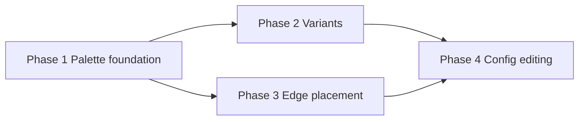

# Location workspace object authoring UX modernization

**Role:** **Parent plan** — architecture, sequencing, and guardrails only. Implementation lives in **child plans** (one per phase or vertical slice), each with its own acceptance criteria and diffs.

**Canonical reference:** [docs/reference/location-workspace.md](../../../docs/reference/location-workspace.md) (toolbar, place/draw, persistence, open issues).

---

## Objective

Create a coherent **object authoring** experience in the location map editor: move from a **rail-heavy picker** and scattered affordances to a **registry-driven** system with **toolbar palette** selection, explicit **loaded placement** state, **variants**, **edge-based** authoring for doors/windows (and similar), and **rail-first inspection/editing** after placement.

This parent plan does **not** specify pixel-perfect UX for every object type; it defines **layers**, **phase boundaries**, and **rules of ownership** so child plans can execute without re-litigating architecture.

---

## Why this modernization is needed

Today, place-mode content is split between **toolbar mode**, **Map rail** (`LocationMapEditorPlacePanel`), and **Draw** for some boundary features. That split makes it harder to:

- Add new placeable kinds without duplicating lists and one-off branches
- Present **grouped categories** and **variants** consistently
- Treat **doors/windows** as authored features with a clear placement model (vs draw-tool boundary paint alone)
- Evolve **stairs** and other rich types without special-casing UI everywhere

The product goal is an **object authoring system** that feels intentional: one registry, clear placement semantics, and rails that **inspect and configure** what already exists.

---

## Architectural principles

1. **Registry is the source of “what can be placed”** — kinds, placement modes, default metadata, and presentation hints come from a **central authoring registry**, not ad hoc arrays in components.
2. **Categories/groups are presentation** — grouping in the palette does **not** define the persisted domain model; the saved map still uses canonical cell/edge/object shapes.
3. **Toolbar chooses; rail inspects** — the **toolbar drawer/palette** selects **what to place next**; the **right rail** (especially Map + Selection) focuses on **configuration and inspection** of placed or selected entities.
4. **Loaded object state is explicit** — “what is armed for placement” is a first-class, reusable concept across flows (not implicit rail selection alone).
5. **Phased delivery** — palette foundation and cell placement land **before** edge placement and deep config; **do not** fold edge semantics or full inspector work into Phase 1 unless unavoidable.

---

## Layer boundaries

Keep these four layers distinct so child plans do not collapse UI into domain or vice versa.

### 1. Object authoring registry

Defines **what** can be placed at an authoring level (not how the React tree is laid out).

| Concern              | Examples                                                                                  |
| -------------------- | ----------------------------------------------------------------------------------------- |
| Identity             | Authored object **kind id**; optional **variant id** / variant group                      |
| Placement capability | Placement mode: `cell`, `edge`, future modes                                              |
| Presentation         | Category/section labels, icons, tooltips, **grouping for palette UI**                     |
| Policy               | Allowed scales/contexts; default authored metadata; flags for “expects post-place config” |

**Rule:** Registry fields drive **defaults and labels**; they are not a substitute for **persisted map state**.

### 2. Placement interaction model

Defines **how** authoring behaves while the user is placing content.

| Concern    | Examples                                                       |
| ---------- | -------------------------------------------------------------- |
| Tooling    | Toolbar palette selection; **loaded** placeable; mode switches |
| Gestures   | Click-to-place; repeat placement until cancel/tool switch      |
| Feedback   | Cursor/tool chrome; variant picker entry points                |
| Targeting  | Cell hit-testing; **later** edge hit-testing and snapping      |
| Completion | Selection after placement; clearing loaded state               |

**Rule:** Placement state (loaded tool, pending placement) stays **ephemeral** — not persistable snapshot fields (see reference doc: map-only UI vs `gridDraft`).

### 3. Persisted authored object model

Defines **what is saved** on `LocationMap` and related structures.

| Concern    | Examples                                                                                     |
| ---------- | -------------------------------------------------------------------------------------------- |
| Cell side  | Objects in `cellEntries` / per-cell `objects[]`                                              |
| Edge side  | `edgeEntries` for walls/windows/doors; canonical `edgeId` + `kind`                           |
| Rich types | Stairs, links, door/window payloads — as **typed authored data**, not generic obstacles only |
| Evolution  | Kind + variant + config blobs that **normalize** at boundaries                               |

**Rule:** Persisted shapes remain the **contract** with server and hydration; UX refactors **migrate** or **adapt** readers/writers rather than silently changing wire meaning.

### 4. UI presentation model

Defines **how** the editor surfaces registry + draft state.

| Concern    | Examples                                             |
| ---------- | ---------------------------------------------------- |
| Palette    | Toolbar drawer sections; counts; variant affordances |
| Inspectors | Selection rail: cell/object/edge inspectors          |
| Overlays   | Modals/popovers for variant pickers when needed      |

**Rule:** Presentation may **group** and **sort**; it must **read** registry + draft, not invent parallel authoritative lists.

---

## Shared terminology

| Term                     | Meaning                                                                                                               |
| ------------------------ | --------------------------------------------------------------------------------------------------------------------- |
| **Authored object kind** | Stable id for a placeable type in the registry and (where applicable) in persisted object payloads                    |
| **Variant**              | A grouped alternative of the same logical kind (visual or behavioral defaults), selected at placement or in inspector |
| **Loaded object**        | The currently armed placeable (kind + variant as applicable) for click-to-place                                       |
| **Placement mode**       | Cell vs edge (and future) — orthogonal to toolbar `LocationMapEditorMode` but coordinated with it                     |
| **Palette**              | Toolbar-adjacent UI listing placeables from the registry (not the Map tab list alone)                                 |

---

## High-level phase breakdown

### Phase 1 — Palette foundation

**Purpose:** Introduce the **authoring registry**, **category/group metadata** for UI, move **object selection** from “picker lives primarily in the rail” toward a **toolbar drawer**, and implement explicit **loaded object** state. Preserve **click-to-place** for existing **cell** objects.

**Out of scope for Phase 1:** Full edge placement, doors/windows migration off Draw, deep inspector rewrites — **only** what is required to hook registry + loaded state + palette.

**Child plan:** [location_workspace_object_authoring_phase1_palette_foundation.plan.md](location_workspace_object_authoring_phase1_palette_foundation.plan.md)

### Phase 2 — Variants

**Purpose:** **Grouped variants** for registry entries, **count/indicator** affordances, **popover or modal** selection when multiple variants exist, **tooltip** copy from registry metadata.

**Depends on:** Registry + loaded object model from Phase 1.

**Child plan:** [location_workspace_object_authoring_phase2_variants.plan.md](location_workspace_object_authoring_phase2_variants.plan.md)

### Phase 3 — Edge placement

**Purpose:** **Edge placement mode** for appropriate kinds; **migrate doors/windows** authoring out of **Draw** toward **edge-targeted** placement; **hit-testing and snapping** on square edges; **selected edge** treatment in the rail inspector.

**Depends on:** Stable registry ids, clear loaded/cursor semantics, and agreement on **persistence** for edge kinds (existing `edgeEntries` model). Coordinate with **hex constraints** documented in the reference doc (square-first edge geometry).

**Child plan:** [location_workspace_object_authoring_phase3_edge_placement.plan.md](location_workspace_object_authoring_phase3_edge_placement.plan.md)

### Phase 4 — Config / editing

**Purpose:** **Rail-driven** editing for placed objects — door/window states, **stairs linking**, richer metadata — building on Selection inspectors and registry metadata.

**Depends on:** Phases 1–3 as applicable; must respect **state ownership** and **debounced persistable** patterns in `location-workspace.md`.

**Child plan:** [location_workspace_object_authoring_phase4_config_editing.plan.md](location_workspace_object_authoring_phase4_config_editing.plan.md)

---

## Dependencies between phases

- **Phase 2** requires **registry + loaded state** from Phase 1.
- **Phase 3** can proceed after Phase 1 for **modeling and targeting**, but **benefits** from variant clarity when the same kind has edge vs cell representations — sequencing detail belongs in the child plan.
- **Phase 4** assumes **selection + inspectors** can address placed entities; it **must not** bypass persistable draft rules.

---

## Cross-cutting concerns (must stay stable)

### Registry ownership

- **Where:** Prefer a dedicated module (or small tree) under `domain/mapEditor/` / `features/content/locations` — exact path is a child-plan decision; **avoid** scattering `switch` tables across routes.
- **Ids:** Authored kind ids and variant ids should be **stable strings** suitable for persistence references where needed.
- **Extension:** New objects = **registry entries** + optional normalizers — not a new rail-only code path.

### Placement ownership

- **Loaded state:** Single conceptual owner (likely `useLocationMapEditorState` or successor) — **cleared** on mode change, successful cancel patterns, and when switching placeables.
- **Placement vs selection:** Placing an object updates **draft**; **selection** highlights what to inspect — child plans define whether placement always selects the new entity.
- **Repeat placement:** Default assumption: **loaded** stays active until the user switches tool or explicitly cancels — child plans confirm product behavior.

### UI responsibility split

- **Toolbar / palette:** Pick **what** to place; show **category** sections; show **variant** entry when Phase 2 lands.
- **Rail:** **Map** tab becomes more **hint + context**; **Selection** tab remains **inspector** for the selected target.
- **Tooltips/labels/icons:** From **registry metadata**, not hardcoded per component.

### Persistence boundary

- **Cell objects** vs **edge entries** remain distinct persisted collections — edge work **reuses** `edgeEntries` semantics unless a child plan justifies a migration.
- **Stairs** remain **rich authored types** (links, endpoints) — not flattened to generic props-only objects.
- **Enriched metadata** attaches to **typed** slots in the authored model; avoid a single untyped bag as the only extension point **unless** a deliberate schema is agreed.

### Compatibility / migration

- Map **table / stairs / treasure** (and similar) flows should gain **registry entries** that mirror current behavior before UX removal.
- Prefer **adapter layers** during rollout: old handlers call new registry resolution.
- **No silent data loss** — hex maps with stored edges remain subject to **Open issues** in the reference doc.

---

## Risks and sequencing notes

| Risk                              | Mitigation                                                                                                                 |
| --------------------------------- | -------------------------------------------------------------------------------------------------------------------------- |
| Selection / hover / pointer churn | Touch **only** what placement requires; do not “redesign Select mode” in this umbrella                                     |
| Draw vs Place duplication         | Temporary overlap is OK; **migrate** doors/windows in Phase 3 with a clear cutover checklist                               |
| Hex edge geometry                 | Phase 3 **square-first**; align with documented hex constraints — full hex edges remain a **separate** geometry initiative |
| Scope creep into dirty/save       | Any new persistable field uses **existing** snapshot + `gridDraft` participation rules                                     |
| “Mini plugin system”              | Registry **interfaces** yes; **heavy plugin framework** no — prove with Phases 1–2 first                                   |

---

## Guardrails

### Do

- Focus on **object authoring UX** and the **four layers** above.
- **Incrementally migrate** from current rail + `getPlacePaletteItemsForScale` patterns.
- **Preserve authored data integrity**; add shims where needed.
- Keep **future enriched objects** in mind without building every behavior in Phase 1.

### Do not

- Reopen **dirty/save** architecture **unless** a child plan explicitly includes persistable contract changes.
- Broaden into a **full map-editor or workspace shell redesign** under this parent plan.
- Conflate **general hex geometry** work with object authoring except where **edge placement** requires shared hit-testing contracts.
- Replace **global selection/hover** semantics wholesale **unless** a phase strictly requires it for placement correctness.
- Build a **large plugin framework** before the registry proves value.

---

## Non-goals (this parent plan)

- A **full map-editor redesign**
- A **database migration** or **broad persistence rewrite**
- A **complete geometry-system overhaul**
- A **final UX spec** for every object type
- A mandate to **implement every future object behavior** immediately

---

## Acceptance criteria (parent plan)

This parent plan is **satisfied** when all of the following are true:

1. **Roadmap:** Phases 1–4 are described with **purpose**, **dependencies**, and **high-level** acceptance (child plans add detail).
2. **Separation:** **Registry/domain**, **placement**, **persistence**, and **UI** responsibilities are **explicitly** distinct.
3. **Toolbar vs rail:** **Toolbar/palette** = choose what to place; **rail** = inspect/configure — stated clearly.
4. **Sequencing:** **Edge placement** is a **dependent** phase, **not** bundled into palette foundation.
5. **Sequencing:** **Deep config/editing** is a **follow-on** phase, **not** folded prematurely into placement foundation.
6. **Child plans** can proceed with **enough shared vocabulary** to avoid re-arguing the overall model.

---

## Child plans

| Phase                  | Plan                                                                                                                                           |
| ---------------------- | ---------------------------------------------------------------------------------------------------------------------------------------------- |
| 1 — Palette foundation | [location_workspace_object_authoring_phase1_palette_foundation.plan.md](location_workspace_object_authoring_phase1_palette_foundation.plan.md) |
| 2 — Variants           | [location_workspace_object_authoring_phase2_variants.plan.md](location_workspace_object_authoring_phase2_variants.plan.md)                     |
| 3 — Edge placement     | [location_workspace_object_authoring_phase3_edge_placement.plan.md](location_workspace_object_authoring_phase3_edge_placement.plan.md)           |
| 4 — Config / editing   | [location_workspace_object_authoring_phase4_config_editing.plan.md](location_workspace_object_authoring_phase4_config_editing.plan.md)         |

---

## Related

- [README.md](README.md) — plan bundle index.
- [docs/reference/location-workspace.md](../../../docs/reference/location-workspace.md) — runtime behavior, toolbar, persistence, open issues.

