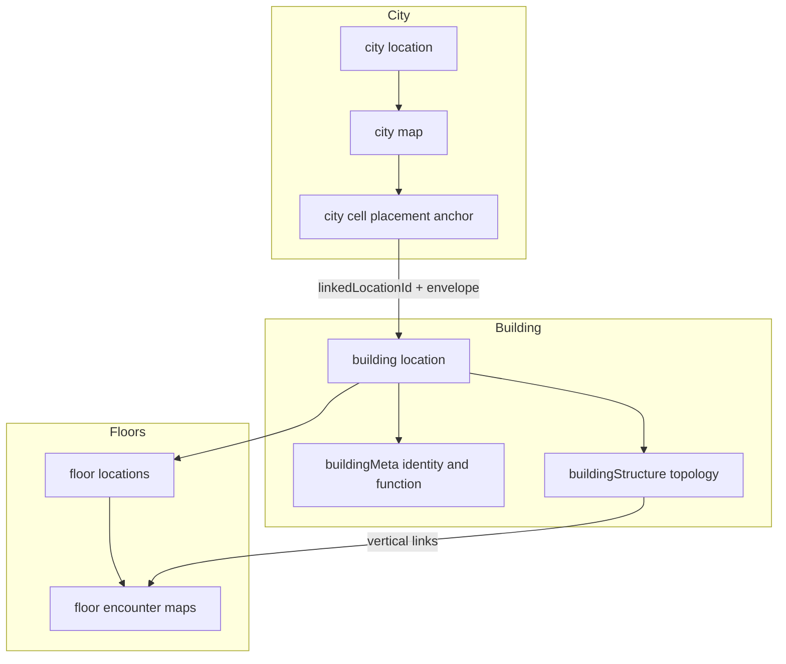

# Location modeling enhancement: cities, buildings, floors, placement, transitions (refined)

## 1. Overview

**Goal:** Strengthen the foundation so **building identity**, **city placement / footprint**, and **interior structure** (floors, vertical links) have clear boundaries and **one authoritative source** for “where this building sits on the city grid,” while keeping **durable linkage** queryable from both sides—**without** leaving legacy dual-read/write paths in the final codebase.

**Current anchors in code:**

- Locations: [`CampaignLocation.model.ts`](server/shared/models/CampaignLocation.model.ts) — generic fields + `buildingProfile` (`Schema.Types.Mixed`).
- Shared shape: [`LocationBuildingProfile`](shared/domain/locations/building/locationBuilding.types.ts) — mixes **profile** (type, subtype, functions, storefront, hours, refs) with **`stairConnections`** (topology).
- Maps: [`CampaignLocationMap.model.ts`](server/shared/models/CampaignLocationMap.model.ts) — `cellEntries[]` with `cellId`, `linkedLocationId`, `objects[]`, `regionId`; building-on-city uses **marker** + link (see [`locationPlacedObject.registry.ts`](src/features/content/locations/domain/model/placedObjects/locationPlacedObject.registry.ts) `building` family).
- Vertical pairing: [`LocationVerticalStairConnection`](shared/domain/locations/building/locationBuildingStairConnection.types.ts) — endpoints reference **floor** locations + cell + object id.
- Runtime traversal graph: [`CampaignLocationTransition.model.ts`](server/shared/models/CampaignLocationTransition.model.ts) — **map-scoped** edges (`fromMapId` + `fromCellId` → `toLocationId` / optional target map/cells).

**Direction:** Prefer **small, explicit named subdocuments** on `CampaignLocation` (`buildingMeta`, `buildingStructure`, optional `floorMeta`)—**not** opaque `Mixed`—over a new collection unless independent versioning is required later. **Compatibility with `buildingProfile` is transitional only** and must be **fully removed** in the final phase (see §10 and **Non-negotiable invariants**).

---

## 2. Current modeling problems

1. **Mixed concerns in `buildingProfile`:** Function/type/public-hours live next to **`stairConnections`**, which are **structure/topology**, not “profile.”
2. **Footprint vs function entanglement:** City **building** marker **variants** (`residential` / `civic`) vs **`LocationBuildingProfile`** `primaryType` / `functions` — two vocabularies that can **drift**; **function stays on building**, **urban envelope stays on the city map**.
3. **Placement authority is implicit:** Truth is city map `cellEntries` + marker object; the building row lacks a clear **back-pointer**; risk of **two editable sources** if coordinates are copied onto the building.
4. **Floors are thin at the location layer:** Optional **`floorMeta`** only for persisted semantics beyond name/sortOrder.
5. **Three “transition” concepts:** `connections` on location, **`CampaignLocationTransition`**, **`LocationVerticalStairConnection`** — naming and layering must stay distinct when adding **building ↔ street**.

---

## 3. Recommended target model (conceptual)

**Principles:**

- **City map placement row** is authoritative for **grid address**, **urban envelope** (footprint template / marker variant, orientation, frontage hints), and **which building id** is linked (`linkedLocationId`).
- **Building location** is authoritative for **identity**, **function/type** (`buildingMeta`), and **interior structure** (`buildingStructure`). **Reverse pointers** on the building are **denormalized only**—never an alternate editor source for placement.
- **Floor** locations remain **children of building** per [`locationScale.policy.ts`](shared/domain/locations/scale/locationScale.policy.ts).

---

## 4. Recommended schema blocks / responsibilities

### 4.1 Generic location row (all scales)

**Keep:** `campaignId`, `locationId`, `name`, `scale`, `category`, `description`, `imageKey`, `accessPolicy`, `parentId`, `ancestorIds`, `sortOrder`, `label`, `aliases`, `tags`, `connections` (unless narrowed later).

**Building scale — final names:** `buildingMeta`, `buildingStructure` (typed subdocuments). **`buildingProfile` must not exist in the end state** (field removed from schema and documents).

### 4.2 `buildingMeta` (final identity / function block)

Same illustrative shape as before: `primaryType`, `primarySubtype`, `functions`, storefront/hours, refs, faction, notes — **no** stairs, **no** placement coordinates.

### 4.3 `buildingStructure`

**`verticalConnections`** (migrated from legacy `buildingProfile.stairConnections`) holds **`LocationVerticalStairConnection[]`**. Optional future **`entrances`** for street-link indirection.

### 4.4 `floorMeta`

Optional `levelIndex`, `levelLabel`, `defaultMapId` — minimal persisted floor semantics only.

### 4.5 City placement (map-owned) — authoritative fields

**Authoritative on the city map** (per cell authoring entry that places a building):

- **`cellId`** — grid address for that placement row.
- **`linkedLocationId`** — the building being placed (**at most one building per placement row**; see invariants).
- **Marker / object payload** — `objects[]` entries for the building marker: **`authoredPlaceKindId`**, **`variantId`**, and any **orientation / frontage** fields you add (persist here, not on `buildingMeta`).
- **`regionId`** — overlay region membership (district-like derivation).
- **`placementId`** (**recommended part of target state**) — stable uuid for this authoring row, generated when the row is created or backfilled by migration. **Join key** for building **`cityPlacementRef`** so APIs do not rely on “scan all cells to find link” as the only stable handle.

**Not authoritative on the building for placement:** editing **`cityPlacementRef`** or any cached **`cellId`** must not be exposed as user-editable; server recomputes from city map or rejects.

---

## 5. Stored vs derived data guidance

- **Persist:** `buildingMeta` (function/type), `buildingStructure.verticalConnections`, optional `floorMeta`, city map placement row (including **`placementId`**), building **`cityLocationId`** + **`cityPlacementRef`** as denormalized pointers.
- **Persist on map only:** footprint template / marker variant, orientation, frontage — **never** duplicate as authoritative on `buildingMeta`.
- **`cellId` on building row:** **Not an independently editable field.** Either **omit** from persisted building document and **derive** when loading city map + ref, or allow **cached `cellId`** only as a denormalized copy **updated only** when placement changes (server-side). **Invalidation:** any city map save that moves or removes the placement **must** recompute or clear building cache; **client must not** send stale `cellId` as a competing edit.
- **Derived:** district from `regionId` / MapZone, compatibility/recommended-preset style QA signals, layout suggestions.

---

## 6. Two-way relationship: city placement ↔ building (tightened)

**Single source of truth for position and envelope:** the **city `CampaignLocationMap`** document’s **`cellEntries`** row (identified by **`cellId`** + **`placementId`** once added) that contains **`linkedLocationId`** and the **building marker object**.

**Denormalized on `CampaignLocation` (building scale only):**

- **`cityLocationId`** — which city location hosts this placement (for queries and when parent hierarchy is ambiguous).
- **`cityPlacementRef`** — **`{ mapId, placementId }`** as the **canonical** pointer; **`cellId`** optional cache only (see §5).

**Rules to prevent two editable sources:**

- **Authoring UX** edits placement only through the **city map editor** (cell + marker + link).
- **Building save path** accepts **`buildingMeta` / `buildingStructure`** updates; **rejects** payloads that attempt to set placement fields not on the allowlist, or **ignores** client-supplied cached placement fields and **overwrites** them from authoritative map resolution when the building is linked.
- **`placementId` in target state:** **Strongly recommended** so `cityPlacementRef` is stable across cell re-addressing if you ever support operations that rewrite `cellId` (otherwise ref by `cellId` alone is brittle).

---

## 7. Floors and building-structure modeling

Unchanged from prior plan: vertical pairing under **`buildingStructure`**; floor map objects as anchors; **`CampaignLocationTransition`** for gameplay edges including future **street ingress**. Combat code must read **`buildingStructure.verticalConnections`**, not legacy profile fields.

---

## 8. Non-negotiable invariants

These are **domain rules**, not UI hints:

1. **At most one city placement per building:** a building (`scale === 'building'`) may appear as **`linkedLocationId`** in **at most one** city map **cell authoring row** across the campaign (for maps whose host is a city placement context—scope precisely in implementation: typically **city location’s** maps).
2. **At most one building per placement row:** a single **`cellEntries`** row may reference **at most one** building via **`linkedLocationId`** (trivially one link field; duplicate objects on same cell must not imply two buildings).
3. **No dual placement truth:** editable placement state lives **only** on the city map; building carries **pointers/cache** per §5–6.
4. **End state — no legacy shape:** no persisted **`buildingProfile`**; no API or server **read** of `buildingProfile`; no **write** accepting legacy-only payloads; no **normalization helpers** mapping old→new in production paths after the **compatibility-removal exit gate**.

---

## 9. Docs recommendation

**Recommendation: yes** — add a dedicated reference doc under [`docs/reference/locations/`](docs/reference/locations/) so schema relations and invariants do not live only in this plan.

**Preferred filename:** [`docs/reference/locations/location-map-schema-relations.md`](docs/reference/locations/location-map-schema-relations.md)

**Rationale:** The confusion to resolve is **cross-model** (`CampaignLocation` ↔ `CampaignLocationMap` ↔ transitions). The name **`location-map-schema-relations`** makes that scope obvious. **`location-schema-relations.md`** is easier to misread as “only the location collection.”

**Doc should include:** authoritative source by concern; relationships between `CampaignLocation`, `CampaignLocationMap`, `buildingMeta`, `buildingStructure`, floor locations, and `CampaignLocationTransition`; stored vs derived; **one-building–one-placement** invariant; **migration-era** compatibility rules and **explicit statement that those paths are removed after Phase N** (pointer to plan or completion checklist).

---

## 10. Revised phased migration strategy

**Phase 1 — Types and dual-write (development)**

- Split types: identity vs structure; **`stairConnections` → `buildingStructure.verticalConnections`** in types and new persistence fields.
- Server and client may still **read** legacy `buildingProfile` **only inside this phase** for unmigrated documents.

**Phase 2 — Data migration script (manual run)**

- Run the **migration script** specified in **§13 Migration script requirements** (`--dry-run` first, then `--apply`).
- Script backfills **`placementId`**, **`cityPlacementRef`**, **`cityLocationId`**, moves **`stairConnections` → `buildingStructure`**, unsets **`buildingProfile`**.

**Phase 3 — Enforcement**

- Server validation: **single-link invariant**, reject legacy-only payloads, reject orphan/inconsistent pointers.
- Editor: placement edits only via city map; building form cannot edit placement.

**Phase 4 — Compatibility-removal exit gate (mandatory final cleanup)**

**Objective:** **Zero** legacy compatibility in production code paths.

**Success criteria (all required):**

- **No legacy reads:** no `buildingProfile` access in server, client, or shared packages (except archived migration script or explicit `__tests__/fixtures` if unavoidable).
- **No legacy writes:** APIs and repos do not persist `buildingProfile`.
- **Normalization removed:** helpers that map old `buildingProfile` → new blocks are **deleted** from runtime code (may remain in **migration script only**).
- **Validation:** create/update **rejects** payloads containing `buildingProfile` or legacy-only shapes after cutover.
- **Database:** migration **unsets** `buildingProfile` on all building documents (verification query returns count **0**).

**Verification (how to prove it):**

- Repo-wide search: e.g. `buildingProfile`, `stairConnections` on profile (narrow patterns to avoid false positives), legacy normalization function names — **must be empty** in `src/`, `server/`, `shared/` except migration tooling or documented test fixtures.
- Optional CI guard: lint rule or grep script in check pipeline that fails if forbidden identifiers reappear in app paths.

**End state naming:** **`buildingMeta`** is **not** temporary—it is the **final** name for the identity block. What is removed is **`buildingProfile`** and **all transitional dual-read paths**, not the concept of `buildingMeta`.

---

## 11. Duplicate / bad legacy data handling (migration policy)

**Detection:**

- **Building linked from multiple city cells/maps:** enumerate all `cellEntries` with `linkedLocationId` pointing to the same `building` — **report** every `(campaignId, cityLocationId, mapId, cellId, placementId?, linkedLocationId)`.
- **Conflicting `cityPlacementRef` on building vs map:** compare post-scan truth.

**Default rule: do not silently pick a winner.**

- **Dry-run:** always list duplicates with full ids; exit code **non-zero** if duplicates exist (configurable flag to **only warn** if you need a preview—default should be **fail** for apply).
- **Apply:** **abort** (no partial apply) if duplicates exist **unless** you pass an explicit **`--force-resolve=…`** mode (discouraged). Preferred: **manual cleanup** using the report, then re-run.

**Report fields (minimum) for practical cleanup:**

- `campaignId`, `cityLocationId`, `mapId`, `cellId`, `placementId` (after backfill), `linkedLocationId` (building), host location name, map name, building name.
- For duplicate building: **all** competing rows listed side-by-side.

**Optional safe auto-rule (only if unambiguous):** if one row is clearly stale (e.g. empty objects and duplicate link)—document explicitly; otherwise **defer to human**.

---

## 12. Where to enforce the single-link invariant

| Layer | Enforcement |
|-------|-------------|
| **Schema/model** | Typed subdocuments only; **no** `buildingProfile` Mixed in end state. Unique compound indexes if MongoDB can express “one placement per building” via a dedicated collection later—**today** enforce in application layer + migration verification. |
| **Server write path** | On city map save: reject if `linkedLocationId` (building) already linked from another city cell in campaign. On building save: reject forbidden placement edits; recompute `cityPlacementRef` from authoritative map. |
| **Editor/workspace** | City map authoring: block linking a building that is already placed; show error from server. Building workspace: no controls to edit `cellId`/placement. |
| **Migration** | Dry-run and apply modes **scan and verify**; fail on duplicates unless resolved. |

---

## 13. Migration script requirements (deliverable)

**Deliverable:** a **single, explicit script** (e.g. Node/tsx or `mongosh` — align with repo conventions) that operators run **manually** after backup. **Cursor / implementation work** should **produce** this script; the plan does not include the script’s code here.

**Modes:**

- **`--dry-run`:** no writes; print counts and duplicate reports; exit non-zero on invariant violations (default).
- **`--apply`:** perform writes idempotently where possible.

**What it should scan:**

- All **`CampaignLocationMap`** documents for host locations with `scale === 'city'` (and any other host scales allowed to place buildings per product rules—**default: city only** unless expanded explicitly).
- All **`cellEntries`** with `linkedLocationId` targeting **`scale === 'building'`**.

**What it should update:**

- **Backfill `placementId`** on each relevant `cellEntries` row (uuid v4) if missing.
- **For each building:** set **`cityLocationId`**, **`cityPlacementRef: { mapId, placementId }`**, optional **`cachedCellId`** if you adopt cache (or omit cache in v1).
- **Move `buildingProfile.stairConnections` → `buildingStructure.verticalConnections`** when new field empty.
- **Migrate `buildingProfile` identity fields → `buildingMeta`** when `buildingMeta` absent.
- **`$unset` `buildingProfile`** after successful copy (apply mode).

**Reporting:**

- Per-campaign summary: buildings processed, placements written, stair rows migrated, documents skipped.
- **Duplicate report** (see §11); **conflict report** if building already has `cityPlacementRef` pointing elsewhere.

**Post-migration verification output:**

- Count of building locations with **`buildingProfile` key** = 0.
- Count of buildings with **more than one** incoming placement link = 0.
- Sample spot-check list of **N** random buildings with resolved `cityPlacementRef`.

**Backup / rollback:**

- **Before `--apply`:** require documented **mongodump** or snapshot of `campaignlocations` / `campaignlocationmaps` collections (exact names per codebase).
- **Rollback:** restore from backup; script should be **documented as non-reversible** except via restore (no automatic down-migration required if backup is mandatory).

---

## 14. Open questions / intentionally deferred

- **Building parent is `site` vs `city`:** how **`cityLocationId`** is chosen when the parent is not the city—resolve when implementing `cityPlacementRef` backfill rules.
- **Separate `BuildingPlacement` collection:** still deferred unless product needs it.
- **Hex multi-cell footprints:** deferred ([`domain.md`](docs/reference/locations/domain.md)).

---

## 15. Requested short sections (summary blocks)

### Non-negotiable invariants

See **§8**. In short: **one building ↔ one city placement**; **placement authority only on city map**; **no legacy `buildingProfile` or dual-read paths after exit gate**.

### Docs recommendation

See **§9**. **Create** [`docs/reference/locations/location-map-schema-relations.md`](docs/reference/locations/location-map-schema-relations.md).

### Migration script requirements

See **§13**. Includes **dry-run / apply**, **duplicate detection**, **backfill**, **stair migration**, **verification output**, **backup**.

---

## 16. Build continuation (next execution)

**Current codebase snapshot:** `CampaignLocation` has **`buildingMeta`** / **`buildingStructure`** (no `cityLocationId` / `cityPlacementRef` yet). `CampaignLocationMap` **`cellEntries`** use **`cellId` + `linkedLocationId`** (no **`placementId`** yet). Single-link validation exists in the map service; the editor prefetches “already linked” buildings on city/site maps (UX only; server remains authoritative — see `docs/reference/locations/location-map-schema-relations.md`).

**Shipped vs still open (YAML todos):**

| Todo | Status |
|------|--------|
| `placement-backpointer` | **Pending** — not in DB/types yet |
| `street-transitions` | **Pending** — defer until placement ids/refs exist |

**§13 script note:** `scripts/migrateLocationBuildingProfile.ts` migrates **legacy `buildingProfile` → `buildingMeta`/`buildingStructure`** and reports duplicate building links; it does **not** backfill **`placementId`** or **`cityPlacementRef`**. Treat **placement backfill** as a **separate** migration (or extend the script in a follow-on PR) once schema + write paths exist.

### Phase A — Placement backpointer (do first)

Ordered checklist:

1. **Shared + Mongoose:** Add **`placementId`** (string uuid) to **`mapCellAuthoringEntry`** / `cellEntries` rows; add **`cityLocationId`** and **`cityPlacementRef`: `{ mapId, placementId }`** on **building** `CampaignLocation` (optional **`cachedCellId`** if you adopt cache-only-on-server rules from §5–6).
2. **Authoring client:** Generate or preserve **`placementId`** when creating a placement row; thread through grid draft → save payload.
3. **Server map save:** On create/update of a cell entry that links a building: ensure **`placementId`** exists; **upsert** building **`cityLocationId`** + **`cityPlacementRef`** from the authoritative map row; clear stale refs when link removed or building moved (same transaction / ordering as existing invariant validation).
4. **Server building save:** Reject or ignore client attempts to edit placement fields outside allowlist; optionally recompute denormalized fields from resolved map.
5. **Migration:** New or extended **`--dry-run` / `--apply`** pass: backfill **`placementId`** on existing rows; set **`cityPlacementRef`** / **`cityLocationId`** per §13; verify counts and duplicates per §11.
6. **Docs:** Extend **`location-map-schema-relations.md`** with concrete field names once stored.

### Phase B — Street transitions (after Phase A)

1. **Product/API:** Define how **building ↔ street** (or **site ↔ street**) edges are authored — **`CampaignLocationTransition`** rows with `fromMapId` + `fromCellId` → target location/map (align with existing transition model).
2. **Optional:** **`buildingStructure.entrances`** — stable ids/refs to transition rows for authoring and combat routing.
3. **Editor:** Surface transition authoring where it fits the location workspace (may depend on map/rail plans already in `.cursor/plans/`).

### Dependency rule

Do **not** implement **Phase B** until **placementId + cityPlacementRef** are persisted and migration story is clear; otherwise street ingress may reference brittle **cellId-only** joins.

---

## Evaluation summary (original A–F prompts)

- **A (location records):** Final: **`buildingMeta` + `buildingStructure`** (+ optional **`floorMeta`**); **remove `buildingProfile`** after exit gate.
- **B (city placement):** Map row authoritative; building **`cityPlacementRef`** + **`placementId`** recommended; **`cellId`** not independently editable (derived or server-maintained cache).
- **C (floors/transitions):** **`buildingStructure`** vs **`CampaignLocationTransition`** unchanged.
- **D (profile vs footprint):** **`buildingMeta`** = function; map marker/row = footprint/presentation.
- **E (stored vs derived):** §5 + §6.
- **F (migration):** §10–§13 + **Phase 4 exit gate (§10)**; **script deliverable** in §13.
