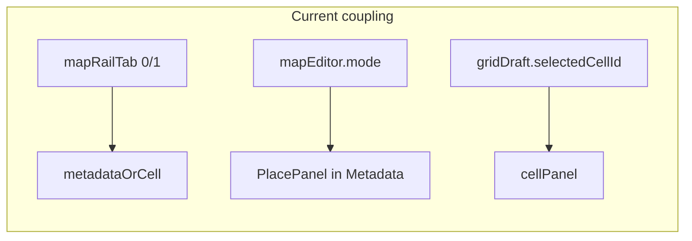

# Location editor right rail: Location / Map / Selection

## Current state (baseline)

- `[LocationEditorMapRailTabs.tsx](src/features/content/locations/components/workspace/LocationEditorMapRailTabs.tsx)`: two tabs, **Metadata** vs **Cell**; `tabIndex === 0` shows `metadata`, else `cellPanel`.
- `[LocationEditRoute.tsx](src/features/content/locations/routes/LocationEditRoute.tsx)`: `mapRailTab` (`0 | 1`), `focusCellRailTab = () => setMapRailTab(1)`, passed to `[LocationGridAuthoringSection](src/features/content/locations/components/LocationGridAuthoringSection.tsx)` as `onCellFocusRail` when a cell is clicked in **select** mode (lines ~694–698).
- **Place panel** is incorrectly nested: `LocationMapEditorPlacePanel` is rendered inside the **metadata** stack when `mapEditor.mode === 'place'` (system branch ~1031–1038, campaign branch ~1298–1304). **Editor mode** already lives in `[useLocationMapEditorState](src/features/content/locations/domain/mapEditor/useLocationMapEditorState.ts)` / `[LocationMapEditorMode](src/features/content/locations/domain/mapEditor/locationMapEditor.types.ts)` — keep that as-is; do not merge it into rail section.




## Target architecture


| Concept        | Responsibility                           | Source of truth                                                                                                                                       |
| -------------- | ---------------------------------------- | ----------------------------------------------------------------------------------------------------------------------------------------------------- |
| `railSection`  | Which tab is visible: `location`         | `map`                                                                                                                                                 |
| `editorMode`   | Toolbar tool: select / place / paint / … | Existing `useLocationMapEditorState`                                                                                                                  |
| `mapSelection` | What is “selected” for the inspector     | `LocationMapSelection` union; **derive** from `gridDraft.selectedCellId` for this pass (`cell` vs `none`); other variants are structural placeholders |


## 1. Types and helpers

Add a small module (location suggested: `[src/features/content/locations/components/workspace/locationEditorRail.types.ts](src/features/content/locations/components/workspace/locationEditorRail.types.ts)`) exporting:

- `LocationEditorRailSection = 'location' | 'map' | 'selection'`
- `LocationMapSelection` union as specified (including `region`, `path`, `object` placeholders with stable ids)
- `deriveLocationMapSelection(selectedCellId: string | null): LocationMapSelection` — maps `null` → `{ type: 'none' }`, else `{ type: 'cell', cellId }`

No persistence changes; selection remains driven by existing draft until future hit-testing wires path/region/object.

## 2. Replace `LocationEditorMapRailTabs` with a section-based API

- **Rename** (conceptually) to something like `LocationEditorRailSectionTabs` (or keep one file but change exports) so the API is not “metadata/cell”.
- **Props** (directional):

```ts
section: LocationEditorRailSection;
onSectionChange: (section: LocationEditorRailSection) => void;
locationPanel: ReactNode;
mapPanel: ReactNode;
selectionPanel: ReactNode;
```

- **Tabs:** MUI `AppTabs` / `AppTab` with three labels: **Location**, **Map**, **Selection** (use `value`/`onChange` that round-trip the string union — check `[AppTabs](src/ui/patterns)` for string `value` support; if it only supports numbers, map index ↔ section inside this component only).

Update barrel exports: `[components/workspace/index.ts](src/features/content/locations/components/workspace/index.ts)`, `[components/index.ts](src/features/content/locations/components/index.ts)`.

## 3. `LocationEditorSelectionPanel` (dispatcher)

New component, e.g. `[LocationEditorSelectionPanel.tsx](src/features/content/locations/components/workspace/LocationEditorSelectionPanel.tsx)`:

- `selection: LocationMapSelection`
- For `**cell`**: render existing `[LocationCellAuthoringPanel](src/features/content/locations/components/LocationCellAuthoringPanel.tsx)` with the same props the route already passes today (host ids, draft slices, handlers).
- For `**none`**: single empty-state copy (e.g. “Select a cell, path, region, or object on the map.”) — can replace the narrower copy currently inside `LocationCellAuthoringPanel` when no cell is selected **only in this dispatcher path**, so the Selection tab is future-ready.
- For `**region` | `path` | `object`**: lightweight placeholder `Typography`/`Box` with TODO-friendly text (no metadata forms).

**Important:** `LocationCellAuthoringPanel`’s internal empty state when `selectedCellId == null` may become redundant for the Selection tab only; either keep the panel as-is for `cell` branch only (and never pass `null` when `selection.type === 'cell'`), or pass `null` only for `none` — the dispatcher should branch so `cell` always has a `cellId`.

## 4. Map panel content

- Move `**LocationMapEditorPlacePanel`** from the **Location** stack into `**mapPanel`**, still gated by `mapEditor.mode === 'place'` (same `items`, `activePlace`, `onSelectPlace`).
- **Location** stack: only location-level metadata — patch form / campaign form / visibility / building floor caption — **no** place panel.

Optional for this pass: when `mode !== 'place'`, Map tab can show a short neutral hint (“Choose Place in the toolbar to place objects, paths, and edges…”) so the tab is not blank; avoid overbuilding.

## 5. `LocationEditRoute` wiring

- Replace `mapRailTab` / `setMapRailTab` with `railSection` / `setRailSection` (`LocationEditorRailSection`), default `**'location'`** (or `'map'` if you prefer parity with power users — default `'location'` matches “metadata first”).
- Replace `focusCellRailTab` with `() => setRailSection('selection')` (same call sites).
- **Toolbar mode → Map:** wrap `mapEditor.setMode` in a callback passed to `LocationMapEditorToolbar` / `onModeChange` that:
  1. Calls `mapEditor.setMode(next)`.
  2. If `next === 'place'` (the only mode that currently has rail-side palette content), `setRailSection('map')`.
  Do **not** add a `useEffect` that continuously forces `railSection` from `mode`; only react on explicit toolbar changes. That keeps manual section switching usable unless the user performs a new strong action (e.g. entering Place).
- **No** “recent override” timer unless you discover a reusable pattern elsewhere; the codebase search did not show one for this editor.

Apply the same structure in **both** the system-patch branch and the **campaign** branch (the two `LocationEditorMapRailTabs` usages around lines 1028 and 1295).

## 6. Tests (focused, low cost)

Add pure tests for:

- `deriveLocationMapSelection` (none vs cell).
- Optional: a tiny helper `autoSwitchRailOnModeChange(nextMode)` returning `'map' | undefined` when `nextMode === 'place'` to keep route logic testable — only if it keeps the route slimmer.

Place tests near the types/helper, e.g. `locationEditorRail.types.test.ts` or `locationEditorRail.helpers.test.ts`.

## 7. Documentation touchpoint

- Update `[docs/reference/location-workspace.md](docs/reference/location-workspace.md)` table under workspace components: replace the **Metadata | Cell** description with **Location | Map | Selection** and one line on responsibilities (optional, only if you want docs in sync — skip if you prefer not to edit docs unless requested).

## Success criteria mapping


| Criterion                                   | How                                                                            |
| ------------------------------------------- | ------------------------------------------------------------------------------ |
| Place options not under Metadata            | `LocationMapEditorPlacePanel` only in `mapPanel`                               |
| Cell selection does not block place options | User switches to **Map** tab or enters **Place** mode (auto → Map)             |
| Three concerns separated                    | `railSection` state + `deriveLocationMapSelection` + existing `mapEditor.mode` |
| Future-ready selection                      | `LocationMapSelection` union + placeholder branches                            |


## Follow-ups (next slices, out of scope)

- Wire `region` / `path` / `object` selection from grid hit-testing and set `mapSelection` explicitly (may lift from `selectedCellId`-only derivation).
- Rail content for **paint** / **erase** if product wants options in the rail (paint tray stays on the left per current design).
- Toolbar / place palette redesign, persistence, region painting — explicitly excluded here.

