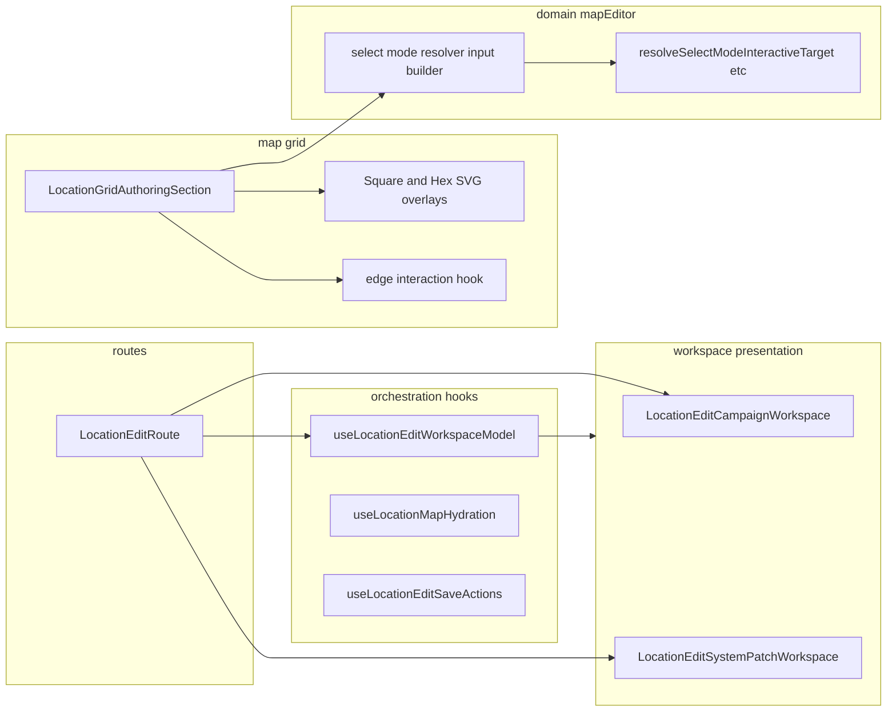

# Location workspace refactor: pre-build review and staged plan

## Baseline (current state)

- **Route:** [LocationEditRoute.tsx](src/features/content/locations/routes/LocationEditRoute.tsx) already has a stable canvas seam ([LocationEditorMapCanvasColumn](src/features/content/locations/components/workspace/LocationEditorMapCanvasColumn.tsx)) and map hydration extracted to [hydrateDefaultLocationMap.ts](src/features/content/locations/routes/hydrateDefaultLocationMap.ts). The bulk of the file remains **orchestration**: RHF + campaign data + building floors + grid draft + map editor + many `useCallback` handlers + three render paths (loading/error, system patch, campaign).
- **Grid:** [LocationGridAuthoringSection.tsx](src/features/content/locations/components/LocationGridAuthoringSection.tsx) already uses [useLocationAuthoringGridLayout](src/features/content/locations/hooks/useLocationAuthoringGridLayout.ts), [usePruneGridDraftOnDimensionChange](src/features/content/locations/hooks/usePruneGridDraftOnDimensionChange.ts), cell/path presentation splits ([LocationMapCellAuthoringOverlay](src/features/content/locations/components/mapGrid/LocationMapCellAuthoringOverlay.tsx), [LocationMapPathSvgPaths](src/features/content/locations/components/mapGrid/LocationMapPathSvgPaths.tsx)). **Still in-file:** pointer routing by mode, select-mode hover/click (`resolveSelectModeInteractiveTarget` + `refineSelectModeClickAfterRegionDrill`), paint/erase strokes, place/path hover, **square edge boundary-paint** (refs + capture handlers), and the remaining **square/hex SVG shell JSX**.

The preliminary direction (hooks + shells + SVG) is sound; the refinement below prioritizes **stable seams, ownership, and staged risk** over maximizing file count.

---

## Evaluation of proposed direction

### Route: hooks vs “model + shells” first

**Verdict:** Prefer **workspace shells first**, then **one route-level model hook**, then **grouped hooks**—not five narrow hooks in parallel.

- **Shells** (`LocationEditCampaignWorkspace`, `LocationEditSystemPatchWorkspace`) are **low coupling**: props in, JSX out. They do not hide side effects or duplicate domain rules. They immediately answer “where is the edit UI?”
- A single `**useLocationEditRouteModel`** (name refined below) can own **form + grid draft + rail + map editor + derived map host IDs + palette memos** without forcing every consumer to know RHF internals—**if** its return type is explicit (see contracts).
- **Save / hydration / draft mutations** are legitimate **second-tier** extractions *after* shells + model, because they touch IO (`locationRepo`, `bootstrapDefaultLocationMap`) and are where regressions concentrate—better to extract when the route is already thinner.

### Grid: mode hooks vs SVG vs edge hook

**Verdict:** Prefer **dumb SVG overlay components first** (`SquareMapAuthoringSvgOverlay`, `HexMapAuthoringSvgOverlay`), then **one** interaction extraction (**edge boundary paint** via `useSquareEdgeBoundaryPaint` or equivalent), **before** splitting select/paint/place/path into many hooks.

- SVG overlays are **pure render layers**: easy to review in PR, easy to snapshot visually, almost no shared mutable state.
- Edge authoring is **self-contained** (refs, capture handlers, commit to parent callback) and is already marked off in the source with a section comment—good seam.
- **Select / paint / place / path** share `gridContainerRef`, `draft`, `mapEditorMode`, and pointer routing; extracting four hooks at once risks **tangled dependencies** unless preceded by a **shared resolver input builder** (below).

---

## Shared resolver / path seam (grid)

**Duplication today:** [LocationGridAuthoringSection.tsx](src/features/content/locations/components/LocationGridAuthoringSection.tsx) builds arguments to `resolveSelectModeInteractiveTarget` in multiple places (e.g. `handleSelectPointerMove` vs `onCellClick` branches with/without `skipGeometry`). Same underlying fields: `objectsByCellId`, `linkedLocationByCellId`, `regionIdByCellId`, `pathPolys`, `edgeGeoms`, `edgeEntries`, `isHex`.

**Recommended seam (before aggressive mode-hook splits):**

- A small **pure helper** in the feature (e.g. `mapEditor/buildSelectModeResolverContext.ts` or next to existing [resolveSelectModeInteractiveTarget.ts](src/features/content/locations/domain/mapEditor/resolveSelectModeInteractiveTarget.ts)):
`buildSelectModeResolverArgs(draft, pathPickPolys, edgePickGeoms, isHex)` → object spread into `resolveSelectModeInteractiveTarget({ ... })`.
- Optionally a second helper for **click** that applies `refineSelectModeClickAfterRegionDrill` so `onCellClick` stays readable.

This reduces duplication and stabilizes future refactors (region paint / selection tweaks touch one builder).

---

## 1. Best first extraction pass (safest / highest ROI)

**Extract first (exact artifacts):**


| Artifact                           | Responsibility                                                                                                                                        | Why first                                                     |
| ---------------------------------- | ----------------------------------------------------------------------------------------------------------------------------------------------------- | ------------------------------------------------------------- |
| `LocationEditSystemPatchWorkspace` | System patch: `LocationEditorWorkspace` + patch header + `mapCanvasColumn` slot + patch rail + `mapAuthoringPanel` / `selectionPanel` props passed in | Isolated branch; no `FormProvider`; fewer props than campaign |
| `LocationEditCampaignWorkspace`    | Campaign: `FormProvider` + building strip wrapper + `LocationEditorWorkspace` + location form stack + modals (linked location, delete confirm)        | Largest JSX block; clarifies “campaign edit shell”            |
| Thin **route file** after pass     | `LocationEditRoute` loads data, calls hooks, chooses `SystemPatchWorkspace` vs `CampaignWorkspace`                                                    | Ownership: route = router + entry fetch + branch only         |


**Optional in the same pass only if small:** move `mapAuthoringPanel` / `selectionPanel` / `mapCanvasColumn` assembly into the campaign workspace as **children or render props** so the route does not build large React nodes.

**Why this is safest:** No change to save logic, hydration, or grid behavior if props are passed **explicitly** (same handlers, same child trees). PR is mostly **move JSX** + prop typing.

**Contracts:** Each workspace component receives **explicit** props: `headerProps`, `canvas`, `rightRail`, `mapAuthoringPanel`, `selectionPanel`, `modals`—or a single `model` object typed from the route model hook (second pass). Avoid implicit closure over route state inside the workspace.

---

## 2. Second pass (after first pass is green)

**Primary:**


| Artifact                                                   | Responsibility                                                                                                                                                                                                                                                                                               |
| ---------------------------------------------------------- | ------------------------------------------------------------------------------------------------------------------------------------------------------------------------------------------------------------------------------------------------------------------------------------------------------------ |
| `useLocationEditWorkspaceModel` (recommended name; see §5) | Single hook returning **explicit** bundle: RHF `methods` subset needed by UI, `gridDraft`/`setGridDraft`/`baseline`/`isGridDraftDirty`, `railSection`, `mapEditor`, `fieldConfigs`, `mapHost`* ids, palette items, `leftMapChromeWidthPx`, canvas zoom/pan, and **stable handlers** referenced by workspaces |


**Secondary (same pass or follow-up PR if large):**


| Artifact                     | Responsibility                                                                                                                                                          |
| ---------------------------- | ----------------------------------------------------------------------------------------------------------------------------------------------------------------------- |
| `useLocationMapHydration`    | Wraps existing [hydrateDefaultLocationMapState](src/features/content/locations/routes/hydrateDefaultLocationMap.ts) + the two `useEffect` call sites + cancel semantics |
| `useLocationEditSaveActions` | `handleCampaignSubmit`, `handleAddFloor`, patch save wiring (`useSystemPatchActions`)                                                                                   |


Keep **grid draft mutations** (`handleAuthoringCellClick`, `handleEraseCell`, region paint handlers) either **inside** the model hook or in a **single** `useLocationMapDraftActions` that takes `setGridDraft` + `mapEditor` + grid dimensions—**not** five separate hooks until the model is stable.

---

## 3. What not to split yet

- **Do not** immediately split `handleAuthoringCellClick` (place + draw path) from `handleEraseCell` + edge handlers into separate hooks if they still share `mapEditor`, `gridGeometry`, `gridColumns`/`rows`—consolidate under one **draft actions** module/hook first.
- **Do not** extract `useLocationFormCampaignData` / `useLocationFormDependentFieldEffects` callers into more hooks—the domain already owns form behavior; the route should **compose**, not re-wrap.
- **Do not** move map editor state out of `useLocationMapEditorState` without a product reason—it is already the editor toolbar seam.
- **Do not** split grid **select / paint / place / path** into four hooks until **resolver context helper** exists and edge overlay is extracted—otherwise ref wiring explodes.

---

## 4. Recommended target structure (realistic)

Keep everything under the locations feature; prefer **route-specific** and **map-authoring** folders over generic `hooks/` sprawl.

```text
src/features/content/locations/
  routes/
    LocationEditRoute.tsx              # thin: branch + composition
    hydrateDefaultLocationMap.ts       # existing
    locationEdit/
      useLocationEditWorkspaceModel.ts # orchestration (optional subfolder if route dir noisy)
      useLocationMapHydration.ts
      useLocationEditSaveActions.ts
  components/
    workspace/
      LocationEditCampaignWorkspace.tsx
      LocationEditSystemPatchWorkspace.tsx
      LocationEditorMapCanvasColumn.tsx  # existing
    mapGrid/
      LocationGridAuthoringSection.tsx   # orchestrator; smaller over time
      mapAuthoring/
        SquareMapAuthoringSvgOverlay.tsx
        HexMapAuthoringSvgOverlay.tsx
      LocationMapCellAuthoringOverlay.tsx
      LocationMapPathSvgPaths.tsx
    mapAuthoring/  # optional: only if you want grid+overlays co-located
      useSquareEdgeBoundaryPaint.ts
  hooks/           # existing cross-cutting location hooks
    useLocationAuthoringGridLayout.ts
    usePruneGridDraftOnDimensionChange.ts
  domain/mapEditor/
    selectModeResolverContext.ts       # pure: buildSelectModeResolverArgs (name TBD)
```

**Rule of thumb:** `routes/` owns **entry + persistence wiring**; `components/workspace/` owns **shell layout**; `components/mapGrid/` + `mapAuthoring/` owns **interaction + overlays**; `domain/mapEditor/` owns **pure resolver helpers**.

---

## 5. Naming refinements


| Weak name                      | Better                                                                 | Rationale                                                                   |
| ------------------------------ | ---------------------------------------------------------------------- | --------------------------------------------------------------------------- |
| `useLocationEditRouteModel`    | `useLocationEditWorkspaceModel`                                        | Signals “workspace orchestration for this route,” not generic “route model” |
| `buildSelectModeResolverArgs`  | `buildSelectModeInteractiveTargetInput` or `toSelectModeResolverInput` | Matches domain name `resolveSelectModeInteractiveTarget`                    |
| `useSquareEdgeBoundaryPaint`   | Keep                                                                   | Clear; square-only is important                                             |
| `SquareMapAuthoringSvgOverlay` | Keep                                                                   | Dumb render layer; “Authoring” distinguishes from read-only map views       |


---

## 6. Risk callouts and what to test after each pass


| Area                     | Regression risk                                                        | Mitigation                                                                                                                                          |
| ------------------------ | ---------------------------------------------------------------------- | --------------------------------------------------------------------------------------------------------------------------------------------------- |
| **Workspace extraction** | Wrong props to `LocationGridAuthoringSection` (host ids, chrome width) | Manual: system patch vs campaign vs building floor; compare host props before/after                                                                 |
| **Model hook**           | Stale closures on submit (`gridDraftRef` pattern must remain)          | Keep ref pattern in one place; run existing save path tests if any; manual save after grid-only edits                                               |
| **Hydration hook**       | Effect deps / cancel on unmount                                        | Manual: navigate away mid-load; switch floors                                                                                                       |
| **Save actions**         | Building vs non-building bootstrap target                              | Manual: save building + floor map; save single location                                                                                             |
| **SVG overlays**         | SVG size vs grid box, z-index, pointer-events                          | Visual: paths, edges, hex region outlines                                                                                                           |
| **Edge hook**            | Capture-phase ordering, Shift axis lock                                | Manual: draw wall stroke, erase edge; domain tests for [edgeAuthoring](src/features/content/locations/domain/mapEditor/edgeAuthoring.ts) stay green |
| **Resolver builder**     | `skipGeometry` / empty polys branch                                    | Exercise select click with/without `gridContainerRef`                                                                                               |


**Automated:** keep running existing location/domain tests ([locationEditorRail.types.test.ts](src/features/content/locations/components/workspace/locationEditorRail.types.test.ts), [mapGridCellVisualState.test.ts](src/features/content/locations/components/mapGrid/mapGridCellVisualState.test.ts), [edgeAuthoring.test.ts](src/features/content/locations/domain/mapEditor/edgeAuthoring.test.ts)); add **unit tests for pure `buildSelectMode…Input`** if non-trivial.

---

## 7. Suggested implementation order (2–4 passes)

**Pass A — Shells (highest safety, clarity)**  

1. Add `LocationEditSystemPatchWorkspace` + `LocationEditCampaignWorkspace` with explicit props.
2. Slim `LocationEditRoute` to fetch + branch + compose.

**Exit criteria:** No behavior change; file size drops; code review focuses on prop contracts.

**Pass B — Route model + hydration + save (grouped ownership)**  

1. Introduce `useLocationEditWorkspaceModel` (or split only if review shows >800 lines: model vs save).
2. Move hydration effects into `useLocationMapHydration`.
3. Move save/add floor/patch into `useLocationEditSaveActions`.

**Exit criteria:** Route file mostly wiring; handlers have clear homes.

**Pass C — Grid render layers + resolver seam**  

1. `SquareMapAuthoringSvgOverlay` + `HexMapAuthoringSvgOverlay` (move JSX only).
2. Add pure `buildSelectModeInteractiveTargetInput` (or similar) and refactor `LocationGridAuthoringSection` call sites.

**Exit criteria:** Less duplication; overlays testable in isolation.

**Pass D — One interaction hook (edge)**  

1. `useSquareEdgeBoundaryPaint` (or `useLocationMapSquareEdgeInteraction`) extracting refs + handlers + `commitEdgeStroke`.

**Exit criteria:** Grid section measurably smaller; edge behavior unchanged.

**Defer:** Splitting select/paint/place/path into multiple hooks until Pass C+D prove stable and duplication is clearly isolated.

---

## Mermaid: target ownership




---

## Summary alignment with your priorities


| Priority             | How this plan addresses it                                                                                                  |
| -------------------- | --------------------------------------------------------------------------------------------------------------------------- |
| Readable ownership   | Shells = UI; model hook = orchestration; save/hydration = IO; grid = interaction + overlays; domain = pure resolver helpers |
| Stable seams         | Shells and SVG overlays first; hooks grouped by real ownership                                                              |
| Minimal coupling     | Explicit props; avoid many hooks sharing implicit route closure                                                             |
| Testability          | Pure resolver input builder; domain tests unchanged; optional unit tests for builder                                        |
| Low-regression order | A → B → C → D; defer multi-mode hook explosion                                                                              |


The **~400 line** aspiration remains a **guideline**: a **~500 line** `LocationEditRoute` that only composes hooks + workspaces is acceptable if orchestration stays obvious.