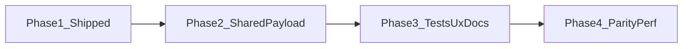

# Location map workspace: scalable dirty-state plan

## Phased roadmap

| Phase | Goal | Primary outcome |
| ----- | ---- | --------------- |
| **1** | Persistable snapshot + baseline | `isWorkspaceDirty`, [`workspacePersistableSnapshot.ts`](src/features/content/locations/routes/locationEdit/workspacePersistableSnapshot.ts), hydration/save baseline, [`location-workspace.md`](docs/reference/location-workspace.md) — **done** |
| **2** | Single source of truth | One builder for “what would be persisted” consumed by **both** dirty snapshot and `handleCampaignSubmit` — eliminates save vs dirty drift |
| **3** | Quality + rail UX | Table/matrix tests, contributor checklist in docs, explicit policy for nested **submit-to-commit** inspectors |
| **4** | Parity + polish | System patch rules documented or aligned; optional snapshot memoization if profiling says so |

---

## Current behavior (as implemented)

- **Campaign** edit header uses `[LocationEditRoute.tsx](src/features/content/locations/routes/LocationEditRoute.tsx)`: `dirty={isWorkspaceDirty}` (persistable snapshot + baseline from [`useLocationEditWorkspaceModel.ts`](src/features/content/locations/routes/locationEdit/useLocationEditWorkspaceModel.ts), [`workspacePersistableSnapshot.ts`](src/features/content/locations/routes/locationEdit/workspacePersistableSnapshot.ts)).
- **System** patch branch: `dirty={driver.isDirty() || isGridDraftDirty}` — map draft still compared via [`gridDraftPersistableEquals`](src/features/content/locations/components/locationGridDraft.utils.ts); **not** the full workspace snapshot (see Phase 4).
- **`isGridDraftDirty`** remains in the model for the system branch; campaign dirty no longer uses RHF `formState.isDirty` for the Save button.
- **Save path** (`[useLocationEditSaveActions.ts](src/features/content/locations/routes/locationEdit/useLocationEditSaveActions.ts)`): `toLocationInput(values)` + `bootstrapDefaultLocationMap(..., { excludedCellIds, ...normalizedAuthoringPayloadFromGridDraft(draft) })`, and for **building** scale, `buildingStairConnectionsRef.current` merged into `buildingProfile.stairConnections` — **Phase 2** should reuse the same structural pieces as [`serializeLocationWorkspacePersistableSnapshot`](src/features/content/locations/routes/locationEdit/workspacePersistableSnapshot.ts).

Rail tabs (**Location / Map / Selection**) are not separate stores: they all feed the same `FormProvider` form, `gridDraft`, and (for buildings) `buildingStairConnections`. There is no need for tab-specific dirty flags if the **aggregate snapshot** is correct.

## Root causes this design fixes

1. **Split sources of truth** — Anything that is **saved** but **not** reflected in RHF `isDirty` or in `gridDraftPersistableEquals` will keep Save disabled. The save path already uses `**buildingStairConnectionsRef`** for building saves; that state lives **outside** the current `dirty` expression and is a **concrete gap** for “rail changed but Save stays off” whenever connections and normalized grid data do not both move (or when only the ref-relevant slice changes). A **single snapshot** that mirrors submit inputs removes this class of bug for future parallel state too.
2. **RHF `isDirty` fragility** — Conditional fields, programmatic `setValue` without `shouldDirty`, or subscription quirks can miss edits. Comparing `**getValues()`-derived persistable input** (same shape as save) is more reliable than trusting `isDirty` alone.
3. **Map draft compare is already normalized** — `[gridDraftPersistableEquals](src/features/content/locations/components/locationGridDraft.utils.ts)` + `[normalizedAuthoringPayloadFromGridDraft](src/features/content/locations/components/locationGridDraft.utils.ts)` are the right building blocks; extend them into a **workspace-level** compare, not new per-field listeners.

## Recommended approach: canonical “persistable snapshot” + baseline

**Idea:** Define one function (or small module) that builds the **same logical payload** the server would receive from the editor: location fields from the form, map authoring from `gridDraft`, and building stair connections when `loc.scale === 'building'`. Compare **stable-serialized** current vs baseline.

| When                                        | Baseline update                                                                                                                                                                  |
| ------------------------------------------- | -------------------------------------------------------------------------------------------------------------------------------------------------------------------------------- |
| After map + form **hydration** succeeds     | Match `[hydrateDefaultLocationMap](src/features/content/locations/routes/hydrateDefaultLocationMap.ts)` / existing `setGridDraftBaseline` timing                                 |
| After **successful** `handleCampaignSubmit` | Same moment as today: `reset(...)` + `setGridDraftBaseline(structuredClone(gridDraftRef.current))` — also set `**buildingConnectionsBaseline`** (or fold into one baseline blob) |

**Dirty:** `!workspaceSnapshotEquals(current, baseline)`.

**Re-renders:** The hook must subscribe to **all** form values that affect save (e.g. `watch()` without args, or `useWatch({ control })` over the full form) plus `gridDraft` and `buildingStairConnections` so the header updates when any slice changes.

### Wiring (obvious / scalable)

- **Single export** from the workspace model, e.g. `isWorkspaceDirty`, used by `[LocationEditRoute.tsx](src/features/content/locations/routes/LocationEditRoute.tsx)` instead of `isDirty || isGridDraftDirty`.
- **Implementation detail:** Prefer **composing** existing helpers:
  - Map slice: reuse `normalizedAuthoringPayloadFromGridDraft` + `excludedCellIds` (same as save); optionally keep using `gridDraftPersistableEquals` **internally** for the map half to avoid duplicating sort/normalization rules.
  - Location slice: align with `toLocationInput(getValues())` or a shared `pick` list so new saved fields automatically join the snapshot when someone extends `toLocationInput`.
  - Building slice: include **normalized** `buildingStairConnections` (stable sort + stable stringify) when building save applies.

### Phase 2 — Single source of truth (anti-drift)

- Introduce a shared helper (name TBD, e.g. `buildCampaignWorkspacePersistableParts` or `buildCampaignLocationPersistablePayload`) that returns the **same** structured inputs the save path needs: merged `LocationInput` (including building stair merge rules), plus map bootstrap fields derived from `gridDraft`.
- [`serializeLocationWorkspacePersistableSnapshot`](src/features/content/locations/routes/locationEdit/workspacePersistableSnapshot.ts) should **call** that helper then `stableStringify` (or the helper returns the pre-string object used for both stringify and API assembly).
- [`useLocationEditSaveActions.ts`](src/features/content/locations/routes/locationEdit/useLocationEditSaveActions.ts) `handleCampaignSubmit` should **use** the helper for the location + map **payload construction** so any future field added for persistence is wired once.

### Phase 3 — Tests, docs checklist, nested rail UX

- **Tests:** Expand [`workspacePersistableSnapshot.test.ts`](src/features/content/locations/routes/locationEdit/workspacePersistableSnapshot.test.ts) (or a small table-driven suite) to cover a **matrix**: form field, cell fill, object metadata, path/edge, building stairs; optionally add a regression for “stairs-only” delta if product allows it.
- **Docs:** Add a short **“Adding persisted workspace state”** checklist to [`location-workspace.md`](docs/reference/location-workspace.md) (update snapshot + baseline touchpoints + one test case).
- **Nested forms:** Pick a product approach for [`LocationMapRegionMetadataForm`](src/features/content/locations/components/workspace/LocationMapRegionMetadataForm.tsx) and similar **submit-to-commit** UIs: sync-on-change into `gridDraft`, panel-level dirty indicator, or explicit copy that header Save does not include unsubmitted panel edits — then implement or document.

### Phase 4 — System patch parity and performance

- **System patch:** Either document the **two-rule** model (`driver.isDirty()` + `isGridDraftDirty`) in [`location-workspace.md`](docs/reference/location-workspace.md) with when to use which, **or** introduce a patch-aware snapshot slice if product requires parity with campaign semantics.
- **Performance:** Only if profiling shows cost: memoize the snapshot string in [`useLocationEditWorkspaceModel.ts`](src/features/content/locations/routes/locationEdit/useLocationEditWorkspaceModel.ts) (deps: `watch` output, `gridDraft`, `buildingStairConnections`, `loc` id).
- **Optional:** Custom lint / PR checklist item for “new ref merged in save → update snapshot” — usually **Phase 3 checklist** is enough.

## Technical limitations

- **Nested forms with local-only state** — e.g. `[LocationMapRegionMetadataForm](src/features/content/locations/components/workspace/LocationMapRegionMetadataForm.tsx)` commits to `gridDraft` only on its **Submit** button. Until that fires, the snapshot (and server) will not include those edits; header Save cannot reflect them. Fixing that is a **separate UX decision** (lift `onChange` into draft, or block header Save with a warning), not solved by dirty plumbing alone.
- **Snapshot vs API drift** — If someone changes save logic but not the snapshot helper, dirty can lie. Mitigation: shared helper with save (see above).
- **Performance** — Full snapshot compare each render is usually fine; if needed, memoize a **string snapshot** + compare strings, or debounce (only if profiling shows cost).

## Risks

- **False positives** after grid **prune** / dimension changes: draft and baseline can diverge in edge cases where layout effects run in different orders. Mitigate by setting baseline during the same **hydration** / **save** boundaries you already use, and add a focused test when changing grid dimensions.
- **False negatives** if a new persisted field is added **outside** `toLocationInput` / map bootstrap and not added to the snapshot.
- **System patch route** (`[LocationEditRoute.tsx](src/features/content/locations/routes/LocationEditRoute.tsx)` `isSystem` branch) uses `driver.isDirty() || isGridDraftDirty` — apply the same **snapshot** idea for campaign path first; patch driver may still need its own dirty source unless the snapshot includes patch state.

## Files touched (Phase 1 — completed)

- [`useLocationEditWorkspaceModel.ts`](src/features/content/locations/routes/locationEdit/useLocationEditWorkspaceModel.ts) — `isWorkspaceDirty`, `workspacePersistBaseline`, `watch()`, hydration/save baseline wiring.
- [`useLocationEditSaveActions.ts`](src/features/content/locations/routes/locationEdit/useLocationEditSaveActions.ts) — `setWorkspacePersistBaseline` after successful save.
- [`useLocationMapHydration.ts`](src/features/content/locations/routes/locationEdit/useLocationMapHydration.ts) — baseline after hydrate / reset.
- [`hydrateDefaultLocationMap.ts`](src/features/content/locations/routes/hydrateDefaultLocationMap.ts) — returns `LocationGridDraftState`.
- [`LocationEditRoute.tsx`](src/features/content/locations/routes/LocationEditRoute.tsx) — campaign `dirty={isWorkspaceDirty}`.
- [`workspacePersistableSnapshot.ts`](src/features/content/locations/routes/locationEdit/workspacePersistableSnapshot.ts), [`locationGridDraft.utils.ts`](src/features/content/locations/components/locationGridDraft.utils.ts) (`stableStringify` export), [`workspacePersistableSnapshot.test.ts`](src/features/content/locations/routes/locationEdit/workspacePersistableSnapshot.test.ts), [`location-workspace.md`](docs/reference/location-workspace.md), [`routes/locationEdit/index.ts`](src/features/content/locations/routes/locationEdit/index.ts).

## Files likely touched (Phase 2+)

- **Phase 2:** [`useLocationEditSaveActions.ts`](src/features/content/locations/routes/locationEdit/useLocationEditSaveActions.ts), [`workspacePersistableSnapshot.ts`](src/features/content/locations/routes/locationEdit/workspacePersistableSnapshot.ts) (or new sibling module for shared `build*`).
- **Phase 3:** [`workspacePersistableSnapshot.test.ts`](src/features/content/locations/routes/locationEdit/workspacePersistableSnapshot.test.ts), [`location-workspace.md`](docs/reference/location-workspace.md), optional [`LocationMapRegionMetadataForm`](src/features/content/locations/components/workspace/LocationMapRegionMetadataForm.tsx).
- **Phase 4:** [`LocationEditRoute.tsx`](src/features/content/locations/routes/LocationEditRoute.tsx) (system branch), [`location-workspace.md`](docs/reference/location-workspace.md), [`useLocationEditWorkspaceModel.ts`](src/features/content/locations/routes/locationEdit/useLocationEditWorkspaceModel.ts) (memoization).

## Tests (Phase 1 — done; Phase 3 — expand)

- **Phase 1:** [`workspacePersistableSnapshot.test.ts`](src/features/content/locations/routes/locationEdit/workspacePersistableSnapshot.test.ts) covers stability, form name change, cell fill, building stair connections.
- **Phase 3:** Table/matrix expansion; optional hydration mock test; regression for stairs-only if valid.

## Documentation (Phase 1 — done; Phase 3–4 — extend)

- **Phase 1:** [`location-workspace.md`](docs/reference/location-workspace.md) includes **Dirty state and Save (campaign edit)**, rail tab aggregate model, baseline lifecycle, pointer #8 for extending snapshot.
- **Phase 3:** Contributor checklist; trim/normalization note if needed.
- **Phase 4:** System patch two-rule section if not already sufficient.

## Gaps and risks (iteration backlog, mapped to phases)

| Backlog item | Suggested phase |
| ------------- | --------------- |
| Save vs snapshot drift | **Phase 2** (shared payload builder) |
| New parallel `useState` / ref at save | **Phase 3** (docs checklist + tests matrix) |
| Nested submit-to-commit rails | **Phase 3** (UX decision + doc or code) |
| System patch vs campaign semantics | **Phase 4** (document two-rule model or extend snapshot) |
| Whitespace / trim vs visible edits | **Phase 3** (document in [`location-workspace.md`](docs/reference/location-workspace.md)) |
| False positives (prune / preset / hydration) | **Phase 3–4** (tests + tune baseline; see risks below) |
| False negatives (Save stuck off) | **Phase 3** (matrix tests + manual rail-tab passes) |
| Performance (large maps) | **Phase 4** (memoize if profiled) |
| Building floor switching baseline | **Phase 1** should already hydrate on `activeFloorId`; re-verify in **Phase 3** tests if regressions appear |

### Risks (ongoing)

- **False positives** after grid prune, preset changes, or hydration race — collect cases; adjust baseline timing only with tests.
- **False negatives** if a new persisted field bypasses both `toLocationInput` / map bootstrap and the snapshot — **Phase 2** reduces this; **Phase 3** checklist catches omissions.

### Process

- Keep **Pointers for the next agent** in [`location-workspace.md`](docs/reference/location-workspace.md) linked to [`workspacePersistableSnapshot.ts`](src/features/content/locations/routes/locationEdit/workspacePersistableSnapshot.ts) and this phased plan for roadmap context.

