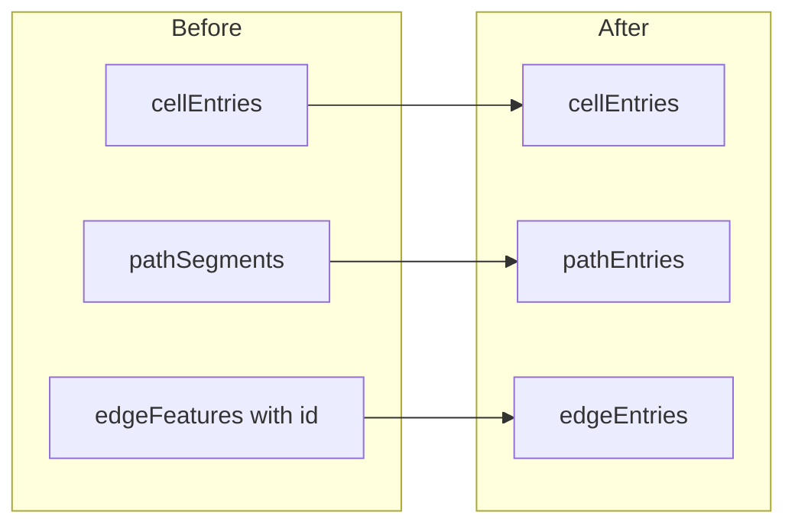

# Location map authoring model refactor (paths/edges canonical split)

**Implemented.** Product chose a **clean cutover** (no legacy `pathSegments` migration). Persisted model is `pathEntries` / `edgeEntries`.

**Next steps:** [.cursor/plans/location_map_authoring_followup.plan.md](location_map_authoring_followup.plan.md) — remove shared `*_FEATURE_`* aliases, normalize empty arrays at API boundaries, extract authored→points helpers, and keep `pathEntriesToSvgPaths` as an explicit temporary seam.

---

## Historical target (achieved)

- `LocationMapPathAuthoringEntry`: `{ id, kind, cellIds[] }`
- `LocationMapEdgeAuthoringEntry`: `{ edgeId, kind }`
- `LocationMapBase.pathEntries` / `edgeEntries`
- Validation, Mongoose, draft round-trip, editor UX (chain extend, erase surgery)

---

## Original diagram (conceptual)

