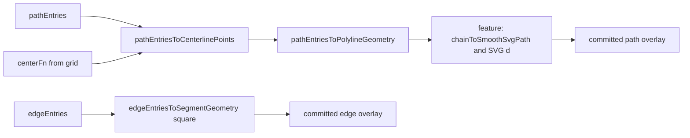

# Location map geometry derivation (refined plan)

## Scope

This pass is **only** about **authored data → consistent geometry**. No persistence changes, no toolbar/UX redesign, no large preview rewrite.

## Refinements (baseline constraints)

### Sequencing (highest value first)

1. **Unify committed path rendering** in [`LocationGridAuthoringSection.tsx`](src/features/content/locations/components/LocationGridAuthoringSection.tsx) on the shared **authored → geometry** seam (it currently rebuilds committed path geometry manually).
2. **Refactor committed edge rendering** to shared **square** edge segment geometry helpers.
3. **Only then** consider preview / anchor / hover path composition—**only if** it can reuse the same geometry pipeline **cleanly** without destabilizing the editor. **Do not** let preview cleanup balloon the pass.

### File churn: conservative

- **Prefer:** extract stable helpers under `shared/domain/` first; migrate **consumers** to those APIs.
- **Physically move** existing [`squareGridMapOverlayGeometry.ts`](src/features/content/locations/components/squareGridMapOverlayGeometry.ts) / [`hexGridMapOverlayGeometry.ts`](src/features/content/locations/components/hexGridMapOverlayGeometry.ts) **only if**, after adoption, that is clearly the cleanest result.
- Default: **stable API extraction over mass file moves and import rewrites.**

### Core seam: `pathEntriesToCenterlinePoints`

Keep [`pathEntriesToCenterlinePoints`](shared/domain/locations/map/locationMapPathCenterline.helpers.ts) (and `pathEntryToCenterlinePoints`) as the **author → centerline** core.

New helpers such as `pathEntryToPolylineGeometry` / `pathEntriesToPolylineGeometry` must **compose from** `pathEntriesToCenterlinePoints`—**do not** duplicate chain → center resolution elsewhere.

### Geometry layer output (no SVG in shared)

Shared geometry stops at:

- points (`Point2D`)
- line segments (`LineSegment2D`)
- polylines (structured lists of `Point2D` per path entry)

**Remain in feature/render layer:**

- Catmull-Rom smoothing
- SVG `d` string creation
- stroke/color styling

**Do not** make SVG path strings the canonical shared output.

### New public geometry types: standardize on `x` / `y`

- `Point2D = { x: number; y: number }`
- `LineSegment2D = { x1: number; y1: number; x2: number; y2: number }`

Existing internals may still use `{ cx, cy }` briefly at boundaries; **map to `Point2D` at the shared public API**. Do not spread both conventions through new public APIs.

### Edges: square-first this pass

Be explicit in code/comments/summary:

- **Path centerlines:** square **and** hex via injected `centerFn` (unchanged conceptually).
- **Edge segment geometry:** **square-first**; reuse canonical `between:cellA|cellB` segment math from current square helpers.
- **Hex edge boundary geometry:** **not** fully modeled in this pass unless verified and implemented cleanly—**do not** imply full hex edge support.

### Adapters: non-canonical

Wrappers like `pathEntriesToSvgPaths` stay **renderer adapters** built **on top of** canonical geometry helpers (polylines → smoothing → `d`). Document that they are **not** sources of truth.

---

## Implementation order (unless code suggests a safer sequence)

1. Inspect current **committed** path rendering in `LocationGridAuthoringSection` and [`pathOverlayRendering.ts`](src/features/content/locations/components/pathOverlayRendering.ts).
2. Extract or formalize **path polyline geometry** helper(s) that **compose** `pathEntriesToCenterlinePoints` → `PathPolylineGeometry` (or equivalent) with **`Point2D[]`** per entry id/kind.
3. Switch **committed** path SVG overlay to: shared polyline geometry → existing feature `chainToSmoothSvgPath` / thin adapter (same visual behavior, single derivation path).
4. Extract **shared edge segment geometry** for **square** grids (batch: `edgeEntries` → `EdgeSegmentGeometry[]`).
5. Switch **committed** edge overlay to those helpers.
6. **Optionally** refactor preview/anchor/hover composition to reuse the same pipeline; **skip** if risky.
7. Add **focused regression tests** (see below).
8. Produce **final report** (template at end).

---

## Architecture (conceptual)

---

## Test focus

Prioritize:

- `pathEntriesToPolylineGeometry` (and `pathEntryToPolylineGeometry` if present)—composition from `pathEntriesToCenterlinePoints`, `Point2D` output.
- `edgeEntriesToSegmentGeometry` for square canonical edge ids.
- **Regression:** committed-rendering helpers match **essential** geometry (segment endpoints, polyline point sequences) for **known square** cases.
- **Hex:** tests **only** where support is **explicitly** claimed (path centerlines via `centerFn`, not hex edges in this pass).

---

## Docs

Minimal update to [`docs/reference/location-workspace.md`](docs/reference/location-workspace.md): rendering seam paragraph—geometry primitives vs SVG adapters; square-first edges.

---

## Final output expectations (report template)

After implementation, report:

1. What geometry responsibilities are now centralized.
2. Whether **committed path** rendering uses the shared geometry seam end-to-end.
3. Whether **committed edge** rendering uses the shared geometry seam.
4. What **preview** logic remains feature-local (if any).
5. Confirmation that **edge geometry remains square-only** in this pass (unless hex was explicitly implemented and verified).

---

## Success criteria

- `pathEntries` / `edgeEntries` remain the authored sources of truth.
- Committed paths derive from **`pathEntriesToCenterlinePoints`** → polyline geometry → feature SVG adapter—not parallel manual center loops.
- Committed edges derive from shared **square** segment helpers.
- No SVG strings as canonical shared output; adapters clearly labeled.
- Square path behavior does not regress; hex path behavior preserved via `centerFn` as today; hex edges not falsely advertised.
