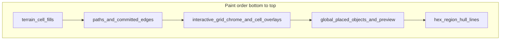

# Map authoring z-index parity (square + hex)

## Target semantics (both geometries)

- **Hex today** already matches this **visually**: grid (terrain + in-cell overlays except suppressed objects) → path SVG → global object layer → region hull ([`locationGridAuthoringMapOverlayLayers.tsx`](src/features/content/locations/components/workspace/locationGridAuthoringMapOverlayLayers.tsx), [`LocationGridAuthoringSection.tsx`](src/features/content/locations/components/workspace/LocationGridAuthoringSection.tsx)).
- **Square today** does **not**: path/edge SVG is **`Z_MAP_PATH_EDGE_UNDER_GRID` (0)** and the grid is **1**, so **terrain fills** (inside [`GridEditor`](src/features/content/locations/components/mapGrid/GridEditor.tsx) / [`GridCellVisual`](src/features/content/locations/components/mapGrid/GridCellVisual.tsx)) paint **above** paths; paths only read clearly in **gaps**.

True parity means **square** gets the same **semantic** order as hex, not necessarily identical **DOM** shape.

---

## 1. Single source of truth for layer indices

- Add a small module (e.g. [`mapAuthoringLayerZ.ts`](src/features/content/locations/components/workspace/mapAuthoringLayerZ.ts) next to the overlay layers) exporting **named** constants: `terrain`, `pathsAndEdges`, `cellGrid`, `globalPlacedObjects`, `hexRegionOutlines` (or equivalent), with short comments mapping **intent → number**.
- Replace raw `0..4` literals in [`locationGridAuthoringMapOverlayLayers.tsx`](src/features/content/locations/components/workspace/locationGridAuthoringMapOverlayLayers.tsx) and the grid wrapper in [`LocationGridAuthoringSection.tsx`](src/features/content/locations/components/workspace/LocationGridAuthoringSection.tsx) with imports from that module so square/hex cannot drift silently.

---

## 2. Square: split **terrain** from **interactive grid**

**Problem:** Terrain is the `Box` with [`GRID_CELL_AUTHORING_FILL_CLASS`](src/features/content/locations/components/mapGrid/GridEditor.tsx) (lines 154–158). It lives **inside** the same stacking subtree as the grid at `z-index: 1`, below path SVG at `0`.

**Approach:**

1. **Terrain-only pass** — A sibling layer **under** path SVG that reproduces the **same** CSS grid layout as `GridEditor` (`repeat(cols)`, `gap: SQUARE_GRID_GAP_PX`, width rules from [`useLocationAuthoringGridLayout`](src/features/content/locations/hooks/useLocationAuthoringGridLayout.ts)): for each cell, render **only** the fill `Box` using existing [`buildSquareAuthoringCellVisualParts`](src/features/content/locations/components/mapGrid/mapGridAuthoringCellVisual.builder.ts) / `fillLayer` + `shell` border styling as needed so it **looks** like today. **`pointer-events: none`** on this layer.
2. **`GridEditor` variant** — Add a prop (e.g. `omitTerrainFill?: boolean` or `renderTerrainExternally`) that **skips** the fill `Box` but keeps [`GridCellHost`](src/features/content/locations/components/mapGrid/GridCellHost.tsx), `GridCellVisual` **shell**, labels, and `renderCellContent` ([`LocationMapCellAuthoringOverlay`](src/features/content/locations/components/mapGrid/LocationMapCellAuthoringOverlay.tsx)). Cells remain **interactive** and must still receive focus/hover chrome.

**Order in [`LocationGridAuthoringSection`](src/features/content/locations/components/workspace/LocationGridAuthoringSection.tsx) (square branch):**

1. `SquareTerrainLayer` — `z = terrain`
2. `LocationGridAuthoringSquareMapOverlayLayer` — raise to `z = pathsAndEdges` (same **semantic** slot as hex path layer)
3. `GridEditor` (no fill) — `z = cellGrid`
4. **Global object layer** (next section) — `z = globalPlacedObjects`
5. (No hex region layer on square.)

**Risks to verify:** Gap alignment with [`SquareMapAuthoringSvgOverlay`](src/features/content/locations/components/mapGrid/authoring/SquareMapAuthoringSvgOverlay.tsx) / [`squareGridMapOverlayGeometry`](src/features/content/locations/components/authoring/geometry/squareGridMapOverlayGeometry.ts); **no double borders** between terrain-only and chrome-only cells; **excluded/selected** states still correct when fill is split.

---

## 3. Square: global placed-object layer (match hex)

- Reuse [`LocationMapAuthoredObjectIconsLayer`](src/features/content/locations/components/mapGrid/LocationMapAuthoredObjectIconsLayer.tsx) (already uses `squareCellCenterPx` + gap) inside a new wrapper in [`locationGridAuthoringMapOverlayLayers.tsx`](src/features/content/locations/components/workspace/locationGridAuthoringMapOverlayLayers.tsx) (e.g. `LocationGridAuthoringSquareMapPlacedObjectsOverlayLayer`), **same** z as hex global objects.
- **Unify data:** Rename or generalize `hexPlacedObjectRenderItems` in [`LocationGridAuthoringSection.tsx`](src/features/content/locations/components/workspace/LocationGridAuthoringSection.tsx) to **`globalPlacedObjectRenderItems`** (derive via [`deriveLocationMapAuthoredObjectRenderItemsFromObjectsByCellId`](shared/domain/locations/map/locationMapAuthoredObjectRender.helpers.ts) + optional `placePreviewItem`) and pass to **both** square and hex overlay components when `items.length > 0`.
- Set **`suppressPlacedObjectGlyphs={isHex || squareUsesGlobalObjectLayer}`** — i.e. **`true` for square** once the global layer is wired, so [`LocationMapCellAuthoringOverlay`](src/features/content/locations/components/mapGrid/LocationMapCellAuthoringOverlay.tsx) does not duplicate objects/preview (same pattern as hex today).

**Selection outline / tooltips:** Ensure [`LocationMapAuthoredObjectIconsLayer`](src/features/content/locations/components/mapGrid/LocationMapAuthoredObjectIconsLayer.tsx) applies the same `selectHoverTarget` outline behavior as [`LocationMapHexAuthoredObjectIconsLayer`](src/features/content/locations/components/mapGrid/LocationMapAuthoredObjectIconsLayer.tsx) (add preview opacity / `__place_preview__` handling on square if missing).

---

## 4. Hex: align constants; optional terrain split (Phase B)

**Minimum for parity with square work:** Use the **same** named z-constants as square so the **documented** stack matches.

**Optional Phase B (true numeric parity with square’s terrain-at-0):** Extract hex cell **fill/clip** rendering into a **terrain-only** layer at `terrain` z-index (mirroring square), and teach [`HexGridEditor`](src/features/content/locations/components/mapGrid/HexGridEditor.tsx) to **omit** fills when `renderTerrainExternally` — **higher** effort because hex layout is more involved than CSS grid. Only pursue if product needs **identical** layer diagram, not just **identical** visual order (which hex already has).

---

## 5. Verification and docs

- **Manual:** Square world/city map — paths visibly **over** terrain swatches, **under** markers; gutters unchanged; edge paint / path draw still align.
- **Automated (light):** If feasible, a small test that **`MAP_AUTHORING_LAYER_Z.paths` &lt; `MAP_AUTHORING_LAYER_Z.globalPlacedObjects`** and that terrain layer is **strictly below** paths (could be a static export test).
- **Docs:** Update [`docs/reference/locations/location-workspace.md`](docs/reference/locations/location-workspace.md) “layer order” paragraph to describe the **unified** model and note Phase B hex terrain split if deferred.

---

## 6. Out of scope (unless you expand scope)

- [`CombatGridAuthoringOverlay`](src/features/combat/components/grid/CombatGridAuthoringOverlay.tsx) read-only path rendering — separate parity pass.
- Region tint on **square** remains in [`LocationMapCellAuthoringOverlay`](src/features/content/locations/components/mapGrid/LocationMapCellAuthoringOverlay.tsx) (in-grid); only hex has a **separate** hull SVG — acceptable unless you want region lines extracted for square too.
