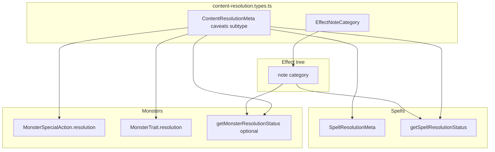

# Monster data authoring plan

## Context (current patterns)

- **Catalog location**: System monsters live in [`src/features/mechanics/domain/rulesets/system/monsters.ts`](src/features/mechanics/domain/rulesets/system/monsters.ts) as `MONSTERS_RAW: readonly MonsterFields[]`, wrapped by `toSystemMonster`.
- **Types**: [`src/features/content/monsters/domain/types/monster.types.ts`](src/features/content/monsters/domain/types/monster.types.ts) defines `MonsterFields` — abilities use short ids (`str`, `dex`, …) per [`AbilityScoreMap`](src/features/mechanics/domain/character/abilities/abilities.types.ts).
- **AC**: [`calculateMonsterArmorClass`](src/features/content/monsters/domain/mechanics/calculateMonsterArmorClass.ts) resolves natural, equipment, and fixed armor (see below for deprecation and escape hatches).
- **Initiative**: [`OpponentCombatantSetupPreviewCard`](src/features/encounter/components/OpponentCombatantSetupPreviewCard.tsx) currently reads `monster.mechanics.abilities?.dexterity` while catalog data uses `dex` — fix with the same dual-key pattern as `getMonsterDexterityScore` (`dex ?? dexterity`).
- **Skills**: Store proficiency shape only in `mechanics.proficiencies.skills`; totals derive from ability mod + `resolveProficiencyContribution(proficiencyBonus, proficiencyLevel)`.
- **Attacks**: Natural actions still use authored `attackBonus` for encounter resolution until automatic derivation exists.
- **Passive Perception**: Optional; omit when equal to `10 + WIS mod` without Perception proficiency.

## Shared resolution model (spells + monsters) — align with [effects.md](docs/reference/effects.md)

Canonical rules live in [docs/reference/effects.md](docs/reference/effects.md): §5 `note` (`category`: `under-modeled` vs `flavor`), §8 under-modeling policy, and “Resolution Status Tracking” (`resolution.caveats`, `getSpellResolutionStatus`).

Spells today:

- **Under-modeled mechanics**: `{ kind: 'note', text: '…', category: 'under-modeled' }` on shared [`Effect`](src/features/mechanics/domain/effects/effects.types.ts).
- **Per-spell caveats**: `resolution.caveats?: string[]` on [`SpellResolutionMeta`](src/features/content/spells/domain/types/spell.types.ts).
- **Status**: [`getSpellResolutionStatus`](src/features/content/spells/domain/types/spellResolution.ts) returns `partial` if any `under-modeled` note or non-empty `resolution.caveats`.

Monster actions and traits should use the **same model** — not comment-only “engine caveat” lines as the only signal.

### Shared types module (canonical path)

**Use** [`src/features/mechanics/domain/resolution/content-resolution.types.ts`](src/features/mechanics/domain/resolution/content-resolution.types.ts) (no alternate location).

Export at least:

- **`EffectNoteCategory`** — `'under-modeled' | 'flavor'` (single source of truth for `NoteEffect` and spell/monster authoring).
- **`ContentResolutionMeta`** — spell-agnostic resolution metadata:
  - **`caveats?: string[]`** — same role as today in effects.md (qualitative gaps the effect tree cannot express).
  - **`subtype?: …`** — optional discriminator for tooling, audits, or future UI filters. **Most spells and monsters leave this unset**; define a small string union (or extend later) when a stable taxonomy appears. Do not require authors to fill `subtype` for routine content.

**Spells**: `SpellResolutionMeta` = `ContentResolutionMeta` & spell-only fields (`hpThreshold`, `hostileIntent`). Re-export or import from the resolution module.

**`NoteEffect`**: `category?: EffectNoteCategory` in [`effects.types.ts`](src/features/mechanics/domain/effects/effects.types.ts).

**Monsters**: Optional `resolution?: ContentResolutionMeta` on [`MonsterSpecialAction`](src/features/content/monsters/domain/types/monster-actions.types.ts) and [`MonsterTrait`](src/features/content/monsters/domain/types/monster-traits.types.ts). Optionally `mechanics.resolution` on [`MonsterFields`](src/features/content/monsters/domain/types/monster.types.ts) for whole-stat-block caveats; prefer **per action/trait** first.

**Optional helpers**: `getMonsterTraitResolutionStatus`, `getMonsterSpecialActionResolutionStatus` (same stub/partial/full semantics as spells). `subtype` does not need to drive status unless you later define rules.

### Escape hatches (last resort only)

Reserve these for cases where **no** combination of structured effects, correct armor/natural base, equipment rows, and `note` + `caveats` can represent the stat block honestly:

- **Spells**: `resolution.hpThreshold`, `resolution.hostileIntent`, and any future spell-only resolution fields — only when the shared effect tree cannot carry the rule.
- **Monsters — AC**: [`MonsterArmorClass`](src/features/content/monsters/domain/types/monster-equipment.types.ts) `kind: 'fixed'`, and `override` on natural/equipment — **only** when matching printed AC without lying is otherwise impossible. Prefer adjusting **`kind: 'natural'`** (see **`offset`** refactor below) and catalog **equipment** so DEX + armor math matches the book.
- **Monsters — monster armor metadata**: Do not use removed fields like **`dexApplies`** on natural armor; PC-style DEX caps live in [`armorClass.ts`](src/features/mechanics/domain/equipment/armorClass.ts) for real armor, not on `MonsterArmorClass`.

Document escape-hatch policy in [`docs/reference/monster-authoring.md`](docs/reference/monster-authoring.md) and tie resolution metadata to [effects.md](docs/reference/effects.md) §8.

### Authoring rules for new monster content

- Prefer structured `Effect` kinds; where encounter resolution is incomplete, add `note` with `category: 'under-modeled'`.
- For cross-cutting adapter limits, add `resolution.caveats` (and optional `resolution.subtype` only when it helps classification).
- Migrate legacy `// Engine caveat` comments in [`monsters.ts`](src/features/mechanics/domain/rulesets/system/monsters.ts) toward this model over time.

## Resistances and damage/condition types (shared creature model)

**Canonical types** live in [`src/features/mechanics/domain/creatures/immunities.types.ts`](src/features/mechanics/domain/creatures/immunities.types.ts): **`ImmunityType`** (mixed damage + condition immunities for stat blocks), **`CreatureResistanceDamageType`**, **`CreatureVulnerabilityDamageType`**. There is no separate monster-only vs character-only immunity type — monsters and future PC/NPC authoring share the same vocabulary.

**`MonsterFields.mechanics`** uses `resistances` / `immunities` / `vulnerabilities` with those types; [`buildMonsterCombatantInstance`](src/features/encounter/helpers/combatant-builders.ts) emits resistance/vulnerability/immunity markers and partitions condition immunities onto **`CombatantInstance.conditionImmunities: ConditionImmunityId[]`** (see [`combatant.types.ts`](src/features/mechanics/domain/encounter/state/types/combatant.types.ts)).

**`monster-combat.types.ts`** holds only monster presentation/combat shapes (e.g. attack kinds, trait roll targets), not shared immunity unions.

## AC authoring rule

Match printed AC via `kind: 'natural'` with appropriate **natural contribution + DEX**, or **`kind: 'equipment'`** with catalog armor. Do not store initiative separately; parenthetical DEX scores are ability scores, not stored rolls.

## Natural armor: `offset` (planned refactor)

**Goal:** One configurable **unarmored AC baseline** (today effectively 10 everywhere; later a single source of truth). Monster natural armor should not store an **absolute** partial base like `12`; it should store **`offset`**: points **above** that baseline from hide, plates, etc.

| Today (absolute) | After refactor (relative) |
|------------------|---------------------------|
| `{ kind: 'natural', base: 12 }` | `{ kind: 'natural', offset: 2 }` |
| `{ kind: 'natural' }` (implicit 10) | `{ kind: 'natural' }` or `{ kind: 'natural', offset: 0 }` — **omit `offset` when 0** |

**Computation:** `defaultBaseAC = globalUnarmoredAcBaseline + (armorClass.offset ?? 0)` passed into [`calculateCreatureArmorClass`](src/features/mechanics/domain/equipment/armorClass.ts) (same hook as today’s `defaultBaseAC: armorClass.base ?? 10`).

**Work:** Types in [`monster-equipment.types.ts`](src/features/content/monsters/domain/types/monster-equipment.types.ts); [`calculateMonsterArmorClass.ts`](src/features/content/monsters/domain/mechanics/calculateMonsterArmorClass.ts); migrate all `base` in [`monsters.ts`](src/features/mechanics/domain/rulesets/system/monsters.ts) and [`monsters-catalog-append.ts`](src/features/mechanics/domain/rulesets/system/monsters-catalog-append.ts) to `offset = base - 10` (or relative to chosen baseline constant); tests + [`docs/reference/monster-authoring.md`](docs/reference/monster-authoring.md).

## Creatures to add

Ghoul, Giant Centipede, Giant Spider, Giant Wasp, Goblin Minion, Air/Earth/Fire/Water Elementals — with `under-modeled` notes and `resolution.caveats` where the engine does not fully enforce riders; AC via natural **`base`** (migrate to **`offset`** when refactor lands) or fixed AC only when unavoidable.

## Reference documentation

- [`docs/reference/monster-authoring.md`](docs/reference/monster-authoring.md): cross-link [docs/reference/effects.md](docs/reference/effects.md); **`ContentResolutionMeta`**, optional **`subtype`**, escape hatches; after **`offset`** refactor, document natural **`offset`** vs global baseline.
- Optionally add a bullet in [docs/reference/effects.md](docs/reference/effects.md) pointing to [`content-resolution.types.ts`](src/features/mechanics/domain/resolution/content-resolution.types.ts).

## Dependency / file touch list

| Area | Files |
|------|--------|
| Shared resolution | [`src/features/mechanics/domain/resolution/content-resolution.types.ts`](src/features/mechanics/domain/resolution/content-resolution.types.ts) (new); [`spell.types.ts`](src/features/content/spells/domain/types/spell.types.ts); [`spellResolution.ts`](src/features/content/spells/domain/types/spellResolution.ts); [`effects.types.ts`](src/features/mechanics/domain/effects/effects.types.ts) |
| Monster types | [`monster-actions.types.ts`](src/features/content/monsters/domain/types/monster-actions.types.ts); [`monster-traits.types.ts`](src/features/content/monsters/domain/types/monster-traits.types.ts); optionally [`monster.types.ts`](src/features/content/monsters/domain/types/monster.types.ts) |
| AC / armor | [`monster-equipment.types.ts`](src/features/content/monsters/domain/types/monster-equipment.types.ts) (deprecation already noted; ensure docs + plan align) |
| Resistances / combat | [`monster.types.ts`](src/features/content/monsters/domain/types/monster.types.ts); [`monster-combat.types.ts`](src/features/content/monsters/domain/types/monster-combat.types.ts); [`combatant-builders.ts`](src/features/encounter/helpers/combatant-builders.ts) |
| Initiative | [`OpponentCombatantSetupPreviewCard.tsx`](src/features/encounter/components/OpponentCombatantSetupPreviewCard.tsx) |
| Catalog | [`monsters.ts`](src/features/mechanics/domain/rulesets/system/monsters.ts) |
| Docs | [`docs/reference/monster-authoring.md`](docs/reference/monster-authoring.md); optional [`docs/reference/effects.md`](docs/reference/effects.md) |

