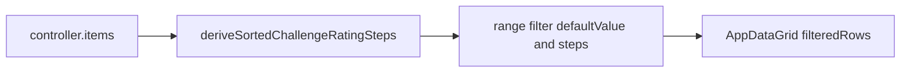

# Monster list CR range filter (popover + primitives)

## Pre-build analysis (answers)

1. **Where to compute dynamic CR bounds**  
   The list’s source of truth is `controller.items` in [`MonsterListRoute.tsx`](src/features/content/monsters/routes/MonsterListRoute.tsx) (same rows passed to the grid). The cleanest approach: **`useMemo` in the route** that scans `items` for **sorted unique** challenge ratings. Implement scanning via shared **`deriveSortedUniqueNumericSteps`** ([`features/content/shared`](src/features/content/shared)), with a thin monster wrapper `deriveSortedChallengeRatingSteps` that passes `(r) => r.lore?.challengeRating`. Same pattern applies to any other list (spells, items): route memo + shared derive + domain accessor.

2. **How filters are modeled; clean CR range extension**  
   Filters are `AppDataGridFilter<T>` in [`appDataGridFilter.types.ts`](src/ui/patterns/AppDataGrid/appDataGridFilter.types.ts) — today only `select` | `multiSelect` | `boolean`. Rendering and row filtering live in [`AppDataGrid.tsx`](src/ui/patterns/AppDataGrid/AppDataGrid.tsx); badges use [`getActiveFilterBadgeSegments`](src/ui/patterns/AppDataGrid/appDataGridFilter.utils.ts) and optional `formatActiveChipValue`.  
   **Cleanest minimal extension:** add a **`type: 'range'`** variant with:
   - `steps: readonly number[]` — sorted unique CRs from the current catalog (dynamic, not hardcoded)
   - `accessor: (row: T) => number` — e.g. `row.lore.challengeRating`
   - `defaultValue: { min: number; max: number }` — **full span** = `{ min: steps[0], max: steps[steps.length - 1] }` when building the filter (recomputed when `steps` changes)
   - `formatActiveChipValue` — returns a single string `CR: X–Y` (en dash) using the shared display formatter  
   This stays within the existing discriminated-union + chip metadata pattern and avoids a one-off parallel state machine in the route.

3. **CR value shape in monster data**  
   **Numeric.** [`MonsterChallengeRating`](src/features/content/monsters/domain/types/monster.types.ts) is a union of numeric literals (`0`, `0.125`, `0.25`, `0.5`, `1`, …). List rows use `MonsterListRow` / summaries with `lore.challengeRating`.

4. **Normalized internal representation**  
   Use **the same numeric values** as `MonsterChallengeRating` for:
   - filter state `{ min, max }`
   - row comparison (`min <= cr <= max`)  
   The **MUI range slider** should use **discrete indices** `0 .. steps.length - 1` internally (step = 1) and map indices ↔ CR via `steps[i]`, so the thumb always lands on catalog CRs. Avoid floating-point slider `min`/`max` on raw CR numbers.

5. **Slider: normalized values vs display**  
   **Yes:** indices (or equivalently discrete steps) internally for the slider; **separate display formatting** for thumb labels, popover summary, and badges via a small **`formatChallengeRatingDisplay(n: number): string`** (e.g. `0.125` → `1/8`, `0.25` → `1/4`, `0.5` → `1/2`, integers as `"12"`). The identity line formatter today uses `toString()` on the number ([`monsterList.columns.tsx`](src/features/content/monsters/domain/list/monsterList.columns.tsx)); badges/slider should use the new helper for D&D-style labels.

---

## Reusable toolbar range pattern (other content lists)

The **`range` filter type on `AppDataGrid`** is intentionally **domain-agnostic**: it only needs **sorted unique numeric `steps`**, an **accessor** from row → number, optional **labels** for the toolbar trigger, and **per-filter** `formatActiveChipValue` (and any `valueLabelFormat` / summary text from injected formatters).

Future examples that fit the same shape without new grid filter types:

- **Spell list** — level (0–9) or caster level; steps from loaded spell rows.
- **Equipment / gear** — price tier buckets, weight, or armor class if modeled as discrete numeric steps from the catalog.
- **Any list** where “min/max over **values that actually appear** in the current rows” is the right semantics.

**Cross-cutting rules** (unchanged from the monster pass): do not hardcode global min/max; derive `steps` from **in-scope rows**; keep the toolbar control **compact** (button + popover, not an inline slider); store filter state as **numeric `{ min, max }`** comparable to row accessors; use **discrete slider indices** internally.

---

## Layering: what belongs in `features/content/shared`

| Layer | Responsibility | Examples |
|--------|----------------|----------|
| [`src/ui/primitives/`](src/ui/primitives/) | Visual building blocks (MUI-aligned), no content domain | `AppPopover`, `AppSlider` |
| [`src/ui/patterns/AppDataGrid/`](src/ui/patterns/AppDataGrid/) | **Generic** `range` filter type, row filtering (`min <= accessor(row) <= max`), badge hooks; **range UI delegated to** `ContentToolbarDiscreteRangeField` | Types, utils, thin `renderFilterControl` wiring for `type: 'range'` |
| **`features/content/shared`** (new or `shared/toolbar/` subfolder) | **Reusable list-toolbar logic and UI** that multiple content types need, without pulling in monsters/spells/etc. | `discreteNumericRange` helpers + **`ContentToolbarDiscreteRangeField`** (required for all `range` filters) |
| **Feature domain** (e.g. monsters) | Type-specific display, accessors, filter wiring, toolbar layout ids | `formatChallengeRatingDisplay`, `buildMonsterCustomFilters`, `MONSTER_LIST_TOOLBAR_LAYOUT` |

### What to abstract into `features/content/shared`

**1. Pure numeric helpers (high value, tiny surface)**

Add a small module such as [`src/features/content/shared/toolbar/discreteNumericRange.ts`](src/features/content/shared/toolbar/discreteNumericRange.ts) (exact path follows existing folder conventions):

- `deriveSortedUniqueNumericSteps<T>(rows: T[], read: (row: T) => number | null | undefined): number[]` — generic version of “scan catalog rows → sorted unique values”.
- `clampMinMaxToSteps(value: { min: number; max: number }, steps: readonly number[])` — when `steps` changes after navigation or data refresh.
- Optionally `valuesToIndexRange(steps, minNum, maxNum): [number, number]` / `indexRangeToValues` for the slider — keeps `AppDataGrid` range UI thin and testable.

**2. `ContentToolbarDiscreteRangeField` (required)**

Implement **`ContentToolbarDiscreteRangeField`** under `features/content/shared/components/` (exact name may match existing naming; this is the canonical toolbar control for **`range`** filters):

- **Props:** `label: string`, `steps: readonly number[]`, `value: { min, max }`, `onChange`, `formatValue: (n: number) => string`, optional `ariaLabel`, placeholder copy when inactive.
- **Behavior:** compact trigger button, `AppPopover` + dual-thumb `AppSlider` on discrete indices, delegates all formatting to `formatValue`.
- **`AppDataGrid` `renderFilterControl` for `type: 'range'` must use this component only** — no duplicate inline range UI in the grid pattern file.

**3. What stays out of `content/shared`**

- Challenge Rating **display** (`1/8`, `1/4`, …) — remains **monster/mechanics**-adjacent; implement next to monsters (or a `mechanics` module if reused outside content lists later).
- Feature-specific **badge strings** (`CR: …` vs `Level: …`) — stay in each route’s filter definition via `formatActiveChipValue`.

---

## Implementation outline

### A. `AppPopover` ([`src/ui/primitives/`](src/ui/primitives/))

- Thin wrapper around MUI `Popover` (same pattern as [`AuthLayout.tsx`](src/app/layouts/auth/AuthLayout.tsx): `open`, `anchorEl`, `onClose`, `anchorOrigin` / `transformOrigin`, optional `slotProps.paper`).
- Props: `children`, anchor + open/onClose, optional `Paper` `sx`, sensible defaults (compact padding-friendly).
- Export from [`src/ui/primitives/index.ts`](src/ui/primitives/index.ts).

### B. `AppSlider` ([`src/ui/primitives/`](src/ui/primitives/))

- Thin wrapper around MUI `Slider` with app defaults (`size="small"`, consistent `sx` for toolbar use).
- Support **range** mode: `value` as `[number, number]`, `onChange` typed accordingly (forward rest props for `min`/`max`/`step`/`marks`/`valueLabelFormat` / `getAriaValueText`).
- Export from primitives index.

### C. Shared + monster helpers

**Shared ([`features/content/shared`](src/features/content/shared))** — implement first:

- `deriveSortedUniqueNumericSteps<T>(rows, read)` and `clampMinMaxToSteps` (see layering table). Unit tests colocated.
- **`ContentToolbarDiscreteRangeField`** — required deliverable in the same vertical slice as primitives; `AppDataGrid` depends on it for `range`.

**Monsters** — thin domain-specific layer:

- [`challengeRatingDisplay.ts`](src/features/content/monsters/domain/list/challengeRatingDisplay.ts) (or similar): `formatChallengeRatingDisplay(n: number): string` only.
- `deriveSortedChallengeRatingSteps(rows: MonsterListRow[]): number[]` becomes a **one-liner** delegating to `deriveSortedUniqueNumericSteps(rows, (r) => r.lore?.challengeRating)` — keeps monster call sites readable and tests focused on CR display + integration.

### D. Extend grid filter system

**Types** — [`appDataGridFilter.types.ts`](src/ui/patterns/AppDataGrid/appDataGridFilter.types.ts): add union member:

- `type: 'range'`
- `steps`, `accessor`, `defaultValue`, plus **required `formatStepValue: (n: number) => string`** for slider thumb / trigger summary (CR formatter vs `String(level)` for spells)
- shared `AppDataGridFilterMeta` (`formatActiveChipValue` for badge row)

**Utils** — [`appDataGridFilter.utils.ts`](src/ui/patterns/AppDataGrid/appDataGridFilter.utils.ts):

- `getFilterDefault`: return `defaultValue` for `range`
- `getActiveFilterBadgeSegments`: `case 'range'` — use `formatActiveChipValue` if present, else fallback string
- Ensure `formatDefaultActiveChipValue` handles `range` if referenced

**AppDataGrid** — [`AppDataGrid.tsx`](src/ui/patterns/AppDataGrid/AppDataGrid.tsx):

- `isFilterValueActive`: active when `{min,max}` ≠ default (full span)
- `filteredRows`: `case 'range'`: `const v = f.accessor(row); return v >= value.min && v <= value.max` (same for spells, gear, any list using numeric accessors)
- `renderFilterControl` **case `'range'`**: render **`ContentToolbarDiscreteRangeField`** from `features/content/shared`, wiring `steps`, controlled `value` / `onChange` from `filterValues`, and **`formatStepValue` (required on `range` filters)** for thumb labels and trigger summary. Do **not** embed popover/slider JSX directly in `AppDataGrid.tsx`.
- **Edge cases:** `steps.length === 0` — render disabled control or “No data”; `steps.length === 1` — single position.
- **Clamping:** use shared `clampMinMaxToSteps` when `steps` identity changes.

**Filter type fields for reuse:** ensure `range` includes everything a second list needs without monster imports: `label`, `steps`, `accessor`, `defaultValue`, **`formatStepValue`**, and `formatActiveChipValue`.

### E. Monster list wiring

- [`buildMonsterCustomFilters`](src/features/content/monsters/domain/list/monsterList.filters.ts): change to **`buildMonsterCustomFilters(params: { crSteps: number[] })`** (or pass `steps` only). When `crSteps.length === 0`, omit the CR filter **or** register a no-op disabled filter — prefer **omit** to avoid invalid layout ids.
- [`MONSTER_LIST_TOOLBAR_LAYOUT`](src/features/content/monsters/domain/list/monsterList.toolbarLayout.ts): add **`challengeRating`** to **row 1** (e.g. `['monsterType', 'sizeCategory', 'challengeRating']` — exact order can follow “compact trigger last” if desired).
- [`MonsterListRoute.tsx`](src/features/content/monsters/routes/MonsterListRoute.tsx): `const crSteps = useMemo(() => deriveSortedChallengeRatingSteps(items), [items])`; pass into `buildMonsterCustomFilters({ crSteps })`; memoize `customFilters` with `[crSteps]` dependency.

### F. Badges

- On the range filter definition, set `formatActiveChipValue: ({ value }) => \`CR: ${format(min)}–${format(max)}\`` with **en dash** between formatted labels. Keep `badgePrefixFilterLabel` unset/false so the chip shows the full string (consistent with “`CR: X–Y`”).

### G. Tests

- **Shared** [`discreteNumericRange`](src/features/content/shared): unique steps, empty rows, clamping when `steps` shrinks.
- **Monster:** `formatChallengeRatingDisplay`; integration-style test that wrapper passes correct accessor into shared derive.
- **Grid:** `getFilterDefault` / `isFilterValueActive` / `getActiveFilterBadgeSegments` for `range` + `formatActiveChipValue`.
- **`ContentToolbarDiscreteRangeField`:** at least one component-level test (e.g. open popover, change range, assert `onChange` / displayed labels) using mocked or minimal `steps`.
- **Optional:** `AppSlider` / `AppPopover` primitive smoke tests.

---

## Key files to touch

| Area | Files |
|------|--------|
| Primitives | New `AppPopover.tsx`, `AppSlider.tsx`; [`src/ui/primitives/index.ts`](src/ui/primitives/index.ts) |
| Content shared | New `discreteNumericRange.ts` (or under `toolbar/`), required `ContentToolbarDiscreteRangeField.tsx`; export from shared barrel/index where the project already re-exports components |
| Grid filters | [`appDataGridFilter.types.ts`](src/ui/patterns/AppDataGrid/appDataGridFilter.types.ts), [`appDataGridFilter.utils.ts`](src/ui/patterns/AppDataGrid/appDataGridFilter.utils.ts), [`AppDataGrid.tsx`](src/ui/patterns/AppDataGrid/AppDataGrid.tsx) |
| Monsters | [`monsterList.filters.ts`](src/features/content/monsters/domain/list/monsterList.filters.ts), [`monsterList.toolbarLayout.ts`](src/features/content/monsters/domain/list/monsterList.toolbarLayout.ts), [`MonsterListRoute.tsx`](src/features/content/monsters/routes/MonsterListRoute.tsx), CR `formatChallengeRatingDisplay` + thin `deriveSortedChallengeRatingSteps` |
| Tests | Shared range utils tests; `ContentToolbarDiscreteRangeField` test(s); monster CR format tests; grid `range` badge/utils tests; optional primitive smoke |

---

## Follow-up opportunities (out of scope)

- Use `formatChallengeRatingDisplay` in the CR **column** for consistent table display (currently `toString()`).
- Persist CR range in user preferences (not required; `useContentListPreferences` only touches `allowedInCampaign` today).
- **Second consumer of `range`:** e.g. spell level on [`SpellListRoute`](src/features/content/spells/routes/SpellListRoute.tsx) — supply `steps` from spell rows, `accessor`, `formatStepValue: (n) => String(n)`, and badge via `formatActiveChipValue`; reuse **`ContentToolbarDiscreteRangeField`** as-is.
