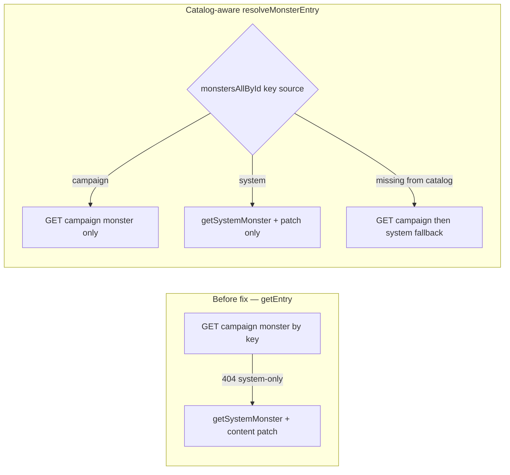

# Monster detail: remove expected 404s (Phase 1)

## Phase 1 implementation status (**done in tree**)

- [`resolveMonsterEntry`](src/features/content/monsters/domain/repo/monsterRepo.ts) encapsulates catalog-aware branching; [`fetchMonsterDetailEntry(cid, sid, key, catalog)`](src/features/content/monsters/domain/repo/monsterRepo.ts) routes detail/edit through it with a populated [`CampaignCatalogAdmin`](packages/mechanics/src/rulesets/campaign/buildCatalog.ts).
- [`monsterRepo.getEntry`](src/features/content/monsters/domain/repo/monsterRepo.ts) delegates to **`resolveMonsterEntry(..., catalog: undefined)`** so [`CampaignContentRepo`](src/features/content/shared/domain/repo/contentRepo.types.ts) stays unchanged — callers without catalog retain **campaign-first, then system** (same silent 404 semantics as before; acceptable for contexts that bypass rules context).
- **Design note:** Phase 1 was specced as an optional fourth `opts.catalog` argument on `getEntry`; shipped code prefers an explicit **`fetchMonsterDetailEntry`** export so repo interface types stay untouched and monster detail routes clearly depend on catalog.

## Root cause (before fix — kept for audit trail)

- **Why the page rendered but the network showed 404:** `getEntry` / resolution always called [`getCampaignMonster`](src/features/content/monsters/domain/repo/monsterRepo.ts) first (`GET /api/campaigns/${campaignId}/monsters/${id}`). For **system** monsters, the URL segment is the catalog **`id`** (e.g. `adult-blue-dragon`), not a campaign DB row; the resolver fell through to [`getSystemMonster`](packages/mechanics/src/rulesets/system/monsters/index.ts) after the API returned 404. The API client maps 404 to `null` inside `getCampaignMonster`, so the UI still succeeded.
- **Duplicate 404s:** There is a **single** detail-loading path ([`useCampaignContentEntry`](src/features/content/shared/hooks/useCampaignContentEntry.ts) in [`MonsterDetailRoute`](src/features/content/monsters/routes/MonsterDetailRoute.tsx) — no data router loader). In dev, **React Strict Mode** runs effects twice, so the same failing campaign GET appears **twice**. Fixing the redundant campaign call removes both visible 404s (and any Strict Mode duplication of that call).
- **Param semantics:** The segment is the canonical **content key** (system `Monster.id` or campaign `monsterId`), kebab-case; it is not the Mongo `_id`. Naming it `monsterSlug` in the router matches “human-readable URL key” without implying DB `_id`.

## Delivered implementation (reference)

### 1. Resolution in [`monsterRepo.ts`](src/features/content/monsters/domain/repo/monsterRepo.ts)

- Shared helper **`resolveMonsterEntry(campaignId, systemId, key, catalog?)`** reads `meta = catalog?.monstersAllById?.[key]`.
  - **`meta?.source === 'campaign'`:** `getCampaignMonster` only.
  - **`meta?.source === 'system'`:** `loadSystemMonsterWithPatch` (`getSystemMonster` + [`getContentPatch`](src/features/content/shared/domain/contentPatchRepo.ts) + [`resolveSystemEntryWithPatch`](src/features/content/shared/domain/patches/patchedContentResolution.ts)) — **no** campaign GET on the happy path.
  - **`meta` present but not system/campaign-only:** `getSystemMonster` wins if present; else **`loadCatalogOnlyMonster`** patches catalog-only/custom meta (`getEntryPatch` + resolve).
  - **`meta` absent:** `getCampaignMonster` then **`loadSystemMonsterWithPatch`** (preserves overrides still loading).
- **`fetchMonsterDetailEntry(..., catalog)`** — exported for routes; **`getEntry`** passes `catalog: undefined` into the same helper.

Overrides / id collision correctness comes from **`source`** on merged catalog entities ([`buildCampaignCatalog`](packages/mechanics/src/rulesets/campaign/buildCatalog.ts)).

### 2. Routes (detail + edit)

- [`MonsterDetailRoute.tsx`](src/features/content/monsters/routes/MonsterDetailRoute.tsx) / [`MonsterEditRoute.tsx`](src/features/content/monsters/routes/MonsterEditRoute.tsx): `fetchMonsterDetailEntry(cid, sid, key, catalog)` inside `useCallback(..., [catalog])`; [`validateMonsterChange`](src/features/content/monsters/domain/validation/validateMonsterChange.ts) unchanged (`monsterId` remains the route key semantic).

### 3. Router / route constants / breadcrumbs

- [`router.tsx`](src/app/router.tsx) `monsters/:monsterSlug`, edit nested path; [`routes.ts`](src/app/routes.ts) `WORLD_MONSTER`; [`breadcrumbs.ts`](src/app/breadcrumbs.ts) matching path keys. URLs unchanged — param name only.

### 4. Shared hook [`useCampaignContentEntry.ts`](src/features/content/shared/hooks/useCampaignContentEntry.ts)

- Missing `campaignId` or effective key (`entryKey ?? entryId`): **`loading: false`**, **`notFound: false`**, clears error/entry — no stuck spinner.

[`CampaignContentRepo`](src/features/content/shared/domain/repo/contentRepo.types.ts) unchanged in Phase 1.

## Other callers of `monsterRepo.getEntry`

- Detail/edit no longer rely on **`getEntry` with catalog omission** — they use **`fetchMonsterDetailEntry`**. Any remaining **`getEntry`** usage (legacy components, tooling) still hits campaign-first fallback; Phase 2+ can audit grep for **`getEntry(`** across `src/` and optionally thread catalog where 404 noise matters.

## Verification (manual — **closes `verify-manual` todo**)

1. Load `/campaigns/{realCampaignId}/world/monsters/adult-blue-dragon` — page renders; copy an id from URL bar or API for a deterministic ID.
2. Network (Fetch/XHR): on **successful** system-monster detail load, **`GET .../api/campaigns/.../monsters/adult-blue-dragon`** must **not** appear with status **404** (request may be absent entirely when catalog says `system`).
3. **Strict Mode:** you may still see **two** `getContentPatch` or other idempotent reads in dev — that is unrelated to eliminating **404**.
4. Invalid slug (`/world/monsters/does-not-exist-xyz`): alert / **`notFound`** path; **`notFound: true`** in hook.
5. **Campaign-homebrew / override id** replacing system: **`source === 'campaign'`** in catalog → single campaign GET succeeds (200).
6. **Transient catalog gap:** simulate slow catalog (optional — throttle network before rules load) → **fallback** branch should still ultimately resolve homebrew ids once campaign GET succeeds.
7. **Edit** `/monsters/:slug/edit` loads and saves for both system-visible and campaign entries.
8. **`content-patch`:** 304 / cache behavior unchanged (patch still fetched on system-only branch).

## Automated tests (optional — **`automated-tests-monster-detail`**)

No **`monsterRepo` resolution tests** exist yet (`*.test.ts` under monsters repo are forms/list/mechanics). Suggested **`vitest`** cases (mock `apiFetch`, `getContentPatch`, [`getSystemMonster`](src/features/mechanics/domain/rulesets/system/monsters)):

| Case | Expected |
|------|----------|
| `catalog.monstersAllById[key].source === 'system'` | **No** `/monsters/` campaign GET mocked; patched system monster returned |
| `source === 'campaign'` | One campaign GET resolves |
| Catalog **missing** `key` but campaign GET returns monster | Fallback works |
| Catalog **missing** key, campaign 404, system has row | System + patch branch |
| `meta` without system row (`loadCatalogOnlyMonster` path) | `getEntryPatch` applied |

Run slice: `npx vitest run src/features/content/monsters/domain/repo/monsterRepo.detail.test.ts` (file to create).

## Documentation sync (optional — **`docs-sync-catalog-migration`**)

[`docs/plans/monster_system_catalog_migration.md`](docs/plans/monster_system_catalog_migration.md) still references detail loading via **`monsterRepo.getEntry` only** — update examples to **`fetchMonsterDetailEntry` + catalog** / `entryKey` after Phase 1 merge.

## Follow-up (later phases — document only)

- **Catalog-aware `getEntry` across content types:** see **Phase 2** below (races, skill proficiencies, weapons, gear, magic items, armor, locations, classes, spells).
- Rename other route params to `*Slug` / `*Key` consistently (can be done alongside each type in Phase 2).
- Optionally extend `useCampaignContentEntry` to accept only neutral `entryKey` once call sites are migrated.

### Shared `*Repo.ts` deduplication (optional — do not fold into Phase 1)

There are on the order of **10 feature `*Repo.ts` files** under `src/features/content` (plus a few special cases such as [`contentPatchRepo`](src/features/content/shared/domain/contentPatchRepo.ts), [`locationMapRepo`](src/features/content/locations/domain/repo/locationMapRepo.ts), [`enchantmentRepo`](src/features/content/enchantments/domain/repo/enchantmentRepo.ts) that are not the same “campaign REST + system catalog merge” pattern).

**Recommendation (unchanged in spirit, stronger as repo count grows):**

- **Do extract** small, low-risk helpers under `features/content/shared/domain` (or `shared/domain/repo/`), for example:
  - name search helper (same `matchesSearch` logic repeated everywhere);
  - thin wrappers for “GET by id → `ApiError` 404 → `null`” and “POST/PATCH → validation payload → `{ errors }`”;
  - optional: one **narrow** helper for the classic **`getEntry`** flow “campaign fetch first, else `getSystemX` + `getEntryPatch` + `resolveSystemEntryWithPatch`” for repos that still match that algorithm **without** catalog-aware routing (keep monster-style catalog resolution separate or compose on top).
- **Do not** introduce a single mega-generic `CampaignContentRepo` factory that owns all DTO mapping, URLs, catalog vs non-catalog list paths, and monster-specific detail behavior — heterogeneity (equipment APIs vs races/spells, spell list not yet on catalog path, etc.) tends to produce overloaded generics / `as` casts and harder debugging.
- **Before** any larger abstraction, **audit** how many repos are structurally isomorphic (same REST envelope, same error semantics, same list + `summariesFromCatalogWithPatches` story). If only a handful match, shared **utils** beat a shared **implementation**.

**Relation to this plan:** Phase 1 **ships** `fetchMonsterDetailEntry` as the monster-specific catalog-aware detail entry point; shared abstraction should compose **alongside** that pattern after 2–3 repos converge — not replace it prematurely with a speculative generic factory.

## Phase 2: Same 404 fix for all content types (document only — do not build in this pass)

**Goal:** For each type below, match the **monster** behavior: successful **system** detail loads must **not** rely on an expected **campaign GET 404** before resolving from the system catalog + content patch. Use [`CampaignCatalogAdmin`](packages/mechanics/src/rulesets/campaign/buildCatalog.ts) `*AllById` entries and `source === 'campaign' | 'system'` (and catalog-only / custom ruleset shapes as for monsters) to choose **campaign API only** vs **system + patch only** vs **fallback** when catalog metadata is not yet available.

**Per-type scope** (confirm `CampaignCatalogAdmin` field names against [`buildCatalog.ts`](packages/mechanics/src/rulesets/campaign/buildCatalog.ts) when implementing):

| Content type | Primary repo file | Catalog map (`*AllById`) | `ContentTypeKey` (patch map) |
|--------------|-------------------|---------------------------|-------------------------------|
| Races | [`raceRepo.ts`](src/features/content/races/domain/repo/raceRepo.ts) | `racesAllById` | `races` |
| Classes | [`classRepo.ts`](src/features/content/classes/domain/repo/classRepo.ts) | `classesAllById` | `classes` |
| Spells | [`spellRepo.ts`](src/features/content/spells/domain/repo/spellRepo.ts) | `spellsAllById` | `spells` |
| Skill proficiencies | [`skillProficiencyRepo.ts`](src/features/content/skillProficiencies/domain/repo/skillProficiencyRepo.ts) | `skillProficienciesAllById` | `skillProficiencies` |
| Weapons | [`weaponRepo.ts`](src/features/content/equipment/weapons/domain/repo/weaponRepo.ts) | `weaponsAllById` | `weapons` |
| Armor | [`armorRepo.ts`](src/features/content/equipment/armor/domain/repo/armorRepo.ts) | `armorAllById` | `armor` |
| Gear | [`gearRepo.ts`](src/features/content/equipment/gear/domain/repo/gearRepo.ts) | `gearAllById` | `gear` |
| Magic items | [`magicItemRepo.ts`](src/features/content/equipment/magicItems/domain/repo/magicItemRepo.ts) | `magicItemsAllById` | `magicItems` |
| Locations | [`locationRepo.ts`](src/features/content/locations/domain/repo/locationRepo.ts) + possibly [`locationMapRepo.ts`](src/features/content/locations/domain/repo/locationMapRepo.ts) | Confirm whether locations participate in **`CampaignCatalogAdmin`** the same way; if campaign-first REST only, still avoid **silent** reliance on error-driven control flow where a 200-eligible GET is used as “existence probe” incorrectly |
| Enchantments | [`enchantmentRepo.ts`](src/features/content/enchantments/domain/repo/enchantmentRepo.ts) | Separate pattern — audit before forcing catalog routing |

**Suggested roll order:** Start with repos already using **`summariesFromCatalogWithPatches`** on list paths (likely races/classes/spells/skillProficiencies + equipment) — their `*AllById` story is easiest to mirror for detail. Leave **locations** until catalog participation is spelled out.

**Mechanics (repeat per repo, as for monsters):**

1. Implement internal **`resolve*Entry(campaignId, systemId, key, catalog?)`** (or export **`fetch*DetailEntry(..., catalog)`** + keep **`getEntry`** as thin wrapper with `catalog: undefined` for [`CampaignContentRepo`](src/features/content/shared/domain/repo/contentRepo.types.ts) compatibility if needed).
2. Wire **detail + edit** routes: `useCampaignRules().catalog` + `useCallback` fetch; use neutral route param naming (`*Slug` / `entryKey`) where the segment is a catalog key, not a Mongo id.
3. Preserve **fallback** when `meta` absent (campaign-only rows while overrides load, or types without `*AllById` in context).
4. Verify: system detail → **no** browser-visible 404 on campaign GET; invalid key → **notFound**; campaign overrides → campaign path only; Strict Mode may still duplicate non-404 calls — acceptable if 404s are gone.

**Explicit checklist (implement in separate PRs or one phased rollout as preferred):**

- [ ] Races
- [ ] Skill proficiencies
- [ ] Weapons
- [ ] Gear
- [ ] Magic items
- [ ] Armor
- [ ] Locations
- [ ] Classes
- [ ] Spells

**Definition of done (Phase 2, whole program):** For each migrated content type’s **system-detail** route, Chrome shows **zero** deliberate **campaign REST 404** responses on cold load while catalog + rules are healthy; **`getEntry(undefined catalog)`** call sites audited or intentional.

After Phase 2, the older follow-up bullet “Apply the same catalog `*AllById[source]` routing…” is superseded by this section for the listed types.
