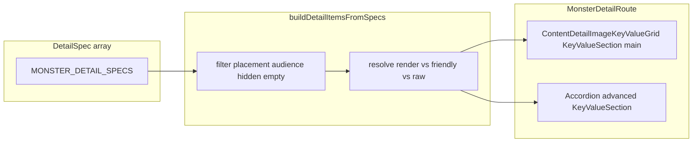

# Monster detail dual presentation (first pass)

## Current state

- [`detailSpec.types.ts`](src/features/content/shared/forms/registry/detailSpec.types.ts): `DetailSpec` is `{ key, label: ReactNode, order, render, hidden? }` — **`render` is required**.
- [`buildDetailItemsFromSpecs.ts`](src/features/content/shared/forms/registry/buildDetailItemsFromSpecs.ts): filters `hidden`, sorts by `order`, maps to `{ label, value }` with `value: spec.render(item, ctx) ?? '—'`.
- [`monsterDetail.spec.tsx`](src/features/content/monsters/domain/details/monsterDetail.spec.tsx): structured fields (`actions`, `traits`, `abilities`, …) use `<StructuredValue />` — generic, not stat-block friendly.
- Spell precedent: [`spellDetail.spec.ts`](src/features/content/spells/domain/details/spellDetail.spec.ts) stays thin and imports from [`src/features/content/spells/domain/details/display/`](src/features/content/spells/domain/details/display/) (e.g. [`spellAttackSaveDisplay.ts`](src/features/content/spells/domain/details/display/spellAttackSaveDisplay.ts)).
- “Platform owner” in this app maps to **`viewer.isPlatformAdmin`** ([`CampaignViewer`](shared/types/campaign.types.ts), [`useActiveCampaignViewerContext`](src/app/providers/useActiveCampaignViewerContext.ts)). There is no `Accordion` usage in `src` yet; MUI’s `Accordion` / `AccordionSummary` / `AccordionDetails` is the natural fit.

## 1) Evolve the shared spec contract (backward compatible)

**Keep `label: ReactNode`** (not `string`) — many specs use JSX labels implicitly via string literals; changing to `string` would be churn without benefit.

Add types next to `DetailSpec` in [`detailSpec.types.ts`](src/features/content/shared/forms/registry/detailSpec.types.ts):

- `DetailPlacement = 'main' | 'advanced' | 'both'`
- `DetailAudience = 'all' | 'platformOwner'` — **at runtime, `'platformOwner'` means `isPlatformAdmin === true`** (document in JSDoc on the type).

Extend `DetailSpec<T, Ctx>` with optional fields (all additive):

| Field | Role |
|--------|------|
| `getValue?(entity, ctx)` | Canonical value for friendly + raw (esp. structured fields). |
| `renderFriendly?(value, entity, ctx)` | Main / friendly cell when `getValue` is used. |
| `renderRaw?(value, entity, ctx)` | Advanced cell; default if omitted: `<pre>{JSON.stringify(value, null, 2)}</pre>`. |
| `placement?` | Default **`'main'`** when omitted (preserves today’s behavior: everything is main-only). |
| `rawAudience?` | Default **`'all'`**. For advanced section, when `'platformOwner'`, gate on `isPlatformAdmin`. |
| `hideIfEmpty?` | Omit row when empty (shared `isEmptyDetailValue` helper: `null`/`undefined`/`''`, empty arrays, empty plain objects). |
| `isStructured?` | Optional hint for future styling; v1 can be unused or used sparingly. |

**Compatibility rules (builder):**

- If **`render`** is present and the spec is resolved for **main**: use `render(entity, ctx)` when **`renderFriendly` is absent** (existing spell/armor/location specs unchanged).
- If **`renderFriendly` + `getValue`** are present: main uses `renderFriendly(getValue(...), entity, ctx)`.
- If both `render` and `renderFriendly` exist, prefer the explicit dual path when `getValue` is present; avoid duplicate definitions in monster specs (monster structured rows should use **`getValue` + `renderFriendly` + `renderRaw`/`default`**, no redundant `render`).
- **`render` becomes optional** in the type only where `getValue` + `renderFriendly` supply the main cell — this is the one TypeScript loosening; all non-monster spec files can keep `render` unchanged.

## 2) Extend the builder (non-breaking API)

Update [`buildDetailItemsFromSpecs.ts`](src/features/content/shared/forms/registry/buildDetailItemsFromSpecs.ts):

- Add optional **4th argument**: `options?: { section?: 'main' | 'advanced'; viewer?: { isPlatformAdmin: boolean } }`.
- Defaults: `section = 'main'` when omitted — **existing 3-arg call sites behave identically**.
- **Main section:** include specs whose `placement` is `undefined`, `'main'`, or `'both'`. Apply `hideIfEmpty` using `getValue` when present, else treat “empty” via `render` only when we cannot infer (skip `hideIfEmpty` inference for pure-`render` specs or run a conservative check).
- **Advanced section:** include specs with `placement === 'advanced' | 'both'`. Drop specs with `rawAudience === 'platformOwner'` when `!viewer?.isPlatformAdmin`. Render via `renderRaw` or default JSON `<pre>`. Sort by `order` like today.

Extract small pure helpers in the same file or a sibling `detailSpec.helpers.ts` if the file grows: `isEmptyDetailValue`, `defaultRenderRaw`.

## 3) Monster display utilities (formatting / resolution)

Add under [`src/features/content/monsters/domain/details/display/`](src/features/content/monsters/domain/details/display/) (mirror spell `display/`):

| File | Responsibility |
|------|----------------|
| `monsterAbilityScoresDisplay.ts` | Compact STR–DEX–… layout strings or small props for UI; use existing [`MonsterAbilityScoreMap`](src/features/mechanics/domain/character) / `abilityIdToAbbrev` patterns from mechanics. |
| `monsterSensesDisplay.ts` | Format `MonsterSenses` → e.g. “Darkvision 120 ft., …” + passive Perception ([`monster-senses.types.ts`](src/features/content/monsters/domain/types/monster-senses.types.ts)). |
| `monsterLanguagesDisplay.ts` | Map `languages[].id` to readable labels: v1 can be **title-cased id** plus a small static map for common ids (`common` → `Common`) if no global vocab exists yet (grep showed no dedicated language catalog in-repo). |
| `monsterActionsDisplay.ts` | Summarize [`MonsterAction`](src/features/content/monsters/domain/types/monster-actions.types.ts) unions: name, attack/save line, damage, reach — align mentally with [`resolveMonsterActionDisplayLabel`](src/features/encounter/helpers/monsters/monster-combat-adapter.ts) where reuse is clean (import shared pure pieces only; avoid pulling encounter UI deps into content domain if messy). |
| `monsterLegendaryActionsDisplay.ts` | Uses/timing + list summaries for [`MonsterLegendaryActions`](src/features/content/monsters/domain/types/monster-legendary.types.ts). |
| `monsterProficienciesDisplay.ts`, `monsterEquipmentDisplay.ts`, `monsterDamageTypesDisplay.ts` (or split immunities/vulnerabilities) | Readable comma-separated / stacked summaries for proficiencies, equipment, immunity/vulnerability lists — enough for “clean summary” v1. |

Keep these **mostly pure** (strings + light `ReactNode` entry points where spell files use `renderXDetailDisplay`).

## 4) Monster view section components (friendly JSX)

Add under [`src/features/content/monsters/components/views/MonsterView/sections/`](src/features/content/monsters/components/views/MonsterView/sections/):

- `MonsterAbilitiesSummary.tsx`, `MonsterSensesSummary.tsx`, `MonsterLanguagesSummary.tsx`, `MonsterTraitsSummary.tsx`, `MonsterActionsSummary.tsx`, `MonsterLegendaryActionsSummary.tsx` — optional thin wrappers for proficiencies/equipment/resistances if not folded into traits/actions files.

Each section component accepts typed props (e.g. `abilities: MonsterAbilityScoreMap | undefined`) and uses existing app typography/`Box` patterns; **no business logic duplication** — call into `display/` helpers.

**Defer `MonsterView.tsx`** unless a single composition barrel reduces duplication; section-first composition per user preference.

## 5) Refactor `MONSTER_DETAIL_SPECS`

Update [`monsterDetail.spec.tsx`](src/features/content/monsters/domain/details/monsterDetail.spec.tsx):

- **Simple scalar / existing rows** (source, visibility, name, HP, AC, movement, alignment, CR, XP, description): keep **`render`** only; `placement` omitted.
- **Structured scope fields** (minimum from your list): `actions`, `bonusActions`, `legendaryActions`, `traits`, `abilities`, `senses`, `proficiencies`, `equipment`, `immunities`, `vulnerabilities`, `languages`:
  - `getValue` → e.g. `m.mechanics?.actions`, `m.languages`, etc.
  - `renderFriendly` → render the corresponding **section component**.
  - `placement: 'both'`, `rawAudience: 'platformOwner'`, `hideIfEmpty: true`, `isStructured: true`.
- Remove `StructuredValue` for those fields from the main path.

## 6) `MonsterDetailRoute`

Update [`MonsterDetailRoute.tsx`](src/features/content/monsters/routes/MonsterDetailRoute.tsx):

- Read `useActiveCampaignViewerContext()` and derive `isPlatformAdmin`.
- **Main:**  
  `buildDetailItemsFromSpecs(MONSTER_DETAIL_SPECS, monster, ctx, { section: 'main' })`  
  inside existing `<ContentDetailImageKeyValueGrid>…<KeyValueSection title="Monster Details" … />`.
- **Advanced:**  
  `const advancedItems = buildDetailItemsFromSpecs(..., { section: 'advanced', viewer: { isPlatformAdmin } })`  
  Render **only if** `isPlatformAdmin && advancedItems.length > 0`: MUI `Accordion` with `defaultExpanded={false}`, summary label e.g. “Advanced”, body: `<KeyValueSection title="Advanced Monster Data" items={advancedItems} columns={1} />` **below** the image grid.

## 7) Tests and regressions

- Update [`monsterArmorClassDisplay.test.tsx`](src/features/content/monsters/domain/monsterArmorClassDisplay.test.tsx) if `armorClass` spec remains `render`-only (should still work).
- Add focused tests: **builder** section filtering / audience gating (new `buildDetailItemsFromSpecs` tests file next to registry), and optionally **one** RTL test for a system monster (e.g. aboleth) asserting friendly text snippets (darkvision, trait name) — keep **`monsterDetail.spec.tsx` thin**.

## 8) Exports

- Re-export new types from [`registry/index.ts`](src/features/content/shared/forms/registry/index.ts) (`DetailPlacement`, `DetailAudience`, and options type for the 4th arg).

## Final spec shape (as implemented)

Document for the deliverable summary:

- `label` remains **`ReactNode`**.
- `render?` optional when `getValue` + `renderFriendly` cover the main cell.
- `placement` defaults to **main-only** behavior.
- `DetailAudience.platformOwner` ↔ **`isPlatformAdmin`** in the viewer context.

## Rollout to other content types (recommended next step)

- Migrate **spells** first: they already use `display/` helpers — add `placement`/`getValue`/`renderRaw` only where a structured “debug JSON” row helps platform admins.
- Then **classes / races / equipment** detail specs using the same **4th-argument** options pattern — no parallel “advanced spec arrays.”

## Mermaid: data flow

