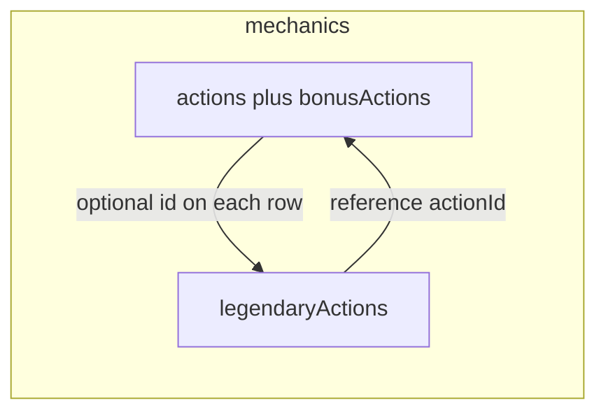

# Plan: `legendaryActions` on monsters

## Context

- Actions today live under `[MonsterFields.mechanics](src/features/content/monsters/domain/types/monster.types.ts)` (`actions`, `bonusActions`). Legendary actions should live there too as `**mechanics.legendaryActions**` (not on the root `Monster`), consistent with existing layout.
- `[MonsterSpecialAction.sequence](src/features/content/monsters/domain/types/monster-actions.types.ts)` uses `{ actionName, count }`. `[buildMonsterActionSequence](src/features/encounter/helpers/monster-combat-adapter.ts)` passes `actionLabel: step.actionName`. To honor **stable IDs**, sequence steps and legendary **reference** entries should use `**actionId`**, with the adapter resolving a display label from the monster’s action list (by `id` on natural/special, or `weaponRef` on `kind: 'weapon'`).
- **Catalog scope**: Only **7** monsters currently have a `Legendary Actions` trait: `aboleth` in `[monsters-a.ts](src/features/mechanics/domain/rulesets/system/monsters/data/monsters-a.ts)`, and six dragons in `[monsters-b.ts](src/features/mechanics/domain/rulesets/system/monsters/data/monsters-b.ts)` (adult/ancient blue, brass, bronze). No other shards match `name: 'Legendary Actions'`.

## 0. Shared turn-hook primitives (refactor)

**Problem:** The same turn-boundary concept is repeated in several shapes:

- `[RepeatSave.timing](src/features/mechanics/domain/effects/effects.types.ts)` — `'turn-start' | 'turn-end'`
- `[RegenerationEffect.trigger](src/features/mechanics/domain/effects/effects.types.ts)` — `{ kind: 'turn-start' | 'turn-end'; subject: 'self' }`
- `[TriggerType](src/features/mechanics/domain/triggers/trigger.types.ts)` — includes `'turn-start' | 'turn-end'` plus `TriggerInput` / `TRIGGER_INPUT_MAP` / `normalizeTriggerType`
- `[MonsterTraitTrigger](src/features/content/monsters/domain/types/monster-traits.types.ts)` — `{ kind: 'turn-start' } | { kind: 'turn-end' }` (tagged-object form, same semantics)

**Approach**

1. Add a small **canonical** module (e.g. `[src/features/mechanics/domain/triggers/turn-hooks.types.ts](src/features/mechanics/domain/triggers/turn-hooks.types.ts)` — name can be `turn-boundary.types.ts` if you prefer) exporting:
  - `**TurnHookKind`**: `'turn-start' | 'turn-end'` — single source of truth for spell/effect/monster content that means “at the start/end of **a** turn” on the usual turn-boundary hooks (repeat saves, regeneration, etc.).
  - `**TurnHookSelfTrigger`** (optional but **recommended** in this refactor): `{ kind: TurnHookKind; subject: 'self' }` — use wherever the rules mean “this creature’s turn start/end” (e.g. `RegenerationEffect.trigger`). Keeps the `subject: 'self'` shape explicit for future extension (e.g. other subjects later).
  - `**OffTurnTiming`** (name TBD; e.g. `EncounterOffTurnKind` or a single literal type): at minimum `'end-of-other-creatures-turn'` — **not** a `TurnHookKind`; models “immediately after another creature’s turn” (legendary actions, and other rules below). Export from the **same** module so monsters and future features import one vocabulary.
2. **Refactor consumers** (no behavior change; types-only / import rewires):
  - `RepeatSave`: `timing: TurnHookKind`
  - `RegenerationEffect`: `trigger: TurnHookSelfTrigger`
  - `trigger.types.ts`: compose `TriggerType` so the turn hooks are `TurnHookKind` (e.g. `type TriggerType = ... | TurnHookKind | ...` or extract non-turn branches and `| TurnHookKind`), keeping `TRIGGER_INPUT_MAP` and `normalizeTriggerType` intact for string aliases (`on_turn_start`, etc.).
  - `MonsterTraitTrigger`: for the turn variants, use `{ kind: TurnHookKind }` or a mapped type so the literal kinds stay assignable to `TurnHookKind`.
3. **Legendary actions alignment**: Define `MonsterLegendaryActions.refresh` using `**TurnHookKind`** when it means “regain uses at **start of this creature’s turn**” (`'turn-start'`). Define the **window** for spending legendary actions (SRD: immediately after another creature’s turn) using `**OffTurnTiming`** / `'end-of-other-creatures-turn'` — **not** `TurnHookKind` and not the same as `turn-end` on the legendary creature’s own turn.

**Reusing `end-of-other-creatures-turn` outside legendary actions:** Yes. The same rules concept appears elsewhere: **reactions** keyed to another creature finishing movement or ending its turn, **readied** spell/activity resolution, some **class or lair** features, and any future “when a creature ends its turn” trigger that is **about other combatants’ turns**, not the acting creature’s `turn-start` / `turn-end`. Putting `'end-of-other-creatures-turn'` in the shared module as `**OffTurnTiming`** (or a small union if more off-turn moments are added later) avoids legendary-only string literals and lets spells/effects/monsters reference the same primitive when authoring needs that window. This plan **uses** it on `MonsterLegendaryActions.timing`; other call sites can adopt the same import when implemented.
4. **Spells**: No mass data rewrite required; spell JSON already uses `'turn-start'` / `'turn-end'` strings — they become `**TurnHookKind`** at the type level.
5. **Verification**: `tsc`, existing encounter tests (`action-effects.ts`, `monster-runtime.ts`, `monster-combat-adapter.ts` branches on turn hooks), and normalization tests.

**Dependency order:** Implement **§0** before or alongside **§1** so `monster-legendary.types.ts` imports `TurnHookKind` instead of inventing a third copy of turn boundaries.

## 1. Domain types

**New file** `[src/features/content/monsters/domain/types/monster-legendary.types.ts](src/features/content/monsters/domain/types/monster-legendary.types.ts)`

- Define `**MonsterLegendaryActions`**: `uses`, optional `usesInLair`, optional `**refresh`**: `TurnHookKind` when meaning “regain uses at start/end of **this** creature’s turn”; optional `**timing`**: `OffTurnTiming` (from §0, e.g. `'end-of-other-creatures-turn'`) for **when** legendary actions may be taken (other creature’s turn), `actions: MonsterLegendaryAction[]`, optional block-level `resolution?: ContentResolutionMeta`.
- Define `**MonsterLegendaryAction`** as a discriminated union:
  - `**kind: 'reference'`**: `name`, optional `cost` (default 1 at call sites / docs), `**actionId*`* (required) pointing at a row in `mechanics.actions` / `bonusActions`:
    - Resolve natural/special rows by `**action.id`**
    - Resolve `**kind: 'weapon'`** by `**weaponRef`** (same string as `actionId`) to avoid a second parallel id system
  - Optional: `notes`, `heal?: DiceOrFlat` (shortcut for self-heal riders), `additionalEffects?: Effect[]`, `resolution?: ContentResolutionMeta`
  - `**kind: 'inline'*`*: `name`, optional `cost`, `action: MonsterAction` for legendary-only actions (spell-like “Cloaked Flight”, composite lines, etc.)

**Imports**: `DiceOrFlat` from dice types, `Effect` from `[effects.types.ts](src/features/mechanics/domain/effects/effects.types.ts)`, `ContentResolutionMeta`, and `MonsterAction` from existing action types.

**Extend action types** in `[monster-actions.types.ts](src/features/content/monsters/domain/types/monster-actions.types.ts)`

- Add optional `**id?: string`** to `**MonsterNaturalAttackAction`** and `**MonsterSpecialAction`** (kebab-case, unique within that monster’s actions + bonus actions). Omit when redundant (e.g. single obvious attack) but **required** for any action referenced by `sequence` or `legendaryActions`.
- Extend `**sequence`** items to support stable references, e.g. `**{ actionId: string; count: number }`** (and optionally keep `**actionName`** temporarily for backwards compatibility, or migrate all touched rows in the same change). Prefer **one canonical shape** (`actionId` + `count`) once catalog rows carry `id`s.

**Wire into** `[monster.types.ts](src/features/content/monsters/domain/types/monster.types.ts)`

- Add `**legendaryActions?: MonsterLegendaryActions`** under `mechanics`.

**Export** from `[types/index.ts](src/features/content/monsters/domain/types/index.ts)`.

## 2. Adapter: Multiattack / sequence labels

Update `[buildMonsterActionSequence](src/features/encounter/helpers/monster-combat-adapter.ts)` (and any small helper in the same file):

- If a step has `**actionId`**, find the matching action in `monster.mechanics.actions` / `bonusActions` and set `**actionLabel`** to the action’s display name (`special.name`, `natural.name` ?? `attackType`, weapon alias/name from equipment).
- If only legacy `**actionName**` is present, keep current behavior.
- This keeps encounter UI labels correct without duplicating display strings in sequence data.

No requirement in this scope to add **executable** legendary actions to the encounter engine; structured data + caveats remain the source of truth until a future pass wires cost/timing.

## 3. Author catalog data (SRD CC 5.2.1)

For each of the **7** monsters:

- Assign `**id`** on every natural/special action that is referenced (e.g. aboleth: `tentacle`, `consume-memories`, `dominate-mind`; dragons: `rend`, `spellcasting` where referenced, etc.).
- Update **Multiattack** `sequence` to use `**actionId`** + `**count`** (aligned with the new sequence type).
- Add `**mechanics.legendaryActions`** with `**uses`** / `**usesInLair`** matching the stat block (e.g. 3 / 4 in lair), `**timing`** / `**refresh`** as in the rules, and `**actions`**:
  - **Reference** entries where the legendary action is “one attack” or “uses action X” (e.g. aboleth **Lash** → `actionId: 'tentacle'`; **Psychic Drain** → `actionId: 'consume-memories'` with `**heal: '1d10'`** and **notes** for the charm/grapple precondition).
  - **Inline** `kind: 'special'` (description + `resolution.caveats` where needed) for dragon options that are not plain duplicates of a single named action (e.g. Cloaked Flight, Sonic Boom, Blazing Light, Scorching Sands, Guiding Light, Thunderclap—per printed block).
- **Trait cleanup**: Remove or drastically shorten the old `**traits[]` entry** whose `name` is `**Legendary Actions`** so the long-form text is not duplicated—canonical list lives under `**mechanics.legendaryActions`**. Preserve `**Legendary Resistance`** as its own trait. Move automation caveats to `**resolution**` on the legendary block or per-entry as today.

**SRD compliance**: Use wording consistent with the **CC BY 4.0 SRD 5.2.1** text your project relies on (not MM-only wording). Keep attribution/licensing expectations aligned with your repo’s existing OGL/SRD practice.

**Files**: `[monsters-a.ts](src/features/mechanics/domain/rulesets/system/monsters/data/monsters-a.ts)` (aboleth), `[monsters-b.ts](src/features/mechanics/domain/rulesets/system/monsters/data/monsters-b.ts)` (six dragons).

## 4. Editor and UI parity (minimal)

- **Form**: Add a JSON field `**legendaryActions`** to `[monsterForm.types.ts](src/features/content/monsters/domain/forms/types/monsterForm.types.ts)`, `[MONSTER_FORM_FIELDS](src/features/content/monsters/domain/forms/registry/monsterForm.registry.ts)`, and `[monsterForm.mappers.ts](src/features/content/monsters/domain/forms/mappers/monsterForm.mappers.ts)` (`monsterToFormValues` / `toMonsterInput`) so create/edit round-trips the new block like `actions` / `traits`.
- **Detail view**: Add a row in `[monsterDetail.spec.tsx](src/features/content/monsters/domain/details/monsterDetail.spec.tsx)` for `**legendaryActions`** (same `StructuredValue` pattern as actions).

## 5. Documentation

Update `[docs/reference/monster-authoring.md](docs/reference/monster-authoring.md)`:

- New subsection **Legendary actions**: shape of `MonsterLegendaryActions`, `**reference` vs `inline`**, `**actionId`** resolution (including weapon `weaponRef`), optional `**heal**` vs `**additionalEffects**`, and defaults (`cost` defaults to 1).
- Document `**TurnHookKind**` / when to use `**refresh: 'turn-start'**` vs a separate **legendary timing** field for “after another creature’s turn.”
- Cross-link types (`[monster-legendary.types.ts](src/features/content/monsters/domain/types/monster-legendary.types.ts)`, `[monster-actions.types.ts](src/features/content/monsters/domain/types/monster-actions.types.ts)`, shared turn-hooks module from §0).
- Short **authoring rule**: add `**id`** to any action referenced by Multiattack or legendary references; use **kebab-case** ids stable across edits to display names.
- Note **SRD** source for rule text where applicable.

Optional: add a one-line pointer in `[docs/reference/resolution.md](docs/reference/resolution.md)` only if it already discusses repeat saves / regeneration triggers — keep the edit minimal.

## 6. Verification

- Run TypeScript check / existing tests (e.g. `[action-resolution.monster-special.test.ts](src/features/mechanics/domain/encounter/tests/action-resolution.monster-special.test.ts)` if sequence shape affects resolution).
- If any test fixtures construct `Monster` with `sequence`, update them to the new shape.

