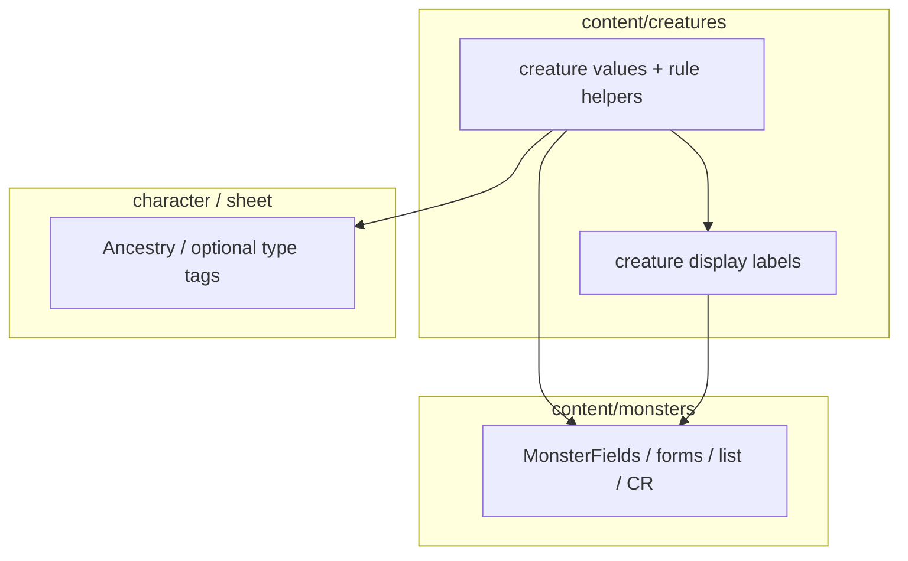

# Creature + monster taxonomy (refined plan)

## What changed from the first draft

- **Shared creature domain:** Types, subtypes, and size are **not monster-only**; they belong in a new layer ([`src/features/content/creatures/`](src/features/content/creatures/)) so mechanics, characters, and monsters can share **value IDs** without sharing UI.
- **Subtypes are type-scoped:** Replace the flat `MONSTER_SUBTYPE_OPTIONS` idea with **`allowedSubtypeIds` on each creature type** plus a **global subtype catalog** for display names and validation.
- **Single build, no long-lived compatibility barrel:** Canonical home is `creatures/.../values/`. The former [`monster.vocab.ts`](src/features/content/monsters/domain/vocab/monster.vocab.ts) is **removed** once all imports are migrated; type aliases for `MonsterType` / `MonsterSizeCategory` / `MonsterSubtype` live in [`monster.types.ts`](src/features/content/monsters/domain/types/monster.types.ts) (re-exporting creature ids).
- **Phased model evolution:** Widen the subtype catalog and `allowedSubtypeIds` **incrementally**; do not require every SRD string in the first commit.

**Current codebase facts (relevant to scope):** There is no `content/creatures` tree yet. [`MonsterFields`](src/features/content/monsters/domain/types/monster.types.ts) uses `type?: MonsterType`, `subtype?: MonsterSubtype`, `sizeCategory?: MonsterSizeCategory`, where `MonsterSubtype` is still a **manual** union (`'goblinoid' | 'aquatic' | 'gnome'`) **alongside** vocab rows—convergence should be a migration step, not a silent assumption.

---

## 1. Recommended final model

### 1.1 Identifiers (shared, creature level)

| Concept | Suggested name | Source of truth |
|--------|----------------|------------------|
| Size | `CreatureSizeId` | `CREATURE_SIZE_DEFINITIONS` in [`creatureSize.ts`](src/features/content/creatures/domain/values/creatureSize.ts) (or a single `creatureTaxonomy.ts` if you prefer one file) |
| Creature (stat block) type | `CreatureTypeId` | `CREATURE_TYPE_DEFINITIONS` in [`creatureTaxonomy.ts`](src/features/content/creatures/domain/values/creatureTaxonomy.ts) |
| Subtype tag | `CreatureSubtypeId` | `CREATURE_SUBTYPE_DEFINITIONS` in the same module |

**Naming policy:** At the **shared** layer, use **Creature***, not *Monster*—rules and targeting care about “creature type,” not “monster feature.”

**Monster-type aliases (optional, at the monster boundary):** `type MonsterType = CreatureTypeId` (and `MonsterSizeCategory` / `MonsterSubtype` mapping to creature ids) live in [`monster.types.ts`](src/features/content/monsters/domain/types/monster.types.ts).

### 1.2 Type-scoped subtypes

**Target data shape (canonical):**

- `CREATURE_SUBTYPE_DEFINITIONS`: `{ id, name }[]` — **global** registry of valid subtype *IDs* and display *names* (dwarf, elf, demon, shapechanger, …).
- `CREATURE_TYPE_DEFINITIONS`: each row `{ id, name, ruleTags?, allowedSubtypeIds }` where **`allowedSubtypeIds` is a readonly list of `CreatureSubtypeId`** (empty meaning “no subtypes in UI for this type” or “not applicable” — pick one convention and document it).

**Helpers (pure, live next to definitions):**

- `getAllowedSubtypeIdsForCreatureType(typeId: CreatureTypeId): readonly CreatureSubtypeId[]`
- `isSubtypeAllowedForCreatureType(typeId, subtypeId): boolean`
- `getAllowedSubtypeOptionsForCreatureType(typeId): { value, label }[]` — **derived** for forms; not hand-maintained.

**`getCreature*DisplayName` — where they live:** Put **string formatting for users** in a **display** module, e.g. [`src/features/content/creatures/domain/display/creatureTaxonomyDisplay.ts`](src/features/content/creatures/domain/display/creatureTaxonomyDisplay.ts), **not** in `values/`. **Rule:** `values/` = canonical tables + *non-presentational* invariants; `display/` = null/empty → `—`, unknown id → pass-through, etc. Same split as for monsters: [`monsterTaxonomyDisplay.ts`](src/features/content/monsters/domain/details/display/monsterTaxonomyDisplay.ts) can re-export or thin-wrap creature display for monster-specific import paths, or only alias — see §4.

### 1.3 Size: lifted to creature level

Yes. **`CREATURE_SIZE_DEFINITIONS`** and `CreatureSizeId` are the single source; monsters use the same IDs for `sizeCategory` as today (tiny … gargantuan).

### 1.4 Single vs multiple subtypes (explicit recommendation)

| Layer | Recommendation |
|-------|-----------------|
| **Long-term / stat block expressiveness** | **`subtypeIds: CreatureSubtypeId[]` is preferable** (multiple tags, SRD-consistent “shapechanger + demon,” etc.). |
| **This migration pass** | **Keep `subtype?: ...` (single) on `MonsterFields`** and persistence as-is. Optionally add a **Branded** `CreatureSubtypeId` derived from definitions instead of the hand union. |
| **UI** | **Stay single-select** in forms until product asks for multi-select. |
| **Bridge** | When you adopt arrays: normalize `subtype` ↔ `subtypeIds[0]` in one mapper for backward compatibility, then deprecate the scalar field. |

Rationale: moving to an array touches JSON shape, list filters, and exports—out of scope for a “pragmatic refinement + scaffolding” pass. Document the **intended** array field in a short ADR or comment in `MonsterFields`.

### 1.5 How monsters vs characters should consume this

- **Monsters:** Import **`CreatureTypeId` / `CreatureSizeId` / `CreatureSubtypeId`** (or aliases) from **creatures** values; use **monster** modules only for list filters, stat block presentation, and monster-only concepts (e.g. challenge rating).
- **Characters / NPCs:** Import the **same ID types** where the rules engine or sheet needs "creature type" or size. **Do not** require character UI to use `getAllowedSubtypeOptionsForCreatureType`—e.g. race/ancestry can drive tags instead. Shared **value model**; **different** UI entry points.

---

## 2. Staged migration plan (revised: single build, cleanup included)

| Phase | Goal |
|-------|------|
| **1** | Add `content/creatures/domain/values/*` and `display/*`; move extraplanar / rule-tag + allowed-subtype logic here. |
| **2** | Migrate all consumers (app, `packages/mechanics`, docs) to creature modules and monster `domain/details/display/monsterTaxonomyDisplay.ts` + `domain/list/monsterList.filterOptions.ts`. **Delete** `monster.vocab.ts` and the empty `vocab/` folder. |
| **3** | Add/extend tests; `vitest run`. |

**No compatibility barrel in the final tree:** by end of build, `monster.vocab.ts` does not exist; grep must have zero references.

---

## 3. Concrete file plan

### 3.1 Shared creature layer (new)

| File | Role |
|------|------|
| [`src/features/content/creatures/domain/values/creatureSize.ts`](src/features/content/creatures/domain/values/creatureSize.ts) | `CREATURE_SIZE_DEFINITIONS`, `CreatureSizeId` |
| [`src/features/content/creatures/domain/values/creatureTaxonomy.ts`](src/features/content/creatures/domain/values/creatureTaxonomy.ts) | `CREATURE_TYPE_DEFINITIONS` (with `allowedSubtypeIds` per type), `CREATURE_SUBTYPE_DEFINITIONS`, `CREATURE_TYPE_RULE_TAGS` / extraplanar derivations, `getAllowedSubtypeIdsForCreatureType`, `isSubtypeAllowedForCreatureType`, `getAllowedSubtypeOptionsForCreatureType` |
| [`src/features/content/creatures/domain/values/index.ts`](src/features/content/creatures/domain/values/index.ts) | Barrel (optional) |
| [`src/features/content/creatures/domain/display/creatureTaxonomyDisplay.ts`](src/features/content/creatures/domain/display/creatureTaxonomyDisplay.ts) | `getCreatureTypeDisplayName`, `getCreatureSubtypeDisplayName`, `getCreatureSizeDisplayName` |
| [`src/features/content/creatures/domain/display/index.ts`](src/features/content/creatures/domain/display/index.ts) | Barrel (optional) |

### 3.2 Monster feature (refined from prior draft)

| File | Role |
|------|------|
| [`src/features/content/monsters/domain/details/display/monsterTaxonomyDisplay.ts`](src/features/content/monsters/domain/details/display/monsterTaxonomyDisplay.ts) | Thin `getMonster*DisplayName` delegating to creature display (monster feature import path) |
| [`src/features/content/monsters/domain/list/monsterList.filterOptions.ts`](src/features/content/monsters/domain/list/monsterList.filterOptions.ts) | Filter rows derived from creature definitions (still monster-scoped: “All” + type ids) |
| [`src/features/content/monsters/domain/values/monsterChallengeRating.ts`](src/features/content/monsters/domain/values/monsterChallengeRating.ts) | **Optional split:** if CR steps stay monster-only, define here later; not blocking Phase 1–2 |
| `monsterTaxonomy.ts` (monsters) | **Only if** something remains truly monster-only after lift; **otherwise omit** to avoid two sources of type rows |

### 3.3 Mechanics / other packages

- Import **`CreatureTypeId`**, `EXTRAPLANAR_CREATURE_TYPE_IDS`, `CREATURE_TYPE_DEFINITIONS`, etc. from `@/features/content/creatures/domain/values` (or direct file paths).
- [`extraplanar-creature-types.ts`](packages/mechanics/src/rulesets/system/monsters/extraplanar-creature-types.ts) can keep depending on the **same** creature definitions (update import path in Phase 2/4).

---

## 4. ~~Compatibility barrel~~ (removed from final build)

`monster.vocab.ts` is **not** part of the shipping layout. Replaced by: [`monster.types.ts`](src/features/content/monsters/domain/types/monster.types.ts) (type aliases), creature `values/` + `display/`, and [`monsterTaxonomyDisplay.ts`](src/features/content/monsters/domain/details/display/monsterTaxonomyDisplay.ts).

---

## 5. Seeding `allowedSubtypeIds` without a breaking rewrite (Phase 1)

**Constraint:** The catalog will eventually list humanoid subraces, fiendish branches, element types, etc. **Do not** add every SRD string in the first commit unless you want a huge review surface.

**Pragmatic approach:**

1. **Backfill** `CREATURE_SUBTYPE_DEFINITIONS` with at least the union of: current vocab rows + any id already present in **system monster data** (grep `subtype` in [`packages/mechanics/.../data`](packages/mechanics/src/rulesets/system/monsters/data)) so display names are consistent.
2. For each `CREATURE_TYPE_DEFINITIONS` row, set **`allowedSubtypeIds`** to include every subtype that **appears in real data** for that type **plus** a minimal plausible set for known placeholders (e.g. **humanoid** gets goblinoid, gnome, dwarf, … as you add them in small batches).
3. **Types with no subtypes in data yet:** `allowedSubtypeIds: readonly []` or omit and treat as “none” in UI.
4. **Validation:** In form submit (later), `isSubtypeAllowedForCreatureType` can soft-warn or hard-error—start **permissive** (allow any known `CreatureSubtypeId` if the product owner prefers) and tighten when data quality improves.

This satisfies the **model direction** (type → allowed ids) while allowing **incremental** vocabulary growth.

---

## 6. Implementation guidance (pain points, cycles, tests)

**Type migration pain points**

- [`MonsterSubtype`](src/features/content/monsters/domain/types/monster.types.ts) is a **manual** union. Path A: `MonsterSubtype` = `CreatureSubtypeId` from definitions. Path B: keep union until all ids exist in `CREATURE_SUBTYPE_DEFINITIONS`, then switch—**prefer A** with `satisfies` or tests that **canonical ids** match stat blocks.
- `packages/mechanics` and `src` cross-import via aliases—**creatures/values** must not import from `monsters` (one-way: monsters → creatures).

**Import stability**

- **Single write path** for row data: `creatureTaxonomy.ts` (and `creatureSize.ts`) only.

**Circular dependencies**

- `values` → no `display` if display imports values (ok: display imports values only). `monster` display can import `creature` display + re-export.
- `monster.types` should import `CreatureTypeId` from **creatures**, not the reverse.

**UI**

- **Subtype:** single-select; options **recomputed** when `type` field changes.
- **List filter:** can stay “all subtypes in catalog” or “union of allowed across types”—product choice; not blocking.

**Tests to add first (stability before big catalog expansion)**

1. **Creature values:** `CreatureTypeId` / `CreatureSubtypeId` sets match definitions; `getAllowedSubtypeIdsForCreatureType('humanoid')` contains expected seeds; `monsterTypeHasRuleTag` / extraplanar lists **unchanged** from current behavior.
2. **Display:** unknown id pass-through, null → `—`.
3. **List filters:** `MONSTER_TYPE_FILTER_OPTIONS` / size filter rows match creature definitions.
4. **Regression:** existing monster list/detail tests; optional system monster spot-check for subtype + type pairs.

**Follow-up refactors (not this pass)**

- Array `subtypeIds` + migration tool for stored JSON.
- Broaden SRD `allowedSubtypeIds` and sync with encounter/stat block authoring docs.
- Character sheet integration using `CreatureTypeId` only where rules require it.

---

## 7. What stays monster-specific

- **Challenge rating** vocabulary and list CR filters (unless you promote “CR” to a generic “content stat” later).
- **Monster list** filter composition (`monsterList.filterOptions`, “All” row semantics for monster grid).
- **Presentation** tied to the monster stat block template (e.g. identity line formatters) — can call **creature** display internally.

**Rule-of-thumb:** If SRD or targeting rules would reference it for a **PC or NPC stat block** the same way as a monster, it belongs in **creatures**; if it is **editor or grid** behavior for the monster feature only, it stays in **monsters**.

---

## 8. Non-goals (restated)

- No giant unrelated refactor; no full character UI rewrite; **no** persistence change to `subtypeIds` **in this pass**; do not add unnecessary abstractions beyond **creature size + taxonomy + display** and monster-specific list/filter modules.

**Final build acceptance:** `monster.vocab.ts` is absent; all imports use creature or monster feature paths as above.
