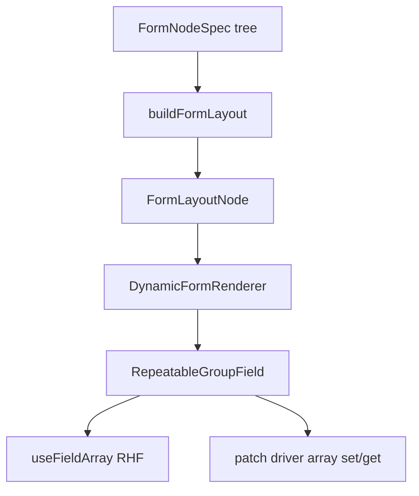

# Nested repeatable groups + spell `effectGroups` prototype

## Current state (findings)

- [`fieldSpec.types.ts`](src/features/content/shared/forms/registry/fieldSpec.types.ts): only flat `FieldSpec` with scalar/list-ish form keys.
- [`buildFieldConfigs.ts`](src/features/content/shared/forms/registry/buildFieldConfigs.ts): `FieldSpec[]` → `FieldConfig[]` (flat).
- [`form.types.ts`](src/ui/patterns/form/form.types.ts): `FieldConfig` discriminated union — no repeatables.
- [`DynamicFormRenderer.tsx`](src/ui/patterns/form/DynamicFormRenderer.tsx): chunks by `group`, renders `DynamicField` / `DriverField` per leaf.
- [`ConditionalFormRenderer.tsx`](src/ui/patterns/form/ConditionalFormRenderer.tsx): filters by `visibleWhen` using dot-paths via `getAtPath` (already compatible with nested RHF values).
- Spell: [`spellForm.types.ts`](src/features/content/spells/domain/forms/types/spellForm.types.ts) has `effectGroups: string`; [`spellForm.registry.ts`](src/features/content/spells/domain/forms/registry/spellForm.registry.ts) uses `kind: 'json'` + JSON parse/format + `patchBinding` on `effectGroups`. Domain shape is already `SpellEffectGroup[]` ([`spell.types.ts`](src/features/content/spells/domain/types/spell.types.ts)).

## 1) Shared modeling: `FormNodeSpec` + builder

**New types** (new file, e.g. [`formNodeSpec.types.ts`](src/features/content/shared/forms/registry/formNodeSpec.types.ts)):

- `RepeatableGroupSpec`: `{ kind: 'repeatable-group'; name: string; label?: string; itemLabel: string; children: FormNodeSpec[]; defaultItem?: Record<string, unknown> }` (optional `defaultItem` for “Add” — minimal empty row).
- `FormNodeSpec = FieldSpec<...> | RepeatableGroupSpec` (recursive).

**Relaxed leaf names inside groups**: nested children are **not** `keyof SpellFormValues`; introduce `NestedFieldSpec` / `FormLeafSpec` as `Omit<FieldSpec<FormValues>, 'name'> & { name: string }` used **only** under `RepeatableGroupSpec` so relative paths like `targeting.selection` and `effects` work without lying to `keyof`.

**New builder** (e.g. [`buildFormLayout.ts`](src/features/content/shared/forms/registry/buildFormLayout.ts)):

- `buildFormLayout(specs: FormNodeSpec[], options: BuildFieldConfigsOptions): FormLayoutNode[]`
- Recursively maps leaf specs with existing `buildFieldConfigs` **single-field** logic (extract inner loop from current `buildFieldConfigs` or call a shared helper) so behavior matches today.
- Emits UI nodes: `RepeatableGroupConfig`: `{ type: 'repeatable-group'; name; label?; itemLabel; children: FormLayoutNode[]; defaultItem? }`.

**Exports**: extend [`registry/index.ts`](src/features/content/shared/forms/registry/index.ts) with new types + `buildFormLayout`.

## 2) UI layer: `FormLayoutNode` + renderer

**Extend** [`form.types.ts`](src/ui/patterns/form/form.types.ts):

- `export type FormLayoutNode = FieldConfig | RepeatableGroupLayoutConfig` (name TBD; include `type: 'repeatable-group'`).

**New component** [`RepeatableGroupField.tsx`](src/ui/patterns/form/RepeatableGroupField.tsx) (or similar):

- **RHF** (`useFieldArray` on `name`): for each index, render nested children:
  - Leaf: prefix child `field.name` → `` `${name}.${index}.${childName}` `` (join path segments).
  - Nested `repeatable-group`: nested `useFieldArray` with name `` `${name}.${index}.${childName}` ``.
- **Patch driver** (when `driver` is passed from [`DynamicFormRenderer`](src/ui/patterns/form/DynamicFormRenderer)): bind **whole array** at `domainPath` `name` (or explicit `patchBinding` on the group config) using the same `getValue`/`setValue` pattern as [`DriverField`](src/ui/patterns/form/DriverField.tsx) — local controlled updates that write the full array back. Same add/remove UX; no `useFieldArray`.

**Update** [`DynamicFormRenderer.tsx`](src/ui/patterns/form/DynamicFormRenderer.tsx):

- Prop type: `fields: FormLayoutNode[]` (keep exporting a type alias so existing `FieldConfig[]` call sites still type-check via union).
- In `chunkFields` / main loop: treat `repeatable-group` as a **single** chunk (like `hidden` / non-group fields) and render `RepeatableGroupField`.
- Thread `driver` into nested renderer (already available for patch mode).

**Update** [`ConditionalFormRenderer.tsx`](src/ui/patterns/form/ConditionalFormRenderer.tsx):

- Accept `FormLayoutNode[]`.
- Visibility: for v1, only apply `visibleWhen` to **leaf** `FieldConfig` entries (repeatable group always visible unless you add `visibleWhen` later). Filtering logic that uses `field.name` must skip or special-case `type === 'repeatable-group'` so it does not break.

**Update** [`buildDefaultValues.ts`](src/ui/patterns/form/utils/buildDefaultValues.ts):

- Recurse into `repeatable-group`: default `name` to `[]` or to `[defaultItem]` if provided.
- Ensure spell defaults still compose with [`SPELL_FORM_DEFAULTS`](src/features/content/spells/domain/forms/config/spellForm.config.ts).

**Export** new types/components from [`ui/patterns/form/index.ts`](src/ui/patterns/form/index.ts) / [`ui/patterns/index.ts`](src/ui/patterns/index.ts) as needed.

## 3) Spell prototype

**Types** — [`spellForm.types.ts`](src/features/content/spells/domain/forms/types/spellForm.types.ts):

- Replace `effectGroups: string` with a narrow row type, e.g. `effectGroups: SpellEffectGroupFormRow[]`.
- `SpellEffectGroupFormRow`: `{ targeting: { selection: TargetSelectionKind | ''; targetType: TargetEligibilityKind | '' }; effects: { kind: 'damage' | 'condition' | '' }[] }` (import kinds from [`spellTargeting.vocab.ts`](src/features/content/shared/domain/vocab/spellTargeting.vocab.ts)).

**Registry** — [`spellForm.registry.ts`](src/features/content/spells/domain/forms/registry/spellForm.registry.ts):

- Remove the JSON `effectGroups` entry from `getSpellSimpleFieldSpecs`.
- Add one `RepeatableGroupSpec` named `effectGroups` with:
  - Two **select** leaves (relative names `targeting.selection`, `targeting.targetType`) using options from `TARGET_SELECTION_DEFINITIONS` and `TARGET_ELIGIBILITY_DEFINITIONS` (map `id` → `value`, `name` → `label`).
  - Nested `RepeatableGroupSpec` `effects` with one **select** leaf `kind` and hardcoded options `[{ id: 'damage', name: 'Damage' }, { id: 'condition', name: 'Condition' }]`.
- Add **simple** `FieldSpec` for `effectGroups` (could live in the same file or next to mappers) with `parse`/`format` that pass through the array and map to `SpellInput['effectGroups']` using a **documented** type assertion (minimal `{ kind }` rows are not full `SpellEffect` yet — acceptable shortcut for this pass).

**Composition** — [`spellForm.config.ts`](src/features/content/spells/domain/forms/config/spellForm.config.ts):

- Build layout via `buildFormLayout(getSpellFormFields(...))` instead of `buildFieldConfigs(getSpellFormFields(...))`.
- Adjust `SPELL_FORM_DEFAULTS` if defaults move.

**Mappers** — [`spellForm.mappers.ts`](src/features/content/spells/domain/forms/mappers/spellForm.mappers.ts):

- `buildDefaultFormValues` must consume `FormNodeSpec[]` (new helper alongside existing flat helper) for `spellToFormValues` default merge.
- `buildToInput` / `buildToFormValues` continue to use `getSpellSimpleFieldSpecs` for scalar mapping; `effectGroups` remains driven by that one field’s `parse`/`format`.

## 4) Tests

- Add [`src/features/content/shared/forms/registry/__tests__/formLayout.build.test.ts`](src/features/content/shared/forms/registry/__tests__/formLayout.build.test.ts): build a tiny `FormNodeSpec` tree (outer + inner repeat) and assert `buildFormLayout` output shape and default value generation (empty arrays / `defaultItem`).
- Add or extend spell-side test: assert `toSpellInput` / round-trip includes nested `effectGroups` structure (can live under [`src/features/content/spells/domain/__tests__/`](src/features/content/spells/domain/__tests__/)).
- Update [`spellPresentation.contract.test.ts`](src/features/content/spells/domain/__tests__/spellPresentation.contract.test.ts) if `getSpellFormFields().map(f => f.name)` no longer applies to every node — either keep `name` on repeatables or adjust test to collect leaf + repeat names.

## 5) Shortcuts (explicit)

- **Domain typing**: `SpellEffect` remains rich; prototype rows use `as SpellInput['effectGroups']` (or equivalent) at the `parse` boundary until full effect authoring exists.
- **Patch / system spell UI**: bind whole `effectGroups` array via driver (no per-leaf patch paths). If that balloons scope, acceptable fallback: **temporarily** keep a `json` field for patch-only — prefer single-array binding first.
- **Validation / visibility / reordering**: out of scope; no drag-and-drop.

## 6) Follow-up enabled

- Flesh out `effects[].kind`-specific subforms (damage dice, condition id).
- Tighten types so `parse` returns real `SpellEffect[]` without assertions.
- Item-scoped `visibleWhen` and optional reorder.

