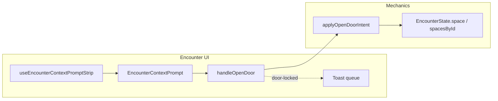

# Phase 1 door interaction (combat) — plan

## Recommendation summary

| Question | Answer |
|----------|--------|
| **Smallest safe Phase 1 path** | New **`CombatIntent`** variant (e.g. `open-door`) + **`applyOpenDoorIntent`** in `packages/mechanics`, optional **`EncounterEdge`** metadata populated in [`buildEncounterSpaceFromLocationMap.ts`](src/features/game-session/combat/buildEncounterSpaceFromLocationMap.ts), thin UI in [`useEncounterContextPrompt.tsx`](src/features/encounter/hooks/useEncounterContextPrompt.tsx) with **stairs-first** priority, **`handleOpenDoor`** in [`useEncounterState.ts`](src/features/encounter/hooks/useEncounterState.ts) mirroring move/stair apply + persist. |
| **Reuse stairs / context prompt pattern?** | **Partially.** Same **`EncounterContextPrompt`** component and same hook shape (resolve → render strip). **Do not** copy the async `useEffect` + `resolveEncounterStairTraversalPayload` pattern—door detection is **pure sync** on `EncounterState` + `getEncounterSpaceForCombatant`. Stairs stay special (async, destination space, transition modal in [`useEncounterActivePlaySurface.tsx`](src/features/encounter/hooks/useEncounterActivePlaySurface.tsx) ~929–957). |
| **Shared `EncounterContextPrompt` action pipeline now?** | **No formal union/pipeline in this pass.** It would add types and indirection before you have a third interaction. |
| **Smallest useful abstraction** | **One pure helper** (e.g. `resolveAdjacentClosedDoorPrompt(space, combatantCellId)` in `src/features/encounter/combat/` or under mechanics tests) returning **`{ cellIdA, cellIdB, mapEdgeId?: string } | null`** (intent payload may stay `cellIdA`/`cellIdB` in Phase 1; **`mapEdgeId`** is the preferred stable id for future door-edge interactions; see below). **Authoritative seam remains `CombatIntent`**, not a parallel “context action” bus. |
| **If skipping pipeline, seam for later** | Keep **`applyCombatIntent`** as the single mutation entry; add **`open-door`** / future **`close-door`** as intent kinds. A later `EncounterContextInteraction` discriminated union can **wrap** existing intents without changing mechanics. |

## Why `EncounterEdge` must carry door state

[`edgeToEncounterEdge`](src/features/game-session/combat/buildEncounterSpaceFromLocationMap.ts) currently maps `doorState` → **`blocksMovement` / `blocksSight` only**. Lock/open **semantics for “can open”** are lost at runtime. [`space.md` §3](docs/reference/space.md) notes locks were authoring-only for older milestones—Phase 1 **reads** lock for this interaction only.

**Minimal additive fields** on [`EncounterEdge`](packages/mechanics/src/combat/space/space.types.ts) (names illustrative):

- **`mapEdgeId?: string`** — **Intentionally** copied from `LocationMapEdgeAuthoringEntry.edgeId` for every door segment built from the map. This is the **preferred stable identity** for future door-edge interactions (open/close/unlock, targeting a specific segment). It is **not** incidental metadata: hydration should set it deliberately so later intents can key off `mapEdgeId` without inferring from cell pairs alone.
- **`doorState?: ResolvedAuthoredDoorState`** — from [`sanitizeAuthoredDoorState`](shared/domain/locations/map/locationMapDoorAuthoring.helpers.ts) / map entry (so `openState` / `lockState` stay aligned with authoring).

**Phase 1 intent shape** may still use **`{ cellIdA, cellIdB }`** (undirected pair) for validation and `findEncounterEdgeBetween`; **apply** resolves the edge by matching that pair (and optionally asserts `mapEdgeId` matches when the intent later adds it). Future phases can prefer **`mapEdgeId`** on the intent.

**Locked vs barred (Phase 1 UX):** Treat **`locked`** and **`barred`** the **same** for simple open attempts—both block the Phase 1 “open door” action and surface the same **`door-locked`** failure path. Document in code (short comment) that this is a **deliberate Phase 1 simplification**, **not** a claim that barred and locked are equivalent in long-term rules (later mechanics may distinguish unbar, force, etc.).

When the door **opens**, update the edge: `openState: 'open'`, `blocksMovement` / `blocksSight` cleared (same effect as [`resolveDoorRuntimeFromState`](src/features/content/locations/domain/model/placedObjects/locationPlacedObject.runtime.ts) for open).

## Mechanics: intent + apply

1. **Types** — [`combat-intent.types.ts`](packages/mechanics/src/combat/intents/combat-intent.types.ts):

   - `OpenDoorIntent`: `{ kind: 'open-door'; combatantId: string; cellIdA: string; cellIdB: string }`  
     (Undirected pair; matches how [`findEncounterEdgeBetween`](packages/mechanics/src/combat/space/spatial/edgeCrossing.ts) works.)

2. **`applyOpenDoorIntent`** (new file next to [`apply-stair-traversal-intent.ts`](packages/mechanics/src/combat/application/apply-stair-traversal-intent.ts)):

   - Resolve tactical space with **`getEncounterSpaceForCombatant`** ([`encounter-spaces.ts`](packages/mechanics/src/combat/space/encounter-spaces.ts)).
   - Validate **active combatant**, placement cell is **either** `cellIdA` or `cellIdB`.
   - Find edge; require **`kind === 'door'`**, **closed** (`blocksMovement === true` or `doorState.openState === 'closed'`—be consistent with how you mark closed).
   - **Lock**: if `lockState` is **`locked`** or **`barred`**, return `validation-failed` with issue code e.g. `door-locked` (for UI toast). Same UX for both; see **Locked vs barred** above. [`sanitizeAuthoredDoorState`](shared/domain/locations/map/locationMapDoorAuthoring.helpers.ts) already normalizes barred+open → closed+barred.
   - **Success**: immutably update that edge in **`spacesById`** (merge pattern like [`mergeSpacesIntoRegistry`](packages/mechanics/src/combat/space/encounter-spaces.ts)) + **`syncEncounterSpaceToActiveCombatant`**. No movement spend; optional small **`note`** log entry via existing logging helpers if you want multiplayer-visible history (optional for Phase 1).

3. **Wire** — [`apply-combat-intent.ts`](packages/mechanics/src/combat/application/apply-combat-intent.ts) `switch` + export from mechanics barrel.

4. **Tests** — new `apply-open-door-intent.test.ts`: unlocked closed door opens; locked/barred fails; wrong cell pair fails.

## Detection helper (prompt)

Pure function used by the hook:

- Inputs: `EncounterSpace`, active combatant `cellId`.
- For each **king-adjacent** neighbor (iterate dx,dy ∈ {-1,0,1}² \\ {(0,0)} via [`getCellAt`](packages/mechanics/src/combat/space/space.helpers.ts)), call **`findEncounterEdgeBetween`**.
- Pick the first edge where **`kind === 'door'`** and door is **closed** (blocking). Deterministic tie-break: sort neighbor `cellId` strings if multiple doors (rare).

**Prompt precedence (temporary):** **Stairs first, door second.** When both stair traversal and an adjacent closed door are available, show only the **stairs** contextual strip. This is an explicit **temporary precedence rule** to preserve current UX stability while multiple contextual interactions coexist; it is not a permanent product rule—revisit when adding multi-action strips or priority config.

**Implementation:** In [`useEncounterContextPromptStrip`](src/features/encounter/hooks/useEncounterContextPrompt.tsx), if the stairs branch renders, **return it**; else if a door candidate exists, render **“Open door”** with `primaryAction` calling **`handleOpenDoor(intent)`**.

## Client wiring

- [`useEncounterState`](src/features/encounter/hooks/useEncounterState.ts): **`handleOpenDoor`** = `applyCombatIntent` + `setEncounterState` + `notifyLogAppendedFromIntentSuccess` + `syncPersistedAfterApply` (same structure as [`handleStairTraversal`](src/features/encounter/hooks/useEncounterState.ts) 570–593).
- [`useEncounterActivePlaySurface`](src/features/encounter/hooks/useEncounterActivePlaySurface.tsx): extend deps with **`handleOpenDoor`**; pass into `useEncounterContextPromptStrip`.
- **Locked feedback**: On `!result.ok` and issue **`door-locked`**, enqueue an [`EncounterToastPresentation`](src/features/encounter/toast/encounter-toast-types.ts) (title **“Door is locked”**, `tone: 'warning'`, stable `dedupeKey`) using the **same queue pattern** as log-driven toasts (~lines 224–340). Small `useCallback` helper to avoid duplicating queue logic is fine; **no** combat-log row required for failure.
- **Prompt stays available**: Failure must **not** clear or dismiss the door contextual prompt by side effect. The toast is **feedback only**; the strip remains visible so the user can retry or move unless **surrounding context** changes (e.g. turn change, movement to another cell, door opens, stairs prompt takes precedence). Avoid resetting interaction state or nulling door resolution on the failed apply path.

## Server / session

- [`combatIntentAuthorization.service.ts`](server/features/combat/services/combatIntentAuthorization.service.ts): authorize **`open-door`** like **`move-combatant` / `stair-traversal`** (controlled **`combatantId`**).
- Add/adjust test in [`combatIntentAuthorization.service.test.ts`](server/features/combat/services/combatIntentAuthorization.service.test.ts).

## Files / seams (expected touch list)

| Area | Files |
|------|--------|
| Edge shape + hydration | [`space.types.ts`](packages/mechanics/src/combat/space/space.types.ts), [`buildEncounterSpaceFromLocationMap.ts`](src/features/game-session/combat/buildEncounterSpaceFromLocationMap.ts), optional test in [`buildEncounterSpaceFromLocationMap.test.ts`](src/features/game-session/combat/buildEncounterSpaceFromLocationMap.test.ts) |
| Intent + apply | [`combat-intent.types.ts`](packages/mechanics/src/combat/intents/combat-intent.types.ts), [`apply-combat-intent.ts`](packages/mechanics/src/combat/application/apply-combat-intent.ts), new `apply-open-door-intent.ts`, mechanics `index`/exports |
| Prompt + handler | New `resolveAdjacentDoorPrompt.ts` (or similar), [`useEncounterContextPrompt.tsx`](src/features/encounter/hooks/useEncounterContextPrompt.tsx), [`useEncounterState.ts`](src/features/encounter/hooks/useEncounterState.ts), [`useEncounterActivePlaySurface.tsx`](src/features/encounter/hooks/useEncounterActivePlaySurface.tsx) |
| Routes | [`EncounterRuntimeContext.tsx`](src/features/encounter/routes/EncounterRuntimeContext.tsx), [`GameSessionEncounterPlaySurface.tsx`](src/features/game-session/components/GameSessionEncounterPlaySurface.tsx) — pass **`handleOpenDoor`** into play surface |
| Auth | [`combatIntentAuthorization.service.ts`](server/features/combat/services/combatIntentAuthorization.service.ts) + test |

## Risks and follow-ups

- **Runtime vs authored state (explicit):** This pass updates **`EncounterState` only** (space edges in memory / persisted combat session). **Authored location-map `doorState`** on the `Location` / map **does not** change—**no write-back** and **no session-specific overlay** on the authoring document yet. Mid-combat opens are **session-local** until a later system syncs encounter state to authoring or maintains a parallel overlay. Call this out in implementation comments where useful.
- **Multi-door edges**: Same cell pair should have one edge row; if data ever duplicates, prefer matching **`mapEdgeId`** in intent (optional Phase 1.1).
- **Docs**: [`docs/reference/space.md`](docs/reference/space.md) §3 still says locks do not drive prompts—**update** after implementation (when you choose to edit docs).

## Implementation notes (concise)

| Topic | Rule |
|-------|------|
| **`mapEdgeId`** | Hydrate from every door `edgeEntries` row; preferred stable id for future door-edge intents; Phase 1 intent may still use `cellIdA` / `cellIdB`. |
| **`locked` / `barred`** | Same blocking behavior for simple open in Phase 1; document as UX simplification, not eternal equivalence. |
| **Prompt precedence** | Stairs-first is **temporary** to stabilize UX when multiple context prompts exist. |
| **`door-locked`** | Toast only; **do not** hide the door prompt unless context changes naturally. |
| **Persistence scope** | Runtime encounter only; **authored** `doorState` unchanged without future write-back/overlay. |

## Assumptions (visibility / movement after open)

- **Grid VM** and reachability recomputed from updated `EncounterState.space` / registry—**no extra orchestration**: React state update → selectors (`cellsReachableWithinMovementBudget`, `selectGridViewModel`, perception inputs) see cleared **`blocksMovement` / `blocksSight`** on the edge.
- **No movement cost** for opening in Phase 1; remaining movement unchanged, so continued movement uses existing paths.

