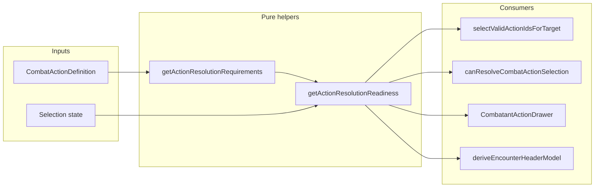

# Phase 1: Action resolution requirements and readiness

## Root cause (verified)

- `[canResolveCombatActionSelection](src/features/encounter/domain/interaction/encounter-resolve-selection.ts)` ends with `return Boolean(selectedActionTargetId)` for all non–area-grid actions, so **every** non-AoE action—including `targeting.kind === 'none'` summons—is gated on a map/sidebar target.
- `[selectValidActionIdsForTarget](src/features/encounter/domain/interaction/encounter-resolve-selection.ts)` only runs when a `targetCombatant` exists; otherwise it returns `undefined`, so the drawer treats “no target” as “all actions target-valid” (`validActionIdsForTarget == null` in `[CombatantActionDrawer](src/features/encounter/components/active/drawers/CombatantActionDrawer.tsx)`).
- When a target **is** selected, `[isValidActionTarget](src/features/mechanics/domain/encounter/resolution/action/action-targeting.ts)` returns `false` for `kind === 'none'`, and `[getActionTargetInvalidReason](src/features/mechanics/domain/encounter/resolution/action/action-targeting.ts)` returns `**'No target required'`**—a backwards message for the drawer.

[Giant Insect](src/features/mechanics/domain/rulesets/system/spells/data/level4-m-z.ts) is already built as spawn + `casterOptions`; `[buildSpellTargeting](src/features/encounter/helpers/spell-combat-adapter.ts)` sets `kind: 'none'` when `hasSpawn`. No spell-data change is required for this pass.

## 1. Pure helpers (mechanics domain)

Add a small module, e.g. `[src/features/mechanics/domain/encounter/resolution/action/action-resolution-requirements.ts](src/features/mechanics/domain/encounter/resolution/action/action-resolution-requirements.ts)`, exported from `[resolution/index.ts](src/features/mechanics/domain/encounter/resolution/index.ts)`:

`**getActionResolutionRequirements(action: CombatActionDefinition)`**

- Returns a **set or ordered list** of Phase-1 kinds: `creature-target` | `area-selection` | `spawn-placement` | `caster-option` | `none` (use `none` only when there are truly no gating requirements, e.g. some future trivial actions).
- **Rules (minimal, composable):**
  - If `[isAreaGridAction](src/features/encounter/helpers/area-grid-action.ts)`(action) → include `**area-selection`** (Fireball-style; unchanged semantics).
  - If `action.effects?.some(e => e.kind === 'spawn')` → include `**spawn-placement`** (Phase 1: never satisfied; placeholder for Phase 2).
  - If `action.casterOptions?.length` → include `**caster-option`** (satisfied when every field id has a non-empty value in the drawer’s `selectedCasterOptions` record).
  - `**creature-target**` only when the action actually needs a selected combatant from the target picker for resolution. Reuse the same idea as `[actionUsesGridCreatureTargeting](src/features/encounter/space/space.selectors.ts)` **plus** any other kinds that still require `selection.targetId` in `[getActionTargets](src/features/mechanics/domain/encounter/resolution/action/action-targeting.ts)` (at minimum: `single-target`, `single-creature`, `dead-creature`; **exclude** `none`, `self`, `all-enemies`, and area-grid actions). This keeps “spell ⇒ creature target” from being assumed globally.

`**getActionResolutionReadiness(...)`**

- **Inputs:** `action`, selection snapshot: `selectedActionTargetId`, `aoeStep`, `aoeOriginCellId`, `selectedCasterOptions`, and optionally `encounterState` + `actor` + `targetCombatant` **only where** you need to preserve existing validation (e.g. still require that the selected target passes `isValidActionTarget` when `creature-target` is in play—same behavior as today).
- **Output:** `{ canResolve: boolean; missingRequirements: Array<{ kind: ...; message: string }> }` with stable, user-facing `message` strings (short, for CTA and hints).
- **Phase 1 behavior:**
  - Area grid: keep current rule—`aoeStep === 'confirm'` and `aoeOriginCellId` set; do not add creature-target.
  - Spawn: `canResolve === false` until placement exists; `**missingRequirements`** should list `**spawn-placement`** (and `**caster-option`** if not satisfied).
  - Do **not** add map/token execution—only gating/messaging.

## 2. Refactor `[encounter-resolve-selection.ts](src/features/encounter/domain/interaction/encounter-resolve-selection.ts)`

- `**canResolveCombatActionSelection`:** extend args with `selectedCasterOptions: Record<string, string>` (and keep existing fields). Delegate to `getActionResolutionReadiness` **or** inline the same boolean logic so there is a single source of truth. Remove the blanket `Boolean(selectedActionTargetId)` for non-AoE actions; instead, require `selectedActionTargetId` **only if** `creature-target` is among requirements for that action.
- `**selectValidActionIdsForTarget`:**  
  - When `**targetCombatant` is null** but `encounterState` and `activeCombatant` exist: still return `{ validIds, invalidReasons }`. For actions that **do not** require `creature-target`, add them to `validIds`. For actions that **do**, set a clear reason such as `**Select a target`** (replacing the old implicit “everything valid” behavior when `validActionIdsForTarget` was `undefined`).  
  - When `**targetCombatant` is set:** for actions that **do not** require `creature-target`, **always** add to `validIds` (do not call `isValidActionTarget` / `getActionTargetInvalidReason` for those—fixes Giant Insect being “invalid” against an enemy). For creature-target actions, keep today’s `isValidActionTarget` / `getActionTargetInvalidReason` path.

Update call sites to pass `**selectedCasterOptions`**:

- `[EncounterActiveRoute.tsx](src/features/encounter/routes/EncounterActiveRoute.tsx)` (`canResolveAction` `useMemo`)
- `[EncounterRuntimeContext.tsx](src/features/encounter/routes/EncounterRuntimeContext.tsx)` (`canResolveActionForHeader`)

Adjust types in `[domain/index.ts](src/features/encounter/domain/index.ts)` export for `CanResolveCombatActionSelectionArgs`.

## 3. `[CombatantActionDrawer](src/features/encounter/components/active/drawers/CombatantActionDrawer.tsx)` and hints

- `**deriveCtaLabel`:** stop using `!targetLabel` ⇒ `**Select a Target`** for all non-AoE flows. Branch on **primary missing requirement** from readiness (or a small prop like `resolveCtaLabel: string` computed in the route): e.g. creature-target vs caster-option vs spawn-placement vs area steps.
- **Target section:** when the selected action does **not** require `creature-target`, soften or hide the “select a target” copy so it does not contradict summon/spawn (optional minimal tweak: only adjust copy when `selectedActionDefinition` is present—avoid large layout changes).
- `**deriveActionUnavailableHint`:** optionally pass **readiness-derived** reason for the selected action or merge with `invalidActionReasons` so non-creature actions do not show target-based hints. Keep `[deriveActionUnavailableHint.ts](src/features/encounter/components/active/drawers/helpers/derive-action-unavailable-hint.ts)` small—either extend its signature or compute the hint in the parent and pass it down.

## 4. `[deriveEncounterHeaderModel](src/features/encounter/domain/header/encounter-header-model.ts)`

Today, when an action is picked but there is no `selectedTargetLabel`, the directive is `**Choose a target for …`** (lines 119–124). That is wrong for `**none` / summon** (and for `**self`** if you include it in `creature-target` = false). Thread **requirement-aware** guidance:

- Either pass `primaryMissingRequirement` / updated directive string from the route, or import a tiny label helper next to readiness so the header does not assume “target” for every action.

Update `[encounter-header-model.test.ts](src/features/encounter/domain/header/encounter-header-model.test.ts)` for the new branches.

## 5. Caster options vs “before form selected”

`[useEncounterState](src/features/encounter/hooks/useEncounterState.ts)` resets `selectedCasterOptions` with `[buildDefaultCasterOptions](src/features/mechanics/domain/spells/caster-options.ts)`, which **pre-selects the first enum value**—so “missing caster option” may never appear for Giant Insect unless you change initialization for summon/caster-heavy actions or treat “missing” differently. **Pick one** (small scope):

- **A)** Keep defaults; readiness will usually show `**spawn-placement`** as the blocking message after the effect runs (matches “after form selected: missing placement” in practice), **or**
- **B)** For actions with `spawn-placement` + `caster-option`, initialize enum fields to **empty** until the user picks (or clear defaults in the same `useEffect` that sets caster options) so `**caster-option`** can surface first.

Document the choice in a one-line comment near initialization—no Phase 2 placement work.

## 6. Tests

- Unit tests for `getActionResolutionRequirements` / `getActionResolutionReadiness` (minimal cases: single-target + target id; area grid + confirm; spawn + caster options; none + spawn without creature target).
- Update or add a test for `deriveEncounterHeaderModel` when a summon (`none`) is selected without a target label.

## 7. Explicitly out of scope

- Map placement UI, token placement, summon execution, new grid modes—**only** gating and messaging; `spawn-placement` stays **unsatisfied** in readiness until a future Phase 2 signal exists.
- Fireball / AoE: preserve existing `**isAreaGridAction`** + `aoeStep` / `aoeOriginCellId` behavior.

