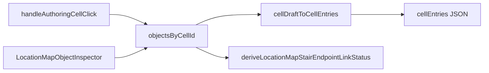

# Phase 1: Staircase endpoints (authored config + workspace)

## Current anchors

- Placed objects persist on `[LocationMapCellObjectEntry](shared/domain/locations/map/locationMap.types.ts)` (`id`, `kind`, optional `label`, `authoredPlaceKindId`). Draft ↔ `cellEntries` is implemented in `[cellAuthoringMappers.ts](src/features/content/locations/domain/mapAuthoring/cellAuthoringMappers.ts)` and **must** be updated or stair config will be dropped on save.
- New placements are created in `[useLocationEditWorkspaceModel](src/features/content/locations/routes/locationEdit/useLocationEditWorkspaceModel.ts)` (`handleAuthoringCellClick` → object with `kind` + optional `authoredPlaceKindId`).
- Object inspector UI is `[LocationMapObjectInspector](src/features/content/locations/components/workspace/LocationMapSelectionInspectors.tsx)`, dispatched from `[LocationEditorSelectionPanel](src/features/content/locations/components/workspace/LocationEditorSelectionPanel.tsx)` and wired in `[LocationEditRoute.tsx](src/features/content/locations/routes/LocationEditRoute.tsx)`.
- Building floors for the editor: `[listFloorChildren](src/features/content/locations/domain/building/buildingWorkspaceFloors.ts)` + `floorChildren` / `activeFloorId` when `[isBuildingWorkspace](src/features/content/locations/routes/locationEdit/useLocationEditWorkspaceModel.ts)` (building route).
- Server persistence: `[mapCellObjectEntrySchema](server/shared/models/CampaignLocationMap.model.ts)` is a strict subdocument; extend it so new fields are not stripped. (Note: `authoredPlaceKindId` is not currently in that schema—worth adding alongside stair fields so palette metadata persists reliably.)

## 1. Shared types (modest authored layer)

Add a dedicated small module (e.g. `[shared/domain/locations/map/locationMapStairEndpoint.types.ts](shared/domain/locations/map/locationMapStairEndpoint.types.ts)`) and export from `[shared/domain/locations/index.ts](shared/domain/locations/index.ts)`:

- `**LocationMapStairEndpointDirection`**: `'up' | 'down' | 'both'`.
- `**LocationMapStairEndpointAuthoring`**: `direction`; optional `targetLocationId` (intended **floor** location id); optional `connectionId` (future shared vertical-link id).
- **JSDoc** on the type and each field: Phase 1 is **endpoint metadata only**; full **paired** endpoint sync, **cell-level** linking, **combat traversal**, and **pathfinding across floors** remain **TODO**.

Extend `**LocationMapCellObjectEntry`** in `[locationMap.types.ts](shared/domain/locations/map/locationMap.types.ts)`:

- Optional `**stairEndpoint?: LocationMapStairEndpointAuthoring`** with JSDoc: meaningful when `kind === 'stairs'`; ignored for other kinds.

**Defaults:** When placing stairs, seed `stairEndpoint: { direction: 'both' }` in `handleAuthoringCellClick` so the inspector always has a defined direction (legacy maps without `stairEndpoint` remain valid).

## 2. Status / validation helpers (shared domain)

Add `[shared/domain/locations/map/locationMapStairEndpoint.helpers.ts](shared/domain/locations/map/locationMapStairEndpoint.helpers.ts)` (name can follow local style):

- `**LocationMapStairEndpointLinkStatus`**: `'unlinked' | 'incomplete' | 'linked' | 'invalid'` (or equivalent names per codebase conventions).
- `**deriveLocationMapStairEndpointLinkStatus(...)`** inputs should include:
  - parsed `stairEndpoint` (or undefined),
  - `currentFloorLocationId`,
  - `**validTargetFloorIds**` = sibling floor location ids (excluding current), or empty when no other floors exist.
- **Suggested rules (Phase 1):**
  - `**invalid`**: `targetLocationId` set but not in `validTargetFloorIds` (or equals current floor).
  - `**linked`**: `targetLocationId` set and in `validTargetFloorIds`.
  - `**incomplete**`: no other floors exist (`validTargetFloorIds.length === 0`) — includes **one-floor buildings**; link cannot be completed yet.
  - `**unlinked`**: other floors exist but no valid target chosen yet.

Add **JSDoc** on the status type and `derive*` explaining that **editor warnings** and **runtime traversal** will consume this later; Phase 1 only **surfaces** status in the inspector.

Extend `**validateCellEntriesStructure`** in `[locationMapCellAuthoring.validation.ts](shared/domain/locations/map/locationMapCellAuthoring.validation.ts)`:

- When `oro.kind === 'stairs'` and `stairEndpoint` is present, validate shape (object, `direction` enum, optional non-empty strings for ids). Reject unknown keys if you want strictness, or allow forward-compatible passthrough—match existing validation style.
- When `kind !== 'stairs'`, reject unexpected `stairEndpoint` if present (keeps data clean).

## 3. Draft ↔ persistence

- Update `**cellDraftToCellEntries` / `cellEntriesToDraft`** in `[cellAuthoringMappers.ts](src/features/content/locations/domain/mapAuthoring/cellAuthoringMappers.ts)` to round-trip `stairEndpoint` (and keep `authoredPlaceKindId` behavior unchanged).
- Add/adjust tests in `[cellAuthoringMappers.test.ts](src/features/content/locations/domain/mapAuthoring/cellAuthoringMappers.test.ts)` for stairs + `stairEndpoint`.

## 4. Mongoose schema

In `[CampaignLocationMap.model.ts](server/shared/models/CampaignLocationMap.model.ts)`:

- Add `authoredPlaceKindId` to `mapCellObjectEntrySchema` if missing (aligns with TS + mappers).
- Add nested schema for `**stairEndpoint**` (`direction`, optional `targetLocationId`, optional `connectionId`) with `_id: false`.

## 5. Workspace UI

**Props:** Extend `[LocationEditorSelectionPanelProps](src/features/content/locations/components/workspace/LocationEditorSelectionPanel.tsx)` with optional `**stairWorkspaceContext`** (name flexible), e.g.:

- `currentFloorLocationId: string`
- `candidateTargetFloors: { id: string; label: string }[]` — **other** floors only (sorted consistently with `[floorTabLabelFromIndex](src/features/content/locations/domain/building/buildingWorkspaceFloors.ts)` or reuse existing floor labels from the strip).

Compute in `**LocationEditRoute`**:

- **Building workspace** (`isBuildingWorkspace && activeFloorId`): `currentFloorLocationId = activeFloorId`; `candidateTargetFloors` = `floorChildren.filter(f => f.id !== activeFloorId)` with labels (`floorTabLabelFromIndex` by sorted index or existing naming).
- **Floor location with a building parent** (optional parity): when `loc.scale === 'floor' && loc.parentId`, use `listFloorChildren(locations, loc.parentId)` to build the same lists so direct floor edit behaves like building edit.

**Inspector:** In `[LocationMapObjectInspector](src/features/content/locations/components/workspace/LocationMapSelectionInspectors.tsx)`:

- If `obj.kind !== 'stairs'`, keep current UI.
- If `**stairs`**: show a compact block — title e.g. “Staircase endpoint”, direction control (`Select` or toggle group), target floor `Select` populated from `candidateTargetFloors`, helper text when `**candidateTargetFloors.length === 0`**: another floor is needed to complete a link; authoring is still allowed.
- Compute `**deriveLocationMapStairEndpointLinkStatus**` with `validTargetFloorIds = candidateTargetFloors.map(f => f.id)` and show a **Chip** or caption for status (`unlinked` / `incomplete` / `linked` / `invalid`).
- Optional `connectionId`: read-only placeholder text field or monospace caption (“for future vertical link records”) with JSDoc reference in code comments—not required to be editable in Phase 1.

**Out of scope:** click-on-destination-cell linking flow (explicitly deferred unless trivial).

## 6. Explicit non-goals (unchanged behavior)

- No changes to `[hydrateGridObjectsFromLocationMap](src/features/game-session/combat/hydrateGridObjectsFromLocationMap.ts)` behavior beyond types flowing through persisted JSON (stair metadata ignored at runtime).
- No combat movement, BFS, or encounter rules changes (`[packages/mechanics/.../spatial/](packages/mechanics/src/combat/space/spatial/)` stays untouched).

## 7. Tests

- Unit tests for `**deriveLocationMapStairEndpointLinkStatus`** (one-floor vs multi-floor, missing target, invalid target id).
- `**validateCellEntriesStructure`** tests for valid/invalid `stairEndpoint` payloads (new file or colocated with existing map validation tests).

## Architecture sketch

